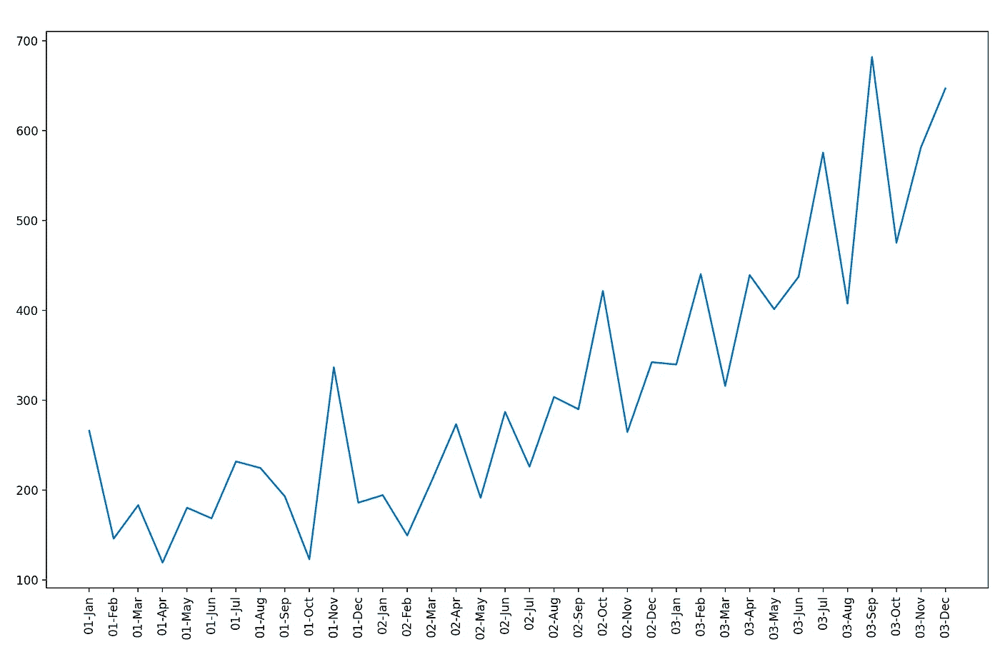
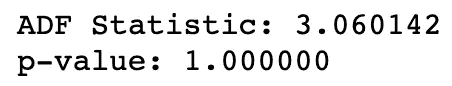
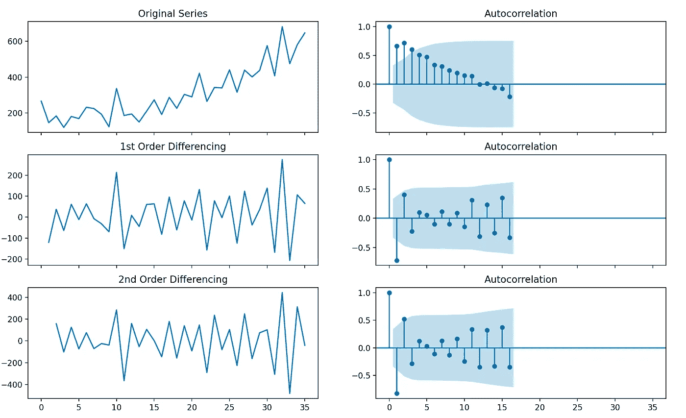
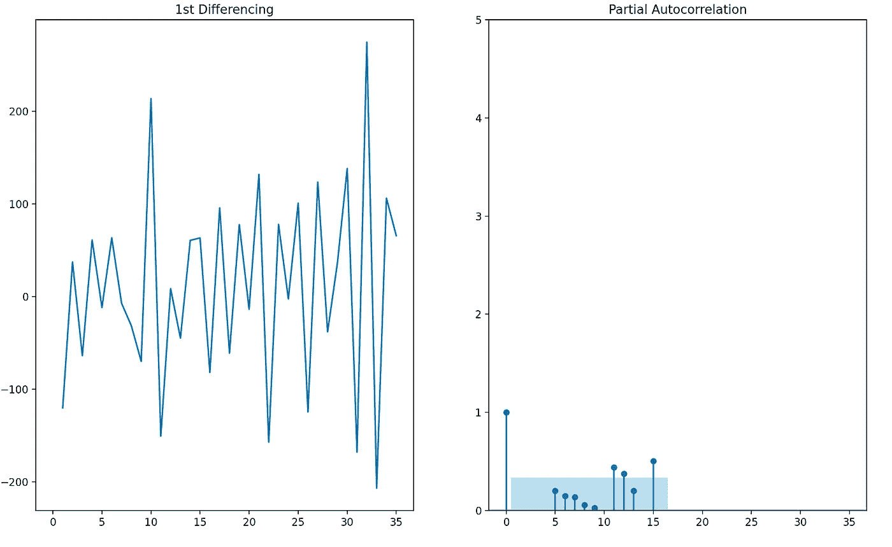
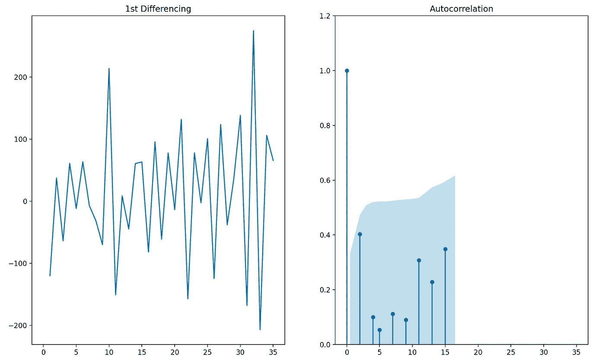
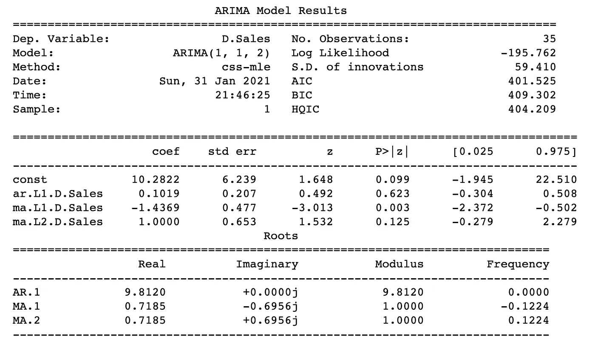
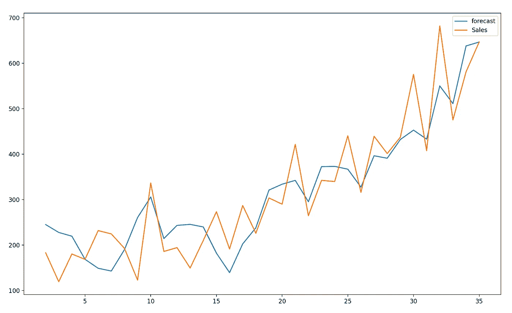

# 关于 ARIMA 预测的 Python 代码

> 原文：<https://medium.com/analytics-vidhya/python-code-on-arima-forecasting-d6e2fd90697c?source=collection_archive---------3----------------------->

去拿你的咖啡，我们要去编码了。

ARIMA 是一种预测技术，它使用一个序列的过去值来预测未来值。通过阅读下面提到的我在 ARIMA 探索的第一部分中写的博客文章，可以对该算法有一个基本的直觉

[](https://etqadkhan23.medium.com/understanding-arima-forecasting-140dc5ceda06) [## 了解 ARIMA 预测

### 说到预测，ARIMA 算法通常是首选算法。让我们试着简单地理解什么…

etqadkhan23.medium.com](https://etqadkhan23.medium.com/understanding-arima-forecasting-140dc5ceda06) 

我正在使用的系列可以从这里下载:[https://drive . Google . com/file/d/1 w8 k 92 LQ 00 ZT 6j 7 qjnlk H4 yp 7 mddivbsr/view？usp =共享](https://drive.google.com/file/d/1W8K92lQ00Zt6J7qJnLKH4yp7MddIVBsR/view?usp=sharing)

第一件事是检查数据的平稳性。平稳性将通过增强的 Dicky Fuller 测试来检查。该检验的无效假设是时间序列是非平稳的。因此，如果 p 值小于 0.05，我们将拒绝零假设，并认为该序列是平稳的。

让我们从导入库模块开始。

```
import pandas as pd
from statsmodels.tsa.stattools import adfuller
import matplotlib.pyplot as plt
```

阅读 csv，然后绘制它，看看趋势是什么样的。

```
df = pd.read_csv(r'''shampoo_dataset.csv''')plt.plot(df.Month, df.Sales)
plt.xticks(rotation=90)
```



让我们看看 ADF 测试的结果，以了解平稳性。

```
result = adfuller(df.Sales.dropna())
print('ADF Statistic: %f' % result[0])
print('p-value: %f' % result[1])
```



现在，由于该值非常高，我们将对该系列进行差分，以获得 Statonarity。

## 寻找差序

我们将绘制自相关图来了解趋势。如果 ACF 图显示大量滞后为正值，则意味着该系列需要进一步差分。另一方面，如果它从第一个滞后本身变成负值，我们可能会过度差分它。所以，让我们画出差分序列的 ACF 图。ACF 是当前时间步长和先前时间步长的观测值之间的相关性。

```
from statsmodels.graphics.tsaplots import plot_acf, plot_pacffig, axes = plt.subplots(3, 2, sharex=True)
axes[0, 0].plot(df.Sales); axes[0, 0].set_title('Original Series')
plot_acf(df.Sales, ax=axes[0, 1])# 1st Differencing
axes[1, 0].plot(df.Sales.diff()); axes[1, 0].set_title('1st Order Differencing')
plot_acf(df.Sales.diff().dropna(), ax=axes[1, 1])# 2nd Differencing
axes[2, 0].plot(df.Sales.diff().diff()); axes[2, 0].set_title('2nd Order Differencing')
plot_acf(df.Sales.diff().diff().dropna(), ax=axes[2, 1])plt.show()
```



我们可以看到，阶 1 的差分帮助我们使序列平稳，所以让我们选择 **d = 1** 。

## 查找 AR 术语

我们将通过部分自相关图来理解 AR 术语。序列中两个时间步长之间的相关性，使得它们与其他时间步长相关。比如今天的天气取决于昨天，昨天的天气取决于后天。所以，昨天的 PACF 将是今天和昨天之间的相关性，在去除了前天的影响之后。

```
fig, axes = plt.subplots(1, 2, sharex=True)
axes[0].plot(df.Sales.diff()); axes[0].set_title('1st Differencing')
axes[1].set(ylim=(0,5))
plot_pacf(df.Sales.diff().dropna(), ax=axes[1])plt.show()
```



正如我们所看到的，滞后在滞后中立即低于显著限值，因此为了简单起见，让我们继续将 **p = 1** 。

## 查找 MA 术语

我们将重新讨论 ACF 术语以找到 MA 术语。MA 项的值告诉我们需要什么值来消除序列中的任何自相关。

```
fig**,** axes **=** plt**.**subplots**(1,** **2,** sharex**=True)**
axes**[0].**plot**(**df**.**Sales**.**diff**());** axes**[0].**set_title**('1st Differencing')**
axes**[1].**set**(**ylim**=(0,1.2))**
plot_acf**(**df**.**Sales**.**diff**().**dropna**(),** ax**=**axes**[1])**

plt**.**show**()**
```



滞后阶数 1 高于显著限值，但对于滞后阶数 2，则没有问题。让我们选择 MA 项，并将 **q = 2** 。

## 模型结构

让我们建立一个模型，并分析如何将价值观转化为模型。

```
from statsmodels.tsa.arima_model import ARIMA
# ARIMA order (p,d,q)
model = ARIMA(df.Sales, order=(1,1,2))
model_fit = model.fit(disp=0)
print(model_fit.summary())
```



该模型可以进一步改进，可以对其进行大量调整，但需要注意的一点是该系列的规模较小，因此限制了准确的结果。

让我们预测并寻求准确性，

```
model_fit.plot_predict(dynamic=False)
plt.show()
```



结果并不令人满意，但了解一下 ARIMA 是如何工作的还是有好处的。让我们对此进行一个快速的准确性度量检查，看看该模型对未来值的预测有多好。

```
import numpy as npmodel = ARIMA(train, order=(1, 1, 2))  
fitted = model.fit(disp=-1)# Forecast
fc, se, conf = fitted.forecast(6, alpha=0.05)mape = np.mean(np.abs(fc - test)/np.abs(test))  # MAPE
```

MAPE 为 17.99，这意味着模型的准确率为 82.11%。

我希望这篇教程能给你一些关于如何使用 ARIMA 的想法。我们可以使用这里给出的代码进入算法。下次我会选择更好的数据集。感谢阅读，非常感谢！