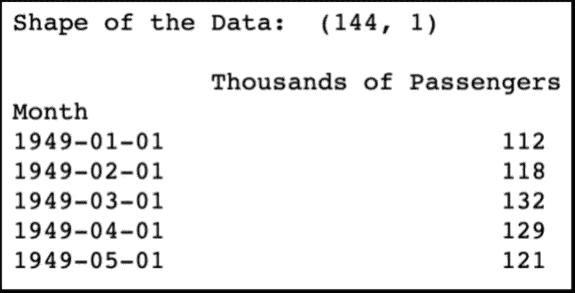
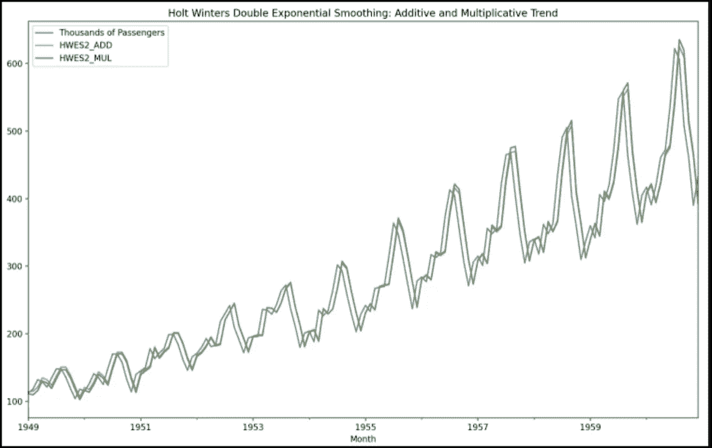

# 霍尔特-温特斯预测的 Python 代码

> 原文：<https://medium.com/analytics-vidhya/python-code-on-holt-winters-forecasting-3843808a9873?source=collection_archive---------0----------------------->

耐心是这里唯一的先决条件。

如果你在这里，我很高兴，如果你对霍尔特-温特斯指数平滑一无所知，请在这里查看这篇文章，

[](/@etqadkhan23/holt-winters-forecasting-13c2e60d983f) [## 霍尔特-温特斯预测

### 昨天是一个寒冷的冬夜，我在 Brooklyn99 上大吃大喝，那时我想我可以写一篇简短的…

medium.com](/@etqadkhan23/holt-winters-forecasting-13c2e60d983f) 

这将是一个很好的起点，可以帮助你理解它的基本概念。去吧，读吧，我会等你的。如果你想让我停止追逐开始编码，你的祈祷已经得到了回应。

我们采用了 1949 年 1 月至 1960 年 12 月间国际航线乘客数量(以千计)的时间序列数据。人们可以在这里找到数据集，

[](https://www.kaggle.com/ternaryrealm/airlines-passenger-data) [## 航空公司乘客数据

### Kaggle 是世界上最大的数据科学社区，拥有强大的工具和资源来帮助您实现您的数据…

www.kaggle.com](https://www.kaggle.com/ternaryrealm/airlines-passenger-data) 

让我们从导入库开始

```
# dataframe opertations - pandas
import pandas as pd# plotting data - matplotlib
from matplotlib import pyplot as plt# time series - statsmodels 
# Seasonality decomposition
from statsmodels.tsa.seasonal import seasonal_decomposefrom statsmodels.tsa.seasonal import seasonal_decompose # holt winters 
# single exponential smoothing
from statsmodels.tsa.holtwinters import SimpleExpSmoothing # double and triple exponential smoothing
from statsmodels.tsa.holtwinters import ExponentialSmoothing
```

让我们快速导入数据，看看它是什么样子。我们还将检查数据框和一些数据点的形状。

```
airline = pd.read_csv('airline_passengers.csv',index_col='Month', parse_dates=True)airline = pd.read_csv('airline_passengers.csv',index_col='Month', parse_dates=True)# finding shape of the dataframe
print(airline.shape)# having a look at the data
print(airline.head())# plotting the original data
airline[['Thousands of Passengers']].plot(title='Passengers Data')
```



## 分解时间序列

现在我们将分解时间序列，并在数据中寻找水平、趋势和季节性，

```
decompose_result = seasonal_decompose(airline[‘Thousands of Passengers’],model=’multiplicative’)
decompose_result.plot();
```


我们可以很清楚地看到，数据有三个层次，趋势，季节性。

## 用霍尔特-温特斯指数平滑法拟合数据

现在我们将分别用单指数平滑法、双指数平滑法和三指数平滑法来拟合这些数据，看看效果如何。

在开始模型之前，我们将首先定义权重系数α和时间段。我们还将日期时间频率设置为每月一次。

```
# Set the frequency of the date time index as Monthly start as indicated by the data
airline.index.freq = ‘MS’# Set the value of Alpha and define m (Time Period)
m = 12
alpha = 1/(2*m)
```

现在，我们将对数据进行单指数平滑拟合，

## 单 HWES

```
airline[‘HWES1’] = SimpleExpSmoothing(airline[‘Thousands of Passengers’]).fit(smoothing_level=alpha,optimized=False,use_brute=True).fittedvaluesairline[[‘Thousands of Passengers’,’HWES1']].plot(title=’Holt Winters Single Exponential Smoothing’);
```


正如预期的那样，它并不十分合适，这是理所当然的，因为如果我们记得的话，单一 ES 不适用于具有趋势和季节性的数据。

## 双 HWES

所以，我们将数据拟合在双 ES 上，在加法和乘法趋势上，

```
airline[‘HWES2_ADD’] = ExponentialSmoothing(airline[‘Thousands of Passengers’],trend=’add’).fit().fittedvaluesairline[‘HWES2_MUL’] = ExponentialSmoothing(airline[‘Thousands of Passengers’],trend=’mul’).fit().fittedvaluesairline[[‘Thousands of Passengers’,’HWES2_ADD’,’HWES2_MUL’]].plot(title=’Holt Winters Double Exponential Smoothing: Additive and Multiplicative Trend’);
```



嗯，这看起来稍微好一点，但因为我们知道有季节性，我们将进入三倍，看看它是如何拟合的。

## 三小时

```
airline[‘HWES3_ADD’] = ExponentialSmoothing(airline[‘Thousands of Passengers’],trend=’add’,seasonal=’add’,seasonal_periods=12).fit().
fittedvaluesairline[‘HWES3_MUL’] = ExponentialSmoothing(airline[‘Thousands of Passengers’],trend=’mul’,seasonal=’mul’,seasonal_periods=12).fit().
fittedvaluesairline[[‘Thousands of Passengers’,’HWES3_ADD’,’HWES3_MUL’]].plot(title=’Holt Winters Triple Exponential Smoothing: Additive and Multiplicative Seasonality’);
```


这看起来很有希望！这里我们绘制了加性和倍增性季节性。

## 霍尔特-温特斯指数平滑法预测

让我们尝试预测序列，让我们从将数据集划分为训练集和测试集开始。我们将 120 个数据点作为训练集，将最后 24 个数据点作为测试集。

forecast _ data = PD . read _ CSV(' airline _ passengers . CSV '，index_col='Month '，
parse_dates=True)

forecast_data.index.freq = 'MS '

#分成训练和测试集
train _ airline = forecast _ data[:120]
test _ airline = forecast _ data[120:]

我们还在等什么，让我们适应和预测，

```
fitted_model = ExponentialSmoothing(train_airline[‘Thousands of Passengers’],trend=’mul’,seasonal=’mul’,seasonal_periods=12).fit()
test_predictions = fitted_model.forecast(24)train_airline[‘Thousands of Passengers’].plot(legend=True,label=’TRAIN’)
test_airline[‘Thousands of Passengers’].plot(legend=True,label=’TEST’,figsize=(6,4))
test_predictions.plot(legend=True,label=’PREDICTION’)plt.title(‘Train, Test and Predicted Test using Holt Winters’)
```


随着我们接近预测的细分市场，该模型似乎总体上做得不错。

```
test_airline[‘Thousands of Passengers’].plot(legend=True,label=’TEST’,figsize=(9,6))test_predictions.plot(legend=True,label=’PREDICTION’,xlim=[‘1959–01–01’,’1961–01–01']);
```


## 评估指标

让我们看看该模型在误差项计算方面的表现。我们将使用 MAE(平均绝对误差)和 MSE(均方误差)作为衡量标准。

```
from sklearn.metrics import mean_absolute_error,mean_squared_errorprint(f’Mean Absolute Error = {mean_absolute_error(test_airline,test_predictions)}’)print(f’Mean Squared Error = {mean_squared_error(test_airline,test_predictions)}’)
```


嗯，这是我所有的了。我认为这将有助于您进行单变量预测。霍尔特-温特斯指数平滑的基础在这里完成。再次见到大家(希望很快)。保持水分！