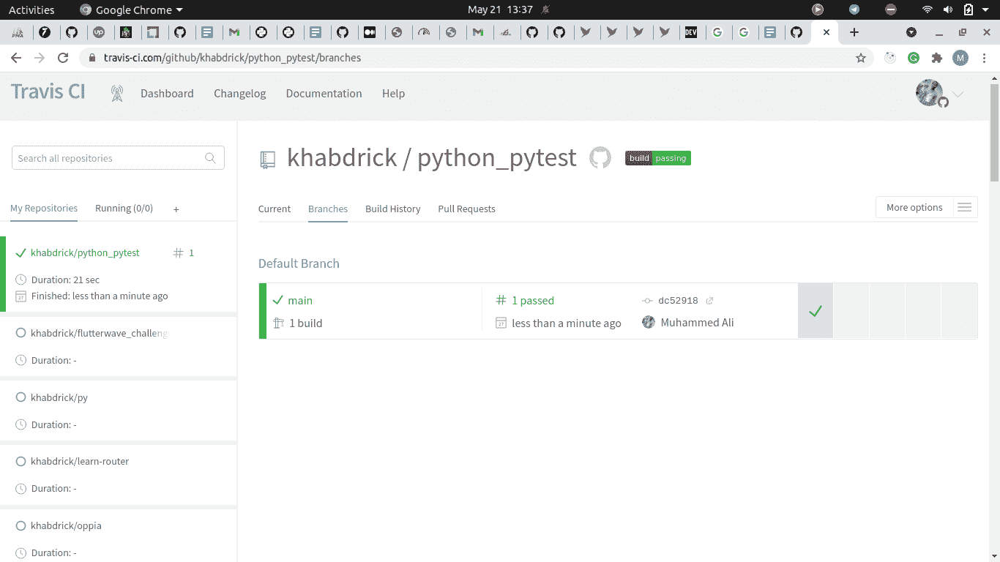

# 使用 Travis CI 为您的 Python 代码设置 CI

> 原文：<https://medium.com/analytics-vidhya/python-code-to-know-for-test-automation-aef47d27428c?source=collection_archive---------16----------------------->


[图像来源](https://testsigma.com/blog/ai-driven-test-automation/)

# 介绍

测试在软件开发中是一个至关重要的话题，因为它可以节省时间，特别是在处理定期改进的软件时，以确保您的更改不会影响软件的其他部分。测试还有助于在交付生产之前识别缺陷。测试您的代码还有许多其他原因，但这不是本文要讨论的，所以我将留给您去研究。

[测试自动化](https://www.perfecto.io/blog/what-is-test-automation)是使用软件来扮演角色，以我们想要的任何顺序运行我们编写的测试代码，并将结果与预期结果进行比较。

在本文中，您将会学到很多关于自动化测试如何工作的知识；您将能够区分手动测试和自动化测试，如何使用 pytest 编写自动化测试，以及如何将手动测试转换为自动化测试。

# 先决条件

1.  Python 基础
2.  Git 和 GitHub 的基础知识

Python 是自动化测试的最佳语言之一。由于它的简单性和英语，它就像大自然一样，很容易上手。我们将使用 Pytest 来完成自动化测试的任务。我们将首先编写单元测试，然后用 Travis CI 自动化测试。如果你以前没有听说过特拉维斯 CI，不要担心。在我们开始使用它之前，我会先谈一点。

# Pytest 是什么？

Pytest 是一个框架，它使得构建简单且可伸缩的测试变得容易。Pytest 还帮助您编写非常可伸缩的测试，并提供测试覆盖率来显示您的代码已经测试了多少。遗憾的是，我不会在这里详细介绍 Pytest 的内部工作原理。

代码片段在[存储库](https://github.com/khabdrick/python_pytest)中，因此如果您对文件排列有问题，您可以查看一下。

# 如何在本地设备上设置 Pytest

首先，为项目创建一个新的虚拟环境。

`$ virtualenv env`

激活虚拟环境；
在 MacOS 和 Linux 上:

`$ source env/bin/activate`

在 Windows 上:

`$ .\env\Scripts\activate`

然后，安装 pytest。

`$ pip install pytest`

在终端/命令行上运行 `$ pip freeze` 应该会提供以下输出。

```
$ pip freeze
attrs==21.2.0
coverage==5.5
iniconfig==1.1.1
packaging==20.9
pluggy==0.13.1
py==1.10.0
pyparsing==2.4.7
pytest==6.2.4
toml==0.10.2
```

# 单元测试

首先，让我们先创建一个文件，并编写一些我们可以测试的 python 代码。下面是一个简单的加减法代码。

```
# arithmetic.py
def sum(x, y):
 return x+ydef minus(x, y):
 return x-y
```

现在让我们为我们的测试创建一个新文件。
注意:如果文件和函数以“test_”开头，pytest 将识别包含要测试的代码的文件和函数

```
# test_arithmetic.py
import arithmetic
def test_sum(): 
 assert arithmetic.sum(5, 2)== 7
 assert arithmetic.sum(100, 200)==300
 assert type(arithmetic.sum(“Hi “, “there”)) is str
 assert arithmetic.sum(“Hi “, “there”) == “Hi there”def test_minus():
 assert arithmetic.minus(5, 2) >= 2
 assert arithmetic.minus(-5, -5)==0
```

测试一般与断言有关。断言只是意味着您编写的代码在命令行运行时给出了期望的输出

`$ python -m pytest -v`

对于 windows 用户

`$ pytest -v`

运行上述程序后，您应该会看到类似这样的内容:

`$ python -m pytest -v`

```
============================= test session starts ==============================
platform linux — Python 3.8.5, pytest-6.2.4, py-1.10.0, pluggy-0.13.1 — /home/muhammed/Desktop/dev/blog-repo/python-pytest/my_env/bin/pythoncachedir: .pytest_cacherootdir: /home/muhammed/Desktop/dev/blog-repo/python-pytestplugins: cov-2.12.0collected 2 itemstest_arithmetic.py::test_sum PASSED [ 50%]test_arithmetic.py::test_minus PASSED [100%]
```

# 如何自动化您的测试

现在，我们将进入会议的主菜。我们可以通过添加 Travis CI 来实现自动化。我们的例子是一个非常小的例子，但是假设我们有一个大的项目，我们不希望每次对代码库进行修改时都要运行测试。我们可以选择使用另一个软件来自动运行我们的测试过程！

Travis CI 是一个[持续集成](https://en.wikipedia.org/wiki/Continuous_integration)工具。它与版本控制管理系统(如 Git)一起工作，当变更被做出并提交到存储库时，根据分配给它的任务，自动运行测试。我们用一个. travis.yaml 文件将任务分配给 Travis CI，稍后我们会看到。你也可以在任何测试失败的时候收到电子邮件。

# 设置 Travis CI

在我们开始工作之前，您必须在本地设备上安装 git。如果你没有，这个[链接](https://git-scm.com/downloads)应该可以帮你做到。

要为您的项目设置 Travis CI，假设您有一个 GitHub 帐户，请访问他们的网站，单击“登录”按钮，然后单击“使用 GitHub 登录”。从那开始应该很容易。之后，Travis CI 会给出以下指令，让您按照这些指令来激活您的存储库，以便 Travis CI 可以对其进行操作。

接下来，您将在您的终端/命令提示符下运行`$ pip freeze > requirements.txt`,将 requirements.txt 文件中的所有依赖项列表存储到您的本地机器中。在根目录下创建`.travis.yaml` 文件，并放入以下代码:

```
language: python
python:
 — “3.7”
install:
 — pip install -r requirements.txt
script:
 — python -m pytest -v
```

上面的代码非常容易理解。你陈述你想要使用的语言，然后是版本。

然后你在`requirements.txt`文件中安装这些东西,“脚本”被用来运行测试。
现在将您的代码推送到 GitHub，它会显示在 Travis CI 上。

在 Travis CI 网站上，您会看到您的存储库列表。点击您想要检查的，然后点击 branches 选项卡，您将会看到 Travis CI 已经开始为您运行您的测试。



您可以单击复选标记查看详细信息。

# 结论

在这篇文章中，我能够触及测试、自动化测试，以及在某种程度上，持续集成。我希望我已经令人满意地解释了它，所以你能理解和跟随。感谢阅读！