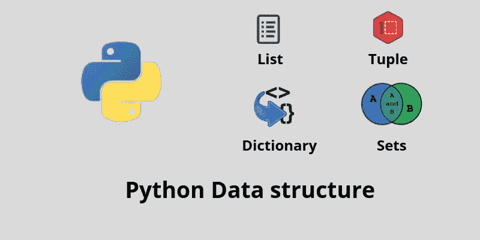

# Python 数据结构-第 1 部分

> 原文：<https://medium.com/analytics-vidhya/python-data-structure-part-1-62a5184ea3c?source=collection_archive---------15----------------------->

Python 是一种现代、易学、面向对象的编程语言。它有一组强大的内置数据类型。如果你是 python 语言的新手，那么这个博客将会帮助你学习。这个博客包含 python 的基本线性数据结构。

1.  **List:** 它是 Python 中的一个线性数据结构，是一个可变的，或者说可改变的，有序的元素序列。它们是异构的，这意味着数据对象不需要都来自同一个类，集合可以赋给一个变量。

例:List=[1，2，3，' a '，True]

**在列表上执行的操作:**

2. **Tuple:** 它们非常类似于列表，因为它们是异构的数据序列。区别在于元组是不可变的，就像字符串一样。不能更改元组。对元组执行的操作与对列表执行的操作相同，除了赋值操作，因为我们不能更改元组中的项。

例:Tuple = (2， **True** ，4.96

3.**集合:**集合是零个或更多不可变 Python 数据对象的无序集合。集合不允许重复，并被写成用大括号括起来的逗号分隔的值。空集由 set()表示。集合是异构的，集合可以分配给一个变量。

例:set={1，2，3，' a '，True}

**对器械包执行的操作:**

4.**字典:**字典是相关条目对的集合，其中每对条目由一个键和值组成。这个键值对通常被写成 key: value。它是无序的结构。

例如:dicti = { 1:' a '；2:'b':3:'c'}

**对字典执行的操作:**

5.**字符串:**它们是零个或多个字母、数字和其他符号的有序集合。我们称这些字母、数字和其他符号为*字符*。

例如:s='abcbd '

**对字符串执行的操作:**

希望这篇文章对你有所帮助。请关注下一篇文章，我将写关于 Python 中其他数据结构的文章。在那之前，继续学习！