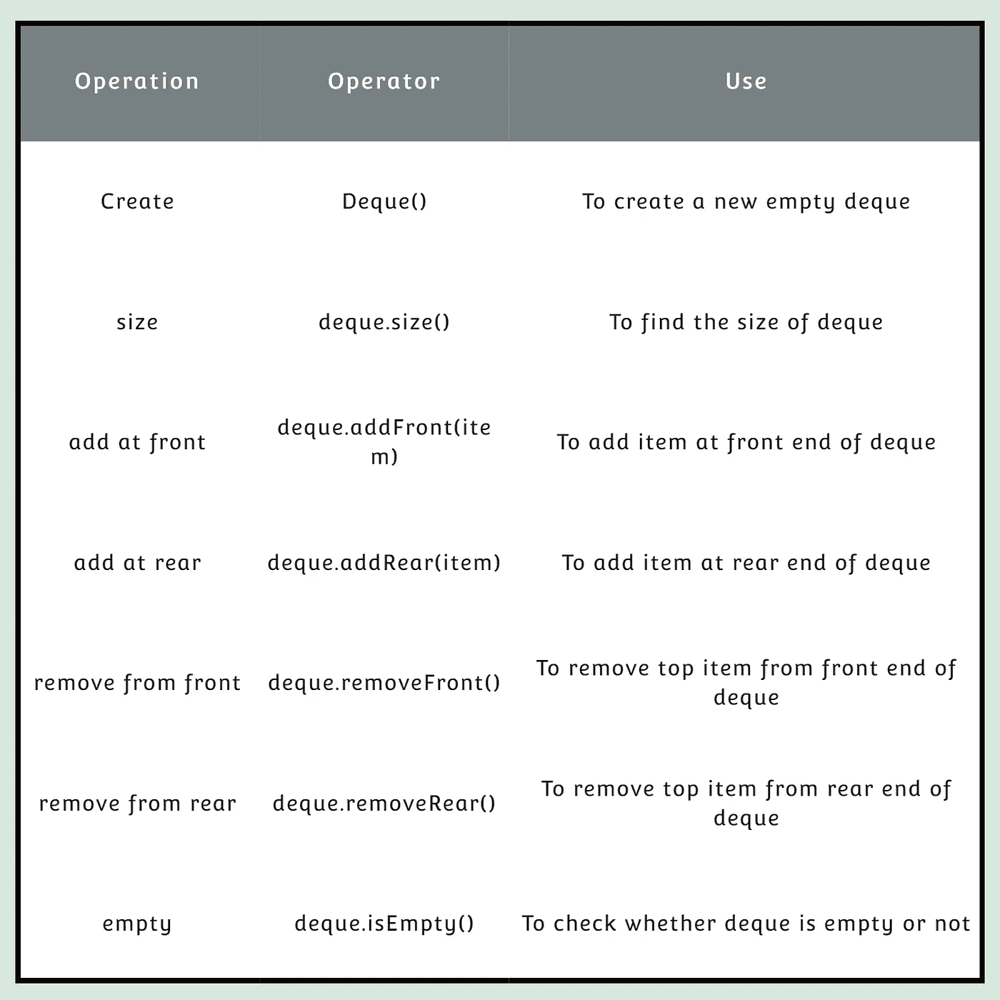

# Python 数据结构——第 2 部分

> 原文：<https://medium.com/analytics-vidhya/python-data-structure-part-2-abc805b72efd?source=collection_archive---------29----------------------->


在之前的[文章](https://agrawalprachi1179.medium.com/python-data-structure-part-1-62a5184ea3c)中，我已经讨论过 python 的一些基本数据结构。在本文中，您将了解 python 数据结构，如堆栈、队列和出列，以及它们的实现。

1.**栈:****栈**(有时称为“下推栈”)是一个有序的项目集合，其中新项目的添加和现有项目的移除总是发生在同一端。这一端通常被称为“顶部”与顶部相对的一端被称为“底部”堆栈的排序原则叫做**后进先出**、**后进先出**。

例如:stack=[1，' a '，True]


**对堆栈执行的操作**:


**栈的实现:**

```
class Stack:
     def __init__(self):
         self.items = []

     def isEmpty(self):
         return self.items == []

     def push(self, item):
         self.items.append(item)

     def pop(self):
         return self.items.pop()

     def peek(self):
         return self.items[len(self.items)-1]

     def size(self):
         return len(self.items)
```

2.**队列:**队列是项目的有序集合，其中新项目的添加发生在一端，称为“后端”，现有项目的移除发生在另一端，通常称为“前端”队列的排序原则叫做**先进先出**、**先进先出**。

例如:queue=[1，' a '，True]


**对队列执行的操作:**


**队列的实现:**

```
class Queue:
    def __init__(self):
        self.items = []

    def isEmpty(self):
        return self.items == []

    def enqueue(self, item):
        self.items.insert(0,item)

    def dequeue(self):
        return self.items.pop()

    def size(self):
        return len(self.items)
```

3.**dequee:**A**dequee**也称为双端队列，是类似于队列的项目的有序集合。它有两个末端，一个前端和一个后端，这些项目仍然位于集合中。新项目可以添加在前面或后面。同样，可以从任意一端移除现有项目。

例如:deque=[1，' a '，True]


**对队列执行的操作:**



**德奎的实现:**

```
class Deque:
    def __init__(self):
        self.items = []

    def isEmpty(self):
        return self.items == []

    def addFront(self, item):
        self.items.append(item)

    def addRear(self, item):
        self.items.insert(0,item)

    def removeFront(self):
        return self.items.pop()

    def removeRear(self):
        return self.items.pop(0)

    def size(self):
        return len(self.items)
```

希望这篇文章对你有所帮助。继续学习！