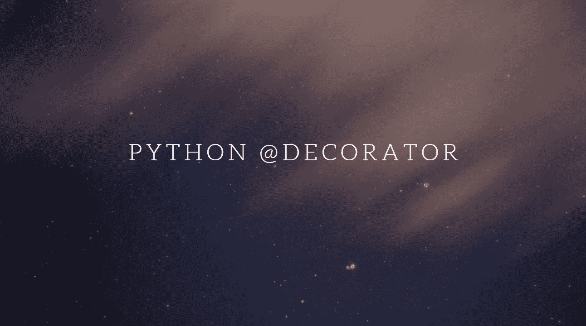

# 为初学者解释的 Python 装饰器和内部原理(第 1 部分)

> 原文：<https://medium.com/analytics-vidhya/python-decorators-and-internals-explained-for-beginners-part-1-f7293620546e?source=collection_archive---------16----------------------->

在本文中，我们将深入探讨 python decorators。我们将详细讨论 decorators 背后的逻辑是什么，如何创建它们以及如何使用它们。

简而言之，装饰器用于修改或扩展现有功能，而不修改原始功能。