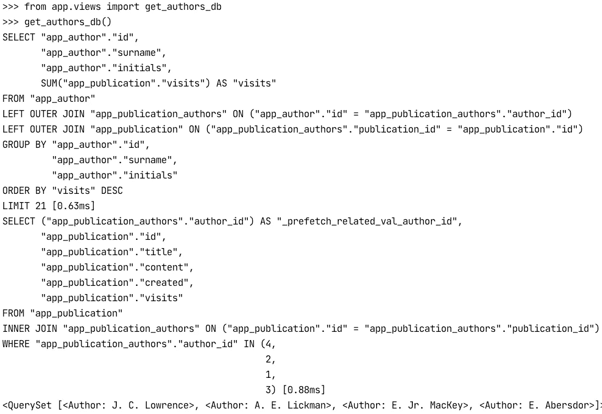

# Python & Django 优化工具和流程

> 原文：<https://medium.com/analytics-vidhya/python-django-optimization-tools-and-process-b59a4d807d4b?source=collection_archive---------5----------------------->

Django 是一个很好的工具(不是最好的，但足够好)来尽快创建 web 应用程序，它包括许多有用的电池，允许在几天内启动生产就绪的 MVP。但是如果你要改进你的应用程序，你需要关注它的性能。我想介绍 3 个工具，它们有助于衡量性能指标，并使优化过程更加明显。[在这里](https://gitlab.com/DariaPlotnikova/demodebuggingtools)你可以找到[已经配置](https://gitlab.com/DariaPlotnikova/demodebuggingtools/-/blob/master/optimization_tools/settings.py)使用这个调试工具的演示项目。

## **在**中需要注意哪些指标

当我们谈论 web 应用程序时，重要的衡量标准是从浏览器获得响应的时间。它包括几个步骤:

1.  从浏览器向服务器发送请求。
2.  用 python 代码准备请求对象，并在函数的控制器类中接收它。
3.  处理请求(提取数据，转到数据库/第三方服务，可能以某种方式计算它，准备响应)。
4.  将响应发送回服务器。

让我们列出可以使这些步骤更有效的指标(减少步骤所用的时间):

*   从浏览器发送到服务器并返回的数据量—影响第 1 步和第 4 步
*   从数据库/第三方服务获取的数据量—影响第三方并间接影响第四方
*   接收/保存数据的数据库/第三方查询计数—影响第三方
*   使用从数据库/第三方服务(业务逻辑)接收的数据进行计算—影响第三方
*   RAM 使用—影响第三、第二、第四。

我们有什么工具来衡量它们？哪个指标对请求-响应周期中的总时间影响最大？哪些指标对我们的应用不那么重要？让我们试着弄清楚。

## 工具概述

我们将考虑我推荐经常使用的 3 种工具，使用它们你将编写更快的代码。

[**姜戈-丝**](https://github.com/jazzband/django-silk)

这是我最喜欢的，它有助于检查执行了哪些 SQL 查询，准备响应花了多少时间(2-4 步)，数据库查询花了多少时间，还可以在代码的任何部分使用 CProfile 并可视化结果。

让我们试一试。您可以在[演示项目](https://gitlab.com/DariaPlotnikova/demodebuggingtools)中使用它。它包含一个简单的 Django 项目，包含两个模型— `Author`和它们的`Publication`、数据夹具和 [Postman](https://www.postman.com/) 集合，以提供对已有 API 的快速访问。

克隆[演示](https://gitlab.com/DariaPlotnikova/demodebuggingtools)并经历几个步骤:

1.  [创建](https://docs.python.org/3/library/venv.html#creating-virtual-environments)虚拟环境并激活它。
2.  安装所需的库`pip install -r requirements.txt`。
3.  设置数据库`python manage.py migrate`。
4.  用数据填充数据库`python manage.py loaddata data.json`
5.  创建超级用户来访问站点的管理部分`python manage.py createsuperuser`
6.  运行 app `python manage.py runserver`。
7.  打开 Postman 并从存储库中导入`collection.json`文件。
8.  使用导入集合中的“出版物列表”请求，在 Postman 中转至[http://127 . 0 . 0 . 1:8000/API/](http://127.0.0.1:8000/api/)。

有一个由不同作者创作的出版物列表，数据由 fixture 准备。正如您所看到的，django-silk 已经打开，所以它会写入关于服务器收到的所有 HTTP 查询的元信息。让我们看看发生了什么，在浏览器中打开[http://127 . 0 . 0 . 1:8000/silk/。](http://127.0.0.1:8000/silk/.)


这是 django-silk 记录的元信息，点击有 200 个 GET 请求的块，你将被重定向到这个特定的请求信息——数据库查询的数量、标题、主体参数。

单击顶部栏选项卡中的 SQL，您将看到在请求-响应周期的第三步中执行的所有数据库查询的列表。每个记录都有计时信息和查询中执行的连接数量。如果单击任何，您将看到详细信息——执行了哪条 SQL，在哪里从 python 代码调用了它。


让我们来看看那些出版物被访问次数最多的作者。打开 Postman，转到“访问量排名靠前的作者(DB)”并发送请求。[这里](https://gitlab.com/DariaPlotnikova/demodebuggingtools/-/blob/master/app/services.py#L15)我们使用数据库聚合来统计每个作者对出版物的访问。之后，转到“访问量排名靠前的作者(PY)”并再次发送请求以获得相同的结果，但在 python 代码中[计算访问量](https://gitlab.com/DariaPlotnikova/demodebuggingtools/-/blob/master/app/services.py#L22)。

现在打开 silk 页面[http://127 . 0 . 0 . 1:8000/silk/requests/](http://127.0.0.1:8000/silk/requests/)，您会看到两个新请求返回了相同的响应，但在内部它们是不同的——第一个只做了 2 个查询，第二个做了 5 个查询(尝试找出它们不同的原因，答案在帖子的末尾，#1)。这就是 django-silk 如何让无效的 queryset 用法变得显而易见。

使用 django-silk 的另一种方法是调用 CProfile 来检查是否有阻塞，这需要花费很多时间来执行一些应用程序逻辑。
看看第三个请求所用的时间，它几乎是第二个请求的 300 倍！让我们试着了解一下原因，点击它并转到 Profiling 选项卡。

在这里你可以看到所有被分析的块，它们都用 silk_profiler decorator 或 context manager 标记，点击“top-authors-py”。


在分析页面上，您可以看到[装饰器](https://gitlab.com/DariaPlotnikova/demodebuggingtools/-/blob/master/app/services.py#L14) / [上下文管理器](https://gitlab.com/DariaPlotnikova/demodebuggingtools/-/blob/master/app/services.py#L24)被调用的位置、分析图和 cProfile 表。看图表，这是最明显的。


这只是一个可视化的轮廓。它根据块花费的时间来给块着色——红色是最慢的函数和类，黄色、绿色是最快的。

正如你所看到的，通过访问来响应作者，我们调用了模糊函数`do_long_action()`，它花费了 66%的执行时间。

添加这个函数是为了演示 django-silk 的可视化如何方便地帮助查找速度慢的函数和类，使用它您可以快速定位并修复它们。

删除`do_long_action()` [调用](https://gitlab.com/DariaPlotnikova/demodebuggingtools/-/blob/master/app/services.py#L26)再次提出请求。会发生什么？会不会存在另一个性能问题？尝试改进“按访问量排名的顶级作者(PY)”视图。

Django-silk 还有另一个有用的特性，更多的例子你可以在它的 [GitHub](https://github.com/jazzband/django-silk) 上找到。

[](https://github.com/jmcarp/nplusone)

**在开发过程中寻找 N+1 查询的简单而强大的工具——当您不从相关模型中预取数据而是访问它们时，通常是通过点。**

**nplusone 已经安装在演示项目中，让我们试试吧。去邮差那里提出“有作者的出版物”的请求。每个出版物都有 id、标题和作者姓名作为响应。这么简单的要求可能有什么问题？如果您查看运行 Django 的控制台输出，您会发现`Potential n+1 query`消息:**

****

**nplusone 告诉我们，使用`Publication`模型时，我们没有预取作者信息，尝试找到并修复(在帖子末尾回答，第 2 条)。仅此而已。
Django 文档中的`prefetch_related()`和`select_related()` [主题](https://docs.djangoproject.com/en/3.2/ref/models/querysets/#select-related)中描述了关于预取数据的更多详细信息。**

**[**Django 调试工具栏**](https://django-debug-toolbar.readthedocs.io/en/latest/index.html)**

****

**这有助于您查看项目中设置的大量信息，如中间件、已安装的应用程序、已注册的信号等，而且它还包括一些特定于请求的数据，例如渲染模板列表、标题、请求数据、请求-响应周期中执行的 sql 等。**

**这个工具提供了非常有用的信息，但是它只能处理 HTML 呈现的响应，因为工具栏不能为 JSON 呈现，因为它需要 HTML 页面上的一些地方来放置它的标签。因此，如果您在浏览器中访问演示项目的任何 URL，除了普通的 JSON 响应，您将什么也看不到。要查看该工具栏的外观，您可以打开管理站点[http://127 . 0 . 0 . 1/admin/](http://127.0.0.1/admin/)，在那里您将看到面板，单击其中任何一个面板，您都可以浏览有关您项目的详细信息。**

**另一个使用 than 库的方便方法是`debugsqlshell`命令，我通常用它来弄清楚函数或类如何产生 SQL。**

**尝试在演示项目中运行`python manage.py debugsqlshell`，并在解释器 shell 中执行以下代码行:**

```
>>> from app.views import get_authors_db
>>> get_authors_db()
```

**您将在输出的最后一行看到直接结果，即作者列表。但是在此之前，你可以找到一些 SQL，这就是`get_authors_db()`函数从数据库中获取数据的方式。**

****

**这个管理命令非常方便测试一些函数或类，而不需要运行整个请求-响应周期。**

## **利弊**

**我们认为有 3 种工具可以帮助开发人员理解他们的代码在使用数据库和 python 代码的环境中是如何工作的。下面你可以看到对比表，我试图总结我们所谈论的一切。**

****

**当然，这个表并不详尽，但是它提供了一些选择更符合您需求的工具的观点。无论如何，至少有两种工具(silk 和 debug-toolbar)是自带电池的大型调试系统，所以请随意深入研究，发现如何使用它来跟踪性能问题并改进您的项目。**

**在评论中分享你知道并每天使用哪些工具来调试和测量你的 python 和 Django 代码。**

## **帖子中问题的答案**

**# 1
d b-request 只对数据库做了两次请求的原因是，我们[在一次额外的查询中使用](https://gitlab.com/DariaPlotnikova/demodebuggingtools/-/blob/master/app/services.py#L19) `prefetch_related()`来填充作者的出版物，这是在对`Author`的表进行查询之后完成的。与此不同，我们[没有请求`get_authors_python()`中的](https://gitlab.com/DariaPlotnikova/demodebuggingtools/-/blob/master/app/services.py#L25)作者相关表，所以当我们构造输出时，Django 在单独的查询中为每个作者找到[出版物。](https://gitlab.com/DariaPlotnikova/demodebuggingtools/-/blob/master/app/contexts.py#L29)**

**#2
在有作者的出版物中，当我们[构造输出](https://gitlab.com/DariaPlotnikova/demodebuggingtools/-/blob/master/app/views.py#L31)时，我们调用`Publication.author`字段，因此 Django 转到之前没有填充的每个出版物的`author`属性，并对`Author`的表进行一次额外的查询。与#1 解决方案一样，只需将`prefetch_related`添加到 [publications queryset](https://gitlab.com/DariaPlotnikova/demodebuggingtools/-/blob/master/app/views.py#L29) 中。**