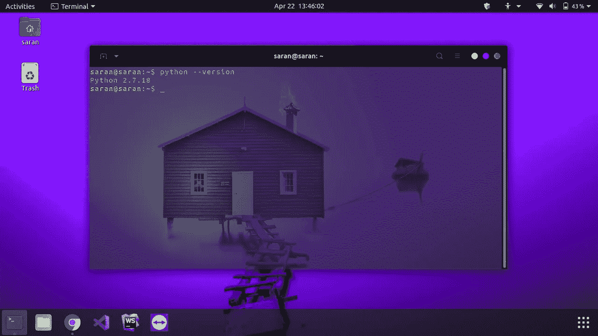
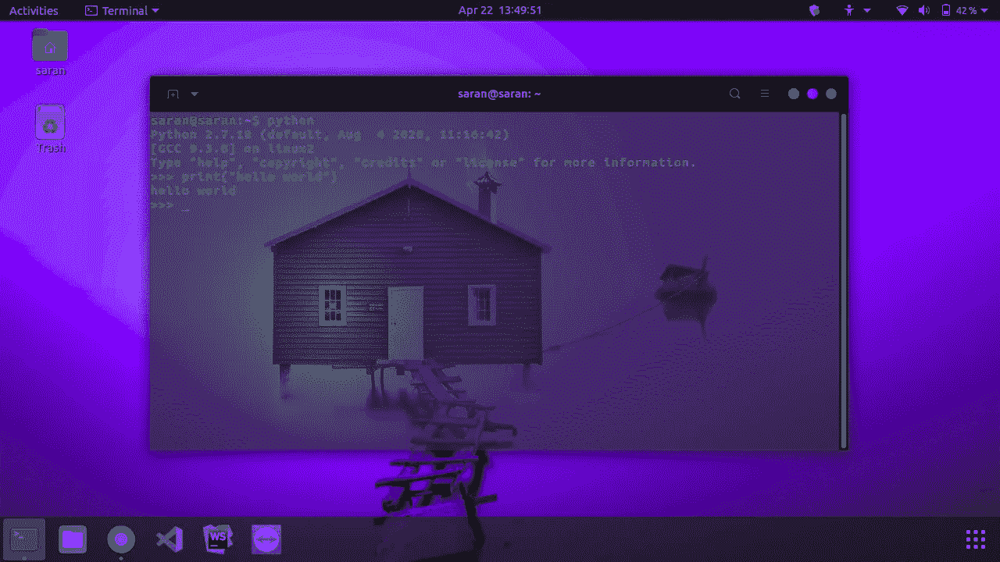
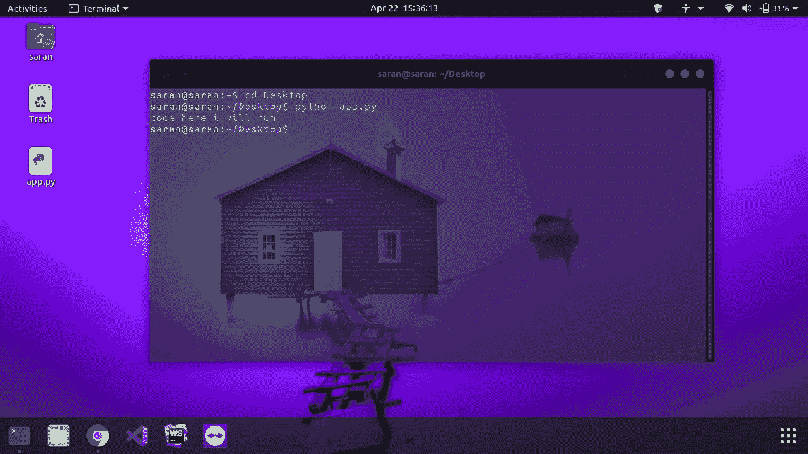
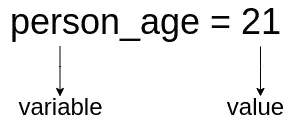

# 面向所有人的 Python

> 原文：<https://medium.com/analytics-vidhya/python-for-everyone-febb359158ee?source=collection_archive---------16----------------------->

## 如何成为 python 编程专家

在本文中，我们将从初学者到专家讨论 python。理解 python 不需要任何先决条件，因为我已经说过 python 适合所有人。我要感谢 [freeCodeCamp](https://medium.com/u/8b318225c16a?source=post_page-----febb359158ee--------------------------------) 和 [GUVI](https://medium.com/u/d0bf50d56bb0?source=post_page-----febb359158ee--------------------------------) 帮助我理解了 python 的复杂性。

∘[python 历史](#2cea)
∘ [集成开发环境:](#da26)
∘ [安装:](#4e6b)
∘ [Python 安装与否](#4420)
∘ [什么是评论？](#8356)
∘ [运行 python](#48f0)
∘ [变量](#01a5)
∘[python 中的数据类型](#5492)
∘ [字符串](#70a0)
∘ [处理字符串](#b6e2)
∘ [转义符](#9bf0)

## python 的历史:

python 是由 [**吉多·范·罗苏姆**](https://en.wikipedia.org/wiki/Guido_van_Rossum) 创立于 1991 年的面向对象编程语言。Python 是一种开源编程语言，所以我们不需要支付一分钱，它是一种解释语言，程序可以逐行执行。与编译语言相比，解释语言速度较慢。

图片来自 [Pixabay](https://pixabay.com/?utm_source=link-attribution&utm_medium=referral&utm_campaign=image&utm_content=1940343) 的 [JL G](https://pixabay.com/users/ractapopulous-24766/?utm_source=link-attribution&utm_medium=referral&utm_campaign=image&utm_content=1940343)

# 为什么是 python？

*   Python 编程语言类似于英语，易于理解代码，执行速度更快。它可以在不同的平台上工作，比如 Windows，Linux，mac..python 在 web 开发、机器学习、人工智能、数学计算中发挥着重要作用，也应用于创建桌面 GUI。

## 集成开发环境:

集成开发环境[IDE]提供了几乎所有的软件开发工具。我使用的 IDE 是 [pycharm professional](https://www.jetbrains.com/pycharm/download/#section=linux) 你可以去找一个完全免费的社区版。

## 安装:

 [## 下载 Python

### 关于特定端口的信息、开发人员信息来源和二进制可执行文件由发布经理或……

www.python.org](https://www.python.org/downloads/) 

访问官方网站，选择使用哪个平台，就可以下载了。

## Python 安装与否

*   您可以通过打开命令提示符或终端并键入`**python --version**`来检查 python 是否安装在我们的本地机器上

像这样的 **☟**

要运行 python，只需在命令提示符下键入`python`

## 运行 python

您可以通过在命令提示符下导航项目文件夹来执行您的 python 文件，然后键入`**python your_filename.py**`并按回车键，如果您使用的是 pycharm，您可以点击编辑器中的运行按钮或按`**Ctrl+Shift+F10**`来执行您的程序。

## 变量

变量就像一个用来存储值的容器。变量*区分大小写*像a=4 和 A=2 都是两个不同的变量，变量是字母数字的(例如:max23)。**变量不能以数字**开头，也不允许任何特殊字符声明变量。变量只以字母开头，下划线 __。不建议在变量的开头使用下划线。

`**person_age**`是保存整数值`**21**`的变量。

**打印变量:**使用`**print()**`显示输出

[https://colab . research . Google . com/drive/1j 4 clunjxznd-EdJ-rKY _ 0 phf 2 ihzutbq？usp =分享](https://colab.research.google.com/drive/1j4clUNJXznd-EdJ-rKY_0pHf2IHzuTbQ?usp=sharing)

## python 中的数据类型

对于 python，有五种常见的数据类型。

1.  线
2.  数字
3.  目录
4.  元组
5.  词典

➤:我们将在本文中讨论字符串。我们将在接下来的文章中看到其他数据类型。

## 线

*   一个字符串包含一个字母和数字，它也可以保存像 i5，five 或 5G 这样的字母数字字符。
*   字符串总是以单引号“”或双引号“”开始和结束。

[https://colab . research . Google . com/drive/16m-xbjjubl 43 jj 84 FX 3-D _ wa 5 hjmvirq？usp =共享](https://colab.research.google.com/drive/16m-xBJjUBL43jj84fx3-D_WA5hjmvIrQ?usp=sharing)

## 使用字符串

[https://colab . research . Google . com/drive/1 YY 8 uxf 1 u 4n 0 dbweibq-gtR-ie 5b zgmy？usp =共享](https://colab.research.google.com/drive/1-kx5u1cKRy7T7j8xJWlJ3qkNjlzxOWVp?usp=sharing)

## 转义字符

转义字符用于在段落或句子之间换行。

[https://colab . research . Google . com/drive/1TD _ hhcvikax 6 ggtl-3 keg 4 Ovi 0x grloe？usp =分享](https://colab.research.google.com/drive/1_5_4qeV8qJ9LD8Zjwa01aPWyXtu1rgMI?usp=sharing)

在接下来的文章中，我们将更多地讨论字符串以及数字是如何在 python 中实现的。

多保重… **！**

## [在这里阅读更多文章:](https://saran-23.medium.com/day-5-concept-of-machine-learning-in-data-science-7e58378fbf90) ☟

 [## 组合学在数据科学中的应用

### 只需 3 分钟就可以免费阅读组合学的基础知识

saran-23.medium.com](https://saran-23.medium.com/day-7-concept-of-combinatorics-you-need-to-know-for-data-science-23e517d44053)  [## 回归在数据科学中的应用

### 只需 3 分钟即可免费阅读逻辑回归

saran-23.medium.com](https://saran-23.medium.com/day-4-different-stages-in-data-science-c9af6e2414ae)