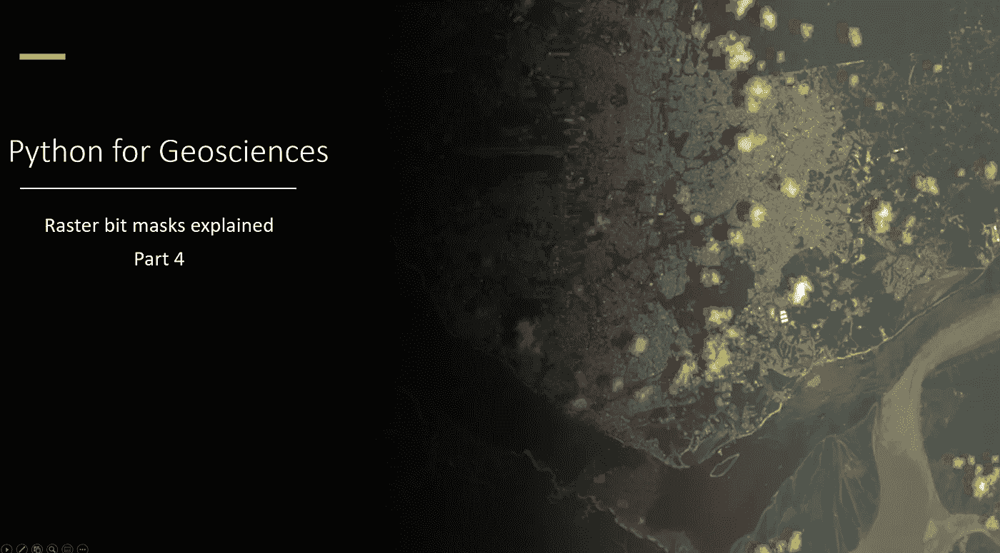

# 面向地球科学的 Python:栅格位掩码讲解(循序渐进)

> 原文：<https://medium.com/analytics-vidhya/python-for-geosciences-raster-bit-masks-explained-step-by-step-8620ed27141e?source=collection_archive---------0----------------------->

## 了解如何(正确)使用卫星影像提供的栅格位掩膜图层作为质量评估波段

# 介绍

欢迎回到地学系列 **Python 的第 4 部分。在上一篇文章中，我们已经介绍了如何提取…**