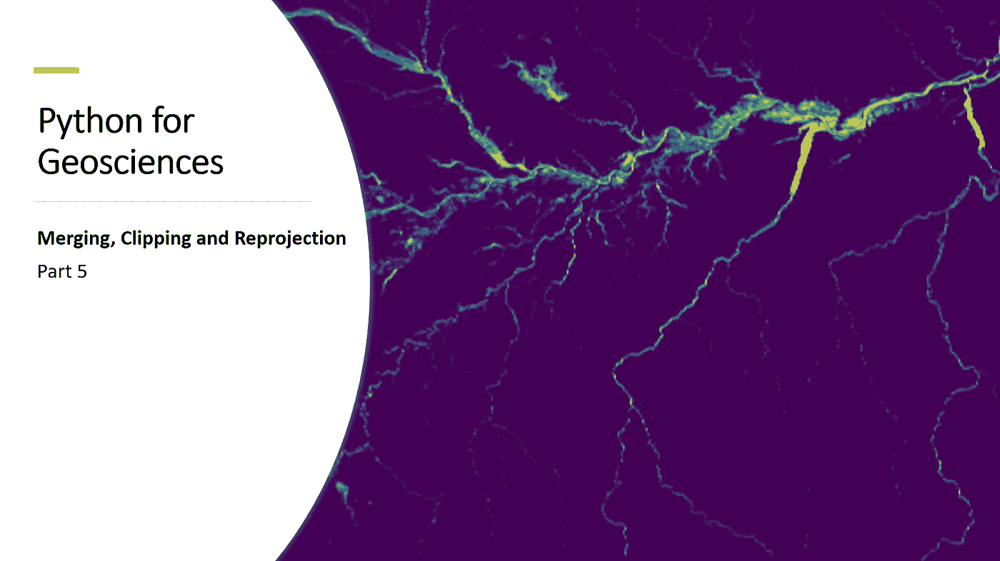

# 面向地球科学的 Python:使用 Rasterio 进行栅格合并、裁剪和重投影

> 原文：<https://medium.com/analytics-vidhya/python-for-geosciences-raster-merging-clipping-and-reprojection-with-rasterio-9f05f012b88a?source=collection_archive---------3----------------------->

## 了解如何使用 Python 的 rasterio 包执行栅格重投影、裁剪和合并

# 介绍

欢迎回到本系列的第 5 部分。在之前的 Python for Geosciences 帖子([此处](/analytics-vidhya/python-for-geosciences-raster-bit-masks-explained-step-by-step-8620ed27141e))中，我们学习了如何…