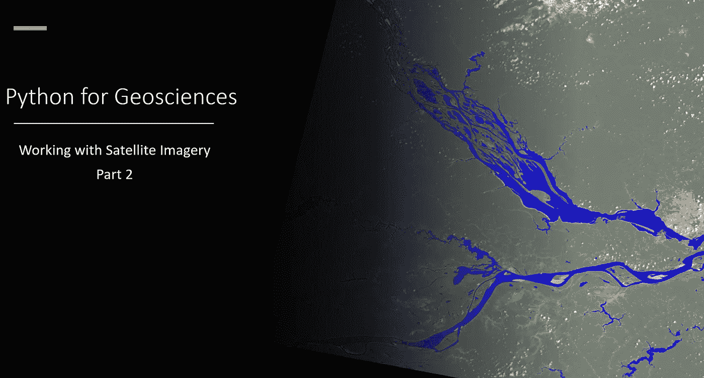

# 面向地球科学的 Python:卫星图像分析(循序渐进)

> 原文：<https://medium.com/analytics-vidhya/python-for-geosciences-satellite-image-analysis-step-by-step-6d49b1ad567?source=collection_archive---------2----------------------->

## 本系列的第二篇文章将教非程序员如何使用 Python 处理和分析地理空间数据。

这是 Python for Geosciences 系列的第二篇文章——使用卫星图像数据。在本系列的第一篇文章中([这里是](/analytics-vidhya/python-for-geosciences-working-with-satellite-images-step-by-step-b141dc50e1df))我们设置了环境来…