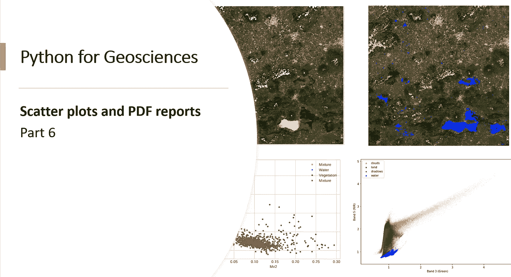

# 面向地球科学的 Python:散点图和 PDF 报告

> 原文：<https://medium.com/analytics-vidhya/python-for-geosciences-scatter-plots-and-pdf-reports-4e4dcec70e4d?source=collection_archive---------5----------------------->

## 了解如何根据卫星影像创建散点图，并使用结果自动生成 PDF 报告引擎

# 介绍

嗨，欢迎回到面向地球科学的 Python 的第 6 部分。使用像 Python 这样的编程语言来执行卫星图像的一个优点是…