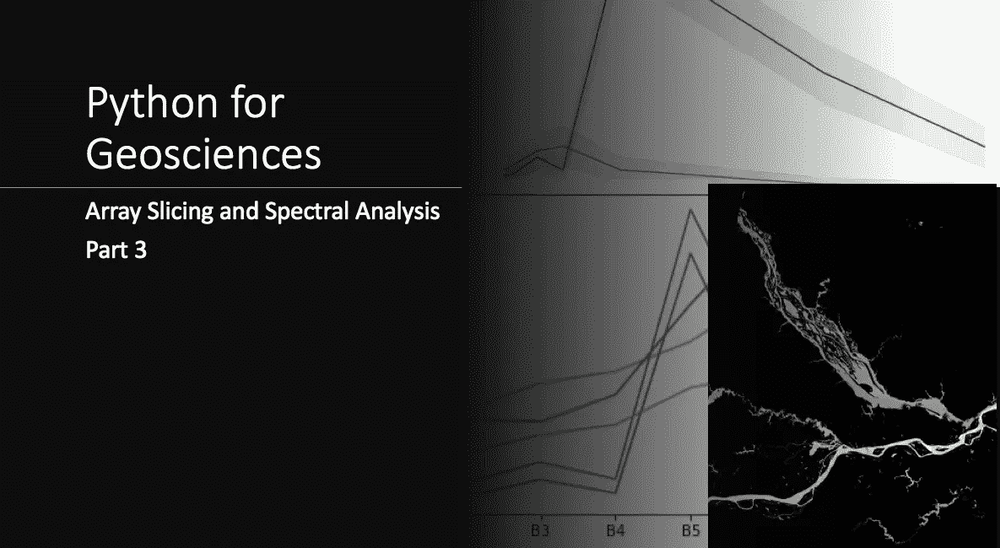

# 面向地球科学的 Python:光谱分析(循序渐进)

> 原文：<https://medium.com/analytics-vidhya/python-for-geosciences-spectral-analysis-step-by-step-e400441a57e7?source=collection_archive---------2----------------------->

## 本系列的第三篇文章将教非程序员如何使用 Python 处理和分析地理空间数据

> 关于课程**科学家 Python 入门** ( [可在 YouTube](https://youtu.be/oQaoj6LE5E4) ) 和其他类似文章的信息，请访问我的网站[cordmaur.carrd.co](http://cordmaur.carrd.co/)。