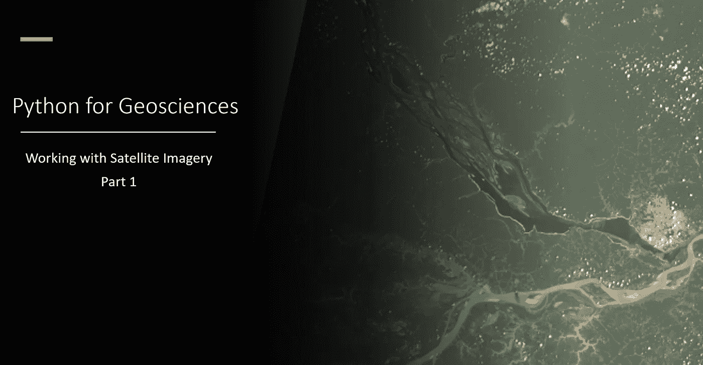

# 面向地球科学的 Python:使用卫星图像(循序渐进)

> 原文：<https://medium.com/analytics-vidhya/python-for-geosciences-working-with-satellite-images-step-by-step-b141dc50e1df?source=collection_archive---------3----------------------->

## 这是教非程序员如何使用 Python 处理和分析地理空间数据的系列文章中的第一篇。

# 更新

有关课程**科学家 Python 入门**(YouTube 上有 ) 的信息以及类似的其他文章…