# 用于股票分析的 Python

> 原文：<https://medium.com/analytics-vidhya/python-for-stock-analysis-fcff252ca559?source=collection_archive---------0----------------------->

在这个项目中，我们将分析股票市场的数据。

同样，我们将使用 Pandas 提取和分析信息，将其可视化，并根据股票的表现历史，寻找不同的方法来分析股票的风险。

以下是我将尝试回答的问题:

*   随着时间的推移，股票价格的变化是什么？
*   一支股票的日平均回报率是多少？
*   各种股票的移动平均数是多少？
*   为什么均线很重要？
*   什么是技术指标以及如何使用它们。
*   不同股票的日收益之间的相关性是什么？
*   各种股票的回报如何？
*   投资一支特定的股票会让我们冒多大的风险？
*   我们如何试图预测未来的股票行为？

我们将分析一些科技股，看看它们去年的表现似乎是个好主意。

## `We're going to analyse stock info for Apple, Google, Microsoft, and Amazon`

让我们来看看数据，我有从[雅虎财经](https://in.finance.yahoo.com/)下载的 CSV 文件。这些 CSV 文件有超过 20 年的数据，对于本教程来说应该足够了。

```
AAPL = pd.read_csv("AAPL.csv")MSFT = pd.read_csv("MSFT.csv")INTC = pd.read_csv("INTC.csv")GOOG = pd.read_csv("GOOG.csv")AMZN = pd.read_csv("AMZN.csv")
```

现在让我们看看这里有什么。

```
AAPL.head()
```

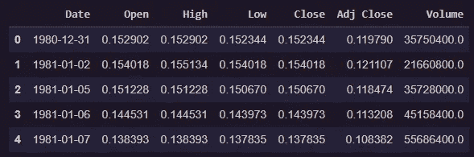

苹果股票数据的前几行

我们还可以检查一些数据的统计，即有多少行，最大值，平均值。通过一个简单的命令，由熊猫提供给我们。

```
#Basic stats for Apple’s StockAAPL.describe()
```

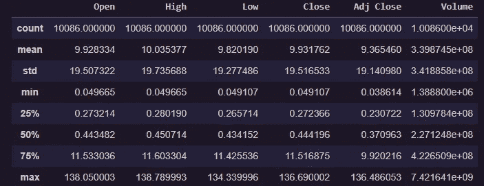

苹果股票数据的基本统计

我们现在应该看看我们有什么类型的列，熊猫再次用另一个简单的命令来救援。

```
# Some basic info about the dataframeAAPL.info()
```

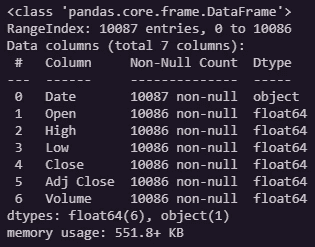

关于苹果股票数据的信息

在上面的数据框架中没有遗漏信息，所以我们可以继续我们的业务。

# 随着时间的推移，股票价格有什么变化？

我们将分析去年，即 2020 年的数据，所以我们有另一个名为“truncate”的属性，我们可以用它来绘制特定日期之间的数据。

```
# Plotting the stock's adjusted closing price using pandasAAPL.truncate(before='2020-01-01', after='2021-01-01')['Adj Close'].plot(legend=True,figsize=(12,5))
```

只需记住这样做，您需要将“日期列”作为数据帧的索引，这可以用另一个简单的命令来完成。

```
AAPL.set_index('Date',inplace=True)
```

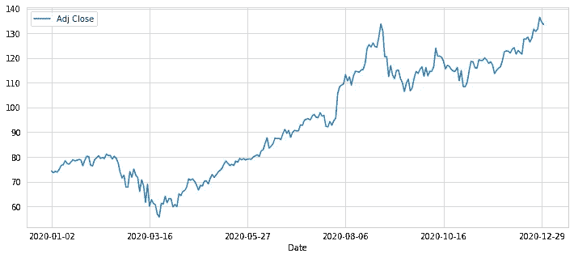

AAPL 调整关闭交易随着时间的推移

类似地，我们可以画出股票交易量随时间的变化。同样，我们将只使用去年的数据，即 2020 年的数据。

```
# Plotting the total volume being traded over timeAAPL.truncate(before='2020-01-01', after='2021-01-01')['Volume'].plot(legend=True,figsize=(12,5))
```

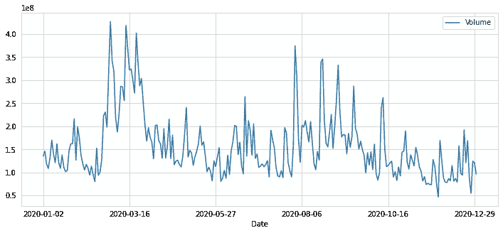

一段时间内的 AAPL 交易量

# 什么是技术指标，如何使用它们

技术指标是探索性的变量，通常来源于股票的价格和交易量。它们被用来解释股票的价格变动，以期预测未来的波动。换句话说，它们被用来确定一只股票是“超买”还是“超卖”。虽然这些指标被独立投资者和对冲基金广泛利用，但许多人没有快速获得它们的方法。他们不得不一次计算一个指标。这个过程需要大量的时间和计算能力。相信我。过去，我花了相当多的时间用 python 编写这个过程。

计算技术指标会占用建模过程的时间，因此会阻碍构建更复杂的统计模型。通过 TA(技术分析)库，我们可以用一行代码证实任何股票的历史价格数据，包括 40 多个不同的技术指标。

安装 TA(技术分析)库

```
pip install --upgrade tafrom ta import add_all_ta_featuresfrom ta.utils import dropnamom_data = add_all_ta_features(AAPL, open=”Open”, high=”High”, low=”Low”, close=”Close”, volume=”Volume”)mom_data.columns
```

这时，图书馆已经实施了 32 项指标:

# 卷

*   积累/分配指数
*   平衡量(OBV)
*   平衡体积平均值(OBV 平均值)
*   柴金资金流(CMF)
*   力指数
*   便于移动(EMV 选举观察团)
*   量价趋势(VPT)
*   负体积指数

# 波动性

*   平均真实距离
*   布林线(BB)
*   凯尔特纳海峡
*   唐奇安海峡(DC)

# 趋势

*   移动平均收敛发散(MACD)
*   平均定向运动指数
*   涡流指示器(六)
*   特里克斯(Trix)
*   质量指数
*   商品频道指数(CCI)
*   去趋势价格振荡器(DPO)
*   KST 振荡器(KST)
*   一目岛

# 动力

*   货币流通指数
*   相对强度指数
*   真实强度指数
*   终极振荡器(UO)
*   随机振荡器
*   威廉姆斯%R (WR)
*   超棒振荡器(AO)

# 其他人

*   每日退货
*   累积回报

这些指标产生了 58 个特征。开发人员可以设置许多输入参数，如窗口的大小，不同的常数或智能自动填充方法中生成的 NaN 值。

[](https://github.com/bukosabino/ta) [## 布科萨比诺/ta

### 这是一个技术分析库，可用于从金融时间序列数据集(开放、封闭…

github.com](https://github.com/bukosabino/ta) 

# 各种股票的移动平均数是多少？

让我们来看看股票在 10、20 和 50 天内的移动平均线。我们会将这些信息添加到股票的数据框架中。

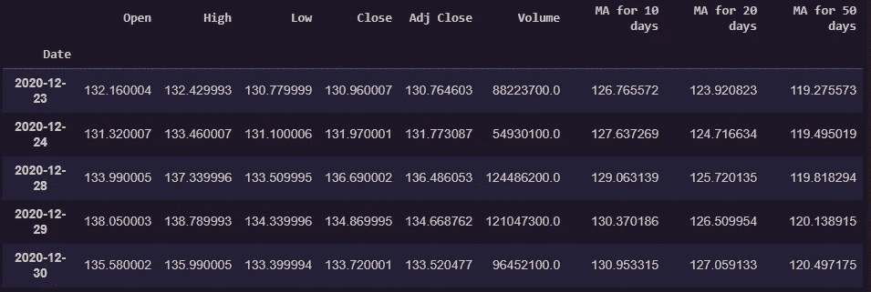

10、20、30 天的移动平均线

让我们同样用去年，也就是 2020 年的数据来绘制。

```
AAPL.truncate(before='2020-01-01', after='2021-01-01')[['Adj Close','MA for 10 days','MA for 20 days','MA for 50 days']].plot(subplots=False,figsize=(12,5))
```

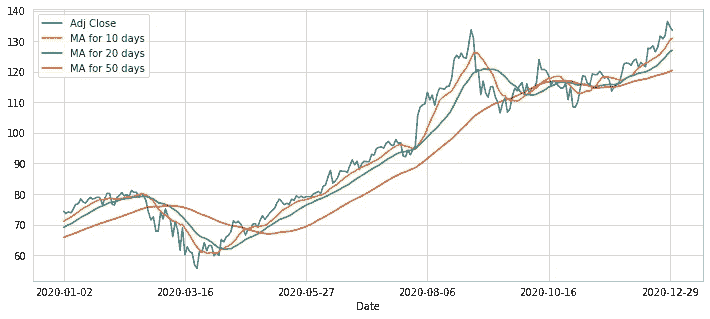

AAPL 移动平均图

更多天的移动平均线有更平滑的曲线，因为它们在每日波动上不太可靠。因此，尽管苹果公司的股票在年初有小幅下跌，主要是由于新冠肺炎的影响，但自 6 月初以来，它一直呈上升趋势。

# 为什么均线很重要？

移动平均线用于识别重要的[支撑位](https://www.investopedia.com/trading/support-and-resistance-basics/)和[阻力位](https://www.investopedia.com/trading/support-and-resistance-basics/)。

交易者观察短期均线与长期均线的交叉，作为趋势变化的可能指标，以进入多头和空头头寸。

> Stan Weinstein 认为:要想买入一只股票，价格必须高于短期 MA。

# 一支股票的日平均回报率是多少？

```
# The daily return column can be created by using the percentage change over the adjusted closing priceAAPL['Daily Return'] = AAPL['Adj Close'].pct_change()
```

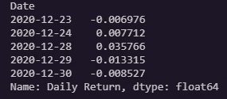

AAPL 每日回报专栏

现在让我们绘制去年(即 2020 年)的日收益率

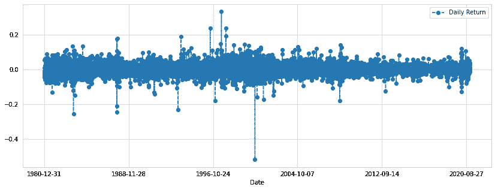

AAPL 每日回报

现在我们将通过 Seaborn library 的 distplot 来检查我们得到了多少正或负的回报。在我们绘图之前，先了解一下 distplot。

Seaborn distplot 允许您显示一个带线条的直方图。这可以表现在各种各样的变化中。distplot 绘制观察值的单变量分布。distplot()函数将 matplotlib hist 函数与 seaborn kdeplot()和 rugplot()函数结合在一起。

```
sns.distplot(AAPL[‘Daily Return’].dropna(),bins=50,color=’blue’)
```

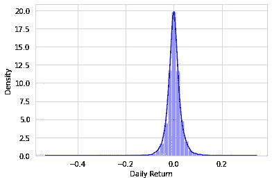

AAPL 区地块

对苹果来说，每日正回报似乎比负回报更频繁。

# 不同股票的日收益之间的相关性是什么？

我以前写过一篇关于这个的文章，你可以看看。[如何在 python 中创建股票相关性矩阵](/analytics-vidhya/how-to-create-a-stock-correlation-matrix-in-python-4f32f8cb5b50)

现在让我们将所有股票数据合并到一个数据框架中，这样我们就可以用它来计算相关性。

```
df = pd.concat(data)df = df.reset_index()df = df[[‘Date’, ‘Adj Close’, ‘Symbol’]]df.head()df_pivot=df.pivot(‘Date’,’Symbol’,’Adj Close’).reset_index()df_pivot.head()
```

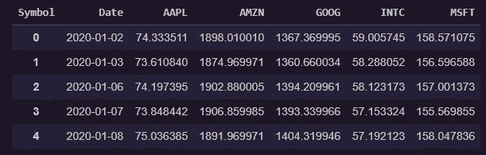

所有股票的组合数据框架

**现在，我们可以运行关联。使用熊猫的“corr”函数计算每对股票之间的皮尔逊相关系数。**

```
corr_df = df_pivot.corr(method='pearson')# reset symbol as index (rather than 0-X)corr_df.head().reset_index()# del corr_df.index.namecorr_df.head(10)
```

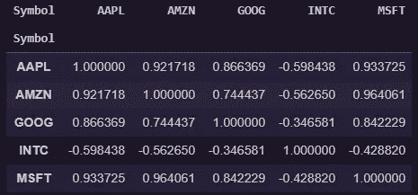

股票之间的相关值

现在让我们使用 Seaborn 库来绘制一个热图，并以一种更好的方式来可视化相关性

```
plt.figure(figsize=(13, 8))sns.heatmap(corr_df, annot=True, cmap="RdYlGn")plt.figure()
```

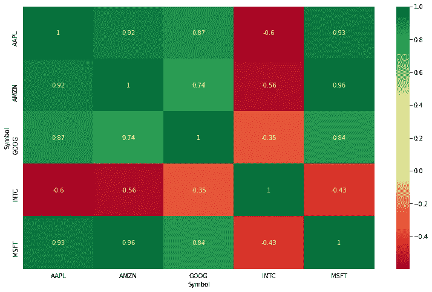

相关矩阵

如您所见，除了英特尔，所有其他公司都有很强的相关性。

# 各种股票的回报如何？

让我们把我们所有的存货都标出来。

```
df_pivot.plot(figsize=(10,4))plt.ylabel('Price')
```

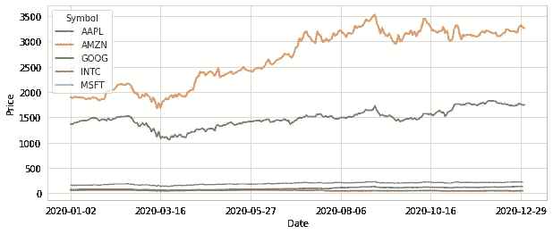

2020 年所有股票的价格图

# 标准化多个股票

```
returnfstart = df_pivot.apply(lambda x: x / x[0])returnfstart.plot(figsize=(10,4)).axhline(1, lw=1, color=’black’)plt.ylabel(‘Return From Start Price’)
```

在这种情况下，我将所有收盘价除以该期间的第一个收盘价。

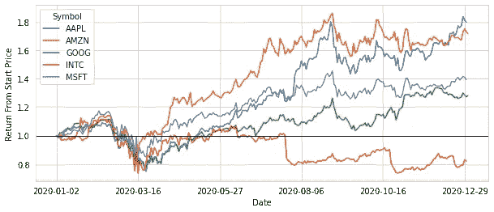

从起始价格返回

# 每日回报百分比图

```
df2=df_pivot.pct_change()df2.plot(figsize=(10,4))plt.axhline(0, color=’black’, lw=1)plt.ylabel(‘Daily Percentage Return’)
```

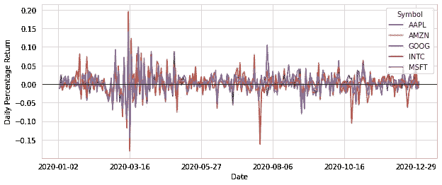

每日百分比回报

因为我有 5 只股票相互重叠，所以在这里进行比较有点困难。

# 投资一支特定的股票会让我们冒多大的风险？

量化风险的一个基本方法是将预期回报(可以是股票每日回报的平均值)与每日回报的标准差进行比较。

```
risk = corr_df.dropna()
```

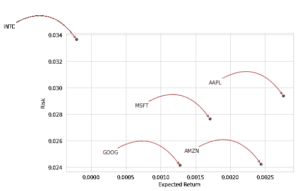

风险图

英特尔(INTC) : —高风险低回报

谷歌(Google):低风险中等回报

微软(MSFT): —中等风险，中等回报

亚马逊(Amazon):—低风险高回报

苹果(AAPL): —高风险高回报

# 风险价值法

我们可以将*风险价值*视为在给定的置信区间内我们可能会损失的金额。我们将使用“Bootstrap”方法和“Monte Carlo”方法来提取该值。

**自举方法**

使用这种方法，我们从日收益率直方图中计算经验分位数。分位数帮助我们定义我们的置信区间。

```
sns.distplot(AAPL.truncate(before='2020-01-01', after='2021-01-01')['Daily Return'].dropna(),bins=100,color='purple')
```

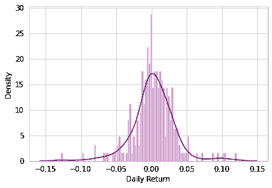

AAPL 的每日回报直方图

概括地说，我们的苹果股票柱状图看起来如上。我们的数据框架是这样的。

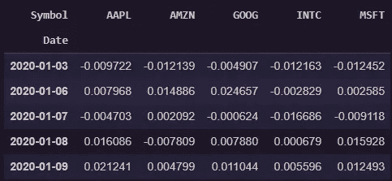

```
# Using Pandas built in qualtile methodrisk['AAPL'].quantile(0.05)>> -0.04486874869710267
```

日收益的 0.05 经验分位数在-0.004703。这意味着，在 95%的信心下，最差的日损失不会超过(投资的)4.48%。

# 我们如何试图预测未来的股票行为？

在这里，我给你提供了一个可以用来预测股票价格的不同模型的列表。

## [使用脸书先知模型预测股票价格](/analytics-vidhya/predicting-stock-prices-using-facebooks-prophet-model-b1716c733ea6)

## [时间序列预测:用 ARIMA 模型预测微软(MSFT)的股票价格](/analytics-vidhya/time-series-forecasting-predicting-microsoft-msft-stock-prices-using-arima-model-be1c45961739)

## [时间序列预测:使用 LSTM 模型预测苹果股票价格](/analytics-vidhya/time-series-forecasting-predicting-apple-stock-price-using-an-lstm-model-f1bb73bd8a80)

我推荐你通读这些文章，所描述的模型能够非常精确地预测价格。

**免责声明**已经有人尝试使用时间序列分析算法来预测股票价格，尽管它们仍然不能用于在真实市场中下注。这只是一篇教程文章，并不打算以任何方式“指导”人们购买股票。

马拉松结束了，我必须说:我完成了我想做的事情。

现在轮到你跟我来了。感谢您的阅读！

给我一个[关注](https://rohan09.medium.com/)如果你喜欢这个，更多的技术博客！

> "如果一开始你不成功，那么跳伞不适合你."—梅尔·赫利策

下次见！