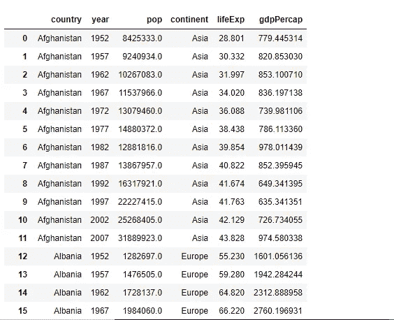
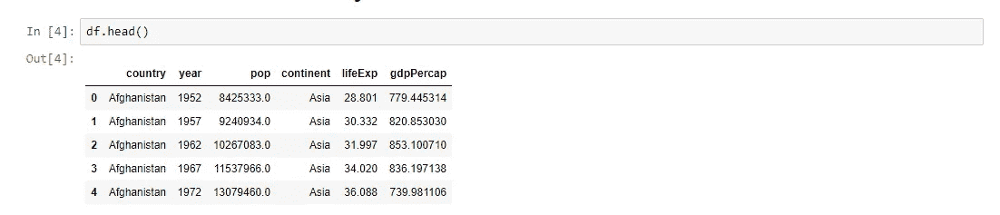
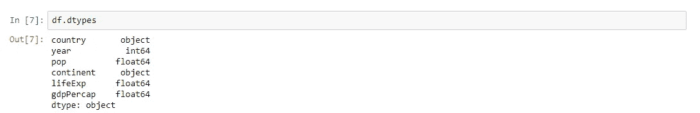
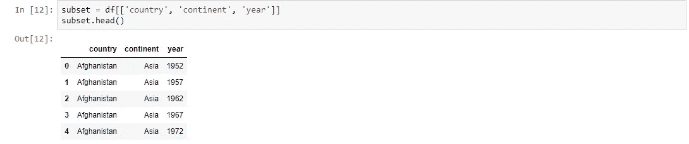
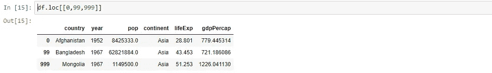
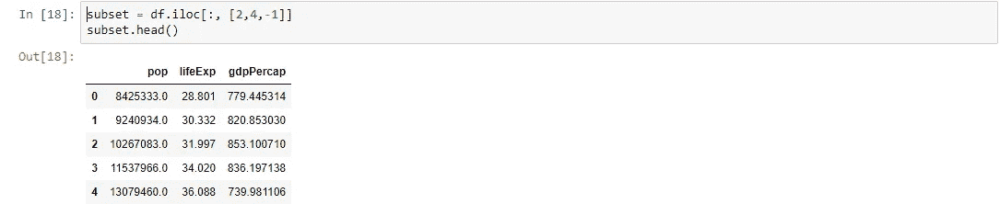
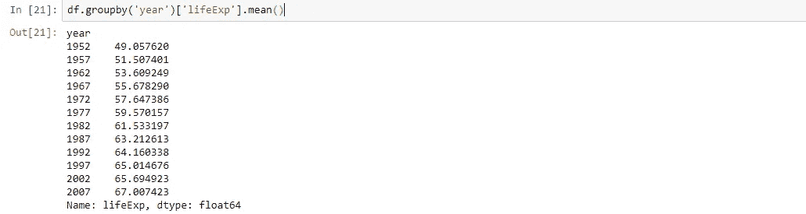
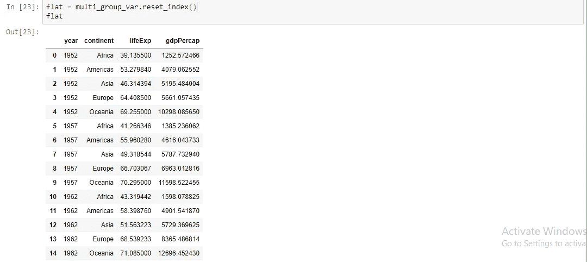
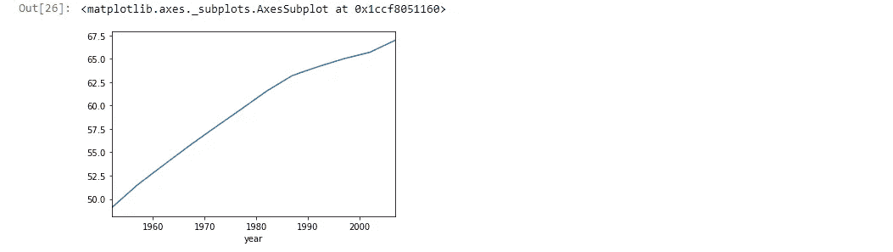

# 数据分析的 Python 基础

> 原文：<https://medium.com/analytics-vidhya/python-fundamentals-for-data-analytics-70e721890d65?source=collection_archive---------14----------------------->


**Python 基础:**

1.  加载简单的分隔数据文件
2.  计算加载了多少行和多少列
3.  确定加载的数据类型
4.  通过对行和列进行子集化来查看数据的不同部分。

**为了访问本教程中使用的数据集，请点击以下链接:**

[](https://github.com/Pallavi885/Data-Analytics/blob/main/Python%20Fundamentals%20for%20Data%20Analytics/gapminder-FiveYearData.csv) [## pallavi 885/数据分析

### 通过在 GitHub 上创建帐户，为 pallavi 885/数据分析开发做出贡献。

github.com](https://github.com/Pallavi885/Data-Analytics/blob/main/Python%20Fundamentals%20for%20Data%20Analytics/gapminder-FiveYearData.csv) 

**导入库以实现数据可视化:**

```
import pandas as pd
import numpy as np
import matplotlib.pyplot as plt
```

**加载一个简单的分隔数据文件:**

```
df=pd.read_csv('gapminder-FiveYearData.csv')
```

**打印数据集的数据:**

```
df
```



在打印数据集时，我们得到如上输出

**为了只看到前 5 行，我们使用 head()函数**

```
df.head()
```



**获取行数和列数**

```
df.shape
```


**获取列名**

```
df.columns
```


**获取每列的数据类型:**

```
df.dtypes
```



**获取国家列，并将其保存到自己的变量:**

```
country_df = df['country']
country_df.head()
```

**获取最近 5 次观察:**

```
country_df.tail()
```

**查看国家、洲和年份:**

```
subset = df[['country', 'continent', 'year']]
subset.head()
```



**获取第一行:**

```
df.loc[0]
```

**使用‘loc’获取多行:**

```
df.loc[[0,99,999]]
```



**按行号排列的子集行:**

```
df.iloc[1]
```

我们可以使用 iloc[-1]来获取最后一个元素，这在使用 loc 时是不可能的。

**子集化列:**

```
subset = df.loc[:, ['year','pop']]
subset.head()
```

带有 iloc 的子集将允许我们使用整数

```
subset = df.iloc[:, [2,4,-1]]
subset.head()
```



**同时子集化行和列:**

```
df.loc[42, 'country']
```

**使用 iloc:**

```
df.iloc[42,0]
```

**使用特定列进行分组的 Groupby 方法**

```
df.groupby('year')['lifeExp'].mean()
```



**多组命令:**

```
multi_group_var = df.groupby(['year','continent'])   [['lifeExp','gdpPercap']].mean()
multi_group_var
```

如果我们需要展平数据帧，我们可以使用 reset_index 方法

```
flat = multi_group_var.reset_index()
flat
```



**使用 nunique 获得熊猫系列的唯一值的计数:**

```
df.groupby('continent')['country'].nunique()
```

**绘制平均寿命图:**

```
global_yearly_life_expectancy = df.groupby('year')['lifeExp'].mean()
global_yearly_life_expectancy
global_yearly_life_expectancy.plot()
```



如果你想亲自尝试，请点击下面的 github 链接:

[](https://github.com/Pallavi885/Data-Analytics/tree/main/Python%20Fundamentals%20for%20Data%20Analytics) [## pallavi 885/数据分析

### 通过在 GitHub 上创建帐户，为 pallavi 885/数据分析开发做出贡献。

github.com](https://github.com/Pallavi885/Data-Analytics/tree/main/Python%20Fundamentals%20for%20Data%20Analytics)