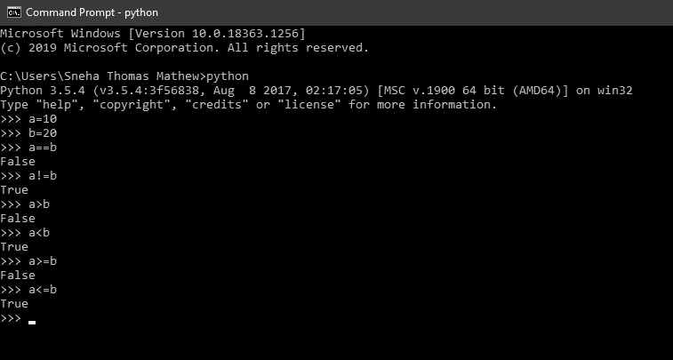
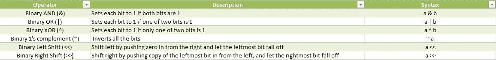

# 面向所有人的 Python 基础——运算符和操作数

> 原文：<https://medium.com/analytics-vidhya/python-fundamentals-for-everybody-operators-and-operands-6f6254fdeb9f?source=collection_archive---------16----------------------->

照片由[在](https://unsplash.com/@freetousesoundscom?utm_source=medium&utm_medium=referral) [Unsplash](https://unsplash.com?utm_source=medium&utm_medium=referral) 上免费使用声音

这是关于每个人的 **python 基础**的第三篇文章，这是一个专注于 Python 基础的 Python 教程系列。

你可以参考下面这个系列的前一篇文章。

 [## 面向所有人的 Python 基础——变量

### 这是面向所有人的 python 基础系列文章的第二篇，这是一个 Python 教程系列，主要关注…

snehathomasmathew.medium.com](https://snehathomasmathew.medium.com/python-fundamentals-for-everybody-variables-b76fd2699b20) 

在这篇文章的结尾，你将会知道什么是操作符，操作数以及我们如何使用它。

## **运算符和操作数**

运算符基本上是一种符号，如+、-、>、< etc., which are used to perform operations on values and variables. These values and variables are known as operands.

Operators are used to manipulate the operands.

For example: In this example, ‘a’ and ‘b’ are operands where as ‘+’ is the operator.

Image by author

Python supports the following Operators:

1.  Arithmetic Operators
2.  Comparison (Relational) Operators
3.  Assignment Operators
4.  Logical Operators
5.  Bitwise Operators
6.  Membership Operators
7.  Identity Operators

Let us look into each of these one by one along with examples.

> Arithmetic Operators

They are used to perform mathematical operations like addition, subtraction, multiplication etc.

Assume a = 2 and b = 3, and go through the following two images with example to understand better.

Image by author

Image by author

> Comparison (Relational) Operators

These operators are used to compare the operand values. It returns True or False depending upon the condition. They are also called as relational operators.

Assume a = 10 and b = 20, and go through the following two images with example to understand better.

Image by author

Image by author

> Assignment Operators

Assignment operators (symbol ‘=’) are operators used to assign values to the variables, in a program.

Assume a = 10 and b = 20, and go through the following two images with example to understand better.

Image by author

Image by author

> Logical Operators

They are operators which are used to control the flow of the program. Most often, logical operators are combined with Boolean expressions. Sometimes, Logical Operators are also called as Boolean Operators. It holds the value of 0 or 1, where 0 means False and 1 means True.

*布尔/逻辑表达式是计算结果为真或假的表达式。*

假设以下示例中 a =假，b =真

作者图片

作者图片

> 按位运算符

按位运算符类似于逻辑运算符，但它直接对位进行操作。

作者图片

作者图片

在上面的例子中，a << 2 is 40, since the binary representation of a = 10 is 00001010(2), which when we shift left two spaces, and fill up the empty spots with zeroes, we get 00101000(2) = 40(10).

The right shift operator works the opposite way, the value of a > > 2 的值是 2，因为 a = 10 的二进制表示是 1010(2)，当我们通过用零填充值来右移两个空格时，最右边的两位会下降。因此，我们得到 00000010(2) = 2。

> 成员运算符

Python 有两个成员操作符，分别是:中的**和【非】中的**。****

这些运算符用于测试值或变量是否存在。它适用于字符串、元组、列表和字典。

作者图片

作者图片

> 恒等运算符

恒等运算符用于比较对象的内存位置。Python 有两个恒等运算符，即**是**和**不是**。

> 成员操作符用于检查列表中的内容等。，其中 as 恒等式运算符比较内存位置。

作者图片

作者图片

> 唷！那是相当多的。既然您已经到了这里，不妨去阅读一下运算符优先级和结合性。

> **Python 运算符优先级&结合律**

如果表达式是单一的，那么在评估解时不存在问题，但如果有多个操作呢？

在大多数情况下，当表达式是混合的，即包含几个操作时，Python 如何知道先执行哪个操作呢？

> 操作符的优先级和结合性，帮助 python 决定操作符的优先级。

作者图片

现在，您已经了解了各种类型的 are Python 操作符及其优先级。

在下一篇文章中，我们将看看类型转换和类型强制之间的区别。