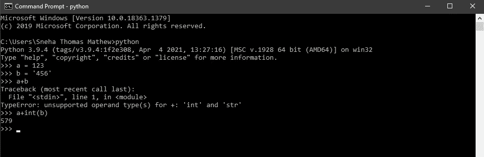
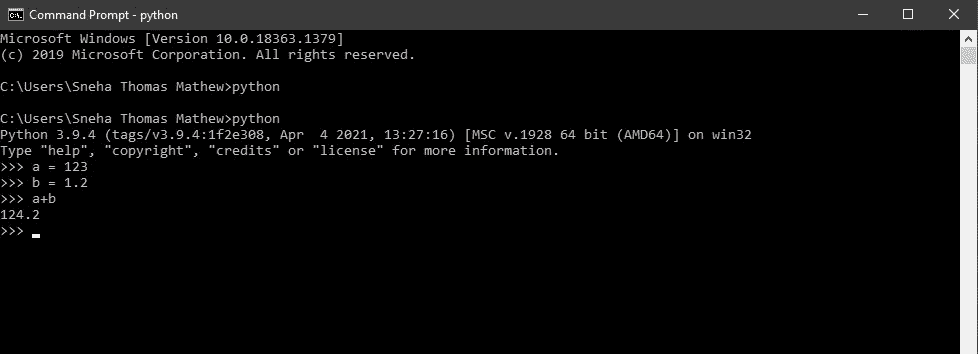

# 面向所有人的 Python 基础——类型转换与类型强制

> 原文：<https://medium.com/analytics-vidhya/python-fundamentals-for-everybody-type-conversion-vs-type-coercion-34234e99c9c4?source=collection_archive---------5----------------------->

由 [Raphael Schaller](https://unsplash.com/@raphaelphotoch?utm_source=medium&utm_medium=referral) 在 [Unsplash](https://unsplash.com?utm_source=medium&utm_medium=referral) 拍摄的照片

这是关于 **python 基础知识的第四篇文章**，这是一个专注于 Python 基础知识的 Python 教程系列。

你可以参考下面这个系列的前一篇文章。

 [## 面向所有人的 Python 基础——运算符和操作数

### 大家好！这是 Python 基础系列的第三篇文章。正如所承诺的，它关注 Python…

medium.com](/analytics-vidhya/python-fundamentals-for-everybody-operators-and-operands-6f6254fdeb9f) 

在本文结束时，您将理解类型转换和类型强制之间的区别。

**类型转换**

类型转换，顾名思义，就是根据需要将对象的类型从一种数据类型转换为另一种数据类型的过程。

Python 支持各种内置的类型转换函数，如 int()、long()、float()、str()等。

> 这种类型的转换也称为显式类型转换或类型转换。

显式类型转换(图片由作者提供)

在上面的例子中， *a* 是一个*整数*，而 *b* 是一个字符串。当我们添加 *a+b* 时，编译器抛出 TypeError。

上面的程序试图将一个字符串和一个整数相加。因为 python 不允许将字符串和整数相加，所以两者应该转换为相同的数据类型。因此，我们将 *b* 显式转换为 *int* 数据类型( *int(b)* )。

值得记住的是，在显式类型转换中，当我们将一个对象强制为指定的数据类型时，可能会有数据丢失的机会。

**型强制**

从一种数据类型到另一种数据类型的自动类型转换称为类型强制。这也称为隐式类型转换。

类型转换和类型强制之间的主要区别在于，类型转换是使用内置函数手动完成的，而类型强制是自动完成的。

类型强制/隐式类型转换(图片由作者提供)

在上面的例子中， *a* 是一个*整数*，而 *b* 的数据类型是*浮点数。*当两者相加时，我们可以看到结果的数据类型为 float。这是因为，python 总是将较小的数据类型转换为较大的数据类型，以避免数据丢失。

> 既然您已经知道了什么是类型强制和类型转换，那么就开始实现它吧！

在下一篇文章中，我们将研究函数。在那之前，敬请关注！:)