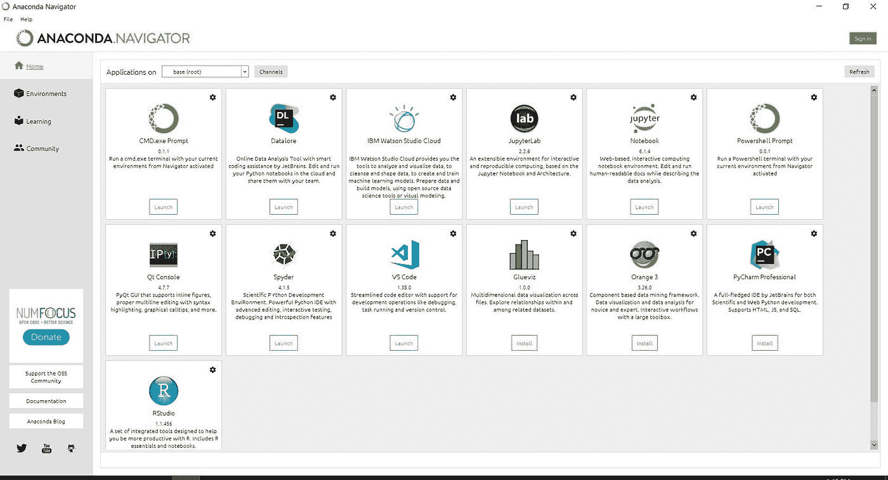
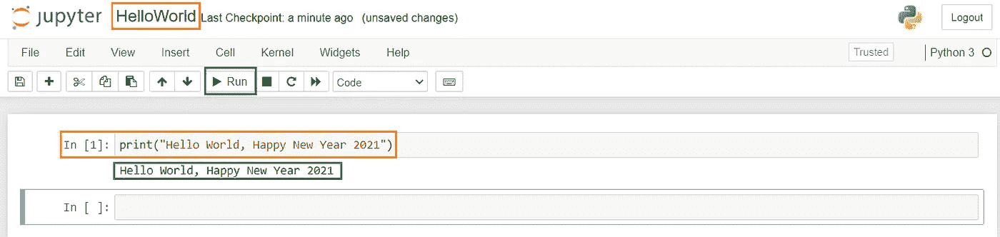

# Python:如何在 5 分钟内编码

> 原文：<https://medium.com/analytics-vidhya/python-how-to-code-in-5-minutes-734965412ec1?source=collection_archive---------33----------------------->

祝我所有亲爱的读者新年快乐。我们现在是在 2021 年。今年的新决心是无障碍地学习技术。作为我的组织内技能改进的一部分，我们的管理层决定让每个人都参与学习我的组织今年将使用的各种技术。这是我们数据数字化和自助服务战略的一部分。在漫长的圣诞节和新年假期期间，当我们每个人都有时间学习 Python、Tableau、Power BI、AWS Glue 和 Azure 时，第一步就发生了。

# 安装 python

今天，我将从 Python 安装开始，并在我的屏幕上显示“Hello World”。如果你之前没有在你的机器上安装 Python，你可以去 python.org 网站安装 Python 3.8.x 或者 Python 3.9。我的机器使用的是 Windows 操作系统。你只需选择操作系统，然后下载 Python 并安装在你的机器上。完成下载和安装不超过 2 分钟。

# 安装 anaconda

接下来，我下载并安装了 [Anaconda](https://www.anaconda.com/products/individual) ，整个过程花了我不到 2 分钟的时间。您可以访问 anaconda 的网站，让安装程序安装它。有两个步骤，当我们想要为 Python 编程设置我们的机器时开始。安装后，您将自动进入默认的 conda 环境，其中安装了所有软件包。conda 是一个包和环境管理器。

# 什么是 python 和 anaconda？

您可能想知道为什么我们需要 Python 和 Anaconda。这条蟒蛇是干什么用的？Wiki 告诉我们，Anaconda 是用于科学计算(数据科学、机器学习应用、大规模数据处理、预测分析等)的 Python 和 R 编程语言的发行版。)，旨在简化包管理和部署。

Anaconda 有助于管理包和环境，并减少将来处理您将使用的各种库的问题。Anaconda 是为数据科学构建的包的发行版。它附带了 conda、一个包和一个环境管理器。我们通常使用 conda 来创建环境，以隔离使用不同版本 Python 和/或不同版本包的项目。例如，您想要设置 Python 2 和 Python 3 环境。您可以从下面的参考链接中了解关于 Anaconda 的更多信息。



# Jupyter 笔记本

在开始我的第一次 Python 编程练习以显示“Hello World”之前，我选择使用 Anaconda Navigator 的 Jupyter 笔记本。Jupyter Notebook 是一个允许我创建文档(笔记本)来编码/编写 Python 代码以显示 Python 代码的输入和输出的应用程序。Jupyter 笔记本也广泛用于其他编程语言。当我谷歌哪个 IDE(集成开发环境)最常用于 Python 编程时，Spyder 是另一个做编码的工具，我可以从 Anaconda 中找到它。

点击“启动”按钮，我的浏览器启动 localhost([http://localhost:8888/tree](http://localhost:8888/tree))，显示 Jupyter 笔记本的仪表盘和我机器的工作目录。在我的例子中，它是 C:\Users\ < myname >。我需要通过单击窗口右侧的“新建”按钮来创建一个新笔记本。一个新窗口启动，我可以看到 Jupyter 笔记本。

我把我的笔记本重新命名为“HelloWorld”，如下所示。然后，我从写第一行代码开始 Python 编程。

```
print("Hello World, Happy New Year 2021")
```

# 第一个 python 代码

print()在我运行所选单元格时显示在双引号中。In [1]后面括号中的数字代表运行的命令数。如果您再次运行同一个单元格，该单元格的数字将会改变。如果您切换到另一个单元格并再次运行该单元格，该单元格的数字将会改变。



好了，我的 Python 编程学习之旅的第一篇博客就此打住。在这里，我讨论了以下主题:

# 点

这不是我第一次在博客中写关于 Python 编程的文章。以前，我通过使用 pip(包管理器)安装 Python。Pip 是一个允许我安装和管理附加库和依赖项的工具。Pip 安装 Python 包，而 conda 安装可能包含用任何语言编写的软件的包。你可以参考我的[词条](https://liyenz.wordpress.com/2020/08/23/updated-pip-and-installed-jupyter-notebook/)分享我是如何在我的 Windows 机器上更新 pip 和 Python 的。使用 pip 的安装在 Windows 命令提示符下完成。

在我之前的 Python 帖子中，我写了如何使用 IntelliJ 作为 IDE，并在 Udemy 注册了一门课程，开始了我的 Python 学习之旅。这里是[第一天的链接:让我们开始使用 Python](https://liyenz.wordpress.com/2018/11/25/let-get-started-with-python/) 。如果你想看看我以前的文章，请访问这个[链接](https://liyenz.wordpress.com/category/experience-sharing/python/)。希望你喜欢我的分享，请关注下一次更新。谢谢你。

*原载于 2021 年 1 月 6 日*[*【http://liyenz.wordpress.com】*](https://liyenz.wordpress.com/2021/01/06/python-how-to-code-in-5-minutes/)*。*