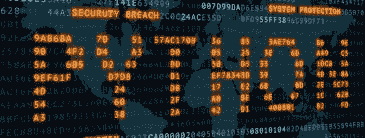

# Python 关键字和标识符

> 原文：<https://medium.com/analytics-vidhya/python-keywords-and-identifiers-89837b34e154?source=collection_archive---------22----------------------->



每种编程语言都有预先给定的关键字，这些关键字是在使用特定语言时保留的。标识符是程序员可以根据自己的意愿来标识变量、函数、类等的单词。不要感到困惑，只要继续读下去，你就会在这篇文章的最后得到正确的想法。

## **Python 关键字**

让我在 Python 中称为关键字的单词前面使用“**保留的**”一词。它们是保留的，这意味着你不能心甘情愿地把它们用在任何事情上。为了便于理解，我们假设使用关键字有一些规则和规定。

Python 3.7 中有 35 个关键字。(随着时间的推移，这个数字可能会略有变化。)

在 Python 中，关键字区分大小写。这意味着关键字的处理方式不同，取决于它是大写还是小写。除了`True`、`False`和`None`之外的所有关键词都用小写字母书写。以下是 Python 编码中使用的所有关键字的列表。

`and`|`as`|`assert`|`async`|`await`|`break`|`class`|
|`continue`|`def`|`del`|`elif`|`else` |`except`|`False`
|`finally`|`for`|`from`|`global`|`if`|`import`|`in`
|`is`|`lamba`|`None`|`nonlocal`|`not`

等等！不要在第一眼编码的时候就去揣摩这些词的意思，去哪里用。现在，只要记住这些是 Python 中的关键字，它们是区分大小写的。现在够了。

## Python 标识符

请记住，标识符是您可以为特定的类、函数、变量等起的名字。例如，让我们以一所学校为例，我将介绍一群 10 年级 A 班的学生。10 A 是我用来区分这个班级和其他班级的标识符，在这个学校里，只有一个 10 A 的班级。谈到 Python 标识符，我们在代码中使用标识符的原因与上面的例子类似。

当你用一个名字作为某个事物的标识符时，你需要遵循一些规则。

1.  标识符可以是大写字母(A 到 Z)、小写字母(A 到 Z)、数字(0 到 9)和下划线(_)的组合。下面是一些有效的标识符，您可以在编码时使用。

```
NUMBER1
number1
Number1
numBer1
number_1
num_ber_1
```

2.标识符不能以数字(数字)开头。

```
1number, 1_number are invalid identifiers. 
```

3.关键字不能用作标识符。(上面提到了 Python 中使用的所有关键字。如果你错过了它们，向上滚动，更新你自己！)

例如，如果我们识别一个变量并将其命名为“lamba ”,我们将显示如下错误。

```
lamba=1
```

输出

```
File "<interactive input>", line 1
    lamba = 1
           ^
SyntaxError: invalid syntax
```

4.我们不能使用特殊符号，如！、@、#、$、%等。在标识符中。(很容易记住，在标识符中唯一允许使用的特殊字符是下划线(_))

例如，如果我们将一个变量标识为“#value”，它将显示如下错误。

```
#value=2
```

输出

```
File "<interactive input>", line 1
    #value= 0
    ^
SyntaxError: invalid syntax
```

5.标识符可以是任意长度。

这一部分到此结束。最后，你必须记住的是，关键字是 Python 中的保留字，标识符是你可以为变量、类、函数等取的名字。和非常简单的规则！很简单！那么是时候编码了！让我们用 Python 编码，勇往直前！祝你们好运！