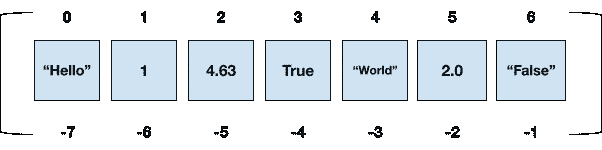

# 面向绝对初学者的 Python 列表程序

> 原文：<https://medium.com/analytics-vidhya/python-list-programs-for-absolute-beginners-58f074c729bb?source=collection_archive---------17----------------------->

# Python 列表刷新程序

列表是 Python 中使用最广泛的数据类型之一。Python 列表很容易通过方括号 **[ ]来识别。**列表用于存储数据项，其中每个数据项由逗号(**，)分隔。**一个 Python 列表可以拥有**任何数据类型**的数据项，无论是整数类型还是布尔类型。

列表被广泛使用的主要原因之一是列表是可变的。可变意味着列表中的任何数据项都可以被任何其他数据项替换。这使得列表不同于**元组**，元组也用于存储数据项，但**是不可变的**。

比如说。,

```
a = ['Hello', 1, 4.63, True, "World", 2.0, "False"]
```

**列表中的索引**有两种类型:

1.正索引—此处索引从 0 开始，从左向右移动。

2.负索引—在这种情况下，索引从右向左开始，最右边的元素的索引值为-1。

以上面的例子为参考，正索引和负索引将看起来像:



基于元素的索引，我们还可以对列表执行**切片**。

例如，以我们之前定义的列表 **a、**为例

```
a[2 : 5] gives [4.63, True, "World"] 
a[ : ] gives ["Hello", 1, 4.63, True, "World", 2.0, "False"] 
a[-1: -3 : -1] gives ["False", 2.0]
```

同样，可以用一个新值替换我们现有的数据项。

例如，我们的列表 **a** :

```
a[1] = 2 
print(a) gives ['Hello', 2, 4.63, True, "World", 2.0, "False"]
```

除了这些操作，Python List 还有许多功能可以满足任何人的需求。下面列出了一些流行但永远不会过时的 Python 程序，它们将帮助初学者建立逻辑思维。

# Python 列表程序每个初学者都应该知道

## 1.检查给定列表是否按升序排列的程序

```
list1 = [1, 2, 3, 5, 4, 8, 7, 9]
temp_list = list1[:]
list1.sort()
if temp_list == list1: 
    print("Given List is in Ascending Order")  
else:  
    print("Given List is not in Ascending Order") 
''' 
Expected Output: 
Given List is not in Ascending Order 
'''
```

**说明:**给定一个有 8 个 int 值的列表 **list1** 。该列表 **list1** 被分配给另一个变量 **temp_list** 。因为我们使用的是。sort()函数，它将对我们的 list **list1** 进行排序，这意味着它将按升序排列我们的 list1 数据项。

因此，我们的原始列表需要存储在某个地方。现在我们的 **temp_list** 有了 list **list1** 的早期版本，而 **list1** 已经变成了 **list1** 的排序版本。现在应用**如果**在 **temp_list** 和 **l1** 上的条件。如果 temp_list 等于 l1，这意味着我们的列表已经被排序了。如果满足该条件，则按升序打印**给定列表**，否则不按升序打印**给定列表。**

## 2.从列表中查找偶数的程序

```
list2 = [2, 3, 7, 5, 10, 17, 12, 4, 1, 13]
for i in list2:
    if i % 2 == 0:
        print(i) ''' 
Expected Output: 
2
10
12
4 
'''
```

**说明:**给定一个列表 **list2** 有 10 个 int 值。我们需要从给定的列表中找到偶数。使用 **for** 循环来遍历列表。并且对于每次迭代，使用 **if 条件**来检查特定迭代的列表数据项是否能被 2 整除，这意味着 **i % 2** 应该等于**零**。现在，满足这个条件的每个项目都将被打印出来。

## 3.合并两个列表的程序

```
list3 = [1, 2, 4, 6] 
list4 = [9, 3, 19, 7] 
list3.extend(list4) 
print(list3) ''' 
Expected Output: 
[1, 2, 4, 6, 9, 3, 19, 7] 
'''
```

**说明:**给出两个列表 **list3** 和 **list4** 具有一定的数值。使用**。Python List 的 extend()** 函数合并两个列表。因此，合并这些列表将给出单个列表，该列表具有来自第一列表的项目，随后是第二列表。现在打印**列表 3，**，它将包含来自列表**列表 3** 和**列表 4 的元素。**如果您希望首先打印第二个列表 **list4** 项，然后打印 list3 数据项，使用 list4.extend(list3)，然后打印 **list4。**

## 4.交换列表的第一个和最后一个元素

```
list5 = [1, 29, 51, 9, 17, 6, 7, 23] 
list5[0], list5[-1] = list5[-1], list5[0] 
print(list5) ''' 
Expected Output: 
[23, 29, 51, 9, 17, 6, 7, 1] 
'''
```

**说明**:给定一个列表 **list5** 有一定的值。如上所述，列表是不可变的，因此任何数据项都可以用另一个值替换。使用索引来替换值。用**列表 5** 的-1 索引替换第 0 索引，同时用**列表 5** 的第 0 索引替换-1 索引。现在打印更新后的列表 **list5** 。

## 5.从一个列表中减去另一个列表的程序

```
a = [1, 2, 3, 5] 
b = [1, 2] 
l1 = [] 
for i in a: 
    if i not in b: 
        l1.append(i) 
print(l1) ''' 
Expected Output: 
[3, 5] 
'''
```

**说明:**给定 2 列出 a 和 b 有确定的值。从第一个列表中减去第二个列表，我们可以从第一个列表 **a** 中得到那些第二个列表 **b** 中没有的列表项。创建一个空列表 **l1** 。使用 **for** 循环遍历列表 **a** ，对于每一次迭代，使用 **if** 条件和 not in 检查代表当前迭代的列表 **a** 数据项的 **i** 是否不在列表 **b** 中。如果列表 **b** 中不存在 **i** ，则将该迭代的 **i** 追加到开始时创建的空列表 **l1** 中。最后，您将拥有一个填充列表 **l1** ，其中包含列表 **a** 独有的那些项目。

## 6.从奇数次出现的列表中获取数据项的程序

```
x = [1,2,3,4,5,1,3,3,4] 
l1 = [] 
for i in x: 
    if x.count(i) % 2 != 0: 
        if i not in l1: 
            l1.append(i) 
print(l1) ''' 
Expected Output: 
[2, 3, 5] 
'''
```

**说明:**给定一个有一定值的列表 **x** 。创建一个空列表 **l1** 。使用**对列表 **x** 进行**循环，并且在每次迭代中，如果条件与**相同，则使用**。Python 列表的 count()** 函数，用于检查列表 **x** 中 **i** 的出现次数，其中 **i** 表示每次迭代中列表 **x** 中的数据项。使用嵌套的 **if** 条件从列表 **x** 中选择有奇数出现的不同数据项。现在，将 **i** 追加到开始时创建的空列表 **l1** 中。最后打印列表 **l1** 。**

# 结论

因此，列表可以用于临时存储值或存储更长时间的情况。列表是除了元组、字典和集合之外的 Python 内置数据类型之一。

提到的每一个 Python 程序都可以更有效地完成。解决这些 Python 程序的工作方式是通过考虑初学者的想法来完成的。例如，可以尽可能使用列表理解来缩短程序。此外，可以使用用户定义的函数来增加代码的通用性。

每个程序都包含一个**预期输出**，如果给定输入，它就会出现。随着预期的输出，程序的**解释**被给出，让初学者以最好的方式理解程序。

除此之外，任何初学者都可以在互联网上找到更多的列表程序。互联网上有大量学习任何东西所需的资源。完善列表将有助于任何领域，无论是机器学习还是 Python 的 Web 开发。

虽然列表是一个广泛的话题，需要练习才能超越，但提到的程序将帮助任何初学者建立如何使用**循环**和**条件**以及**列表函数**的逻辑。

*原载于 2021 年 4 月 30 日 https://www.analyticsvidhya.com*[](https://www.analyticsvidhya.com/blog/2021/04/python-list-programs-for-absolute-beginners/)**。**