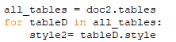
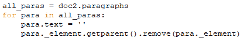
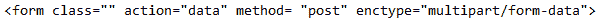
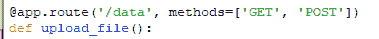
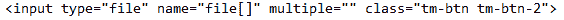
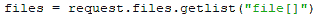
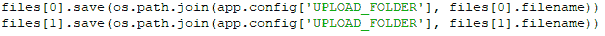
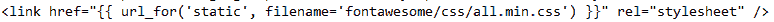

# Python 本地应用程序到 Flask web 应用程序——用 Python 自动化枯燥的任务

> 原文：<https://medium.com/analytics-vidhya/python-local-app-to-flask-web-app-automating-boring-tasks-with-python-a0632e76f107?source=collection_archive---------0----------------------->

作为我工作的一部分，我要处理大量的文档，有时需要手工操作，比如将信息从一个特定格式的文档转换到另一个文档，只需改变布局。例如，我将这个包含不同行和列信息的 excel 表转换成不同的 Word 文档表。这听起来确实很少，但是当您有数千行时，一个简单的复制粘贴任务可能会花费您几个小时，甚至几天。

这就是我如何创建一个简单的 Python 应用程序，它接受一个 excel 文件，并将其行转换为不同的 Word 表格。起初，它是一个本地应用程序，用于处理我的本地桌面文件，但我把它变成了一个 web 应用程序，作为一个学习的机会，这就是我想写的——把一个处理本地文件的 Python 应用程序带到 Heroku 上部署的 Flask web 应用程序，用户可以在那里上传他们想要的文件。在这个过程中，在前端文件、Python 库的使用、文件夹结构和 Heroku 部署任务中有许多编辑。

可以这么说，这是我的一些心得-

1.  **Python Docx 库**

我用 Python-docx 库来处理 Word 文件。python-docx 是一个 python 库，用于创建和更新 Microsoft Word(。docx)文件。你可以在这里找到完整的文档:【https://python-docx.readthedocs.io/en/latest/

我从 Python-docx 库中学到的一些东西是:

I)如果你想将一个特定样式的文档转换成除了默认样式之外的任何其他样式，那么使用一个具有所述样式的模板。然后使用“Document.style”从模板文件中提取样式，并将其传输到所需的文件中。您还可以提取特定段落或表格的样式。下面是从存储在变量 doc2 中的文档中提取表格样式的代码片段:

ii)为了清除文档，您获取文档的元素，例如段落、表格等。并将它们从 for 循环中移除。下面是从存储在文档对象 doc2 中的文档中删除段落的一段代码:

**2。烧瓶**

为了使本地 Python 文件成为 web 应用程序，对其最重要的补充之一是 Flask 库的使用。Flask 是一个 python 库，用于 web 应用程序的轻量级 Web 服务器网关接口。Flask 实际上将您的 Python 代码与前端 html 文件连接起来，您可以在前端显示后端 Python 代码操作的数据。

这是它看起来的样子:

I)您可以在 html 文件中定义端点:

ii)然后在您的 Python 后端文件中，您可以借助 Flask 库来定义函数:

开发 Flask webapp 的另一个主要方面也是维护文件结构和设置相关文件。以下是这方面的一些注意事项:

I)设置 uwsgi 文件，在其中指定哪个主 python 文件，在我的例子中，我的主 python 文件是 appa.py，因此:

在这里阅读更多关于 uwsgi 的信息:[https://www . digital ocean . com/community/tutorials/how-to-serve-flask-applications-with-uswgi-and-nginx-on-Ubuntu-18-04](https://www.digitalocean.com/community/tutorials/how-to-serve-flask-applications-with-uswgi-and-nginx-on-ubuntu-18-04)

ii)如果你维护文件夹结构也更容易，例如:单独的文件夹来存储上传的文件，这通常是很方便的。

从使用本地存储的文件到让你的用户通过前端上传文件，你必须使用 Flask 上传文件到上传文件夹。下面是它的一个片段:

I)在输入类型为“文件”的所需 html 文件中创建一个表单:

ii)使用 python 函数中的 files.save 代码上传文件，表单提交的端点将使用 Flask 调用该函数:

现在，我的文件存储在“static1”文件夹中，我可以从那里访问和操作它。

你可以在这里找到合适的通过 flask 上传文件的学习资源:[https://python basics . org/flask-upload-file/#:~:text = It % 20 is % 20 very % 20 simple % 20 to % 20 It % 20 to % 20 required % 20 location](https://pythonbasics.org/flask-upload-file/#:~:text=It%20is%20very%20simple%20to,it%20to%20the%20required%20location)。

帮助我开始使用 Flask 的更多资源有:

I)蒂姆的技术指导:【https://www.youtube.com/watch?v=mqhxxeeTbu0 

ii)烧瓶网的开发-O ' Reilly

**3。在 Heroku 部署 web 应用程序**

Heroku 是一个基于容器的云平台即服务(PaaS)。开发人员使用 Heroku 来部署、管理和扩展现代应用。对于学习将 Python 应用程序部署为 web 服务的学生来说，这是非常棒的，因为 A)它非常容易使用，b)如果它是免费的，它会非常有用。

以下是我入门 Heroku 的一些经验分享:

I)一个很棒的视频，帮助我开始在 Heroku 部署 Python 应用:[https://www.youtube.com/watch?v=Li0Abz-KT78](https://www.youtube.com/watch?v=Li0Abz-KT78)

ii)另一件要注意的事情是，你必须将所有的 HTML 文件保存在一个名为“templates”的文件夹中，你的主页名为“index.html”。

iii)如果您正在使用免费的 HTML 模板，并且它的 JavaScript 和 CSS 文件夹和文件与您的 HTML 文件相关联，那么您必须执行以下步骤才能使它与您的 HTML 文件一起工作:

a.把你的 js，css，img 文件夹放在名为“static”的文件夹里。

b.将所有链接从 HTML 更改为 css、js 文件，如下所示:

iv)另一件要知道的事情是，你需要有一个“requirements.txt”文件，在这个文件中，你使用的所有包和库及其版本都需要被指定。为此，有一个名为“pipreqs”的好库，它允许您选择文件夹，并为所选文件夹的 python 文件生成需求列表。点击此处了解更多信息—[https://pypi.org/project/pipreqs/](https://pypi.org/project/pipreqs/)

**4。其他试错:**

嗯，我最长时间犯的一个错误是我的熊猫图书馆没有工作。这显然是因为 requirements.txt 文件中缺少用于从 Excel 文件中读取数据和格式化信息的名为 xlrd 的包，必须对其进行特别指定。在我的“requirements.txt”文件中包含以下代码为我解决了这个问题:

总而言之，这是一次很棒的学习经历。以下是一些本可以做得更好的反思:

我应该学习日志库，而不是到处使用 try catch 来调试。

ii)我的编码惯例本可以做得更好，接下来会看到更多！

iii)我的评论和 git 提交本可以更有远见。

但这是一个过程和旅程，慢慢地到达目的地，在那之前我会偶尔写点东西，发些帖子。感谢阅读！