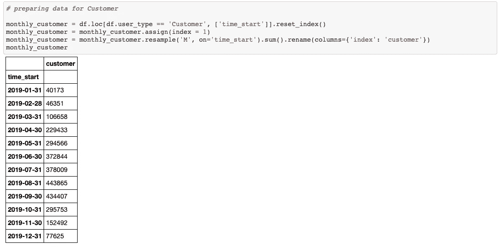

# Python Matplotlib

> 原文：<https://medium.com/analytics-vidhya/python-matplotlib-36ad72381c0c?source=collection_archive---------8----------------------->

## 商务专业人士实用指南

在上一篇文章中，我为初学者分享了 Python Pandas 的实用数据辩论技巧。

[](/analytics-vidhya/data-wrangling-with-python-pandas-e58a7058408a) [## 与 Python 熊猫的数据角力

### 非技术人员的视角

medium.com](/analytics-vidhya/data-wrangling-with-python-pandas-e58a7058408a) 

他的文章强调了使用最流行的 Python 库之一— ***Matplotlib*** 进行数据可视化。更具体地说，这篇文章的灵感来自于这样一个想法，即提供一个 ***可视化模板，让商务专业人士创建有意义的图表*** ，而不必太担心语法。

本教程使用了[纽约自行车共享 2019](https://www.citibikenyc.com/system-data) 数据集，一切都是在[谷歌 Colab](https://colab.research.google.com/notebooks/intro.ipynb) 的帮助下准备的。

你可以在 github @ [ongks-useR](https://github.com/ongks-useR/united_states_bike_share/blob/main/matplotlib_demo.ipynb) 中找到我的 jupyter 笔记本进行演示。请按照 Python 库，探索数据&按客户类型划分的自行车共享月度活动一节中的步骤准备本教程所需的数据框架。


订户的数据帧



客户的数据框架

现在，让我们从可视化的基本概念开始。基本图表(真正的基本图表)由几个部分组成:

1.  数字和图表
2.  数据
3.  颜色
4.  主要标题和副标题
5.  轴标签
6.  神话；传奇
7.  记号和记号标签
8.  样式表

# **1。图&图表**

用简单的英语，你可以把它们想成:

> 图——一张 A4 大小的纸
> 图——一幅画由一个物体组成，例如:一栋房子。

可视化意味着在一张纸上画一个图表；但是，我们使用的是 Python Matplotlib，而不是 pencil。

```
*create a chart (ax) on a A4 paper (figure) with plt.subplots()**# create figure (fig) & chart (ax)*
fig, ax = plt.subplots()

*# use .get_height() & get_width() to obatin default height & width of the Figure*
h = fig.get_figheight()
w = fig.get_figwidth()

*# use .get_xticks() & .get_xticklabels() to obtain default tickmark of the chart*
xtick = ax.get_xticks()
xticklabel = ax.get_xticklabels();
```


由 plt.subplots 生成的默认图表

通过运行下面的代码，我们创建了一个默认情况下由一个图表组成的图形。

```
*# create figure (fig) & chart (ax)*
fig, ax = plt.subplots()
```

下面的代码用于获得图形的默认高度和重量，即 6px 宽和 4px 高。

```
*# use .get_height() & get_width() to obatin default height & width of the Figure*
h = fig.get_figheight()
w = fig.get_figwidth()*# height & width of Figure*

f"Figure height: **{**h**}** & width: **{**w**}**"
'Figure height: 4.0 & width: 6.0'
```

我们可以检查 x 轴上的记号和标签。默认标签范围从 0 到 1，增量为 0.2。

```
*# use .get_xticks() & .get_xticklabels() to obtain default tickmark of the chart*
xtick = ax.get_xticks()
xticklabel = ax.get_xticklabels();*# xticks of chart*  
xtick
array([0\. , 0.2, 0.4, 0.6, 0.8, 1\. ])*# xticklabels of chart*

[label **for** label **in** xticklabel]
[Text(0.0, 0, '0.0'),
 Text(0.2, 0, '0.2'),
 Text(0.4, 0, '0.4'),
 Text(0.6000000000000001, 0, '0.6'),
 Text(0.8, 0, '0.8'),
 Text(1.0, 0, '1.0')]
```

通过提供参数 *nrows=1 & ncols=2* ，我们可以很容易地创建一个连续包含两个图表的图形。

```
*# create 2 charts in one row & 2 columns*  
fig, ax = plt.subplots(nrows=1, ncols=2)
```


连续两张图表…

我们可以通过使用参数 *figsize* 将图形大小(想象我们使用更大的纸张)调整为 14px 宽和 6px 高。

```
*'''*
*figsize >> adjust size of figure*
*figsize = (14, 6) >> 14 px for x-axis & 6 px for y-axis*

*imagine we use larger piece of drawing paper to fit 2 charts*

*'''*

fig, ax = plt.subplots(nrows=1, ncols=2, figsize = (14, 6))
```


较大的绘图纸…

我们只关注基本面，所以让我们在图上做一个图表。\

```
fig, ax = plt.subplots(figsize = (10, 6))
```


每个图形初始化一个图表…

# **2。数据**

接下来，我们将绘制每个月的自行车共享记录。

为了方便起见，下面的代码显示了从 1 月到 12 月的 12 个月的数据。

```
*# extract month number*
*# 1 >> January & 12 >> December*

monthly_subscriber.index.month
Int64Index([1, 2, 3, 4, 5, 6, 7, 8, 9, 10, 11, 12], dtype='int64', name='time_start')
```

**提醒:我们在图表上绘制数据点，而不是数字。** 所以，我们就用*。chart 上的 fill_between()* 方法( *ax* )。

> ax *。>fill _ between()>绘制面积图*

```
*# create figure (fig) & a chart (ax)*
fig, ax = plt.subplots(figsize = (10, 6))# draw area chart for Subscriber & Customer
ax.fill_between(monthly_subscriber.index.month, monthly_subscriber.subscriber, alpha=0.4)ax.fill_between(monthly_customer.index.month, monthly_customer.customer, alpha=0.4);
```


面积图…

# ***3。*颜色**

Matplotlib 为订户和客户随机分配 2 种颜色。他们可能看起来不太好，我们可以做些什么。定制颜色的一种方法是使用 [Matplotlib Colormap](https://matplotlib.org/stable/gallery/color/colormap_reference.html) 。

我们将使用**选项卡 20** 中的一种颜色进行演示。tab20 是色彩图的定性颜色之一。


定性彩色地图

在教程的最开始，我们用`from matplotlib import cm`导入颜色管理器(cm)。我们可以调用`cm.<colormapname>`从色图中选择单独的颜色，并包含在*的参数 color 中。fill_between()*

例:
`cm.tab20()`由 Tableau 提供的 20 种颜色组成。通过调用`cm.tab20(0)`，我们得到`tab20`色图索引 0 处的颜色，也就是`darkblue`。

```
*# create figure (fig) & a chart (ax)*
fig, ax = plt.subplots(figsize = (10, 6))

*'''*
*paramater 'color' within fill_between, with cm.tab20()*
*'''*
ax.fill_between(monthly_subscriber.index.month, monthly_subscriber.subscriber, 
                alpha=0.4, **color=cm.tab20(7)**)ax.fill_between(monthly_customer.index.month, monthly_customer.customer, 
                alpha=0.4, **color=cm.tab20(4)**);
```


彩色地图的效果

# 4.大标题+小标题

**大标题**设置在**图**上，而**副标题**设置在**图**上。

`fig.suptitle()`创建大标题
`ax.set_title()`创建小标题

```
fig, ax = plt.subplots(figsize = (10, 6))

ax.fill_between(monthly_subscriber.index.month, monthly_subscriber.subscriber, 
                alpha=0.4, color=cm.tab20(7))
ax.fill_between(monthly_customer.index.month, monthly_customer.customer, 
                alpha=0.4, color=cm.tab20(4))

*# create Major Title*
fig.suptitle('New York Bike Share 2019')

*# create a Subtitle*
ax.set_title('Monthly Trend by Customer Type');
```


主要标题和副标题…

# ***5。轴标签***

对于 x 轴，显示“月”。因此，不需要标签。
1>>*1 月* 12>>*12 月*。

我们将为 y 轴贴上标签，让用户知道它代表用户的**号。我们用。 *set_ylabel()***

```
*# create figure (fig) & a chart (ax)*
fig, ax = plt.subplots(figsize = (10, 6))

ax.fill_between(monthly_subscriber.index.month, monthly_subscriber.subscriber, 
                alpha=0.4, color=cm.tab20(7))
ax.fill_between(monthly_customer.index.month, monthly_customer.customer, 
                alpha=0.4, color=cm.tab20(4))

*# create Major Title*
fig.suptitle('New York Bike Share 2019')

*# create a Subtitle*
ax.set_title('Monthly Trend by Customer Type')

*# set y-axis label*
ax.set_ylabel("# of User ('000)");
```


创建 y 标签

# 6.神话；传奇

此时，我们在图表上看到两种颜色，但用户可能不知道哪种颜色属于*订户* & *客户*。要给图表添加图例，使用*。legend()*

```
*# create figure (fig) & a chart (ax)*
fig, ax = plt.subplots(figsize = (10, 6))

ax.fill_between(monthly_subscriber.index.month, monthly_subscriber.subscriber, 
                alpha=0.4, color=cm.tab20(7))
ax.fill_between(monthly_customer.index.month, monthly_customer.customer, 
                alpha=0.4, color=cm.tab20(4))

*# create Major Title*
fig.suptitle('New York Bike Share 2019')

*# create a Subtitle*
ax.set_title('Monthly Trend by Customer Type')

*# set y-axis label*
ax.set_ylabel("# of User ('000)")

*# set legend; title & labels*
ax.legend(title = 'Customer Type', labels = ['Subscriber', 'Customer']);
```


添加图例

# 7.记号和记号标签

我们可以在图表上获得刻度和刻度标签，x 轴为
`.get_xticks()` & `get_xticklabels()`，y 轴为
`.get_yticks()` & `get_yticklabels()`

在这里，我们可以看到图表在 x 轴上的刻度范围从 0 到 14。这些是月份数字的表示(2020 年 1 月 1 日、12 月 12 日和 2 月 14 日)

```
ax.get_xticks()
array([ 0.,  2.,  4.,  6.,  8., 10., 12., 14.])[label **for** label **in** ax.get_xticklabels()]
[Text(0.0, 0, '0'),
 Text(2.0, 0, '2'),
 Text(4.0, 0, '4'),
 Text(6.0, 0, '6'),
 Text(8.0, 0, '8'),
 Text(10.0, 0, '10'),
 Text(12.0, 0, '12'),
 Text(14.0, 0, '14')]
```

类似地，y 轴的刻度范围从-25K 到 225 万。

```
ax.get_yticks()
array([-250000.,       0.,  250000.,  500000.,  750000., 1000000.,
       1250000., 1500000., 1750000., 2000000., 2250000.])[label **for** label **in** ax.get_yticklabels()]
[Text(0, -250000.0, '−0.25'),
 Text(0, 0.0, '0.00'),
 Text(0, 250000.0, '0.25'),
 Text(0, 500000.0, '0.50'),
 Text(0, 750000.0, '0.75'),
 Text(0, 1000000.0, '1.00'),
 Text(0, 1250000.0, '1.25'),
 Text(0, 1500000.0, '1.50'),
 Text(0, 1750000.0, '1.75'),
 Text(0, 2000000.0, '2.00'),
 Text(0, 2250000.0, '2.25')]
```

请注意，我们可以选择要包含在图表中的 xticks/yticks，并格式化相应的 xticklabels/yticklabels 以反映在图表上。我们用*选择要包含在图表中的数字。set_xticks()/。set_yticks()* ，用*格式化 ticklabels。set_xticklabels()/。set_yticklabels()* 反映在图表上。

```
*'''*
*set ticks & ticklabels for x-axis*

*NOTE: must set xticks first then set xticklabels*

*Only want to display February (ie 2) up to December 2019 (ie 12)*
*'''*ax.set_xticks([2, 4, 6, 8, 10, 12])
ax.set_xticklabels([**'Feb', 'Apr', 'Jun', 'Aug', 'Oct', 'Dec'**])*'''*
*set ticks & ticklabels for y-axis*

*NOTE: must set yticks first then set yticklabels*
*yticks are [0, 500,000, 1,000,000, 1,500,000, 2,000,000], in 'integer' format*
*yticklabels are formatted as 'string' >> [0, 500, 1,000, 1,500, 2,000]*

*REMEMBER!! ticks are actual number & ticklabels are number formatted for presentation.*

*'''*

ax.set_yticks([0, 0.5e6, 1e6, 1.5e6, 2e6])
ax.set_yticklabels(**[f"{int(num):,}" for num in np.array([0, 0.5e6, 1e6, 1.5e6, 2e6])/1000]**);
```


两轴上的新标签…

# 8.样式表

样式表本质上是图表的主题。它通过应用自定义样式来提高图表的美感。你可能会发现所有的 [*样式表*](https://matplotlib.org/stable/gallery/style_sheets/style_sheets_reference.html) 都内置在 Matplotlib 中。

在图的开头添加`with plt.style.context(<style sheet name>):`，为特定的图应用临时主题。每个样式表都有预定义的格式，只需一行代码就可以改善图表的美观。

本演示使用样式表 **fivethirtyeight。**

```
**with plt.style.context('fivethirtyeight'):**

    *# create figure (fig) & a chart (ax)*
    fig, ax = plt.subplots(figsize = (10, 6))

    ax.fill_between(monthly_subscriber.index.month, monthly_subscriber.subscriber, alpha=0.4, color=cm.tab20(7)) ax.fill_between(monthly_customer.index.month, monthly_customer.customer, alpha=0.4, color=cm.tab20(4))

    *# create Major Title*
    fig.suptitle('New York Bike Share 2019')

    *# create a Subtitle*
    ax.set_title('Monthly Trend by Customer Type')

    *# set y-axis label*
    ax.set_ylabel("# of User ('000)")

    *# set legend; title & labels*
    ax.legend(title = 'Customer Type', labels = ['Subscriber', 'Customer'])

    *'''*
 *set ticks & ticklabels for x-axis*

 *NOTE: must set xticks first then set xticklabels*

 *Only want to display February (ie 2) up to December 2019 (ie 12)*
 *'''*
    ax.set_xticks([2, 4, 6, 8, 10, 12])
    ax.set_xticklabels(['Feb', 'Apr', 'Jun', 'Aug', 'Oct', 'Dec'])

    *'''*
 *set ticks & ticklabels for y-axis*

 *NOTE: must set yticks first then set yticklabels*
 *yticks are [0, 500,000, 1,000,000, 1,500,000, 2,000,000], in 'integer' format*
 *yticklabels are formatted as 'string' >> [0, 500, 1,000, 1,500, 2,000]*

 *REMEMBER!! ticks are actual number & ticklabels are number formatted for presentation.*

 *'''*

    ax.set_yticks([0, 0.5e6, 1e6, 1.5e6, 2e6])
    ax.set_yticklabels([f"**{**int(num)**:**,**}**" **for** num **in** np.array([0, 0.5e6, 1e6, 1.5e6, 2e6])/1000]);
```


**538**样式表…

# 多走几英里

最后再来完善一下:*大标题* & *小标题*，*字体*，*图例* & *轴标签*。我们可以用各种参数来调整这些组件的字体大小、位置和样式。

```
**with** plt.style.context('fivethirtyeight'):

    *# create figure (fig) & a chart (ax)*
    fig, ax = plt.subplots(figsize = (10, 6))

    ax.fill_between(monthly_subscriber.index.month, monthly_subscriber.subscriber, alpha=0.4, color=cm.tab20(7)) ax.fill_between(monthly_customer.index.month, monthly_customer.customer, alpha=0.4, color=cm.tab20(4))

    *# create Major Title*
    fig.suptitle('New York Bike Share 2019', **x=0.25, y=1.03, fontsize=22, fontweight='bold'**)

    *# create a Subtitle*
    ax.set_title('Monthly Trend by Customer Type', **fontdict={'fontsize': 16, 'style': 'italic'}, position = [0.15, 1.06]**)

    *# set y-axis label*
    ax.set_ylabel("# of User ('000)", **fontdict={'fontsize': 16, 'fontweight': 'bold'}**)

    *'''*
 *set legend; title & labels*
 *frameon = False >> remove the frame of legend*
 *bbox_to_anchor >> moves legend out of the chart window*

 *'''*
    ax.legend(title = 'Customer Type', labels = ['Subscriber', 'Customer'], **frameon = False, bbox_to_anchor=(1.25, 0.6)**)

    *# set axes ticks & ticklabels*
    ax.set_xticks([2, 4, 6, 8, 10, 12])
    ax.set_xticklabels(['Feb', 'Apr', 'Jun', 'Aug', 'Oct', 'Dec'])

    ax.set_yticks([0, 0.5e6, 1e6, 1.5e6, 2e6])
    ax.set_yticklabels([f"**{**int(num)**:**,**}**" **for** num **in** np.array([0, 0.5e6, 1e6, 1.5e6, 2e6])/1000]);
```


最终杰作…耶

# TQVM

我将在这里结束我的 Matplotlib 基础演示。我花了几周时间，根据纽约自行车共享 2019，用类似的**模板**概念创建各种图表类型；如果你渴望了解更多，请在这里找到它们。如果你有更好的分享想法，请发表评论。