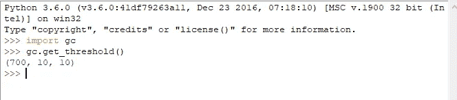
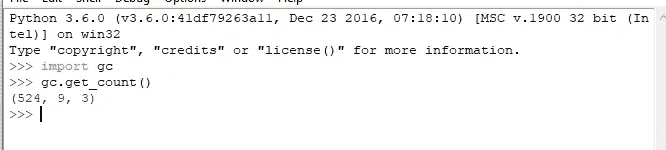
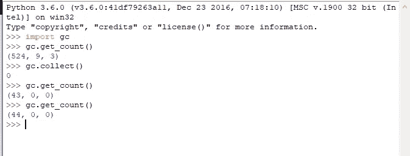
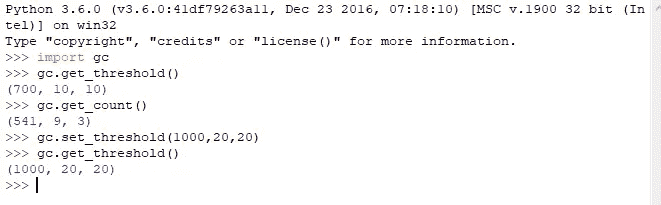

# Python 内存管理

> 原文：<https://medium.com/analytics-vidhya/python-memory-management-8854f4952ba0?source=collection_archive---------0----------------------->

> 编写高效的代码意味着编写节省内存的代码。

本文描述了 python 3.6 中的内存管理和垃圾收集。

对于任何软件开发人员来说，理解内存分配是如何发生的以及如何管理内存是非常重要的。

在这个过程中，我们将经历:

*   什么是内存管理？
*   为什么需要内存管理？
*   Python 中内存是如何分配的？
*   Python 中的垃圾收集

# **什么是内存管理？**

简单地说，内存管理就是为程序提供存储数据所需的内存并释放内存中未使用的数据的过程称为内存管理。

提供内存被称为**内存分配**。释放内存被称为**内存释放。**

在 Python 中，**内存管理器**负责分配和释放内存。

# **为什么需要内存管理？**

通常，编程语言使用对象来操作程序所需的数据。这些对象是在内存中创建的，以便更快地访问。因此，一旦一个对象被创建，它就在内存中被分配了一些空间，一旦你的程序完成了它的执行，这些对象就必须被清理或者从内存中删除，因为它们不再被使用，可以被其他进程/程序再次使用来执行。

如果不清理这些未使用的对象，那么您的内存可能已满，没有足够的空间供其他程序使用，您的应用程序可能会崩溃。所以，内存管理在任何编程语言中都是非常重要的。

在早期的编程语言(如 C)中，分配内存和在执行后释放内存是开发人员的责任，这导致了以下问题:

> **忘记释放内存—** 如果开发者忘记释放未使用的内存，那么内存可能会变满，导致你的程序使用过多的内存。
> 
> **释放已经在使用的内存—** 如果开发人员错误地释放了已经在使用的内存，当您的程序试图访问相同的内存时，会导致意外的行为。

所以，这些问题导致新的编程语言实现了自动的**内存管理**和**垃圾收集**，这由 Python 中的 **Python 内存管理器**负责。

> 在 python 中，内存分配和取消分配是自动的。

# **Python 中内存是如何分配的？**

所以，正如在**中所说，python 内存管理器**负责**分配和释放内存。**

内存有两部分栈内存和堆内存(这与堆数据结构无关)

**堆栈内存**—所有的方法/方法调用、引用都存储在堆栈内存中。

**堆内存** —所有对象都存储在堆中。

> **python 中的每一样东西都是对象。因此，了解 python 中的对象非常重要。**

**Python 是一种动态类型语言**，这意味着不同于其他编程语言(Java 和 C#)，类型是基于它所引用的值来分配的。

例如，在 Java/C#等其他编程语言中，如果不指定变量的类型，就无法创建变量。

`In C# we create a variable as , public int <variable_name>`

动态类型语言

在上面的例子中，我创建了一个名为“x”的变量，它最初被赋值为 None。(python 中的 None 相当于其他编程语言中的 null)。当“x”被赋值为“无”时，“x”的类型为“无”。

当“x”被重新分配为 10 时，“x”的类型为“int”。

当“x”再次被重新分配给“10”时，“x”的类型是“str”。

与其他编程语言不同，在 python 中，每当一个变量被赋值时，python 内存管理器将检查内存中是否已经有一个具有该值的对象。如果对象已经存在于内存中，那么这个变量指向那个对象，而不是创建一个具有相同值的新对象。

如果具有该值的对象在内存(堆)中不可用，python 内存管理器将创建一个具有指定值的新对象，该变量将指向堆(内存)中新创建的对象。

此外，当一个变量被重新赋值为新变量时，python 不会覆盖内存中的值，而是再次遵循上述相同的过程，并检查堆中是否已经存在具有新值的对象。如果对象已经存在，那么这个变量将指向那个对象，否则 python 内存管理器将在堆上用新值创建一个新对象，这个变量将指向那个值。

举个例子，

```
**x == 100** // this will create a new object in heap
**y == 100** // this will not create a new object as an object with           value 100 is already available on heap**print(id(x) == id(y))** // this returns true because x and y are pointing to same object on heap**x = 101** // now when new value is assigned  "101" is not available on heap , so new object is created and x points to this new object . In this case value at that location is not overwritten unlike other programming languages. 
```

> 这与其他编程语言的情况不同，在其他编程语言中，当变量被更新时，该存储器位置/地址处的值被新的更新值覆盖

为了清楚地理解上面讨论的要点，请点击下面的链接，该链接展示了上面讨论的关于 python 对象内存分配的要点。

对象创建

> 每当在 python 中创建新对象时，python 内存管理器都会确保堆中有足够的内存来为该对象分配空间。
> 
> 在 python 中，所有的对象都是从 **PyObject 一个 struct** 中派生出来的，这个 struct 有两个属性:引用计数和指向对象的指针

有关**对象**的更多信息，请参考以下文档。

 [## 公共对象结构- Python 3.9.6 文档

### Python 的对象类型定义中使用了大量的结构。本节…

docs.python.org](https://docs.python.org/3.6/c-api/structures.html) 

# Python 中的垃圾收集

现在，是时候清理不使用的对象了。释放内存或删除未使用的对象以便其他对象可以使用的过程称为**垃圾收集**。

因此，垃圾收集器的工作是跟踪可以释放的对象。

Python 使用以下两种算法进行垃圾收集:

*   引用计数
*   分代垃圾收集

## **参考计数**

**引用计数**是一种简单的技术，每当对象的引用计数达到“0”时，它就有资格进行垃圾收集，并且为该对象分配的内存被自动释放。

每当创建一个对象时，该对象的引用计数就增加“1”，类似地，当移除对该对象的引用时，其引用计数就减少“1”。最后，当该对象的引用计数变为“0”时，分配给该对象的内存被释放。

python“sys”模块提供了一个名为“getrefcount(object)”的方法，该方法给出了给定对象的引用计数。

浏览下面的代码示例，它演示了在什么情况下对象的引用计数会增加和减少。

对象引用计数

默认情况下，python 使用引用计数技术进行垃圾收集，这是不能禁用的(开发者对此没有控制权)。

但这种技术的问题是它有一些开销，因为每个对象都必须跟踪内存取消分配的引用计数，而且每当对象引用计数变为“0”时，就会发生内存取消分配。

引用计数将无法检测到循环引用，并且这些对象将没有资格进行垃圾收集。

由于上述问题，python 还使用了另一种叫做**分代垃圾收集的技术。**

## **分代垃圾收集**

这在 python 中也是一个自动过程，但与不能禁用的引用计数不同，分代垃圾收集是可选的，也可以手动触发。

**python 中的 gc** 模块负责分代垃圾收集。

在这种技术中，所有 python 对象被分为 3 类:

*   第 0 代
*   第一代
*   第二代

每一代都有一个预定义的**阈值**，阈值只是垃圾收集器何时调用垃圾收集的指示器。

您可以通过导入 gc 模块来检查默认阈值，如下所示:



您还可以检查每代中的对象数量，如下所示:



您也可以手动调用垃圾收集，如下所示:



您也可以按如下方式设置阈值:



> 当创建一个新对象时，该对象被分类为“第 0 代”。

当一个代达到其阈值时，垃圾收集被自动触发，并且垃圾收集后该代中剩余的任何对象都被提升到较老的代。

如果有 2 代达到阈值，垃圾收集总是选择老一代，然后是年轻一代。