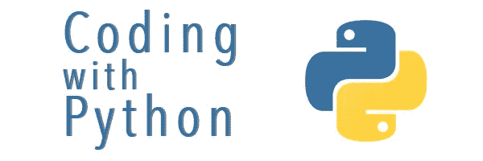

# Python 面向对象编程技巧

> 原文：<https://medium.com/analytics-vidhya/python-object-oriented-programming-tips-db4b40c9e314?source=collection_archive---------11----------------------->



这是我上一篇文章的延续，文章讲述了用 Python 编写库或框架时要做的事情，这将使代码更易于维护和扩展。

如果还没有，请看看我的第一篇文章。

 [## 中等

### 在 Python 中管理实例属性的提示/技巧](https://vivek936ster.medium.com/ways-to-manage-instance-attributes-and-access-in-python-to-code-more-defensively-a95384298c33) 

bat 的权利，我们来看问题陈述。

1.  如果我们在一个框架之上编写一个库或包装器，我们向它添加了更多的功能，但是我们还想利用它的底层特性，而不需要重新实现它，那该怎么办？
2.  如何为一个类添加额外的功能而不修改它或从它继承？基本上，我们不想在类之间增加紧密耦合。

让我们逐一讨论如何解决这些问题。

# 拦截“.”调用实例方法时

对于第一个问题，想法是截取“.”当我们调用一个实例的方法将它转发给超类的实现时。考虑下面的例子。

```
class Person(object):
    def __init__(self, first_name, last_name, address):
        self.first_name = first_name
        self.last_name = last_name
        self.address = address

    @classmethod
    def create_using_full_name(cls, full_name, address):
        name = full_name.split(' ')
        return cls(name[0], name[1], address)

class Employees(object):
    def __init__(self):
        self.employees_list = []

    def __len__(self):
        return len(self.employees_list)

    def __getitem__(self, item):
        return self.employees_list[item]

    @classmethod
    def add_employee_to_list(cls, list_of_emps=[]):
        self = cls()
        for emp in list_of_emps:
            self.employees_list.append(emp)
        return self

    def print_emp_name(self):
        return [person.first_name + person.last_name for person in self.employees_list] person1 = Person(“Henry”, “Thiery”, “France”)
person2 = Person(“Xaxi”, “Hernandez”, “Spain”)
person3 = Person(“Erling”, “Haaland”, “Sweden”)employees = Employees.add_employee_to_list([person1, person2, person3])
employees_list.print_emp_name()
[‘HenryThiery’, ‘XaxiHernandez’, ‘ErlingHaaland’]
```

在这里，employees 是一个类似于对象的列表，但不是一个列表。假设我们想在 Employees 对象中使用列表对象的 append 方法，我们需要从列表对象继承，并在 Employee 类定义中覆盖 append 方法，如果我们想支持更多来自列表对象的方法，这是紧耦合的，很难维护。

```
employees = Employees.add_employee_to_list([person1, person2, person3])
len(employees)
3
employees[1]
<__main__.Person object at 0x10fd987c0>
employees[1].first_name
‘Xaxi’
```

有一个解决方案，我们可以定义一个神奇的方法 __getattr__ 来拦截“.”当我们调用一个实例方法时，我们可以使用 getattr 方法将它重定向到适当的类，就像我们在上一篇文章中看到的那样。

```
class Employees(object):
    def __init__(self):
        self.employees_list = []

    def __len__(self):
        return len(self.employees_list)

    def __getitem__(self, item):
        return self.employees_list[item]

    def __getattr__(self, item):
        return getattr(self.employees_list, item)

    @classmethod
    def add_employee_to_list(cls, list_of_emps=[]):
        self = cls()
        for emp in list_of_emps:
            self.employees_list.append(emp)
        return self

    def print_emp_name(self):
        return [person.first_name + person.last_name for person in self.employees_list]
```

现在 employee 对象神奇地拥有了 List 对象的方法，它实际上被重定向到了 main 类，因为我们截获了“.”使用 getattr。现在谈我们的第二个问题。

```
employees = Employees.add_employee_to_list([person1, person2, person3])
employees.append
<built-in method append of list object at 0x10fd88200>
employees.sort
<built-in method sort of list object at 0x10fd88200>
employees.index(1)
employees.index
<built-in method index of list object at 0x10fd88200>
```

# 使用混合来减少紧耦合

我们使用 mixins 来解决下一个问题，这是一种多重继承。在像 Django 或 Flask 这样的框架中编码的人肯定会使用它，或者至少听说过它。

我在 mixins 上看到一个不错的 stackoverflow 回答。粘贴到这里，
当你想给一个类提供可选的继承时，可以使用 Mixins。
比如你想在不同类型的类中重用某个特定的特性。
我同意，在我们下面的例子中，我们将它用于上面提到的要点，作为副产品，我们正在减少紧密耦合，并且正在实现编写通用代码。
让我们再次以这个 Person 类为例，

```
class Person(object):
    def __init__(self, name, age, sex, profession):
        self.name = name
        self.age = age
        self.sex = sex
        self.profession = profession
```

假设我们希望通过选择实例中的字段，以表格格式打印类对象的内容。我们编写下面的函数来实现这一点。

```
def print_table(objects, attrs):
    for attr_name in attrs:
        print(attr_name, end='\t')
    print()
    for obj in objects:
        for attr_name in attrs:
            print(getattr(obj, attr_name), end="\t")
        print()name age profession
Thiery Henry 42 Footballer 
Hernandez Xaxi 35 Footballer 
Erling Haaland 21 Footballer
```

(暂时请原谅缩进)现在输出看起来还可以。但是如果想要有不同的类似文本的输出格式，比如 csv，html 等呢？
更改 print_table 的代码以接受任何具有标题和内容打印方法的对象。

```
def print_table(objects, attrs, format):
    format.heading(attrs)
    for obj in objects:
        rows = [str(getattr(obj, attr_name)) for attr_name in attrs]
        format.contents(rows)
```

现在让我们实现格式化程序代码，我们将把它作为参数传递给 print_table 方法。所以，这是一个基础类的蓝图。我们继承基类并实现蓝图。

```
class Formatter(object):
    def __init__(self, save_file=None):
        if save_file:
            self.save_file = save_file

    def heading(self, headers):
        raise NotImplementedError

    def contents(self, rows):
        raise NotImplementedError

class TextFormatter(
    Formatter):  # if i want to support width param or add a feature then I would need to init parent and create my var

    def __init__(self, save_file=None, width=20):
        self.width = width
        super().__init__(save_file=save_file)

    def heading(self, headers):
        for header in headers:
            print(header, end='\t')
        print()

    def contents(self, rows):
        print()
        for row in rows:
            print({}.format(row), end="\t")

class CVSFormatter(Formatter):
    def heading(self, headers):
        for header in headers:
            print(header, end=',')
        print()

    def contents(self, rows):
        for row in rows:
            print('{}'.format(row), end=",")
        print()

class HTMLFormatter(Formatter):
    def heading(self, headers):
        for header in headers:
            print('<h>{}</h>'.format(header), end=' ')
        print()

    def contents(self, rows):
        for row in rows:
            print('<t>{}</t>'.format(row), end=" ")
        print()persons = [person1, person2, person3]**# Creating a formatter**
formatter = CVSFormatter()
print_table(persons, [‘name’, ‘age’, “profession”], format=formatter)**# Creating another formatter** formatter = HTMLFormatter()
print_table(persons, [‘name’, ‘age’, “profession”], format=formatter)**# output of each formatter**
name,age,profession,
Thiery Henry,42,Footballer,
Hernandez Xaxi,35,Footballer,
Erling Haaland,21,Footballer,<h>name</h> <h>age</h> <h>profession</h> 
<t>Thiery Henry</t> <t>42</t> <t>Footballer</t> 
<t>Hernandez Xaxi</t> <t>35</t> <t>Footballer</t> 
<t>Erling Haaland</t> <t>21</t> <t>Footballer</t>
```

看来我们的代码起作用了。但是也有一些问题。如果我们想添加一个向行中添加报价的功能会怎么样。无论是任何格式化文本，CSV 或 HTML。

假设如果我们想要添加宽度参数的支持或者添加任何其他参数到 TextFormatter，那么我们需要初始化父类，如果父类有一些参数需要用 init 初始化，而子类不关心它。这是紧耦合。

然后，我们必须从父类到子类做这么多的更改，如果我们想把它作为参数添加到子类中，该怎么办呢？

```
class TextFormatter(Formatter):
    def __init__(self, save_file=None, width=20):
        self.width = width
        super().__init__(output_type=None)
```

下面是紧耦合的另一个例子，我们从 TextFormatter 继承，我们不需要这样做。

```
class QuoterMixin(TextFormatter):
    def contents(self, rows):
    quoted = ['"{}"'.format(text) for text in rows]
    super().contents(quoted)
```

还记得为什么我们需要混音吗？这是原因之一。我们不希望紧耦合向我们的类添加功能，我们只是创建一个 mixin 类，它只是将功能添加到 contents 方法并调用超类的 contents 方法。

```
class QuoterMixin(object):
    def contents(self, rows):
        quoted = ['"{}"'.format(text) for text in rows]
        super().contents(quoted)
```

现在我们创建一个新的 formatter 对象，它继承了两个类。做我们需要它做的事情。

```
**class Formatter(QuoterMixin, CVSFormatter):
    pass**

formatter = Formatter()person1 = Person(“Thiery Henry”, “42”, “M”, “Footballer”)
person2 = Person(“Hernandez Xaxi”, “35”, “M”, “Footballer”)
person3 = Person(“Erling Haaland”, “21”, “M”, “Footballer”)

persons = [person1, person2, person3]
print_table(persons, [‘name’, ‘age’, “profession”], format=formatter)formatter = CVSFormatter()
print_table(persons, [‘name’, ‘age’, “profession”], format=formatter)formatter = HTMLFormatter()
print_table(persons, [‘name’, ‘age’, “profession”], format=formatter)name,age,profession,
**“Thiery Henry”,”42",”Footballer”,
“Hernandez Xaxi”,”35",”Footballer”,
“Erling Haaland”,”21",”Footballer”**<h>name</h> <h>age</h> <h>profession</h> 
**<t>”Thiery Henry”</t> <t>”42"</t> <t>”Footballer”</t> 
<t>”Hernandez Xaxi”</t> <t>”35"</t> <t>”Footballer”</t> 
<t>”Erling Haaland”</t> <t>”21"</t> <t>”Footballer”</t>**
```

现在双引号神奇地出现在我们想要的行中。我们已经成功地添加了一个特性，而且代码也不是紧密耦合的。
本文到此结束。我希望当你用 Python 编码时，这些技巧能以某种方式帮助你。尤其是这些技巧帮助我们在 Apache Spark 的基础上为我们的用例创建了一个更干净的框架。感谢阅读我的文章。

[1]: Python 食谱:掌握 Python 的食谱 3 第 3 版

[https://www . Amazon . in/Python-Cookbook-Recipes-Mastering-ebook/DP/b 00 dqv 4 ggy](https://www.amazon.in/Python-Cookbook-Recipes-Mastering-ebook/dp/B00DQV4GGY)