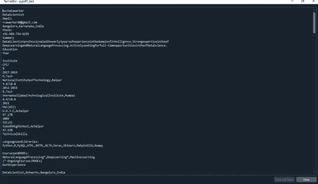

# 用于 PDF 数据提取的 Python 包

> 原文：<https://medium.com/analytics-vidhya/python-packages-for-pdf-data-extraction-d14ec30f0ad0?source=collection_archive---------0----------------------->

我是全球系统集成和服务公司 3K 技术公司的数据科学家。作为最近一个项目的一部分，我们必须解析简历，从结构化格式的简历中提取和存储信息，因为简历经常以各种格式上传或通过电子邮件发送，如 pdf、docx 等。

通常，对于 PDF 格式，我们需要从 PDF 中提取文本以供进一步分析。PDF 简历有多种创建方式。例如，一些求职者用 word 格式创建简历，然后保存为 PDF 格式，而一些人用 LATEX 创建，或者使用在线简历模板。总的来说，我们应该能够解析所有这些类型的简历，并提取每一个文本，而不会丢失任何信息。


下面展示的是两个简历示例，一个是 docx 格式，另一个是用 LATEX 创建并保存为 PDF 格式。


docx 和 PDF 格式的简历

在这里，为了执行给定的任务，我尝试了各种 python 包。在这篇博客中，我总结了这些包的性能，每个包都有其优点和缺点。

下面是我用来从 PDF 文件中提取文本的包列表。

1.  PyPDF2
2.  小红点；吉祥记
3.  Textract
4.  PyMuPDF
5.  PDFtotext
6.  PDFminer
7.  白板

我们将通过 python 代码详细讲解每个包。

**PyPDF2**

PyPDF2 是一个纯 Python 包，可以用于许多不同类型的 PDF 操作。PyPDF2 可用于执行以下任务。

用 Python 从 PDF 中提取文档信息

旋转页面

合并 pdf

分割 pdf

添加水印

加密 PDF

下面显示的是使用 PyPDF2 提取全文和页数的代码，以及输入 PDF 和输出提取的文本。

```
path = r"\....Downloads\RuchaSawarkar.pdf"#Using PyPDF2#importing required modules
import PyPDF4# creating a pdf file object
pdfFileObj = open(path, 'rb')#creating a pdf reader object
pdfReader = PyPDF4.PdfFileReader(pdfFileObj)#printing number of pages in pdf file
print(pdfReader.numPages)#creating a page object
pageObj = pdfReader.getPage(0)# extracting text from page
for i in range(pdfReader.numPages):
    pypdf2_text +=pdfReader.getPage(i).extractText()#closing the pdf file object
pdfFileObj.close()
```



使用 PyPDF2 包的缺点:

1.  此软件包提取文本，但不保留原始 PDF 中的文本结构。
2.  提取的文本中包含不必要的空格和换行符。
3.  它不保留表结构。

当我使用 LATEX 创建的 PDF 时，提取的文本没有空格，这意味着一些信息可能会丢失。

**蒂卡**

Tika 是一个基于 Java 的包。Tika-Python 是绑定到 Apache TikaTM REST 服务的 Python，它允许在 Python 语言中本地调用 Tika。要在 python 中使用 Tika 包，我们需要在您的系统中安装 java。当您第一次运行代码时，它将启动与 Java 服务器的连接。如果代码是第一次在系统中运行，这将导致使用 Tika 包从 PDF 中提取文本的延迟。

以下是从 PDF 中提取文本时执行的一些附加任务。

1.  提取 PDF 文件的内容
2.  提取 PDF 文件的元数据
3.  提取关键字(字典的元数据和内容)
4.  要了解 Tika 服务器的状态

下面显示了使用 Tika 包从 PDF 中提取全文的代码，以及输入 PDF 和输出提取的文本。

```
path = r"\....Downloads\RuchaSawarkar.pdf"#using Tika
#pip install tikafrom tika import parser
raw = parser.from_file(path2)
tika_text = raw['content']
```


使用 Tika 包的一些主要缺点是:

1.  需要安装 java
2.  Java 服务器连接非常耗时
3.  不保留表结构

因此，如果您愿意在您的系统中安装 Java，那么您可以使用这个包。

**文本摘要**

虽然有几个包可以独立地从各种格式的文件中提取内容，但 Textract 包提供了一个单一的接口，可以从任何类型的文件中提取内容，没有任何不相关的标记。

Textract 用于从 PDF 文件以及其他文件格式中提取文本。其他文件格式包括 csv、doc、eml、epub、json、jpg、mp3、msg、xls 等。

使用 Textract 包最值得注意的一点是，它以字节格式从文件中提取信息。要将字节数据转换成字符串，我们需要使用其他 python 包进行解码，比如编解码器。

下面显示的是使用 Textract 从 PDF 中提取文本的代码，以及输入 PDF 和输出提取的文本。

```
path =   r"\....Downloads\RuchaSawarkar.pdf"#for decoding
import codecs#using Textract
import textract#extract text in byte format
textract_text = textract.process(path)#convert bytes to string
textract_str_text = codecs.decode(textract_text)
```


使用这个包进行文本提取后，信息不会丢失。原始文档的结构保持不变。但是，不会保留表结构。

总的来说，这个包不仅为从 PDF 中提取文本提供了一个很好的选择，也为从其他类型的文件中提取文本提供了一个很好的选择。

**PyMuPDF**

PyMuPDF 是一个轻量级 PDF 查看器 MuPDF 的 python 绑定。PyMuPDF 并不完全基于 python。该软件包以其高性能和高渲染质量而闻名。

使用 PyMuPDF，我们可以访问扩展名为*的文件。pdf，*。xps，*。oxps，*。epub，*。来自 Python 脚本的 cbz 或*.fb2。还支持几种流行的图像格式，包括多页 TIFF 图像。

PyMuPDF 还提取多页文档的信息。如果您输入页码，它将授予我们提取特定页面信息的权限。

下面是使用 PyMuPDF 从 PDF 中提取文本以及输入 PDF 和输出提取的文本的代码。

```
path = r"\....Downloads\RuchaSawarkar.pdf"#Usinf pymupdf
import fitz  # this is pymupdf#extract text page by page
with fitz.open(path) as doc:
pymupdf_text = ""
for page in doc:
    pymupdf_text += page.getText()
```


通常，从 PDF 文件中提取文本时，PyMuPDF 是您可以考虑的选择。它确实从文本中删除了不必要的空格，所以预处理的文本清理任务是由这个包自动完成的。

它保持了文档的原始结构。然而，与其他包类似，以原始格式提取表格的问题仍然存在。我们将不得不使用一些其他的包来保存表中的信息。

**PDFtotext**

PDFtotxt 是一个纯粹基于 python 的包，可用于从 PDF 文件中提取文本。顾名思义，它只支持 PDF 文件，不支持其他文件格式。

数据以对象的形式提取。PDF 的结构被保留。

下面是使用 PDFtotext 包从 PDF 中提取文本以及输入 PDF 和输出提取的文本的代码。

```
path = r"\....Downloads\RuchaSawarkar.pdf"#Using PDFtotext
import pdftotext# Load your PDF
with open(path2, "rb") as f:
    pdf = pdftotext.PDF(f)# Read all the text into one string
pdftotext_text = "\n\n".join(pdf)
```


换句话说，与之前讨论的所有包不同，该包的主要优点是它保留了 PDF 文本的结构以及表格结构格式。

**PDFminer**

这是另一个纯粹基于 python 的包，仅用于提取 PDF 文件。它还可以将 PDF 文件转换成其他文件格式，如 HTML/XML。PDFminer 有多种版本，最新版本与 python 3.6 及更高版本兼容。

PDFminer 以 API 请求的形式提供服务。因此，从这个包获得的结果比其他纯粹基于 python 的包花费的时间稍多。

调用这个包时有几个参数要使用。参数的完整描述可在[这里](https://pypi.org/project/pdfminer/)找到。

使用 PDFminer 包从 PDF 中提取文本所用的代码与其他包所用的简单代码相比冗长乏味，下面给出了输入 PDF 和输出提取的文本。

```
path = r"\....Downloads\RuchaSawarkar.pdf"#Using PDFminer
from pdfminer.pdfinterp import PDFResourceManager, PDFPageInterpreter
from pdfminer.converter import TextConverter
from pdfminer.layout import LAParams
from pdfminer.pdfpage import PDFPage
from io import StringIOdef convert_pdf_to_txt(path):
    rsrcmgr = PDFResourceManager()
    retstr = StringIO()
    codec = 'utf-8'
    laparams = LAParams()
    device = TextConverter(rsrcmgr, retstr,      codec=codec,laparams=laparams)
    fp = open(path, 'rb')
    interpreter = PDFPageInterpreter(rsrcmgr, device)
    password = ""
    maxpages = 0
    caching = True
    pagenos=set()
    for page in PDFPage.get_pages(fp, pagenos, maxpages=maxpages, password=password,caching=caching, check_extractable=True):
        interpreter.process_page(page)
    text = retstr.getvalue()
    fp.close()
    device.close()
    retstr.close()
    return textpdf_miner_text = convert_pdf_to_txt(path1)
```


**白板**

这个基于 java 的包主要用于读取 PDF 中的表格。这是 tabula-java 的一个简单的 python 包装器。

信息提取存储在 python 中的 python 数据帧中，随后可以转换为 csv、tsv、excel 或 json 文件格式。

下面显示的是使用 Tabula 包将表格从 PDF 文件中提取到 DataFrame 中的代码，以及输入 PDF 和输出提取的文本。

```
path = r"\....Downloads\RuchaSawarkar.pdf"#using Tabula
import tabuladf = tabula.read_pdf(path, pages='all')
```


这个包对于提取表信息很有用。使用 Tabula 和上面提到的其他软件包可以从 pdf 中提取全文。

**结论**

在这篇博客中，我比较了从 PDF 文件格式中提取文本的各种 python 包。此外，我在 python 编程语言中包含了每个包的代码片段。

总而言之:

1.  pypdf 2——与其他相比不太受欢迎
2.  **Tika** —需要安装 java—需要熟悉 Java 安装，不需要涉及 Java 连接，适合提取内容、密钥、元数据。
3.  **textract** —返回字节对象—需要将其转换成字符串
4.  **PyMuPDF** —从 PDF 文件中提取文本，删除文本中不必要的空格，保持文档的原始结构
5.  **PDFminer** —保留 PDF 文件文本的结构，但不保留表格结构。
6.  **PDFtoText** —相对来说是最优选的，因为它保留了表格和原始结构

我已经在我的 GitHub 个人资料[链接](https://github.com/rucha80/PDF-Data-Extraction)上传了代码和一些 PDF 文件来比较这些包，供你参考。

谢谢你的阅读。我真诚地希望它对你有所帮助，一如既往，我乐于接受建设性的反馈。

正如我已经提到的，我是 3K 技术公司的数据科学家。请关注我们的公司页面，了解更多此类博客和创新解决方案[此处](https://www.linkedin.com/company/3k-technologies/mycompany/)。

在 rsawarkar80@gmail.com/rucha.s@3ktechnologies.com 给我寄封信。

你可以在 [LinkedIn](https://www.linkedin.com/in/rucha-sawarkar-714644a0/) 上找到我。

**参考文献**

[https://pypi.org/project/PyPDF2/](https://pypi.org/project/PyPDF2/)

[https://realpython.com/pdf-python/](https://realpython.com/pdf-python/)

[https://www . geeks forgeeks . org/parsing-pdf-in-python-with-tika/](https://www.geeksforgeeks.org/parsing-pdfs-in-python-with-tika/)

[https://cbrownley . WordPress . com/2016/06/26/parsing-pdf-in-python-with-tika/](https://cbrownley.wordpress.com/2016/06/26/parsing-pdfs-in-python-with-tika/)

[https://pypi.org/project/tika/](https://pypi.org/project/tika/)

[https://text ract . readthedocs . io/en/stable/python _ package . html](https://textract.readthedocs.io/en/stable/python_package.html)

[https://towards data science . com/how-to-extract-text-from-pdf-245482 a96de 7](https://towardsdatascience.com/how-to-extract-text-from-pdf-245482a96de7)

[https://pymupdf.readthedocs.io/en/latest/intro.html](https://pymupdf.readthedocs.io/en/latest/intro.html)

[https://pypi.org/project/PyMuPDF/](https://pypi.org/project/PyMuPDF/)

[https://medium . com/dida-machine-learning/how-to-extract-text-from-pdf-files-16df 0830 aa 66](/dida-machine-learning/how-to-extract-text-from-pdf-files-16df0830aa66)

[https://pypi.org/project/pdftotext/](https://pypi.org/project/pdftotext/)

[https://pypi.org/project/pdfminer/](https://pypi.org/project/pdfminer/)

[https://pypi.org/project/tabula-py/](https://pypi.org/project/tabula-py/)