# Python 熊猫:-数据输入和输出

> 原文：<https://medium.com/analytics-vidhya/python-pandas-data-input-and-output-297725432339?source=collection_archive---------11----------------------->

*通过这篇文章，我们将学习如何对不同格式的数据执行***和* ***写*** *操作。**

# ***4 种广泛使用的数据格式:-***

1.  *战斗支援车*
2.  *擅长*
3.  *超文本标记语言*
4.  *结构化查询语言*

**注意:-对于此处的示例，我将 csv 和 excel 等文件存储在编写代码或 jupyter 笔记本文件所在的同一文件夹中。如果你愿意，你可以从我的*[*github repo*](https://github.com/georgian4049/learning_pandas/tree/master/input_output)*下载和我在这里使用的相同的文件。**

***1) CSV-逗号分隔值***

*逗号分隔值(CSV)文件是一种具有特定格式的文本文件，允许以表格结构格式保存数据。*

****从 CSV 中读取:-****

*您必须使用 pandas 的 read_csv()方法，并传递您想要读取的文件的位置。Pandas 会将数据转换到各自的数据框中。*

***语法:- read_csv(文件名，可选参数)***

*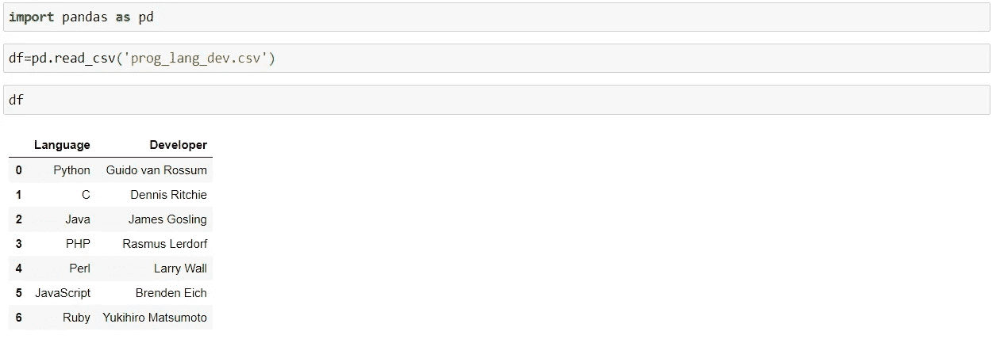*

****写 CSV:-****

***语法:- to_csv(文件名，可选参数)***

*a)没有将 **"index"** 参数传递给 to_csv()方法*

*如果我们不向 to_csv()方法传递 **"index=False"** 参数，它将创建包含索引值的第一列。*

*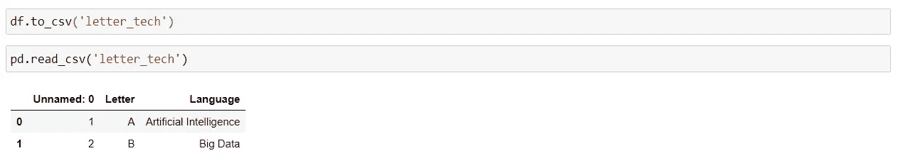*

*向 CSV 文件写入(不带索引参数)并读取 CSV 文件*

*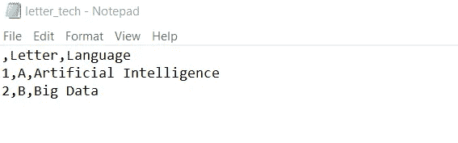*

*CSV 文件*

*b)传递**“索引=假”**作为参数*

*传递 **"index=False"** 参数，删除不必要的索引。*

*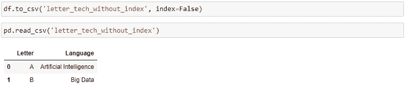*

*向 CSV 文件写入(带索引参数)并读取 CSV 文件*

*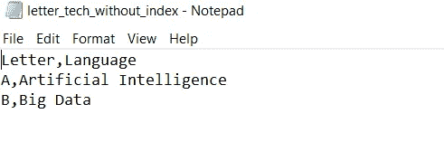*

*CSV 文件*

***ii) XLSX- Excel***

*xlsx 文件在 Microsoft Excel(2007/2010)中用于工作簿、电子表格和文档文件。文件格式基于开放 XML 数据格式。*

*这里举个例子，我取了两张表 data.xlsx 文件中存储的“prog_lang_dev”和“letter_tech”。*

****从 Excel 文件中读取****

***语法:- pd.read_excel(文件名，可选参数)***

*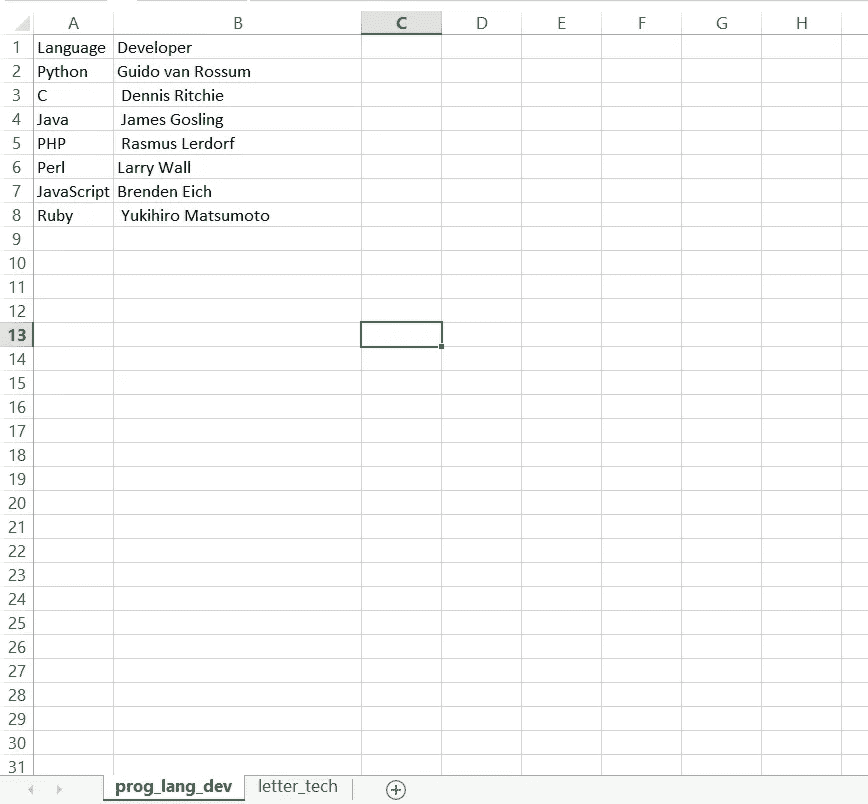*

*data.xlsx 中的 prog_lang_dev 表*

*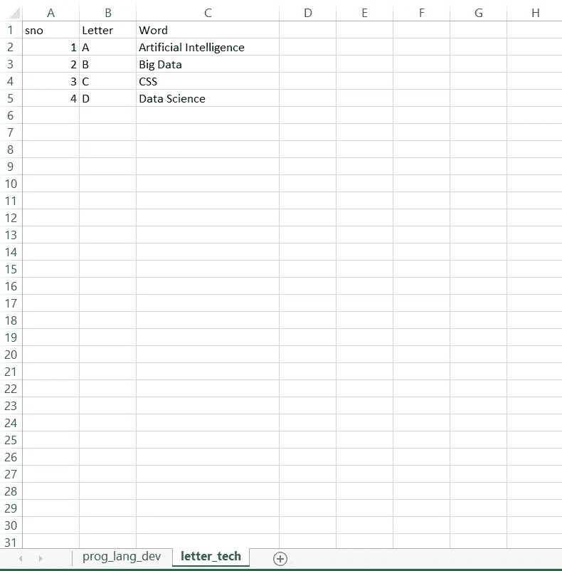*

*data.xlsx 中的 letter_tech 表*

*a)当我们没有将 **"sheet_name"** 作为参数传递给 read_excel()方法时，它取第一张工作表。因此，在下面提到的查询中，它读取了**“Prog _ lang _ dev”表。***

*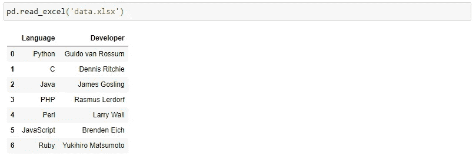*

*使用 prog_lang_dev 表创建的数据框架*

*b)将 sheet_name 作为第二个参数传递给 read_excel()方法。*

***语法:- pd.read_csv(文件名，工作表名)***

*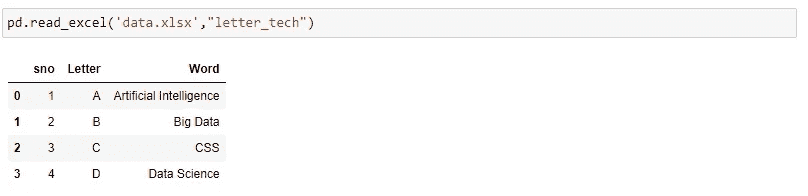*

*letter_tech 表的数据框架*

****写入 Excel 文件****

***语法:- to_excel('文件名'，可选参数)***

*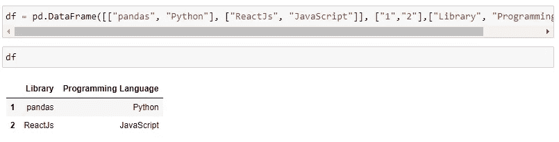*

*数据帧*

*a)不将**表名**作为参数传递*

*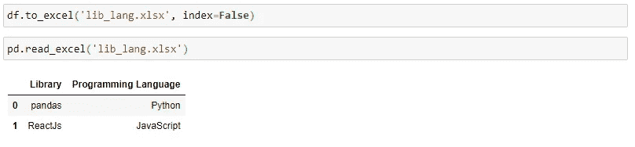*

*数据帧*

*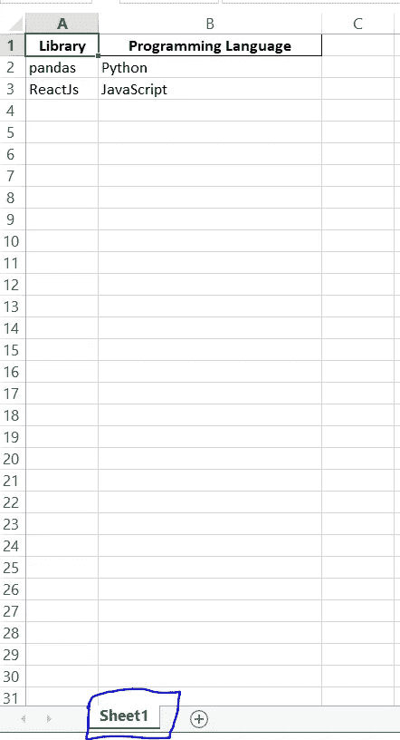*

*使用自动分配的工作表名称创建的 Excel 文件*

*b)传递表单名称—**“lib _ lang”***

*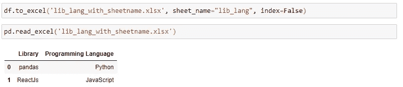*

*数据帧*

*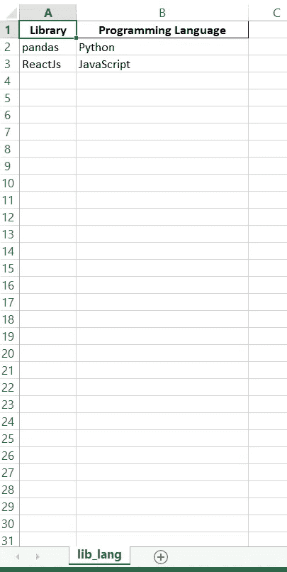*

*工作表名称为“lib-lang”的 Excel 文件*

***iii) HTML-超文本标记语言***

*超文本标记语言( **HTML** )是设计用于在网络浏览器中显示的文档的标准标记语言。*

*对于这个例子，我们将使用一个包含表格的简单网站。点击-> [编程语言及其开发者](https://georgian4049.github.io/learning_pandas/input_output/prog_lang_dev)即可打开网页。您可以将此链接用于您的练习。*

**以下是上述网页的部分代码-**

*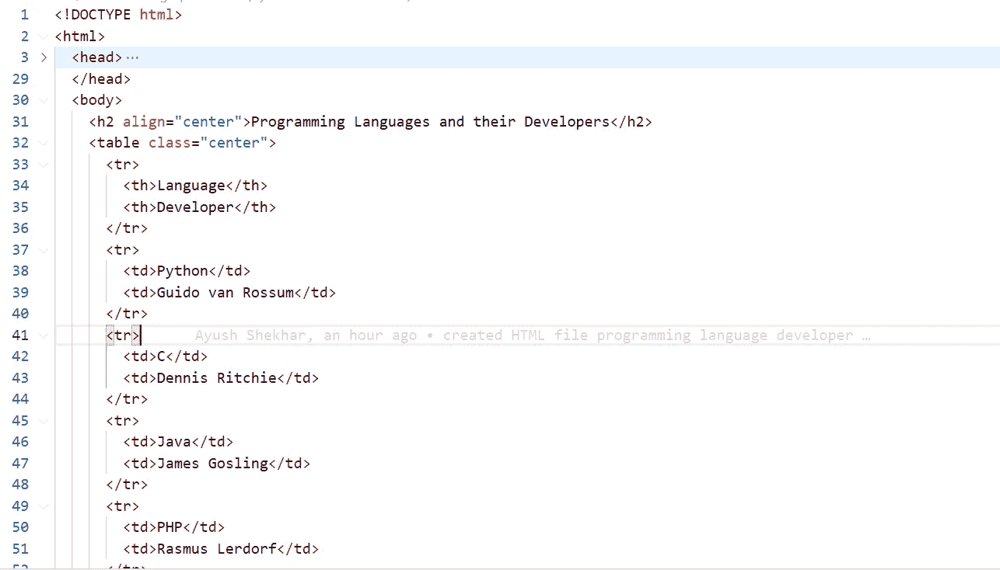*

*部分 HTML 代码(注意:-此网页有表格)*

**

*上述网页的截图*

****从一个 HTML 网站上阅读:-****

***语法:--PD . read _ html(网页 _ 链接)***

*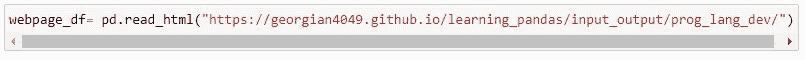*

*wepage_df 变量将包含网页中包含的所有表格的列表。*

*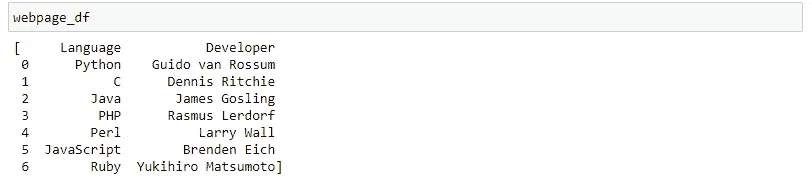*

*包含从网页中以“列表”形式获取的表格值的数据帧*

*您可以使用索引或使用一些过滤算法来获取表值。*

*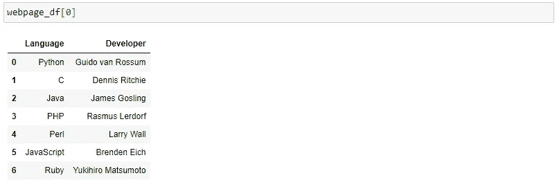*

****写 HTML****

***语法:--to _ html()***

*它将 DataFrame 值转换为 HTML 表格代码库。*

*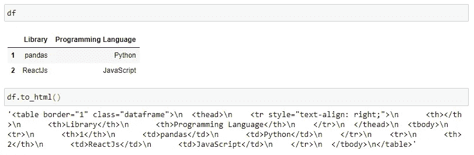*

*数据框架“df”到 HTML 代码库的转换*

***iv) SQL 结构化查询语言***

*SQL 是一种用于存储、操作和检索数据库数据的标准语言。*

*有各种各样的 SQL 引擎，像- MySQL，PostgreSQL，SQLite 等等。对于这里的例子，我将使用 SQLite，它是一个非常轻量级的数据库引擎，并将值存储在内存中。*

***SQLAlchemy**:-SQLAlchemy 是 Python SQL 工具包和对象关系映射器，为应用程序开发人员提供了 SQL 的全部功能和灵活性。*

*I)我们需要从 SQLAlchemy 导入 **create_engine()** 函数来创建 SQLite 引擎。*

*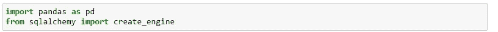*

*导入创建引擎*

*ii)创建引擎以在内存中存储数据*

*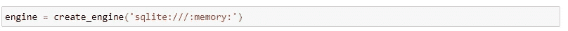*

*引擎(在内存中存储数据)*

****写入和读取数据****

****语法:-****

****w*rite:--to _ SQL(表名，引擎)***

***read:--read _ SQL(table _ name，con=engine)***

*让我们创建一个数据框架。*

*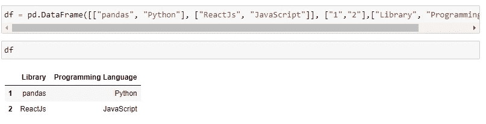*

*将其存储到数据库中，表名为“mytable”。*

*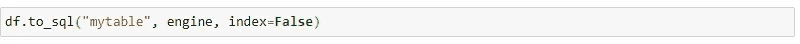*

*将数据存储到 **mytable***

*从数据库中检索数据*

*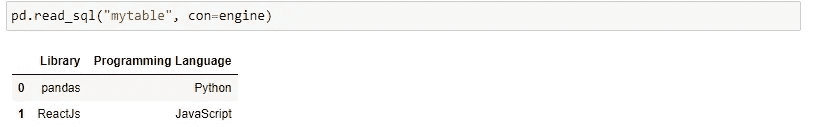*

*从 **mytable** 中检索数据*

> ***注意:-如果您不想要不必要的索引**，则在写入数据时使用“index=False”参数*

*感谢阅读！*