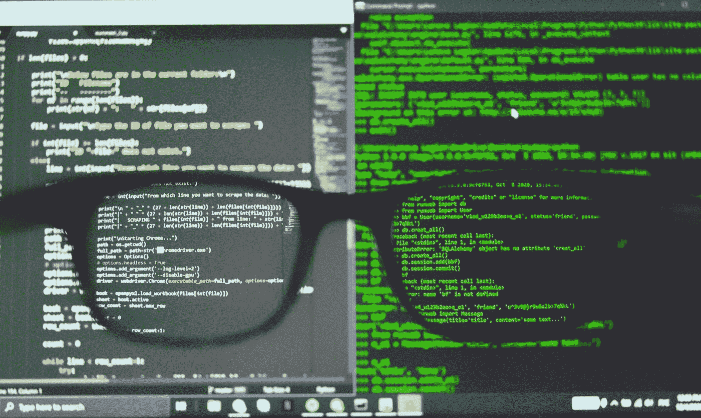
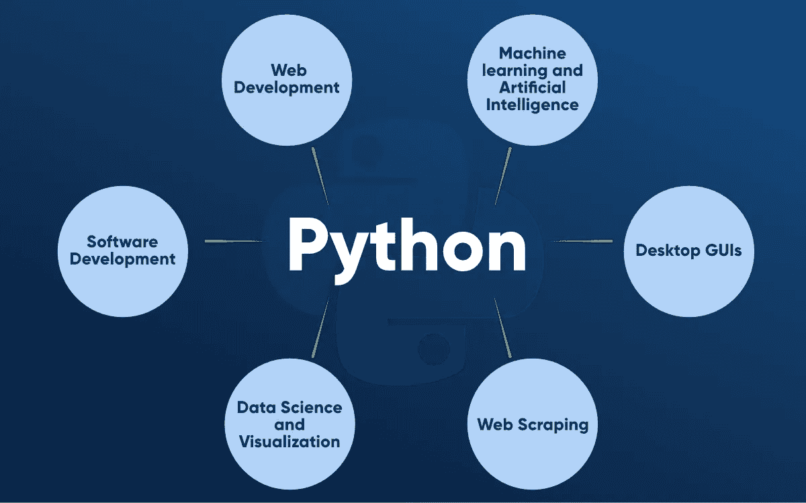

# 2021 年的 Python 路线图

> 原文：<https://medium.com/analytics-vidhya/python-roadmap-to-follow-in-2021-1f49715468ca?source=collection_archive---------0----------------------->

## 2021 年学员开始 Python 之旅的路线图。

亚历克斯·丘马克在 [Unsplash](https://unsplash.com?utm_source=medium&utm_medium=referral) 上的照片

现在已经是 2021 年了，但是我们仍然不能停止宣传 Python 是一种编程语言。Python 作为一种通用语言在各种领域的流行，如竞争性编程、web 开发、web 抓取、数据科学、机器学习等等，这使它成为学习 2021 年的超级大国语言。

# 因此，这个博客致力于你的 Python 学习之旅，它有一个特别为初学者和中级 Python 爱好者设计的定义明确的路线图。

我们将从**“热身”**阶段开始，在这个阶段，我们将重温编程基础知识，Git 和 GitHub 的版本控制知识，以及一些命令行基础知识。接下来，我们将从基础开始，继续学习 Python 中最重要的库的编程范例。

> 每个阶段都包含几个子阶段，我们没有设定时间限制，而是让你进入下一个学习阶段的小任务。我们真诚地希望列出的教程能给你最好的 Python 知识！我们走吧。

# 第一阶段:热身！

*   [Bash/Linux 命令](https://cheatography.com/davechild/cheat-sheets/linux-command-line/)
*   Git 基础

*   [GitHub 基础知识](/mindorks/fundamentals-of-git-and-github-6d0ca62b0b1f)
*   [Python 是什么？为什么是 Python？](https://www.python.org/doc/essays/blurb/)
*   Python 的特性

*   [Python 的应用](https://www.upgrad.com/blog/python-applications-in-real-world/)
*   Python2 vs Python3

*   [Python 代码编辑器](https://www.programiz.com/python-programming/ide)
*   [Python 解释器](https://towardsdatascience.com/how-does-python-work-6f21fd197888#:~:text=For%20the%20most%20part%2C%20Python,which%20is%20stored%20with%20a%20.)
*   为 Python 设置开发环境

# 阶段 2: Python 基础知识

*   基本 Python 语法
*   缩进规则和注释
*   Python 中的“你好，世界”
*   变量和数据类型
*   类型变换
*   Python 运算符
*   Python 条件语句
*   Python 中的循环
*   Python 字符串和数字

# 教程

 [## Python 简介

### Python 是一种流行的编程语言。它由吉多·范·罗苏姆创作，于 1991 年发行。它用于:网络…

www.w3schools.com](https://www.w3schools.com/python/python_intro.asp)  [## 学习 Python 编程

### Python 是一种强大的通用编程语言。我们的 Python 教程将引导你一步到位地学习 Python…

www.programiz.com](https://www.programiz.com/python-programming)  [## 面向初学者的 Python

### 欢迎光临！你完全是编程新手吗？如果没有，我们认为您会寻找有关原因的信息…

www.python.org](https://www.python.org/about/gettingstarted/)  [## Python 基础

### 本课程介绍 Python 3 的基础知识，包括作为控制结构的条件执行和迭代，以及…

www.coursera.org](https://www.coursera.org/learn/python-basics) 

# 阶段 Python 中的数据结构

*   Python 列表
*   Python 元组
*   Python 中的切片
*   Python 集合
*   Python 词典
*   Python 中的布尔值

# 教程

 [## 关于 Python 中的数据结构，你应该知道的一切

### 概述在我们深入数据科学和模型的细微差别之前，Python 中的数据结构是一个需要学习的关键概念…

www.analyticsvidhya.com](https://www.analyticsvidhya.com/blog/2020/06/data-structures-python/)  [## Python 数据结构

### 本课程将介绍 Python 编程语言的核心数据结构。我们将超越…的基础

www.coursera.org](https://www.coursera.org/learn/python-data) 

# 阶段 4:面向对象与函数式编程

*   OOP 概念
*   Python 中的类
*   邓德
*   方法
*   发电机
*   遗产
*   函数式编程
*   λ函数
*   内置函数
*   Python 中的装饰者
*   关闭
*   Python 中的正则表达式

# 教程

 [## Python 中的函数式编程- GeeksforGeeks

### 函数式编程是一种编程范式，在这种编程范式中，我们试图将一切都绑定在纯数学函数中…

www.geeksforgeeks.org](https://www.geeksforgeeks.org/functional-programming-in-python/)  [## Python 终极指南:如何从初学者到专业人员

### 如果你对数据科学、Web 开发、机器人或物联网感兴趣，你必须学习 Python。Python 已经成为…

www.freecodecamp.org](https://www.freecodecamp.org/news/the-ultimate-guide-to-python-from-beginner-to-intermediate-to-pro/) 

# 阶段 5:模块和包

*   模块与包
*   数字模块
*   系统模块计数器
*   DefaultDict 和 orderedDict 模块
*   随机模块
*   日期时间和日历模块
*   pip 和 PyPI 包

# 教程

 [## Python 模块和包-简介-真正的 Python

### 在 Python 中定义模块实际上有三种不同的方式:模块可以用 Python 本身编写。一个…

realpython.com](https://realpython.com/python-modules-packages/)  [## Python 包索引

### Python 包索引(PyPI)是 Python 编程语言的软件仓库。PyPI 帮助您找到…

pypi.org](https://pypi.org/)  [## Python 的模块、包、库有什么区别？- GeeksforGeeks

### Python 的模块、包、库有什么区别？模块:模块是一个简单的 Python 文件，它…

www.geeksforgeeks.org](https://www.geeksforgeeks.org/what-is-the-difference-between-pythons-module-package-and-library/) 

# 阶段 6:文件和异常处理

*   用 Python 读/写文件
*   操作系统模块
*   在 Python 中重命名/复制/管理文件
*   压缩文件和目录

# 教程

 [## Python 中的文件处理

### Python 也支持文件处理，并允许用户处理文件，例如，读取和写入文件，以及许多其他…

www.geeksforgeeks.org](https://www.geeksforgeeks.org/file-handling-python/)  [## Python -异常处理

### Python 提供了两个非常重要的特性来处理 Python 程序中的任何意外错误，并添加调试功能…

www.tutorialspoint.com](https://www.tutorialspoint.com/python/python_exceptions.htm)  [## 使用 try、except 和 finally 语句的 Python 异常处理

### Python 有许多内置的异常，当你的程序遇到错误时(程序中的某些东西…

www.programiz.com](https://www.programiz.com/python-programming/exception-handling) 

# 第七阶段:重要的图书馆

*   熊猫
*   NumPy
*   SciPy
*   tkinter
*   枕头
*   PyQT
*   pygame
*   PyTorch
*   matplotlib
*   张量流
*   克拉斯

# 教程

# 应用领域

对于 Web 开发、机器学习或脚本编写来说，Python 一直是编程的流行选择。我们已经列出了一些应用领域，您可以使用 Python 及其令人惊叹的库和框架进行探索。每个应用领域都有自己的一套额外的学习内容，你可以根据自己的兴趣来选择！

## 路径 1:网页抓取

*   美味的汤
*   硒
*   Scrapy

## 路径 2:脚本

*   DevOps: Docker，Kubernetes 等。
*   系统管理员

## 路径 3: Web 开发

*   姜戈
*   瓶

## 路径 4:道德黑客

## 路径五:机器学习

*   张量流
*   PyTorch
*   克拉斯
*   sci kit-学习
*   Numpy
*   熊猫
*   SciPy
*   Matplotlib
*   海生的

 [## Python 数据科学-面向初学者的 12 小时免费课程。学习熊猫，NumPy，Matplotlib，还有…

### 这个免费的 12 小时 Python 数据科学课程将带你从对 Python 一无所知到能够分析…

www.freecodecamp.org](https://www.freecodecamp.org/news/python-data-science-course-matplotlib-pandas-numpy/)  [## 用 Python 进行机器学习

### 这门课程深入到机器学习的基础，使用一种平易近人的，众所周知的编程语言…

www.coursera.org](https://www.coursera.org/learn/machine-learning-with-python)  [## 机器学习:如何从零到英雄

### 从“为什么”开始并以“我准备好了！”如果你对人工智能和机器学习的理解是一个大大的问号…

www.freecodecamp.org](https://www.freecodecamp.org/news/machine-learning-how-to-go-from-zero-to-hero-40e26f8aa6da/) 

如有任何帮助或疑问，请随时联系我👇

 [## 软件工程师

### Chandrika Deb 是一名即将入职的软件开发人员，住在印度，喜欢学习新事物和帮助技术…

chandrikadeb7.github.io](https://chandrikadeb7.github.io/) 

谢谢大家！🦄