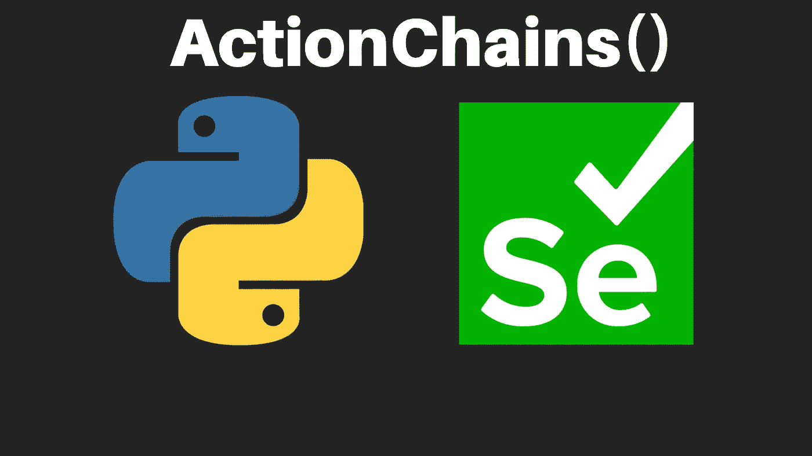

# Python Selenium 使用动作链的所有鼠标动作

> 原文：<https://medium.com/analytics-vidhya/python-selenium-all-mouse-actions-using-actionchains-197530cf75df?source=collection_archive---------2----------------------->

什么是动作链？
ActionChains 是 Selenium 提供的方法，用于自动化与网站的低级交互，类似于鼠标移动、鼠标按钮操作、按键和上下文菜单(右键菜单)交互。这些特殊的策略有助于完成额外的复杂操作，比如鼠标悬停和拖放，而这些操作是直接的 web 驱动程序所做不到的。

利用 ActionChains 对象，我们命名一个接一个按顺序执行特定动作的策略。selenium 教练操作被直接推入队列。当 performing()方法被调用时，事件按照它们排队的顺序被触发。

要使用 ActionsChains，您必须从 lib 导入:

ActionChains = action chains(driver)#初始化 action chain 对象

创建 ActionChains 对象时应传递 WebDriver 实例。

ActionChains 可以在链模式中使用，在同一行中添加所有方法。

如何将驱动程序移动到一个元素？

动作将被一个接一个地添加到队列中，然后被执行。

在每一种方式中，动作都是按照它们被添加的顺序一个接一个地执行或实施的。

所有可用的 ActionChains 方法:

# **。点击()**

。单击(on_element)

单击传递给此方法的元素。如果没有任何东西传递给 click()，默认情况下单击鼠标的当前位置。

**on_element:** 点击左键点击 WebElement 对象。

# **。点击 _ 并 _ 保持()**

。单击并按住(在元素上)

在传递给此方法的元素上按住鼠标左键。如果什么都没有传递，默认点击鼠标的当前位置。

**on_element:** 鼠标左键所在的 WebElement 对象。

# **。context_click()**

。上下文点击(on_element)

在传递给此方法的元素上执行上下文单击(右键单击)操作。如果什么都没有传递，默认点击鼠标的当前位置。

**on_element:** WebElement 对象

# **。双击()**

。双击(在元素上)

双击传递给此方法的元素。如果没有传递任何东西，默认情况下双击鼠标的当前位置。

**on_element:** WebElement 对象在哪里执行双击。

# **。拖放()**

。拖放(源，目标)

在源元素上按住鼠标左键，然后移动到目标元素并释放鼠标按钮。

**来源:**鼠标按下的 WebElement 对象。

**目标:**web driver 元素中鼠标向上移动的对象。

# **。drag_and_drop_by_offset()**

。拖放偏移(*源*、 *xoffset* 、 *yoffset* )

在源元素上按住鼠标左键，然后移动到目标偏移并释放鼠标按钮。

**source:** 鼠标按下的 WebElement 对象。

**xoffset:** 要移动到的 X 偏移量。

**yoffset:** 要移动到的 Y 轴偏移量。

# **。key_down()**

。key_down( *值*，*元素*)

只发送按键，不释放。应仅与修饰键(Control、Alt 和 Shift)一起使用。

**值:**要发送的修改键。值在 Keys 类中定义。

**元素:**发送键的元素。如果没有，则向当前获得焦点的元素发送一个键。

示例:“CTRL+A”—[全选]

# **。key_up()**

。key_up( *值*，*元素*

释放修饰键。

**值:**修改键发送。值在 Keys 类中定义。

**元素:**发送按键的元素。如果没有，则向当前获得焦点的元素发送一个键。

# 。 **move_by_offset()**

。move _ by _ offset(*x offset*， *yoffset* )

将鼠标移动到偏离浏览器屏幕当前鼠标位置的位置。

**xoffset:** 要移动到的 X 偏移量，为正整数或负整数。

**yoffset:** 要移动到的 Y 偏移量，为正整数或负整数。

# 。 **move_to_element()**

。移动到元素

将鼠标移动到元素的中间

**to_element:** 要移动到的 WebElement 对象。

# 。move_to_element_with_offset()

。move _ to _ element _ with _ offset(*to _ element*， *xoffset* ， *yoffset)*

将鼠标移动指定元素的偏移量。偏移量相对于元素的左上角。

**to_element:** 要移动到的 WebElement 对象。

**X 偏移:**要移动到的 X 偏移。

**yoffset:** 要移动到的 Y 偏移。

# **。暂停()**

。暂停(秒)

将所有输入暂停指定的秒数。

**秒:**暂停输入动作的持续时间

# 。**执行()**

。执行()

在 ActionsChains()中执行所有存储的操作。

# 。**发布()**

。释放(on_element)

在元素上释放按住的鼠标按钮。

**on_element:** WebElement 对象

# 。 **reset_actions()**

。重置 _ 操作()

清除已经存储的操作。

# 。 **send_keys()**

。发送密钥(发送密钥)

向当前聚焦的 web 元素发送文本或键。

**按键发送:**按键发送。修饰键常量可以在“keys”类中找到。

# 。 **send_keys_to_element()**

。发送密钥至元素(元素，密钥至发送)

向特定元素发送键。

**元素:**发送按键的元素。

**按键发送:**按键发送。修饰键常量可以在“keys”类中找到。