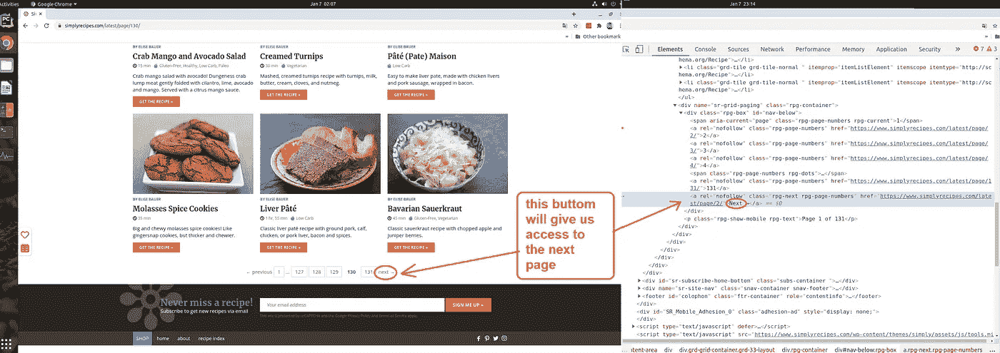

# Python Selenium:抓取食谱网站

> 原文：<https://medium.com/analytics-vidhya/python-selenium-web-scraping-in-eight-steps-7d33b263f399?source=collection_archive---------2----------------------->

## 逐步指南

## 当你废弃数据科学实践平台时的数据科学见解。

麦克斯韦·尼尔森在 T2 的照片

# 引言。

这次我将解释(用完整的代码示例)如何使用 Selenium Python 框架通过八个步骤创建一个 web scraper。

我将带一个食谱网站【https://www.simplyrecipes.com/ 。这篇文章的主题可以是任何数据科学项目的基础部分:数据收集。

所以我选择了这个网站，因为它正好包含了我的 NLP 形容词所需要的数据。此外，本教程的第 3 步、第 5 步和第 7 步将涉及一些在 web 爬行过程中可能出现的特定问题(selenium 异常)。因此，在实现这个项目代码之后，您不需要检查 Stackoverflow。

# 定义。

[***网络抓取***](https://en.wikipedia.org/wiki/Web_scraping) 通常被称为网络爬行或网络蜘蛛，或“以编程方式浏览网页集合并提取数据”。这对任何数据科学家来说都是非常有益的实践。

使用 web scraper，您可以挖掘关于一组产品的数据，获得用于 NLP 任务的大型文本语料库，获得用于电子商务分析的任何定量数据，或者收集用于计算机视觉目的的大型图片集。你甚至可以从没有官方 API 的网站上获取数据。

[***Selenium***](https://en.wikipedia.org/wiki/Selenium_%28software%29)*是一个测试 web 应用的可移植框架。它自动化了 web 浏览器，您可以使用它来代表自己在浏览器环境中执行操作。Selenium 还带有一个解析器，可以发送 web 请求。您可以像使用 Javascript DOM API 一样从 HTML 文档中提取数据。通常，如果人们需要只有在加载 Javascript 文件时才可用的数据，他们会使用 Selenium。*

# *第一步。安装。*

*Selenium 文档提供了几种不同的安装包的方式。在我的例子中，我在 Ubuntu OS 的 **Pycharm 中的**虚拟环境**上应用安装。***

**

*图 1 在 Pycharm 的虚拟环境中安装 Selenium 包*

*使用 pip，您可以像这样安装 selenium:*

**

*图 2 通过 pip 安装硒包*

*安装 Selenium 后，必须下载一个[驱动程序](https://sites.google.com/a/chromium.org/chromedriver/downloads)。*

> *Selenium 需要一个驱动程序来与所选的浏览器交互。例如，火狐需要[一只壁虎驱动](https://github.com/mozilla/geckodriver/releases)。它应该在您的路径中，例如，将它放在/usr/bin 或/usr/local/bin 中。*

*在本教程中，我拿一个 [**Chrome 驱动 87 版**](https://sites.google.com/a/chromium.org/chromedriver/downloads) **给 Ubuntu OS。***

*现在我们已经安装了这个包，并在项目目录中解压了一个驱动程序。我们可以去数据所在的网页。让我们来探索一下 HTML 的结构。*

# *第二步。探索页面的 HTML 结构。*

*这里有 131 页，每页有 26 个食谱文章的链接。我们可以收集超过三千个网址。我们必须记住最后一页没有写满。有些链接并不指向食谱信息。如何管理这种情况？您将在步骤 6 中看到它。将所有收集的 URL 保存到一个文件中。
那么，我们在这个页面的 HTML 中有什么食谱链接收集呢？*

**

*图 3 我们很幸运，有两个地方(一个用红色圈起来，另一个用绿色圈起来)可以找到所需的食谱链接。*

*如果一个地方有问题，还有其他地方可以尝试。页面导航呢？*

**

*图 4 页面底部有一个按钮“下一步”。*

*通过按钮“下一步”，我通过 Python 自动改变页面。*

# *第三步。获取与网页的连接。*

*这里是第一个代码示例。这是一个为网页连接创建 chromedriver 的函数。为了更方便使用，我把它做成功能性表示。*

*[与网页建立连接的功能](https://gist.github.com/Galina-Blokh/db95b44812175ac61e1992c2271a76e1)*

*在每次连接请求后设置一个超时非常重要。否则，你将被阻止，你的程序将无法工作。
如果您的互联网连接不好，或者页面有很多弹出窗口，或者页面负载过重，就会发生这种情况。在这些情况下，您可以捕获 selenium.TimeoutException。只有第二次尝试失败，程序才会停止。*

# *第四步。从一个页面收集食谱链接。*

*在我创建了一个 chromedriver 之后，是时候从页面获取链接了。使用硒有几种流行的方法:*

*   *使用 XPath*
*   *使用 CSS 选择器*
*   *按类别、id、标签*
*   *使用 CSS 或 XPath 进行部分搜索*
*   *等等。*

*我用 XPath 搜索完成了这一部分:*

*[如何使用 selenium python 从一个页面收集每个食谱的链接](https://gist.github.com/Galina-Blokh/c5175865109ed859086f31e5bd9cb3db)*

*这个函数接收一个 chrome 驱动对象作为参数。第一步是为链接收集创建一个空列表(第 7 行)。第二步—进入链接计数范围(我们记得这个网站每页包含 26 个链接)(第 9 行)，并使用 XPath 中的这个索引通过 HTML 对象进行迭代(第 11–12 行)。最后，将每个链接添加到一个列表中(第 15 行)，这个列表是在这个函数开始时创建的。
如何获得网页上元素的 XPath 有三个简单的步骤:
1 .转到网页并按键盘上的 F12 键。
2。找到你想要得到元素，在 HTML 中点击鼠标右键。
3。复制 XPath 并将其作为搜索参数粘贴到函数中。*

**

*图 5 如何获取网页中元素的 XPath*

*用开发者模式(F12)真的不难做到。*

# *第五步。逐页导航以收集链接。*

*现在我可以一页一页地创建一个全局行走的函数。看看下面的代码:*

*[使用 selenium python 功能逐页收集所有链接](https://gist.github.com/Galina-Blokh/2eab0bfd1bb01c497bdf39d4a0ba5cfe)*

*同样，首先创建一个空列表(第 11 行)。该函数接收 chromedriver 作为参数以及它应该遍历的页数。
然后我们进入一个页码范围内的 for 循环(第 12 行)。我们仍然记得该网站有 131 页的食谱网址。
在第 15–16 行中，调用一个 previous 函数从一个页面获取链接，并将结果存储到列表中。
在第 19–22 行中，查找“下一步”按钮并单击。如果没有更多的页面，您将得到一条关于它的消息(第 24–26 行)。
该函数返回 list [list[str]]。每个内部列表[str]是我们走过的每个页面的 URL 列表(第 27 行)。*

# *第六步。将所有收集的 URL 保存到一个文件中。*

*在这一步中，我们有三个常数:*

*   *存储配方 URL 的文件路径(第 2 行)*
*   *文件的文件名/路径，其中将存储我们得到的没有食谱的链接(在我们浏览的每一页上，都有一些文章和评论的链接，而不是食谱的链接)(第 3 行)*
*   *字符串模式(第 4 行)来区分这两个 URL 类别。*

*[将获取的链接保存到两个文件中的功能:链接到配方的文件和链接到没有配方的文件](https://gist.github.com/Galina-Blokh/6f2165314b1416bb136b704cc096c3a7)*

*该函数获取一个文件名作为参数，我们将在其中存储正确的链接。这次我们创建一个 chromedriver(第 14 行)。
调用前面的函数收集 URL，并将结果写入一个变量(第 17 行)。
在第 20–29 行，我们迭代结果变量中的元素。以“写”模式打开两个文件，并检查我们应该在哪个文件中写入元素的模式。写下一行并关闭两个文件。
好了，这已经是我们做的大部分了。剩下的只是从网页上收集数据。*

# *第七步。收集配方数据:配料和说明。*

*在 HTML 中寻找配方成分和配方说明的正确位置。使用与步骤 2 和 4 相同的方法:应用 XPath 搜索和按标记名搜索。*

**

*图 HTML 中包含所需数据的元素*

*现在说说下面的功能。它接收一个食谱页面链接作为参数。在第 14–16 行，我们定义了一个字典和两个列表(来收集我们的数据)。
在第 23 行调用 HTML 元素搜索。它应该会返回给我们一个硒对象。使用它在第 32 行继续按标记名进行搜索。*

*[将一页中的配方成分和说明收集到字典中的功能](https://gist.github.com/Galina-Blokh/ab34f48a69dc745830b3458900503952)*

*那么在这两个步骤之间发生了什么:在第 25–30 行？".它预测由于警报而退出程序(在我们的例子中，ReCaptcha)。*

*有时警报不会立即显示。当您试图在它可见之前切换到它时，您会得到 *NoAlertPresentException* 。要避免这种情况，只需等待警报出现。第 25–30 行的代码处理这种情况。*

*第 34 行:在下载进行到一半的时候，我突然意识到没有收集到所有的成分。其中一些表示为空列表。在 HTML 检查之后，我看到了另一个数据出现在页面上的 *div* 元素。因此，第 34 行检查了 *div* 元素的“为空”条件。如果 search_by_tag_name 返回一个空列表，程序将转到第 35–36 行。它应该在前面的 *div* 中看到相同的 id 并收集数据。然后遍历搜索结果，将每个条目添加到一个列表中(第 37–38 行)。*

*说明书收集不同于配料收集。在第 41–42 行，我们通过 XPath 进行搜索。在第 43 行，我用标签名进行搜索。这里没有像检查配料一样检查警报(真是松了一口气)。但是，instruction 中存在标签名称与文本数据相同的图片！因此，我检查“是段落文本，不是空字符串”(第 44 行)，并且仅在将文本追加到列表中之后(第 45 行)。否则，程序将转到下一个段落元素(第 48–49 行)。*

*当所有搜索请求和迭代结束后，chromedriver 应该关闭(第 50 行)。现在，您可以用收集的数据(53–54)更新我们的字典，并将其发送到 return 语句(第 56 行)*

*此外，我编写了一个小的打印函数来监视加载的是哪种数据。它给出了控制台输出:一个. txt 文件中页面链接的数量、链接本身以及收集的类似 JSON 表示的文本数据(关于成分和说明)。*

*[控制台输出监控下载数据的功能](https://gist.github.com/Galina-Blokh/2d529fb1a1afb87a878b5506b46ff818)*

# *第八步。在 main.py 中运行所有*

*本教程的最后一部分—要从一个位置运行所有程序，请将收集的数据保存到一个 CSV 文件中。*

*我选择 CSV 是因为 Python 允许我们逐行写入这种文件格式。因此，如果你将停止中间的刮刀，并在休息后从同一位置继续，它将起作用。你不会丢失数据。*

*要继续下载，您必须更改的唯一内容是:*

1.  *注释行 17 和 18，因为他们正在从网站收集链接。您已经将它们保存在一个. txt 文件中；*
2.  *并在第 23 行更改 np.arrange()的 start 参数，从您停止的地方重新开始下载。监控功能将为您提供铲运机使用的最后一个链节的信息。*

*[从一个地方运行抓取程序并将数据保存到 csv 文件](https://gist.github.com/Galina-Blokh/c2137ba02fb0cddd78f7504fb201d6a9)*

**main* 打开一个包含所有 URL 的. txt 文件来读取行(第 21–22 行)。然后从选择的页面收集数据(第 26 行)，将收集的数据存储到一个列表中，并将其作为一行写入 CSV 文件。*

*仅此而已。几个小时后，你将拥有一个 2565 行× 2 列的大集合。剩下的只是对数据进行预处理:删除重复项，分成段落，删除标点符号，转换成数字序列，并训练模型。*

# *结论。*

*本教程应该足以学习如何用 Selenium 构建一个刮刀，并从任何网站收集数据。要将此代码应用到另一个网站，只需在所有爬行函数中更改 URL-pattern 和 XPaths 的常量。*

*你可以在 Github 上找到完整的代码。*