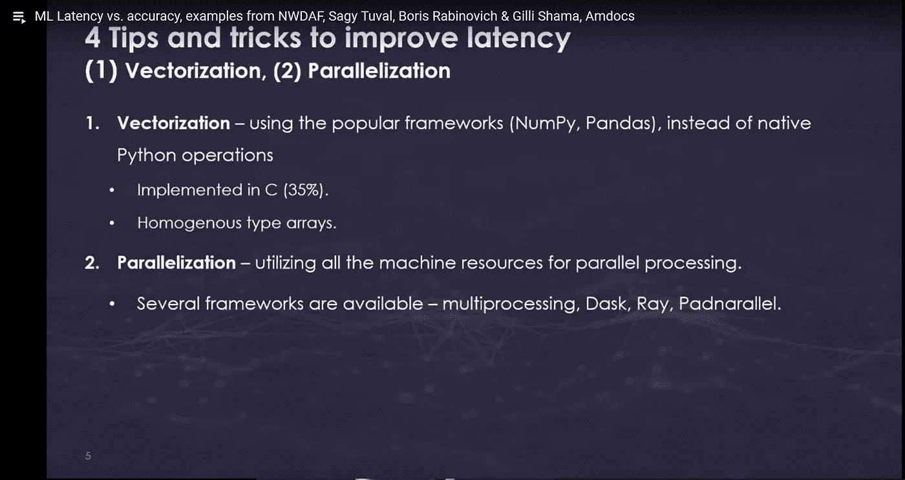
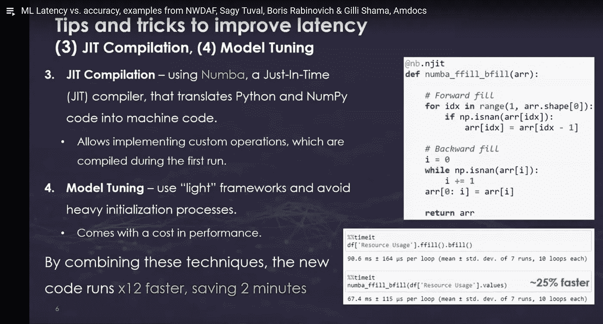
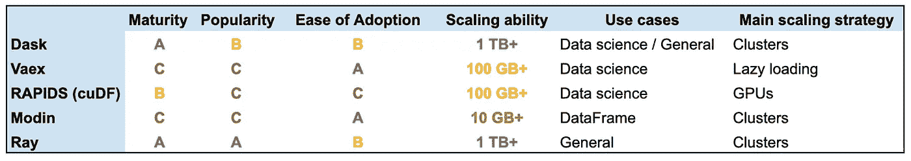

# Python 加速

> 原文：<https://medium.com/analytics-vidhya/python-speed-up-89f249bc484a?source=collection_archive---------11----------------------->

在这个故事中，我只是分享我做的小小研究。

**关键要点:**

*   **Dask** 1.0.0 版本于 2018 年 11 月底发布，2015 年左右开始开发。我想以后再进一步探索。
*   **Spark** 也在我的探索名单上很长时间了。
*   Numba 可以用来优化一些关键的功能。



[https://www.youtube.com/watch?v=hT8wjSGL7S8](https://www.youtube.com/watch?v=hT8wjSGL7S8)

# …向量化…

就用 Numpy 和熊猫吧。但是请参见下面的 Numba 以了解替代方案。

# 并行化

*   对于一些简单的场景，标准的*多进程*库可能就足够了。例如参见[https://medium.com/geekculture/join-files-cc5e38e3c658](/geekculture/join-files-cc5e38e3c658)。
*   看起来 Pandaral-lel[https://repos hub . com/python/miscellaneous/na lepae-pandarallel . html](https://reposhub.com/python/miscellaneous/nalepae-pandarallel.html)非常有限，应该使用 trail & error 来有效地利用它。另请参见[https://towards data science . com/pandaral-lel-a-simple-efficient-tool-to-parallelism-your-pandas-operations-on-all-your-your-CPU-bb 5 ff 2 a 409 AE](https://towardsdatascience.com/pandaral-lel-a-simple-and-efficient-tool-to-parallelize-your-pandas-operations-on-all-your-cpus-bb5ff2a409ae)

除了 Dask 和 **Ray** 之外，还有一些更好的选择，我们先来看看。引用:

> *******[***Dask***](https://www.datarevenue.com/ml-tools/dask)***:****一个低级调度器和一个高级局部熊猫替换，面向计算集群上的运行代码。*
> 
> **** Ray:*** *跨处理器或集群并行化 Python 代码的底层框架。*
> 
> *[***摩丁***](https://www.datarevenue.com/ml-tools/modin)***:****熊猫的空降替代品，由****【Dask】****或* ***雷*** *驱动。**
> 
> ********[***Vaex***](https://www.datarevenue.com/ml-tools/vaex)***:****使用惰性评估和内存映射的部分熊猫替换，允许开发人员在标准机器上处理大型数据集。**
> 
> ********[***激流***](https://www.datarevenue.com/ml-tools/rapids)***:****运行在 GPU 上的数据科学库集合，包括*[*cuDF*](https://github.com/rapidsai/cudf)*，熊猫的部分替代。
> …。**

**

*Dask 和 Ray 比较成熟，但是摩丁和 Vaex 比较容易上手。如果你有 GPU 的话，Rapids 是有用的。*

> *****到期:*** *自第一次提交以来的时间和提交次数。**
> 
> *****人气:****GitHub 明星数。**
> 
> *****易于采用:*** *用户期望的知识量、假定的硬件资源和安装的简易性。**
> 
> *****扩展能力:*** *每个工具的广泛数据集大小限制，取决于它是主要依赖于单个机器上的 RAM、硬盘空间，还是可以扩展到机器集群。**
> 
> *****用例:*** *无论这些库是旨在加速 Python 软件的一般功能(* ***一般功能(*** *)、是专注于数据科学和机器学习(* ***数据科学*** *)、还是仅限于简单地替换熊猫的“数据框架”功能(**

*[https://www . data revenue . com/en-blog/pandas-vs-dask-vs-vaex-vs-modin-vs-rapids-vs-ray](https://www.datarevenue.com/en-blog/pandas-vs-dask-vs-vaex-vs-modin-vs-rapids-vs-ray)*

*当然，也可以换成 **Spark** /PySpark。这种方法的主要缺点是您需要学习全新的方法来组织您的代码。以下是更多相关信息。*

# *光线*

*引用自其网站:*

> *Ray 为构建分布式应用程序提供了一个简单、通用的 API。*
> 
> **雷通过*完成这个任务*
> 
> **1。为构建和运行分布式应用程序提供简单的原语。**
> 
> **2。支持最终用户并行处理单个机器代码，几乎不需要修改代码。**
> 
> **3。包括应用程序、库和工具的大型生态系统，以支持复杂的应用程序。**
> 
> ****雷核*** *为应用构建提供了简单的原语。**

*[https://docs.ray.io/en/master/](https://docs.ray.io/en/master/)*

*让我们详细说明一下。引用:*

> **传统编程依赖于两个核心概念:* ***函数*** *和* ***类。*** *利用这些构建模块，编程语言允许我们构建无数的应用程序。**
> 
> **然而，当我们将应用程序迁移到分布式环境时，概念通常会发生变化。**
> 
> **在光谱的一端，我们有类似*[*OpenMPI*](https://www.open-mpi.org/)*，*[*Python****多处理***](https://docs.python.org/2/library/multiprocessing.html) *和*[*ZeroMQ*](http://zeromq.org/)*的工具，它们为发送和接收消息提供底层原语。这些工具非常强大，但它们提供了不同的抽象，因此单线程应用程序必须从头开始重写才能使用它们。**
> 
> **另一方面，我们有特定领域的工具，如用于模型训练的*[***【tensor flow】***](https://www.tensorflow.org/)**[***Spark***](https://spark.apache.org/)**用于数据处理和 SQL，以及*[***Flink***这些工具提供了更高层次的抽象，如神经网络、数据集和流。然而，因为它们不同于串行编程所用的抽象，应用程序必须从头开始重新编写才能利用它们……](https://flink.apache.org/)****
> 
> ***雷占据了一个独特的中间地带。而不是引入新的概念。Ray 采用现有的函数和类的概念，并将它们作为任务和参与者转换到分布式环境中。这种 API 选择允许串行应用并行化，而无需重大修改。***
> 
> ***…Ray 允许你用* `*@ray.remote*` *装饰器来声明一个 Python 类。每当实例化该类时，Ray 都会创建一个新的“actor ”,它是一个在集群中某个地方运行的进程，并保存着该对象的副本。对该角色的方法调用变成了在角色进程上运行的任务，并且可以访问和改变角色的状态。以这种方式，参与者允许在多个任务之间共享可变状态，而远程函数不能。***
> 
> ***个体参与者串行执行方法(每个个体方法都是原子的)，因此不存在竞争条件。并行可以通过创建多个参与者来实现。***
> 
> ***……演员都是极其厉害的。它们允许您获取一个 Python 类，并将其实例化为一个微服务，可以从其他参与者和任务甚至其他应用程序查询该微服务。***
> 
> **任务和参与者是 Ray 提供的核心抽象。这两个概念非常通用，可以用来实现复杂的应用程序，包括 Ray 的内置库，用于[](https://ray.readthedocs.io/en/latest/rllib.html)**、* [*超参数调优*](https://ray.readthedocs.io/en/latest/tune.html) *、* [*加速熊猫*](https://github.com/modin-project/modin) *等等。****

**[https://towards data science . com/modern-parallel-and-distributed-python-a-quick-tutorial-on-ray-99f8d 70369 b 8](https://towardsdatascience.com/modern-parallel-and-distributed-python-a-quick-tutorial-on-ray-99f8d70369b8)**

**据我所知，雷把演员模型带到了 Python 语言中。它确实是一个强大的工具，但是它需要重新设计你的代码。**

# **达斯克**

**引用自官方文件:**

> **分析师经常使用 Pandas、Scikit-Learn、Numpy 和 Python 生态系统的其他工具来分析他们个人电脑上的数据。他们喜欢这些工具，因为它们高效、直观且广受信任。然而，当他们选择将他们的分析应用于更大的数据集时，他们发现这些工具并不是为超越单台机器而设计的。Dask 提供了以最少的重写更自然地扩展 Pandas、Scikit-Learn 和 Numpy 工作流的方法。它与这些工具集成得很好，因此它复制了它们的大部分 API，并在内部使用它们的数据结构。此外，Dask 与这些库共同开发，以确保它们一致发展，最大限度地减少从本地笔记本电脑过渡到多核工作站，然后再过渡到分布式集群时的摩擦。熟悉 Pandas/Scikit-Learn/Numpy 的分析师将很快熟悉他们的 Dask 同类产品，并将他们的许多直觉带到一个可扩展的环境中……
> ……
> Dask 可以使分析师能够在他们的笔记本电脑上操作 100GB 以上的数据集，或者在工作站上操作 1TB 以上的数据集，而完全不需要使用集群。这可能是更可取的，原因如下:**
> 
> ***1。他们可以使用本地软件环境，而不是受限于集群上的可用资源或必须管理 Docker 映像。***
> 
> ***2。他们可以在途中、咖啡店或远离公司网络的家中更轻松地工作。***
> 
> ***3。在单台机器上调试错误和分析性能更加简单和愉快。***
> 
> ***4。他们的迭代周期可以更快。***
> 
> ***5。他们的计算可能更有效，因为所有的数据都是本地的，不需要通过网络或在不同的进程之间流动。
> ……
> Dask 允许您将集群换成单机调度程序，这种调度程序非常轻量级，不需要设置，并且可以完全在与用户会话相同的进程中运行……***

# ***Dask 与 Python 代码原生集成***

> ***Python 包括计算库，如* ***Numpy、Pandas 和 Scikit-Learn*** *，以及许多其他用于数据访问、绘图、统计、图像和信号处理等的库。这些库无缝地协同工作，产生一个内聚的包生态系统，它们共同发展，以满足当今大多数领域中的分析师的需求。***
> 
> ***这个生态系统由每个人都遵守的通用标准和协议联系在一起，这使得这些包以令人惊讶和愉快的方式相互受益。***
> 
> *****Dask 从这个生态系统内进化而来*** *。它遵守这些标准和协议，并积极参与社区工作来推动新的标准和协议。这使得生态系统的其余部分能够以最少的协调从并行和分布式计算中受益。Dask 并不寻求破坏或取代现有的生态系统，而是从内部补充和受益。***
> 
> **结果，Dask 开发被来自 Pandas、Numpy、Scikit-Learn、Scikit-Image、Jupyter 和其他人的开发者社区所推动。这种来自更广泛的社区增长的参与有助于用户信任该项目，并有助于确保 Python 生态系统将以平稳和可持续的方式继续发展。**

**[https://docs.dask.org/en/latest/why.html](https://docs.dask.org/en/latest/why.html)**

**因此，它值得进一步研究。**

# **农巴**

**引用:**

> ***Numba 为代码生成提供了几个实用程序，但是它的核心特性是* `[*numba.jit()*](https://numba.readthedocs.io/en/stable/reference/jit-compilation.html#numba.jit)` *装饰器。使用这个装饰器，您可以通过 Numba 的 JIT 编译器为优化标记一个函数。不同的调用模式触发不同的编译选项和行为。***

**[https://numba.readthedocs.io/en/stable/user/jit.html](https://numba.readthedocs.io/en/stable/user/jit.html)**

**让我们引用另一个资源:**

> ***JIT 或 Just In Time compilation 是一种编译器特性，允许在运行时而不是在执行时解释和编译语言。这意味着 JIT 编译器在编译代码之前执行逻辑，而不是准备所有的代码来工作，决定代码要做什么，然后再去做。***
> 
> ***这种编译器的好处当然是速度。花费在初始编译上的时间更少意味着代码可以更快地被解释。打个比方，假设你有一份晚餐要做的东西的清单。你可以采取一种多任务的方法，在同一时间做多件事情，而不是单独做所有的事情。***
> 
> ***数字概述***
> 
> **Numba JIT 编译器…使用标准的 LLVM 编译器库。虽然它在这方面确实有一些缺点，因为 LLVM 的重点不一定是 JIT，但它确实意味着编译器非常快和精确。 ***Numba 编译的 Pythonic 算法可以达到 c 等低级语言中常见的速度*****
> 
> ***这听起来可能很复杂，的确如此——但这并不意味着 Numba 很难使用。事实上，Numba 非常容易使用！为了试用它，你当然需要用 Python 的包管理器 PIP 来添加它。***

```
**sudo pip3 install numba**
```

> ***安装 Numba 后，可以通过 jit 函数访问:***

> **对于大多数代码，Numba 在优化 Python 代码方面做了令人难以置信的工作……然而，在其当前版本中，Numba 仍有很长的路要走，并出现了[某些代码的问题。有些问题无法通过简单的 Python 调用来解决，尽管 Numba 在创建可以轻松导入的 Python 优化编译器方面做得很好，但仍有改进的空间。**

**[https://towardsdatascience . com/numba-JIT-compilation-but-for-python-373 fc 2 f 848d 6](https://towardsdatascience.com/numba-jit-compilation-but-for-python-373fc2f848d6)**

**我想特别指出@jit decorator 的另一个参数:**

# **`*nogil*`**

> ***每当 Numba 将 Python 代码优化为只对原生类型和变量(而不是 Python 对象)起作用的原生代码时，就不再需要持有 Python 的* [*全局解释器锁*](https://docs.python.org/3/glossary.html#term-global-interpreter-lock) *(GIL)。如果您通过了* `*nogil=True*` *，Numba 将在进入此编译函数时释放 GIL。***

```
**@jit(nogil=True)
def f(x, y):
    return x + y**
```

> ***使用 GIL 发布版运行的代码可以与执行 Python 或 Numba 代码的其他线程并发运行(无论是同一个编译函数，还是另一个函数)，从而让您充分利用多核系统。如果该函数在* [*对象模式*](https://numba.readthedocs.io/en/stable/glossary.html#term-object-mode) *下编译，这是不可能的。***
> 
> **当使用 `*nogil=True*` *时，你必须警惕多线程编程的常见陷阱(一致性、同步、竞争条件等)。).***

**[https://numba.readthedocs.io/en/stable/user/jit.html](https://numba.readthedocs.io/en/stable/user/jit.html)**

# **Numba 的局限性**

> ***1。Numba 编译单个函数，而不是整个程序。***
> 
> ***2。Numba 支持 Python 的一个子集。有些字典/列表/集合支持但* ***不混合类型*** *的键和值在列表中也不混合类型。***
> 
> ***3。Numba 支持 NumPy 的子集。并非所有的函数和方法都可用。***
> 
> ***4。Numba 不支持 Scikitlearn、PyData 和其他一些 Python 包。***
> 
> ***5。使用 Numpy 数组比使用 Python 列表效果更好。但是这并不是很大的限制，因为我们的大部分数据科学计算都是用 NumPy 数组完成的。***

**[https://www . analyticsvidhya . com/blog/2021/04/numba-for-data-science-make-your-py-code-run-1000 x-faster/](https://www.analyticsvidhya.com/blog/2021/04/numba-for-data-science-make-your-py-code-run-1000x-faster/)**

# **“轻量级”框架和避免繁重的初始化过程**

**这真的取决于你正在做的任务。也许你可以让你的应用程序一直运行，比如 web 服务，这样初始化时间就不那么重要了。也许整个管道运行需要几个小时，所以在启动时多“浪费”几秒钟是可以的。如果你正在做一些接近“实时”的事情，那么你确实应该减少你的初始化时间。有许多技术可以做到这一点，但是，使用随机值的模型只是其中之一。**

**另一种方法可能是:使用“轻”模型，您可以将初始化的模型保存到某个快速存储中，并在启动时从其中加载。**