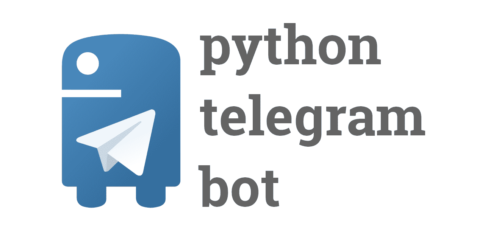
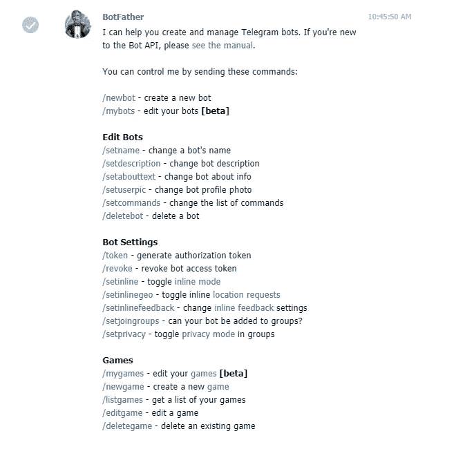
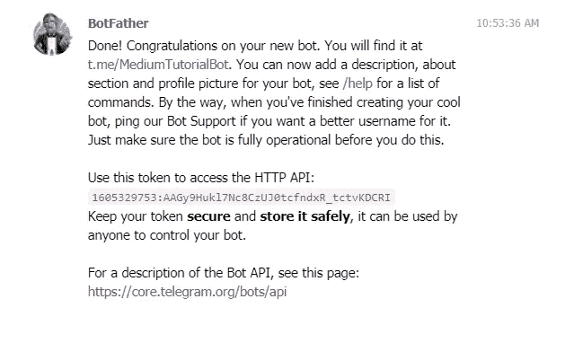

# 具有预定任务的 Python 电报机器人

> 原文：<https://medium.com/analytics-vidhya/python-telegram-bot-with-scheduled-tasks-932edd61c534?source=collection_archive---------0----------------------->



图片来源:[此处](https://github.com/python-telegram-bot/python-telegram-bot)

你好。在本教程中，我们将学习如何用 python 创建一个简单的 echo bot，其中包含一些预定的任务。我们开始吧！

# 依赖性和第一步:

以下是本教程中您应该拥有的所有依赖项的列表:

1.  计算机编程语言
2.  电报帐户
3.  python-telegram-bot 模块

可能，您已经有了前两个依赖项，所以让我们从模块的安装开始。打开终端并键入以下命令:

```
pip install python-telegram-bot
```

然后我们必须创建我们的机器人，并从 Telegram 获取令牌。打开电报，搜索“僵尸父亲”(“@僵尸父亲”)。选择经过验证的。键入 start 来查看所有可能的命令，机器人应该像这样响应您:



键入 ***/newbot*** 创建一个新的 bot。这将是 BotFather 接下来的回应。为您的机器人选择名称和唯一的用户名:


在这个案例中，我选择了**机器人和**机器人作为用户名

如果一切正常，BotFather 将向您发送如下图所示的带有令牌和凭据的响应。不要与任何人分享你的令牌，它就像 Django 中的 ***密钥*** 。教程结束后，我将删除该机器人，因此我将向您展示我的凭据:



如你所见，我们创建了我们的机器人，我们可以通过链接或在电报中搜索来找到它。现在，您可以向您的机器人添加个人资料图片、描述等。你可以随意做，但现在我们专注于编写我们的机器人。我们继续。

# 发展

打开任意编辑器，让我们开始吧！

首先，我们要从***python-telegram-bot***导入一些模块:

```
*from* telegram.ext *import* Updater, CommandHandler
*import* logging
```

***更新者*** 将获得我们的机器人发生的所有更新(消息等等)。我们使用 ***日志*** 来显示错误，使用 ***命令处理程序*** 来处理我们将要创建的所有命令。让我们创建我们的 ***更新器*** :

```
updater = Updater(token='1605329753:AAGy9Hukl7Nc8CzUJ0tcfndxR_tctvKDCRI', use_context=True)dispatcher = updater.dispatcherlogging.basicConfig(format='%(asctime)s - %(name)s - %(levelname)s - %(message)s', level=logging.INFO)
```

让我们为机器人编写第一个命令。显然，它会/ ***启动*** 命令。

```
# writting functionality of the command
def start(update, context):
    message = 'Welcome to the bot'
    context.bot.send_message(chat_id=update.effective_chat.id, text=message)# give a name to the command and add it to the dispaatcher
start_handler = CommandHandler('start', start)
dispatcher.add_handler(start_handler)updater.start_polling() // enable bot to get updates
```

现在运行脚本并检查电报中的命令。

如你所见，我们使用***update . effective _ chat . id***向特定用户发送消息。但是如果我们想给所有用户发送一条消息呢？不幸的是，这个 API 没有提供类似的功能，所以我们将所有用户存储在我们的数据库中。您可以使用任何数据库，我将使用远程 Redis 数据库。你也可以从 [Heroku](https://heroku.com) 获得免费的 Redis 数据库。

我假设您获得了 Redis 数据库的 URL。要使用它，我们必须在我们的机器上安装 Redis:

```
pip install redis
```

我们将如何储存它？最有效的方法是，当用户键入/ ***开始*** 命令时，存储用户的用户名和 id。首先，将这些行添加到脚本中:

```
*from* telegram.ext *import* Updater, CommandHandler
*import* logging
import redisr = redis.from_url('your_redis_db_url') # connection to the databse
db_keys = r.keys(pattern='*')   # allows us to fetch data
```

然后将**的*开始*的**函数重写为这样:

```
def start(update, context):
    user_id = update.message.from_user.id
    user_name = update.message.from_user.name
    r.set(user_name, user_id)message = 'Welcome to the bot'
    context.bot.send_message(chat_id=update.effective_chat.id, text=message)
```

你可以随时查看订户名单。创建新脚本 ***users.py:***

```
*import* redis
r = redis.from_url('your_redis_db_url')
db_keys = r.keys(pattern="*")
print((len(db_keys)))*for* single *in* db_keys: chat_id = r.get(single).decode("UTF-8")
    print(single.decode("UTF-8"), ": ", chat_id)
```

现在让我们编写一个 ***echo*** 函数，允许机器人向用户发送他/她发送给机器人的相同消息。导入过滤器和 MessageHandler 以处理来自 ***telegram.ext*** 的消息，并编写如下函数:

```
def echo(update, context):
    context.bot.send_message(chat_id=update.effective_chat.id, text=update.message.text)from telegram.ext import MessageHandler, Filters
echo_handler = MessageHandler(Filters.text & (~Filters.command), echo)
dispatcher.add_handler(echo_handler)
```

> 注意:这不是一个命令，您不能通过键入/ ***echo*** 来访问它。这是一个自动处理程序，它会在用户的文本消息后回复用户(借助于 ***过滤器。text***

# 计划的作业/任务:

为了使用调度任务，我们使用 ***job_queue*** 。它有 ***run_once*** ， ***run_daily*** 等几种方法。在这种情况下，我们将使用这两种方法。

首先，我们要在 ***更新器中添加***job _ queue****。**** *我们在这里也会用到****callback context****，所以从****telegram . ext***中导入它

```
j = updater.job_queue
```

从方法的名字来看， ***run_once*** 只运行命令一次。我们决定的时间和命令将由 ***run_once*** 自动运行。

让我们编写只执行一次的函数:

```
def once(context: CallbackContext): message = "Hello, this message will be sent only once"

    # send message to all users
    *for* keys *in* db_keys:
        id = r.get(keys).decode("UTF-8")
        context.bot.send_message(chat_id=id, text=message)
```

现在将该函数添加到 ***run_once*** 并给出时间:

```
*j.run_once(once, 30)*
```

***run_once*** 带两个属性，我们要执行的函数和时间。30 表示该功能将在部署 30 秒后执行

我们转到 **run_daily。**把早晨的函数写成这样:

```
def morning(context: CallbackContext): message = "Good Morning! Have a nice day!"

    # send message to all users
    *for* keys *in* db_keys:
        id = r.get(keys).decode("UTF-8")
        context.bot.send_message(chat_id=id, text=message)
```

现在将该功能添加到 ***run_daily*** 并进行配置:

```
job_daily = j.run_daily(daily_suggestion, days=(0, 1, 2, 3, 4, 5, 6), time=datetime.time(hour=10, minute=00, second=00))
```

***run_daily*** 带几个属性:我们要执行的函数、天数(应该是元组)、时间(导入 ***datetime*** )。该功能将在每天 10:00 执行，用户将收到一条“早安”消息。

# 最后:

1.  你可以从 python-telegram-bot 的官方博客上获得更多关于所有可能的命令和方法的详细信息。点击[这里](https://python-telegram-bot.readthedocs.io/en/stable/)
2.  你可以加入他们的电报群，找到你问题的答案。点击[这里](https://web.telegram.org/#/im?p=@pythontelegrambotgroup)
3.  如果你想部署这个脚本(比如在 Heroku 上)，你可以在[这里](https://thesaintraphael.medium.com/hosting-python-script-on-heroku-b5eb4dc28606)阅读我的文章。

> 如果你有问题，请写在下面。感谢阅读！