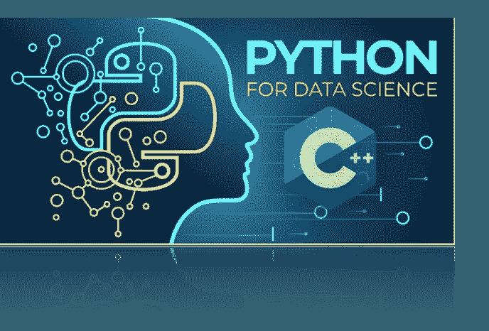

# Python 到 C++:数据科学家学习新语言的旅程——Hello World

> 原文：<https://medium.com/analytics-vidhya/python-to-c-a-data-scientists-journey-to-learning-a-new-language-hello-world-d0b718887041?source=collection_archive---------14----------------------->



**一个介绍**

作为一名有抱负的数据科学家，我通过学习编程语言 **Python** 开始进入计算机科学的伟大世界。这是一种高度用户友好的语言，有许多用于程序创建、数据收集、数据分析等的优秀库。从那以后，我选择通过钻研 C 编程的世界来扩展我的知识，特别是 **C++** 。在对编程语言做了一些研究后，我决定使用 C++，因为它在数据科学社区内外都有广泛的可用性。在这个新的系列中，我们将探索这两种伟大的编程语言之间的差异和共性，重点放在程序工程上。

在今天的简介期中，我们将探讨 Python 和 C++语言之间的一些基本差异，包括对这两种语言的简要描述、每种语言的有用领域，以及它们在数据科学中的作用。接下来，我们将创建一个非常受欢迎的入门程序，在这个程序中，我们将高兴地用两种编程语言向世界致意。

对两种语言的简要描述

Python，我们的入门语言，被认为是一种比计算机代码高几级的解释型高级编程语言。这意味着有很多软件在后台运行，允许更友好的使用和对不可避免的错误的更多原谅，并且不需要用户编译程序来运行它。这是一种非常适合初学者的编程语言，因为它允许用户更专注于计算机科学的基本概念，而不会用复杂的语言语法给程序员增加过多的负担。Python 的易用性和可访问性使它成为各种不同领域的程序员的热门选择，包括 web 开发人员、游戏开发人员、通用软件开发人员、数据科学家和数据分析师。这种语言易用性的一个主要缺点是它的总体运行速度较慢。虽然这在创建较小的产品时不会立即显现出来，但是较大的项目，如主要的神经网络模型，将会更多地受到这个运行时问题的影响。

C++，这种建立在 C 语言主干之上的语言，是一种编译过的高级编程语言，相对来说比 Python 更接近于计算机代码。后台没有那么多事情，创造出一种不那么用户友好、不那么宽容的语言。C++要求用户有更高的语言能力和更严格的语法。虽然这确实增加了这门语言的学习难度，但它的好处远远大于坏处。首先，作为一门建立在 C 语言基础上的语言，C 语言是最古老和使用最广泛的编程语言之一，它在计算机科学领域的重要性是不可低估的。作为一种编译语言，并且非常接近计算机代码，它的运行时允许它在更大的程序中表现出色，而这些程序只能在其他编程语言如 Python 中爬行。这使得该语言在诸如计算量更大的视频游戏、web 应用程序、桌面应用程序和性能关键型应用程序等应用程序中非常有用。

**数据科学世界中每种语言的应用**

Python 在更复杂的数学领域，尤其是统计学和数据科学中的重要性已经不是秘密了。Python 为分析程序提供了大量高质量的数学库。通过使用诸如**熊猫**、 **numpy** 、 **scikit-learn** 和 **scipy** 之类的库，机器学习的世界变得更加触手可及。由于这个原因以及它的易用性，Python 成为数据科学家的首选语言也就不足为奇了。这个领域的程序员可以更专注于数学、统计和分析方面，而不必担心在语法和程序工程上花费太多时间。如上所述，Python 也是一种解释语言，这意味着任何程序，无论大小，都可以立即运行，而无需编译以更快地分析数据、机器学习模型等。

C++虽然在数据科学领域的广泛应用并不广为人知，但仍然有它的用途。在数据探索和模型创建发生之后，上述模型通常被实现到程序中，用于新数据的预测目的。通常这不是问题；然而，当处理大量数据(如大数据)和高度复杂的预测模型(如深度人工神经网络)时，我们需要使用不同的语言来加快处理速度，这是 c++之类的完美工作。

**我们的第一次节目对比——向世界发出双语问候**

在本系列中，我将使用 Python 和 C++编程语言实现原始代码来创建简单的程序。我将逐行比较这些代码，并简要解释它们的不同之处。为了这个系列，我将在本地集成开发环境中编码，简称为 **IDE** 。我更喜欢使用 **VS 代码**，因为这是我学习的 IDE，也是我最熟悉的一个。由您来决定哪种 ide 最适合您。然后，所有完成的程序都使用我的终端的命令行运行(在 Mac 操作系统上)。不管你选择什么操作系统，下面的链接都可以用来下载 VS 代码:【https://code.visualstudio.com】T4。不管你选择什么操作系统，下面的链接都可以用来下载 Python 和它的许多最重要的库:[https://www.python.org](https://www.python.org)。最后，下面的链接将带您完成为 C++设置环境的过程，而不考虑您选择的操作系统:[https://www . geeksforgeeks . org/setting-C-development-environment/](https://www.geeksforgeeks.org/setting-c-development-environment/)。

我们的第一个程序，Python 中的一行代码，允许我们打印出短语“Hello World！”通过命令行:

```
print("Hello World!")
```

简单、干净且容易，后台运行的软件允许访问 Python 的“print()”方法，该方法获取传递的参数并将其打印给用户。要运行这个程序，我们首先将它保存在 VS 代码中，然后在命令行上确保我们位于正确的目录中，在本例中，我将目录命名为 **python。**我们使用以下命令行提示符来检查我们的当前目录:

```
$ pwd
```

我们会收到类似于以下输出的内容:

```
>> /Users/Daniel/Desktop/Medium-Posts/Python to C++ Series/Article 1/python
```

在这里，我们可以使用 python 3 运行我们创建的程序 helloworld.py，方法是在命令行中键入以下内容:

```
$ python3 helloworld.py
```

这将运行我们的程序，并向命令行输出以下内容:

```
>> Hello World!
```

正如我们所料，用 C++编写相同的程序时，事情并不简单。

```
#include <iostream>int main(){std::cout << “Hello World!\n”;
return 0;}
```

同样的程序，Python 里只有一行，C++里是五行。我们来分析一下。第一行用于调用标准输入和输出库，以便我们能够使用 C++的等价关键字来调用 Python 的 **print()** ， **std::cout** 。与 Python 不同，许多这些库并没有内置到语言软件中，而是必须使用 **#include** 语句从单独的文件中调用。这也是 C++能够比 Python 跑得更快的原因之一。

我们的 C++程序中的第二行代码在使用这种语言创建的每个程序中都是必需的。它是初始化函数，告诉编译器这是我们程序开始的地方，这个函数中的所有东西都需要检查和/或运行。在我们的一些较大的 python 程序中，我们确实包含了一个 **__init__** 函数，其工作方式类似，但正如我们所知，这并不是我们的许多 Python 程序运行所必需的。

第三行，一个开括号， **{** ，也是我们在 C++中创建函数时需要的。这告诉编译器这是函数的开始，必须检查/运行开括号之后的所有内容。这类似于 Python 中命名函数及其参数后的冒号符号。然而，与 Python 不同，C++还需要一个符号来表示函数的结束，或者一个右括号， **}。**我们在代码的第 6 行发现了这一点，这告诉编译器已经到达了函数的末尾，后面的任何内容都不应该在该函数的范围内检查/运行。

最后是 C++程序的第 4 和第 5 行，main()函数的主体。在这里，第 4 行向编译器指出函数应该做什么。 **std** 是上面提到的标准库，包括 cout、cin 等方法。我们将在以后的文章中详细讨论这些，只需知道包括库名后跟两个冒号，然后是对我们想要在该库中使用的方法的调用是很重要的。在本例中，我们使用的是 **std** 库和该库中的 **cout** 方法，它将把双左箭头 **< <** 后面的内容输出到终端。双左箭头告诉编译器接下来的内容需要打印出来。然后我们包括我们想要打印的内容，在这个例子中是我们的“Hello World！”字符串。像在 Python 中一样，使用“\n”告诉编译器，在打印完我们想要的内容后，我们想要创建一个新行。最后，在整个语句的末尾添加一个分号。与 Python 不同，C++要求在每条语句的末尾都有这些分号，以向编译器表明它已经到达了语句的末尾。它充当一种停止符号，以便编译器知道何时需要继续下一条语句。

这就把我们带到了程序中的第 5 行。每个主函数必须返回 0。这用于向编译器表明 main()函数已成功运行，没有任何错误。编译器的 0 表示运行成功，而 1 表示出错。同样，这个 return 语句以分号结束。

现在我们终于完成了程序的构建并准备运行。但是这里我们遇到了 Python 和 C++语言之间的另一个主要区别。如前所述，C++要求程序员在计算机运行程序之前将程序编译成计算机代码。为此，我们首先检查我们是否在正确的目录中，就像我们在 python 程序中所做的那样。在本例中，我将目录命名为 c++:

```
$ pwd>> /Users/Daniel/Desktop/Medium-Posts/Python to C++ Series/Article 1/c++
```

接下来，我们必须编译我们的程序。我们使用以下代码来实现这一点:

```
$ g++ -o helloworld helloworld.cpp
```

其中 g++表示我们正在调用 c++编译器，-o 表示我们正在为编译后的文件添加我们自己的标题，helloworld 是我们希望为编译后的文件添加的标题，helloworld.cpp 是包含我们希望编译的程序的文件。如果程序语法中的所有内容都是正确的，那么我们将不会得到任何输出，光标将简单地移动到命令行中的下一行，等待我们的下一个命令。从这里开始，我们的代码现在已经编译好了，最终可以运行了。我们可以通过在命令行中键入以下命令并看到类似的输出来检查这个新编译的文件是否已创建:

```
$ ls>> helloworld     helloworld.cpp
```

这表明我们的目录中现在有两个文件，helloworld 文件包含我们的编译程序，helloworld.cpp 包含我们的 C++编码程序。要运行我们的程序，在命令行中键入以下提示，我们会收到预期的输出:

```
$ ./helloworld>> Hello World!
```

感谢您关注这份介绍。在下一期文章中，我们将探索数据类型和变量，并比较两种语言中打印输出和接受用户输入的代码。在那之前，奇妙的读者，一如既往，重复它，快乐编码。

丹尼尔·本森

**来源**

[T3【https://en.wikipedia.org/wiki/C%2B%2B】T5](https://en.wikipedia.org/wiki/C%2B%2B)

[**https://en . Wikipedia . org/wiki/Python _(编程 _ 语言)**](https://en.wikipedia.org/wiki/Python_(programming_language))

[**https://www.cplusplus.com/info/**](https://www.cplusplus.com/info/)

[**https://www.python.org**](https://www.python.org)