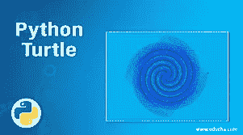
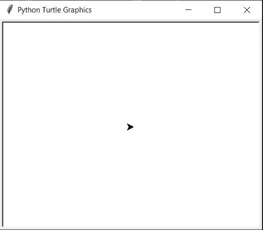
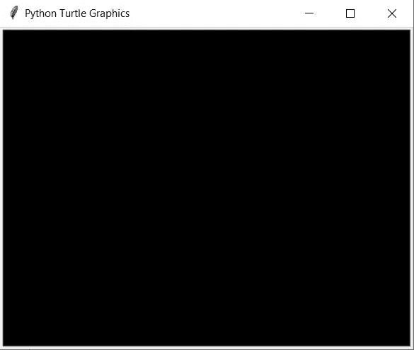
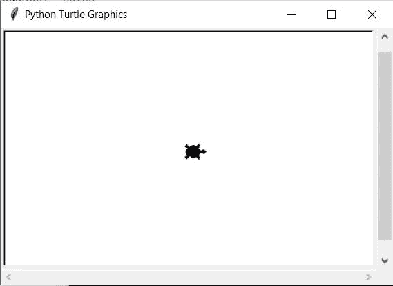
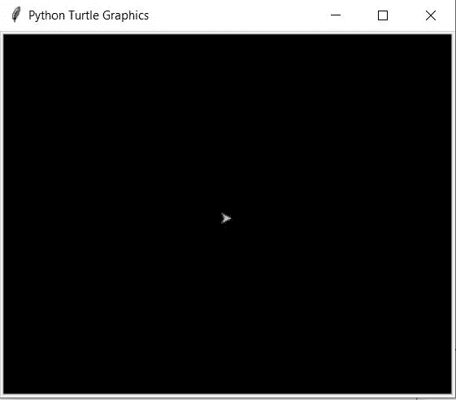
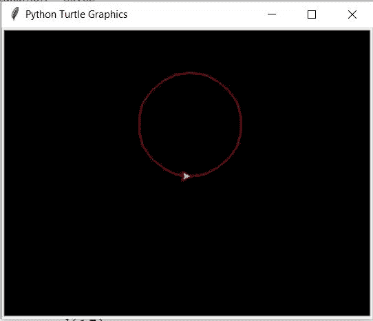
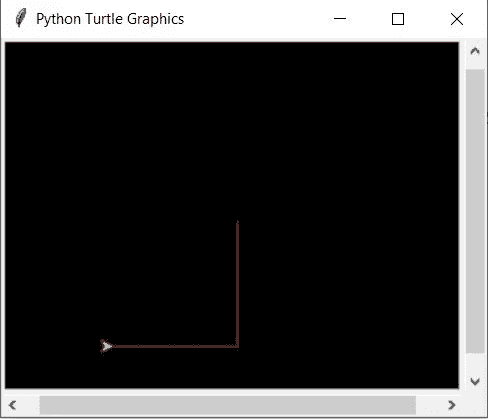
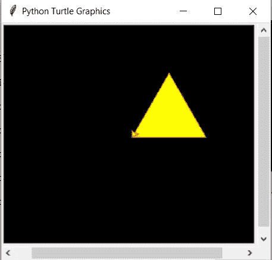

# 蟒蛇皮海龟图案

> 原文：<https://medium.com/analytics-vidhya/python-turtle-graphics-5ed7d97b13a9?source=collection_archive---------1----------------------->

# Python 中的龟库是什么？

[turtle](https://pypi.org/project/PythonTurtle/) 是一个预装的 Python 库，通过向用户提供虚拟画布，用户可以创建图片和形状。

turtle 模块以面向对象和面向过程的方式提供了 turtle 图形原语。因为它对底层图形使用了 [Tkinter](https://docs.python.org/3/library/tkinter.html#module-tkinter)

# 如何使用龟库制作图形？

1.  **安装并导入库:**
    *pip 安装 PythonTurtle* (安装命令)
    *导入 turtle* (导入在 project.py 文件顶部)
2.  **初始化变量，然后在整个程序中使用它来引用海龟:** c=turtle。Turtle()
    可以用任何变量代替“c”。
3.  **现在，要打开 turtle screen，你用下面的方式初始化一个变量:**
    *c . get screen()*
    你应该会看到一个单独的窗口打开

4.**你可以使用下面的命令改变窗口的颜色:**
*c.getscreen()。bgcolor("黑色")*

5.**改变屏幕标题:** *c.title(《我的海龟计划》)*

6.**改变龟形:** *c.shape("龟")
c.shape("箭")
c.shape("圆")*

7.**改变箭头所指乌龟的颜色:**
*c.color("颜色")*
例如
*c.color("红色"、"黄色")*

**改变速度:**
*c.speed(值)*
例如
*c.speed(15)*

8 .**绘制预设图形:** *c.circle(半径)*
例如
*c . circle(60)*
Tou 会得到圆
*c.dot(20)*
你会得到一个填充的点

9.**移动乌龟:**

乌龟可以向四个方向移动:

*   向前
*   向后的
*   左边的
*   对吧

示例:

c .右(90)

c .向前(100)

左转弯(90 度)

c .向后(100)

您也可以使用这些命令的缩写版本:

*   **c.rt()** 代替 c.right()
*   **c.fd()** 代替 c.forward()
*   **c.lt()** 代替 c.left()
*   **c.bk()** 代替 c.backward()

10.**填充图像:**

c . begin _ fill()
c . FD(100)
c . lt(120)
c . FD(100)
c . lt(120)
c . FD(100)
c . end _ fill()

> **蟒龟项目:**

[源代码](https://github.com/dikshitakambri/Graphics-using-Python)
[输出](https://youtu.be/pKWxTLXkOXI)