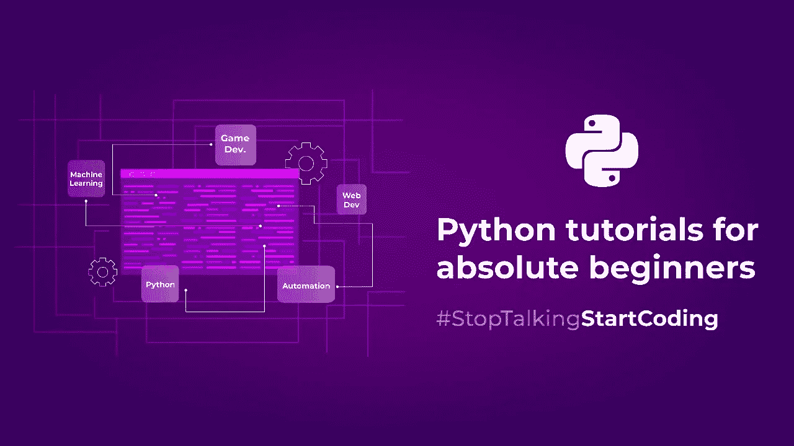
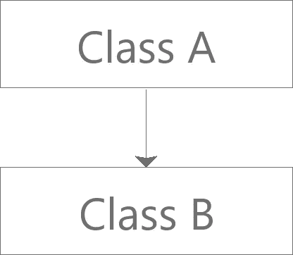
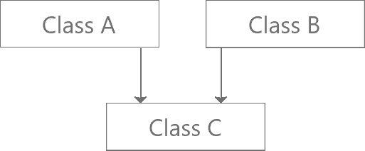
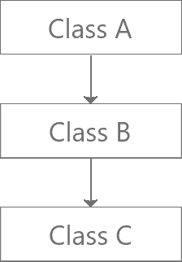
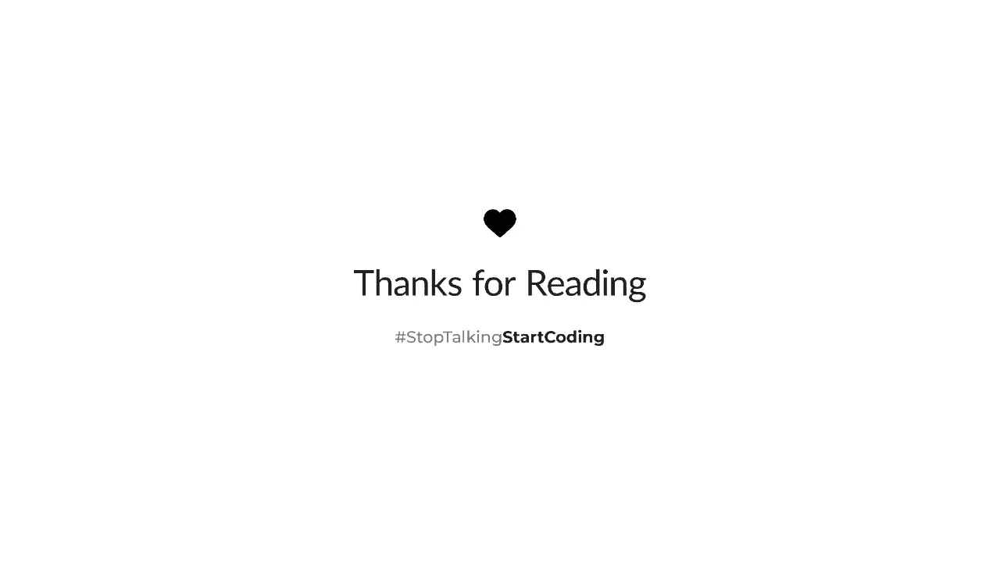

# 面向绝对初学者的 Python 教程:第 2 部分

> 原文：<https://medium.com/analytics-vidhya/python-tutorials-for-absolute-beginners-part-2-934b9dccb29b?source=collection_archive---------15----------------------->

在我们之前的博客中，我们学习了一些令人惊叹的 python 基本概念，比如变量、循环、条件语句和函数。[[https://medium . com/analytics-vid hya/python-tutorials-for-absolute-初学者-part-1-fabc7dd0ecc9](/analytics-vidhya/python-tutorials-for-absolute-beginners-part-1-fabc7dd0ecc9) ]

在这篇博客中，我们将探讨 OOP 的一些重要概念和 python 的一些高级概念。

我们走吧。

# **OOP**

OOP 代表面向对象编程；它侧重于从包含数据和函数的类中创建对象。所以，这里的问题是我们为什么需要它？我们如何实现 oops 的概念？

哎呀的优点:

*   可重用性
*   代码维护
*   更高的生产率
*   多态性灵活性

**班级:**

类是用户定义的数据类型或创建对象的蓝图。为了在 python 中创建一个类，我们使用 class 关键字，后跟类名。

**对象:**

对象只不过是类的一个实例。

示例:

**构造函数:**

构造函数用于在创建类的对象时初始化类的数据成员的值。创建对象时调用构造函数。为了在 python 中创建构造函数，我们使用 __init__()方法。

有两种类型的构造函数:

默认构造函数:除了一个参数(self:一个引用实例的参数)之外没有其他参数的构造函数称为默认构造函数。

示例:

参数化构造函数:带有参数的构造函数称为参数化构造函数。参数化构造函数将第一个参数作为实例(self)的引用，其余参数由程序员提供。

示例:

**继承:**

继承是从一个类到另一个类访问/继承属性(数据成员和方法)的能力。

其成员被继承的类称为*父类* 或*基类*。

继承了成员的类称为*子类*或*派生类*。

继承的类型:

单一继承:

单一遗传

示例:

多重继承:

多重遗传

示例:

多级继承:

多级遗传

示例:

# **让我们看看如何在 Python 中读写文本文件**

示例:

# **λ:**

Lambda 是 python 中的匿名函数。在 Python 中，普通函数是使用 def 关键字定义的，而匿名函数是使用 lambda 关键字定义的。

Lambda 函数可以有任意数量的参数，但只能有一个表达式。

这是什么意思？

让我们看看语法，lambda args: expressions

让我们看看一些好的 lambda 示例

# **迭代器:**

迭代器是一个可以遍历所有值的对象。如果我们可以从一个对象中得到一个迭代器，那么这个对象就叫做**可迭代的**。迭代器方法实现了两种方法:

*   iter()
*   下一个()

示例:

# **用 Python 处理异常:**

异常只不过是错误…每当出现异常，python 解释器就会停止进程，程序就会崩溃。

异常处理是一种强大的机制，它可以处理运行时错误，从而维护程序的流程。

在 python 中，可以引发异常的代码放在 try 块中，可以处理异常的代码放在 except 块下。一旦异常被捕获，我们可以选择我们想要执行的任何操作。

示例:

这段代码将给出一个错误，指出 ZeroDivisionError:被零除

为了处理这个异常，我们将在这里使用 ***try*** 和 ***除了***

示例:

# **总结:**

在这篇博客中，我们讨论了 OOP 的一些重要概念，比如类、对象、构造函数和继承。我们还学习了用 python、Lambda、迭代器和异常处理来读/写文件，

仅仅阅读这篇文章和这些例子不会让你成为一个好的开发人员…你真的需要努力工作，弄脏你的手，所以开始练习…开始编码。

页（page 的缩写）s:如果您还没有阅读第 1 部分，我强烈建议您点击下面的链接来阅读。

 [## 面向绝对初学者的 Python 教程:第 1 部分

### #StopTalkingStartCoding

medium.com](/analytics-vidhya/python-tutorials-for-absolute-beginners-part-1-fabc7dd0ecc9) 