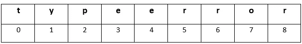

# PYTHON 类型错误:字符串索引必须是整数-解决方案

> 原文：<https://medium.com/analytics-vidhya/python-type-error-string-indices-must-be-integers-solution-dc53df846b0f?source=collection_archive---------3----------------------->


一个人可以通过在拨号盘上输入名字来呼叫另一个人吗？不要！在密码字段中键入密码以登录？(虽然有时候可能会管用)。还是用自己宝贵的时间和精力去报复一个没用的人？所有提到的解决问题的方法都是徒劳的，而且有点愚蠢。但我们还是做了。没什么好担心的每个任务都需要一点耐心和常识。我们在文中将要讨论的问题也是如此。

## **剧情简介:**

首先让我们了解一下什么是 iterable 对象:iterable 是一个对象，它一次返回它的一个成员，允许它在 for-loop 中迭代。在 Python 中，使用数字(即整数)将可迭代对象编入索引或放置在数据结构(如字符串或字典)中。当使用字符串值(输入的不正确的*类型*)提取索引处的值时，会产生如下错误:

**类型错误:字符串索引必须是整数。**'

下面的文章将解释错误是否在何时以及如何发生，以及如何通过不同的场景理解某些数据结构的结构来解决错误。每个问题实例都会被深入理解，意义会被解释，最终会被解决。

## **问题:**

当一个人开始编码或者是一个初学者时，这是一个程序员必须经历的最烦人的事情。似乎世界已经走到了尽头，人们可能永远也不会掌握编码的艺术。一个人几乎处于放弃的边缘，但一个人不应该忘记世界上最好的程序员在开始时是天真的，他们从某个地方开始，经历了所有的错误和技术问题，成为游戏的顶端。你也是。一个人不能这么快放弃。让我们净化空气，做好准备！

首先，为了解决问题，我们必须了解问题的结构。这里，我们的问题肯定会出现，因为我们通过数据结构传递的参数不兼容。让我们通过几个例子来理解错误是如何以及何时产生的。

**场景 1:**

假设我们有一个如下所示的字符串。因为 Python 是动态类型语言，即在运行时检查变量的类型，所以我们不需要在使用变量之前提到像 int、str 或 char 这样的关键字。我们尝试索引字符串的一部分，这是一种通过位置引用 iterable (string)中的单个项目的方法。在 Python 中，对象是零索引的，即位置计数从零开始。现在我们要从字符串中访问字母“e ”,可以遵循给定的方法:

```
In [**1**]: string="typeerror"
In [**2**]: string['e']
Traceback (most recent call last):File "<ipython-input-8-1b9006e9beb0>", line 1, in <module>
string['e']TypeError: string indices must be integers
```

这个错误是不言自明的，但是让我们看看这个消息想要表达什么。Python 是一种解释型语言，这意味着只要存在语法错误，它就会停止编译程序，除非问题得到解决，否则不会运行。现在可能会让我们困惑，错误在第二行，但它说的是第一行。在我使用的 Python 发行版 Anaconda 的 Spyder 环境中，第一行被称为 0 行。因此，在第 1 行，它显示类型错误，这表示所提供的索引值是另一种类型。我们试图使用*字符串索引*而不是*整数索引*从字符串中提取一个值。查看下面的信息图，了解字符串的确切含义以及 iterable 中的项目是如何索引的:



**场景二:**

另一种从字符串中提取部分文本的方法是通过切片。切片是一种获取 iterable (list)的元素子集(即基于索引值的小列表)的技术。它在优化、错误分析、调试、流量控制等任务中有突出的应用。让我们看一个例子:

```
In [**3**]: mystring="gratitude"
In [**4**]: mystring[0,5]
Traceback (most recent call last):File "<ipython-input-13-7c2881597196>", line 1, in <module>
mystring[0,5]TypeError: string indices must be integers
```

怎么会这样尽管我们使用了整数索引来分割 iterable，但它显示了相同的兼容性问题错误，老实说，这不是对我们所犯错误的正确解释。我们需要挖掘得更深一点，因此我们将在另一个字符串对象中保存整数索引，然后查找相同的类型。

```
In [**5**]: extract=0,5
In [**6**]: type(extract)
Out[**6**]: tuple
```

因为它是 Python 中内置数据类型之一的元组，而不是 List、Set 和 Dictionary，所以它没有显示我们期望的输出。字符串中的逗号被自动计算为元组，使错误具有误导性。因此，错误应该是这样的:

```
In [**7**]: mystring[extract]
Traceback (most recent call last):File "<ipython-input-16-308e1ed6160d>", line 1, in <module>mystring[extract]TypeError: string indices must be integers(not tuple)
```

要了解更多关于 Python 的数据类型，请访问以下链接: [Python 数据类型](https://realpython.com/python-data-types)。

**情景三:**

下一个数据结构是字典，它比列表稍微复杂一些。因此，我们必须知道它的结构是怎样的:

**字典={**

**key1 : value1，**

**键 2:值 2，**

**。**

**。**

**keyN : valueN，**

**}**

键可以是任何实体，如姓名、地址、性别和电话，而值是属性，如 Max 代表姓名。一个键甚至可以有多个值，用逗号和双引号或单引号隔开。

让我们创建一个名为“phone_book”的字典，其中包含关键字“Name”、“Mobile”和“Address”。但是，为了更好地理解，我们将使用一个更简单的字典。

```
In [**8**]: phone_book={"Name": "Jennifer Aniston",
"Phone": “1800”,
"Address": "Apt20”}
```

为了遍历字典中的所有值并打印出来，我们将使用下面的代码片段，其中 k 代表字典中的所有键:

```
In [**9**]: for   k in phone_book:...: print("Name:" + k["Name"])
...: print("Phone:"   + k["Phone"])
...: print("Address:"   + k["Address"])Traceback (most recent call last):File "<ipython-input-20-e5c1b8f425c3>", line 2, in <module>
print("Name:"   + k["Name"])TypeError: string indices must be integers
```

唉！出现该错误是因为我们试图使用字符串索引而不是整数索引来访问值。然而，这并不是全部，我们将在解决方案部分进一步阐述。

## **解决方案:**

**场景 1:**

因为我们使用了字符串索引，所以我们得到了类型错误，因为值存储在字符串和字典中从 0 开始的地址。现在我们将尝试使用整数来索引字符串，因为这是提取信息的正确方法。

```
In [**10**]: string[0]
Out[**10**]: 't'
```

瞧啊。它展示了我们正在寻找的东西。通过传递 0–8 之间的值，尝试提取 iterable 不同位置的项目。想知道为什么和如何？正如我们在上面的信息图中看到的，它有九个字母，编号从零开始，最后一个是八。但是，如果字符串更长，我们没有太多的时间来计算每个字母和空格(是的，空格是重要的)，我们可以做以下事情来获得字符串的大小:

```
In [**11**]: string1 = “Hi there”
In [**12**]: len(string1)
Out[**12**]: 7
```

**场景二:**

因为我们使用逗号分割字符串，所以当 Python 计算逗号时，我们得到了类型错误，因此我们用冒号“:”替换它。遵循以下代码:

```
In [**13**]: mystring[0:5]
Out[**13**]: 'grati'
```

**场景三:**

在 dictionary 中，我们尝试使用“k”并向其传递键来访问值，但问题是在 for 循环中，如下所述:

k 是一个键，

关键字是字典“phone_book”中的“Name ”,并且

我们将“Name”传递给“Name”来获取值。

我们不能使用字符串访问其他字符串。困惑对吗？这就像用锁开锁一样。下面的代码会让它更清楚。

```
In [**14**]: for k in phone_book:
...: print(k)
...:
Name
Phone
Address
```

在这里，我们试图通过传递键名本身来访问键值(dict[key:value])，但方法是通过传递对象(如 string)中项目的索引或位置，对于 dictionary，要提到字典的名称来检索它们。因此，这个问题的解决方案是，我们必须使用字典名而不是“k ”,因为字典键可以是字符串。因此，请遵循以下方法:

```
In [**15**]: phone_book={
...: "Name": "Jennifer Aniston",
...: "Phone": "1800",
...: "Address": "Apt20",
...: }In [**16**]: print("Name:" + phone_book["Name"])
...: print("Phone:" + phone_book["Phone"])
...: print("Address:" + phone_book["Address"])Name:Jennifer Aniston
Phone:1800
Address:Apt20
```

我们的代码运行成功！自从我们诊断出问题的原因后，解决问题就变得更加清晰和容易了。为搜索 iterable(字符串、字典)中的可用内容而传递的错误参数引发了该错误。随后，我们做了相应的更改，因此，能够获得预期的输出，即字符串中提到的位置处的项目/字母表，以及带有键及其值的字典的详细信息。

## **结论:**

吸取的教训是:

字符串索引必须是整数(string[0])，并且

切片是通过冒号“:”(string[0:1])而不是逗号“，”完成的，因为 Python 认为它是一个元组。

此外，必须只使用字典名而不是字典中的键来访问字典项。这就对了。现在你可以解决这个错误，像专业人士一样工作！

# 关注更多！