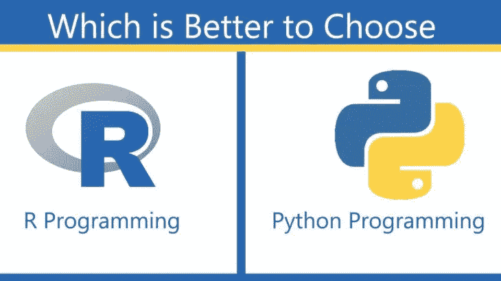

# 数据科学项目的 Python vs R

> 原文：<https://medium.com/analytics-vidhya/python-vs-r-for-data-science-projects-7a56a26c2e4b?source=collection_archive---------1----------------------->

*这些语言之间的一个主要区别在于它们对待数据科学的方法。r 用于统计分析，而 Python 提供了一种通用方法。*

对于越来越多的人来说，数据科学是工作的核心部分。对分析驱动的决策、强大的计算和提高的业务数据可用性的重视使其成为数据科学的全盛时期。根据 IBM 最近的一份报告，2015 年美国有 235 万个数据分析职位空缺。进一步估计，到 2022 年，这一数字将激增至 500 万。

用于数据科学工作的最流行的编程工具是 R 和 Python。很难从两种惊人灵活的数据分析语言中选择一种。两者都是开源和免费的，都是在 20 世纪 90 年代早期开发的- **数据科学的 Python**用作通用编程语言，数据科学的**R**用于统计分析。对于任何对处理大数据集、机器学习或开发复杂的**数据可视化**感兴趣的人来说，它们非常有用。

# Python 和 R 历史的简要回顾

# 计算机编程语言

Python 于 1989 年发布，强调效率和可读性。它是一种面向对象的编程语言，即收集数据并将其编码为可以修改和相互交互的对象。Scala、C++、Java 是其他编程语言的例子。这种复杂的编程语言允许开发人员和数据科学家以代码可读性、模块化和更好的稳定性来执行任务。在这种多样化的语言中，数据科学只占很小的一部分。

# 稀有

r 开发于 1992 年，多年来一直受到大多数**数据科学专业人士**的青睐。它是一种过程语言，通过将编程任务分解成一系列子程序、过程和步骤来工作。当涉及到构建数据模型时，这是有益的，因为它使得理解如何执行复杂的操作变得容易；然而，这通常会牺牲代码的可读性和性能。然而，缺乏关键特性和较慢的性能，如 web 框架和单元测试，是数据科学专业人员更愿意去别处寻找的常见原因。

# 数据科学过程

让我们更深入地了解这两种语言在数据管道中的使用情况，包括:

1.数据收集

2.数据探索

3.数据建模

4.数据可视化

# 1.数据收集

# 计算机编程语言

这种语言支持各种不同的格式，被认为是数据科学 的 [**最佳编程语言。人们可以使用逗号分隔值文档(CSV ),也可以使用 web 上的 JSON 源代码。SQL 表可以直接导入代码。**数据科学专业人士**使用 Python 可以创建数据集。这种编程语言提供的库允许数据科学家在一行代码中从不同的网站获取数据。**](https://www.dasca.org/world-of-big-data/article/top-6-programming-languages-for-data-science-in-2021)

# 稀有

这种编程语言允许将数据从 CSV、Excel 和文本文件导入 R。内置 SPSS 格式或 Minitab 的文件也可以转换为 R 数据框。然而，R 并不像 Python 那样能够从 web 上抓取信息。

# 2.数据探索

# 计算机编程语言

为了从数据中获得洞察力，数据科学家使用 Pandas，这是 Python 的数据分析库。它可以容纳大量数据，没有 Excel 带来的任何延迟。个人需要**数据科学技能**在整个项目中多次定义和重新定义熊猫数据框架

# 稀有

**用于数据科学的 R**用于对大型数据集进行数值和统计分析，因此毫不奇怪**数据科学专业人员**在使用 R 探索数据时有许多选择。除了机器学习、随机数生成、信号处理和统计处理，人们将不得不依赖第三方库来完成更繁重的工作。

# 3.数据建模

# 计算机编程语言

这些编程语言有用于数据建模的标准库，包括用于数值建模分析的 Numpy 和用于科学计算的 SciPy。

# 稀有

对于 R 中特定的建模评估，数据科学家有时不得不依赖 R 核心功能之外的包。但是有一些被称为 Tidyverse 的特定包，它使得可视化、操作和报告数据变得容易。

# 4.数据可视化

# 计算机编程语言

这个领域不是 Python 的强项，但是，Matplotib 库可以用来生成图表和图形。此外，seaborn 库允许人们用 Python 绘制更多信息和更有吸引力的图形。

# 稀有

r 是为了演示统计分析结果而构建的，其基本图形模型允许用户轻松创建基本的图形和图表。

# 结论

Python 是一种功能强大的通用语言，程序员可以用它来完成数据和计算机科学中的各种任务。另一方面，r 编程语言是为数据科学社区中流行的数据评估而设计的。如果用户想在数据科学领域走得更远，理解 R 是很重要的。学习这两种编程语言只会提高用户作为数据科学家的能力。