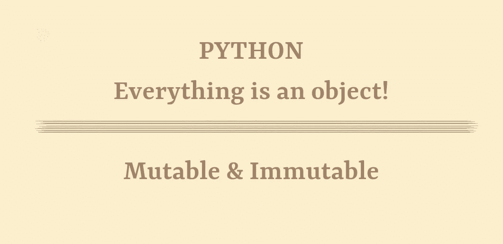
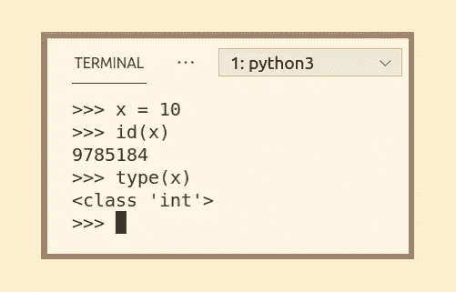
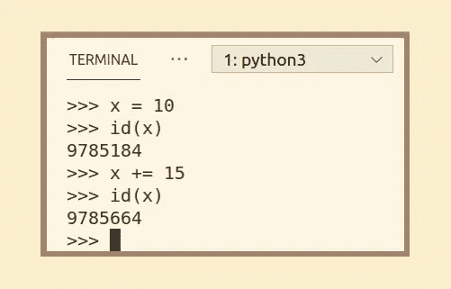
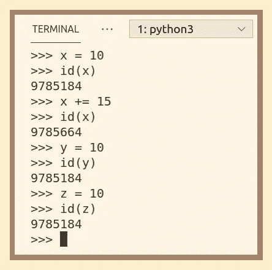
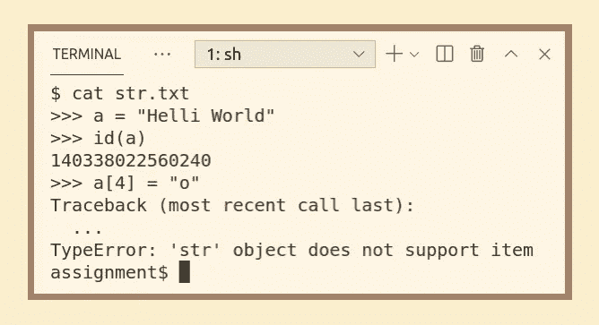
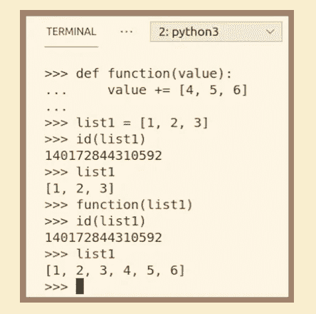
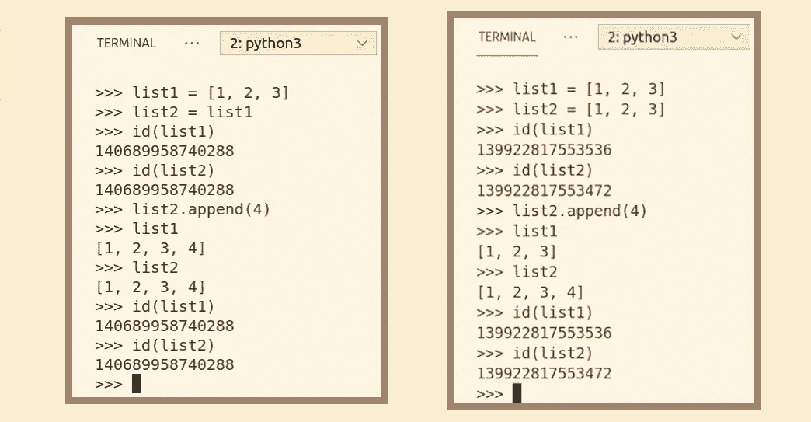
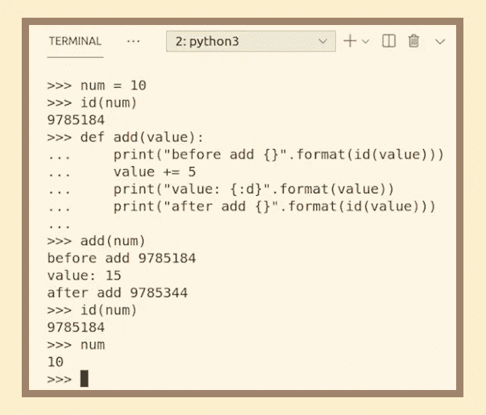

# Python3:可变的，不可变的…一切都是对象！

> 原文：<https://medium.com/analytics-vidhya/python3-mutable-immutable-everything-is-an-object-31ee65736ad6?source=collection_archive---------27----------------------->

你肯定已经看到在 Python 中一切都是对象，你在这里是为了更好地理解这些对象在这种语言中的行为。你必须知道什么是可变的和不可变的对象，以及它们是如何工作的，这样你在执行你的程序时就不会有任何意外。

首先，让我们弄清楚变量包含类(对象)的实例，当一个对象被初始化时，它接收一个唯一的 Id。此 ID 一旦分配就不能更改，但某些对象的状态可以修改。这意味着可变对象可以在创建后保留其 Id 进行修改，而不可变对象则不能，在想要修改的情况下，要做的是重新分配包含该对象的变量的值。

为了更清楚地理解这一点，不至于迷路，我们将看到两个函数，id()和 type()，它们将帮助我们确认我们在哪里。

**Id() &类型()**

Id()和 type()是内置的 python 函数。Id()返回对象的标识号，以保证它在同时存在的对象中是唯一的。这个数字是十进制格式的。Type()返回对象的类型。在 python3 中，它不再被称为类型，而是被称为类。

**不可变对象**

不可变对象是那些不改变 id 就不能被修改的对象，这意味着通过改变包含不可变对象的变量的值，我们正在重新分配一个新值。不可变对象是 int、str、float、bool、Unicode 和 tuple。

我们会看到一些例子，关于整数。如果我们给一个值添加一些东西，原始对象不会被修改，但是变量现在保存了最终值的 id。

如果我们给另一个变量赋一个 X 开始时的值，它就会有原来的地址。这里我想澄清一下，python 缓存了从-5 到 256 赋值的所有数字；这就是为什么 Y 会有 X 的第一个地址，如果我们把相同的值赋给 Z，这意味着两个变量指向同一个对象。

同样的事情也发生在字符串上，我们可以尝试修改字符串中的一个字符，但是会抛出一个错误；然后要修改它们，我们要做的是重新分配变量，使它指向一个新的字符串。

另一方面，元组是不可变的，但它们可以包含不可变和可变的对象，这意味着如果您有一个整数元组和一个列表，您可以在列表中进行内部更改。

**可变对象**

可变对象是那些可以被修改但仍然保留其 id 的对象。对于可变对象，我们有列表、字节数组、集合和字典。

让我们看一个列表的例子，在这里我们将添加更多的值；您可以看到 id 得到了保留:

不使用"+ = "或" append()"方法，而是使用" = "方法，你将重新分配一个具有各自 ID 的新对象。

**为什么这很重要，Python 对待可变和不可变对象的方式有多不同**

记住这一点很重要，以免混淆行为并产生意外的结果，因为在 C、Java 和其他语言中，原始变量的副本是在函数中处理的。如果有一个变量引用一个可变对象，然后将第一个变量的值赋给一个新变量，它们将被同等地修改。但是如果你用相同的可变对象创建两个变量，这并不意味着它们引用同一个对象，所以它们将被分别修改。与我们在整数例子中看到的非常不同。

**参数如何传递给函数，这对可变和不可变对象意味着什么**

在 python 中，所有的变量都作为对函数的引用来传递，也就是说，在函数内部，它将具有相同的 id。作为参数传递给函数的对象的行为取决于它是可变的还是不可变的。在对该参数执行改变其值的操作时，可变变量修改了超出函数范围的变量的原始值。

我再举一个同样的例子，我们通过打印函数前后的 id 来修改函数的列表，函数保持不变，但是列表被修改了。

另一方面，不可变的也接收相同的引用，但是当操作它的值时，分配新 id 的行为将与重新分配相同。

*原载于*[*https://www.linkedin.com*](https://www.linkedin.com/pulse/python3-mutable-immutable-everything-object-hern%25C3%25A1ndez-morales)*。*