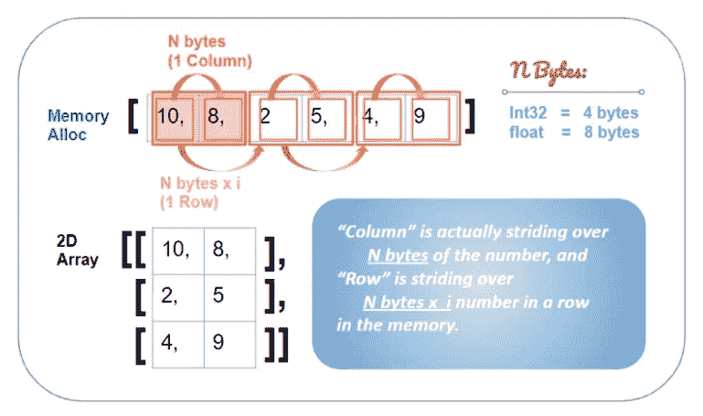

# [Pytorch]连续与非连续张量/视图—了解视图()、整形()、转置()

> 原文：<https://medium.com/analytics-vidhya/pytorch-contiguous-vs-non-contiguous-tensor-view-understanding-view-reshape-73e10cdfa0dd?source=collection_archive---------2----------------------->


# 张量和视图

***视图使用来自原始张量的相同数据块，只是“查看”其维度的方式不同。***

在我们深入讨论邻接和非邻接意味着什么之前，我们需要先了解 Pytorch 中的 ***张量*** 和 ***视图*** 之间的关系。

***视图*** 无非是 ***解释*** 原张量的维度 ***而不在内存中制作物理副本*** 的一种替代方式。比如我们可以有一个 1x12 的张量，即[1，2，3，4，5，6，7，8，9，10，11，12]然后用`.view(4,3)`把张量的形状改成 4x3 的结构。

```
x = torch.arange(1,13)
print(x)
>> tensor([ 1,  2,  3,  4,  5,  6,  7,  8,  9, 10, 11, 12])x = torch.arange(1,13)
y = x.view(4,3)
print(y)
>>
tensor([[ 1,  2,  3],
        [ 4,  5,  6],
        [ 7,  8,  9],
        [10, 11, 12]])
```

如果你改变原始张量`x`中的数据，它也会反映在视图张量`y`中，因为视图张量`y`不是创建原始张量`x`的另一个副本，而是从与原始张量`x`相同的内存地址读取数据。反之亦然，视图张量中的值的改变将同时改变原始张量中的值，因为 ***视图张量和它的原始张量共享同一块存储块*** 。

```
x = torch.arange(1,13)
y = x.view(4,3)
x[0] = **100**
print(y)
>> 
tensor([[**100**,   2,   3],
        [  4,   5,   6],
        [  7,   8,   9],
        [ 10,  11,  12]])x = torch.arange(1,13)
y = x.view(4,3)
y[-1,-1] = **1000**
print(x)
>> tensor([   1,    2,    3,    4,    5,    6,    7,    8,    9,   10,   11, **1000**])
```

# 可以以连续的方式用不同的维度来查看数据序列

***张量数据被存储为 1D 数据序列。
技术上来说*** *，。view()是一个指令，告诉机器如何* ***跨越 1D 数据序列*** *并提供给定维度的张量视图。*

***直觉上*** *，你可以想象一下。view()函数定义了新的尺寸，比如说* ***(2，2，3)，作为空模板框*** *，如下图所示。然后，* ***的数据从*** *的 1D 数据序列开始消耗，并从最里面的点一个一个地填充到这些盒子里，直到盒子满了，才移动到下一个维度(盒子)。这遵循了一个***的连续顺序。**

****

*因此，只要盒子的总数与 1D 数组中的元素数相匹配，例如 2x2x3 = 6x2 = 12，就可以在视图()中任意组合维度。您也可以拥有(3，2，2)或(4，3)，只要元素总数相加。*

# *大步*

*如果你不熟悉计算机如何在内存中大步前进(1D 序列)以形成 N-D 维张量，我鼓励你花 5 分钟阅读下面文章中的一节:*

*【读取】 ***一个 Numpy 2D 数组的数据结构*** 在此 [***后***](/analytics-vidhya/a-thorough-understanding-of-numpy-strides-and-its-application-in-data-processing-e40eab1c82fe) ***。****

**

*numpy***strides()***returns(***N*****字节**到下一行，****M*****字节**
py torch***stride()***returns(***N*****元素****

****让我们来看看 2D 阵列的步幅****

```
**# x is a contiguous data. Recall that view() doesn't change data arrangement in the original 1D tensor, i.e. the sequence from 1 to 12.x = torch.arange(1,13).view(6,2)
x
>>
**tensor([[ 1,  2],
        [ 3,  4],
        [ 5,  6],
        [ 7,  8],
        [ 9, 10],
        [11, 12]])**# Check stride
x.stride()
>> **(2, 1)****
```

****strides (2，1)** 告诉我们:我们需要跨越 **1** (最后一个维度，即维度 0)的数字到达沿 0 轴的下一个数字，我们需要跨越 **2** (维度 1)的数字行进到沿 1 轴的下一个数字。**

****

****3D 阵列的步幅如何****

```
**y = torch.arange(0,11).view(2,2,3)
y
>>
**tensor([[[ 0,  1,  2],
         [ 3,  4,  5]],

        [[ 6,  7,  8],
         [ 9, 10, 11]]])**# Check stride
y.stride()
>> **(6, 3, 1)****
```

**由步幅(6，3，1)表示，我们可以从每个位置开始观察*， *(i+1)* 引导你沿 0 轴移动， *(i+3)* 沿 1 轴移动， *(i+6)沿 2 轴移动。****公式检索(A，B，C)*** 在 1D 张量中的位置是通过: **A * 6 + B * 3 + C * 1** 完成的***

**例如，在上面的张量中，我们特意选择了一个从 1 到 12 的数字序列，因为我们可以用它来表示它们在 1D 数组中的位置。**

*   **索引 **(0，0，0)**
    1D 位置:0 * 6 + 0 * 3 + 0 * 1 = 0**
*   **索引 **(1，0，0)**
    在 1D 的位置:1* 6 + 0 * 3 + 0 * 1 = 6**
*   **索引 **(0，1，0)**
    在 1D 的位置:0 * 6 + 1* 3 + 0 * 1 = 3**
*   **索引 **(0，0，1)**
    在 1D 的位置:0 * 6 + 0* 3 + 1* 1 = 1**
*   **索引 **(1，1，1)** 1D 位置:1* 6 + 1* 3 + 1* 1 = 10**

**好了，现在我们完成了 ***连续*** 视图的介绍，也学习了 Pytorch 中的 ***步长*** 如何在 N 维张量中工作。现在我们来看看非连续数据是什么样的。**

# ****非连续数据结构:Transpose( )****

*****首先，Transpose(axis1，axis2)简单来说就是“交换 axis1 和 axis2 跨越的方式。*****

****

```
**# Initiate a contiguous tensor
x = torch.arange(0,12).view(2,2,3)
**x**
>>
**tensor([[[ 0,  1,  2],
         [ 3,  4,  5]],

        [[ 6,  7,  8],
         [ 9, 10, 11]]])**x.stride()
**>> (6,**3,**1)**# Now let's transpose axis 0 and 1, and see how the strides swap
y = **x.transpose(0,2)**
**y**
>>
**tensor([[[ 0,  6],
         [ 3,  9]],

        [[ 1,  7],
         [ 4, 10]],

        [[ 2,  8],
         [ 5, 11]]])**y.stride()
**>> (1,**3,**6)****
```

**好的， **y** 是一个 ***x.transpose(0，2)*** ，它交换了 x 张量在 0 轴和 2 轴的步幅，因此得到的 **y** 的步幅是( **1，3，6** )。这意味着我们需要跳转 **6 个**数字来获取 0 轴的下一个数字，跳转 **3 个**数字来获取 1 轴的下一个数字，跳转 **1** 来获取 2 轴的下一个数字。(大步走公式: **A * 1+ B * 3+ C * 6)****

**转置的不同方面是:现在数据序列是 ***不再遵循连续的顺序*** 。它不会从最里面的维度开始逐个填充顺序数据，填充完后会跳到下一个维度。现在它在最里面的维度跳了 6 个数，所以不是连续的。**

****转置( )具有非连续的数据结构，但仍然是视图而不是副本****

**transpose()仍然返回一个视图，但不是原始张量的副本。因此，它是非连续的“视图”。它改变了原始数据的步长，对原始张量的任何数据修改都会影响视图，反之亦然。**

```
**# Change the value in a transpose tensor y
x = torch.arange(0,12).view(2,6)
y = x.transpose(0,1)
y[0,0] = 100
y
>>
tensor([[**100**,   2,   4,   6,   8,  10],
        [  1,   3,   5,   7,   9,  11]])# Check the original tensor x
x
>>
tensor([[**100**,   1],
        [  2,   3],
        [  4,   5],
        [  6,   7],
        [  8,   9],
        [ 10,  11]])**
```

**使存储在张量中的 1D 数据序列达到峰值的另一种方式是通过方法`.storage()`**

```
**y.storage()
>>
 100
 1
 2
 3
 4
 5
 6
 7
 8
 9
 10
 11
[torch.LongStorage of size 12]**
```

# **检查 Pytorch 中的连续和非连续**

**Pytorch 有一个方法`.is_contiguous()`告诉你张量是否是连续的。**

```
**x = torch.arange(0,12).view(2,6)
x.**is_contiguous()**
>> Truey = x.transpose(0,1)
y.**is_contiguous()**
>> False**
```

****将不连续的张量(或视图)转换成连续的****

**Pytorch 有一个方法`.contiguous()`，可以将不连续的张量或视图转换为连续的。**

```
**z = y**.contiguous()**
z.is_contiguous()
>> TRUE**
```

**它**复制一份原始‘非连续’张量的副本**，然后按照**连续顺序**将其保存到新的内存块中。我们可以通过它的步伐来观察它。**

```
**# This is **contiguous**
x = torch.arange(1,13).view(2,3,2)
x.stride()
>> (6, 2, 1)# This is **non-contiguous**
y = x.transpose(0,1)
y.stride()
>> (2, 6, 1)# This is a **converted contiguous** tensor with new stride
z = y.contiguous()
z.stride()
>> (4, 2, 1)**
```

**我用来区分张量/视图是否连续的一种方法是通过观察步长中的(A，B，C)是否满足 A > B > C。如果不满足，这意味着至少一个维度比它上面的维度跳过了更长的距离，这使得它不连续。**

**我们还可以观察转换后的连续张量 ***z*** 如何以新的顺序存储数据。**

```
**# y is a non-contiguous 'view' (remember view uses the original chunk of data in memory, but its strides implies 'non-contiguous', (2,6,1). **y.storage()**
>>
 1
 2
 3
 4
 5
 6
 7
 8
 9
 10
 11
 12# Z is a 'contiguous' tensor (not a view, but a new copy of the original data. Notice the order of the data is different). It strides implies 'contiguous', (4,2,1)
**z.storage()**
>>
 1
 2
 7
 8
 3
 4
 9
 10
 5
 6
 11
 12**
```

# **视图( )和整形( )之间的区别**

**虽然这两个函数都可以 ***改变张量的维度*** (基本上这只是在 1D 数据中的不同大步方式)，但两者之间的主要区别是:**

**1/ **view():** 难道 ***不是*** 做了一个**副本**的原张量。它改变了对原始数据的维度解释(跨度)。换句话说，它使用与原始张量相同的数据块，因此它 ***只*** 处理**连续数据**。**

**2/ **reshape():** **返回一个可能的视图**(即当数据连续时)。**如果不是**(即数据不是连续的)，那么它**将数据复制**到连续的数据块中，并且作为副本，它将占用存储空间，并且新张量的变化也不会影响原始张量中的值。**

**使用**连续数据**，reshape()返回一个视图。**

```
**# When data is contiguous
x = torch.arange(1,13)
x
>> tensor([ 1,  2,  3,  4,  5,  6,  7,  8,  9, 10, 11, 12])# Reshape returns a view with the new dimension
y = x.reshape(4,3)
y
>>
tensor([[ 1,  2,  3],
        [ 4,  5,  6],
        [ 7,  8,  9],
        [10, 11, 12]])# How do we know it's a view? Because the element change in new tensor y would affect the value in x, and vice versa
y[0,0] = 100
y
>>
tensor([[100,   2,   3],
        [  4,   5,   6],
        [  7,   8,   9],
        [ 10,  11,  12]])print(x)
>>
tensor([100,   2,   3,   4,   5,   6,   7,   8,   9,  10,  11,  12])**
```

**接下来，让我们看看 reshape()如何处理**非连续数据。****

```
**# After transpose(), the data is non-contiguous
x = torch.arange(1,13).view(6,2).transpose(0,1)
x
>>
tensor([[ 1,  3,  5,  7,  9, 11],
        [ 2,  4,  6,  8, 10, 12]])# Reshape() works fine on a non-contiguous data
y = x.reshape(4,3)
y
>>
tensor([[ 1,  3,  5],
        [ 7,  9, 11],
        [ 2,  4,  6],
        [ 8, 10, 12]])# Change an element in y
y[0,0] = 100
y
>>
tensor([[100,   3,   5],
        [  7,   9,  11],
        [  2,   4,   6],
        [  8,  10,  12]])# Check the original tensor, and nothing was changed
x
>>
tensor([[ 1,  3,  5,  7,  9, 11],
        [ 2,  4,  6,  8, 10, 12]])**
```

**最后，我们来看看 **view()** 能否对**非连续数据**起作用。
***不，不行！*****

```
**# After transpose(), the data is non-contiguous
x = torch.arange(1,13).view(6,2).transpose(0,1)
x
>>
tensor([[ 1,  3,  5,  7,  9, 11],
        [ 2,  4,  6,  8, 10, 12]])# Try to use view on the non-contiguous data
y = x.view(4,3)
y
>>
-------------------------------------------------------------------
RuntimeError Traceback (most recent call last)
----> 1 y = x.view(4,3)
2 y

RuntimeError: view size is not compatible with input tensor's size and stride (at least one dimension spans across two contiguous subspaces). Use .reshape(...) instead.**
```

# **摘要**

*   **一个'**视图**'使用**内存块**的相同块作为原始张量，因此这个内存块中的任何变化都会影响所有视图和与之相关联的原始张量。**
*   **一个'**视图**'可以是连续的，也可以是不连续的。**
*   **一个**不连续的**张量视图可以**转换**成一个连续的，并且它会制作一个**副本**，因此数据将不再与原始数据块相关联。**
*   ****步距位置公式:**给定一个步距(A，B，C)，索引(j，k，v)在 1D 数据数组中的位置为(A *j + B*k + C*v)**
*   ****视图()**和**整形()** :
    **视图()**不能应用于“非连续”张量/视图。它返回一个视图。
    **shape()可应用于‘连续’和‘非连续’张量/视图。如果可能，它将返回一个视图；当数据不连续时，它会制作一个新的副本。****

****我希望这篇文章能增强你的张量直觉，让你在工作中快速识别张量维度！如果你觉得这个帖子有用，请给这个帖子留个“掌声”。你的鼓励是我前进的动力！感谢您的阅读！****