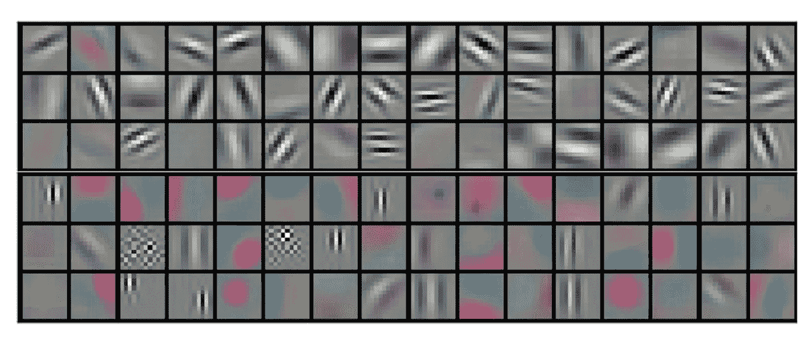

# PyTorch 挂钩

> 原文：<https://medium.com/analytics-vidhya/pytorch-hooks-5909c7636fb?source=collection_archive---------0----------------------->



ref:[https://jhui . github . io/2017/03/16/CNN-卷积-神经网络/](https://jhui.github.io/2017/03/16/CNN-Convolutional-neural-network/)

有时候有很多方法可以完成同样的任务。你如何做取决于可用的工具和你使用它们的效率。Pytorch Hook 就是那个工具，没有它你可能会做一个完整的神经网络，也可以训练它，但是当你知道它有多强大的时候，你就无法把手从它身上拿开了。

那么什么是钩子呢？钩子是帮助动态更新梯度、输入或输出的函数。也就是说，我可以改变神经网络的行为，即使是在我训练它的时候。

钩子用在两个地方

1.  关于张量
2.  在 torch.nn .模块上

更重要的一点是，要应用一个钩子，我们必须首先“注册”我们想要应用它的地方。现在听起来可能有点复杂，我们将在后面的例子中理解它。

挂钩有三种应用方式

*   向前预瞄(在向前传球之前执行)，
*   向前钩住(在向前传球之后执行)，
*   向后挂钩(在向后传递后执行)。

在这里，前向传递是指输入被用来计算下一个隐藏神经元的值，使用权重等等，直到它到达末端并返回输出。使用输出值和真实值计算损失后，会发生反向传递，然后使用链规则在输出到输入的方向上(因此是向后)计算每个层的每个权重和偏差的梯度。基本上，反向传播发生的步骤

**论张量**

对于张量来说，只有向后弯钩是可能的。为了记录钩子的张量，我们可以

```
x.register_hook( your_hook_func ) #x is a tensor
```

这个钩子函数与梯度一起工作，并且它将在每次计算张量的梯度时被激活。

钩子函数要么返回更新的渐变，要么不返回。我们不应该做任何就地操作，这可能会改变计算图形中与之相连的张量的梯度。

```
 #Correct way                         #Inplace (wrong)
   def func(grad):                       def func(grad):
      return grad+100                       grad+=100
```

让我们看一个完整的例子，看看输出。首先让我们定义一个钩子，它将为计算的梯度加 2

```
def hook(grad):
   return grad + 2
```

现在让我们写一个简单的乘法代码，首先，我们将不使用钩子来计算梯度

```
import torch#initializing two tensors(requires_grad = True is necessary to calculate gradients)a = torch.tensor(7.0, requires_grad=True)
b = torch.tensor(13.0, requires_grad=True)c = a * bc.retain_grad()#to store the gradient of Cc.backward()print(a.grad)
print(b.grad)
print(c.grad)
```

输出将是

```
tensor(13.) tensor(7.) tensor(1.)
```

所以现在如果我们使用钩子，c 的梯度应该增加 2 也就是应该是 3，类似地，a 和 b 的梯度也会改变，它们的新梯度将是旧梯度乘以 3，分别是 39 和 21。让我们看看是否匹配。

```
c = a * b#registering the tensor c with the hook
c.register_hook(lambda grad: hook(grad))c.retain_grad()
c.backward()print(a.grad)
print(b.grad)
print(c.grad)
```

输出

```
tensor(39.) tensor(21.) tensor(3.)
```

因此，它与我们之前讨论的内容相匹配。(如果你对这些梯度是如何计算的感到困惑，你最好看看亲笔签名的库)

要移除挂钩，请执行以下操作

```
d = c.register_hook(c_hook)
d.remove()
```

我不会在**模块上讨论整个钩子系统。**但是在这里我们可以使用所有的三个钩子，即向前预钩、向前和向后钩。

让我们看看模块上前向挂钩的一个很好的应用。

# **使用钩子寻找层激活**

如果我们想要计算模型学习的激活，向前挂钩会非常有用。假设你制作了一个可以检测皮肤癌的模型，通过激活模型，我们可以看到模型实际上聚焦在图像的什么地方。这是描述模型可解释性的一个很好的工具，因为我们可以看到激活图。

让我们建立一个简单的 CNN 模型，由 3 层组成。首先是卷积层，然后是平均池层，最后是线性层。我们将尝试从池层获取激活。(如果你愿意，你可以从每一层激活)

```
import torch
import torch.nn as nn
import torch.nn.functional as Fclass Net(nn.Module):
   def __init__(self):
      super().__init__() 
      self.conv = nn.Conv2d(3,8,2)
      self.pool = nn.AdaptiveAvgPool2d((4,4))
      self.fc = nn.Linear(8*4*4 , 1)def forward(self, x):
      x = F.relu(self.conv(x))
      x = self.pool(x)
      x = x.view(x.shape[0] , -1)
      x = self.fc(x)
      return x
net = Net()
```

forward hook 函数有 3 个参数:模块、输入和输出。它根据函数或 None 返回更新的输出。它应该具有以下签名:

```
**hook(module,** input**,** **output)** **->** **None** **or** **modified** **output**
```

让我们做一个钩子，它可以收集激活。我们将使用字典数据结构来收集它们。

```
feats = {} #an empty dictionary
def hook_func(m , inp ,op):
   feats['feat'] = op.detach()
```

现在通常我们首先训练一个模型。(显然)我不会在这里做。让我们假设我们之前制作的模型已经根据一些数据进行了训练，我们现在需要它学习的功能。

在池层上注册向前挂钩

```
net.pool.register_forward_hook(hook_func)
```

假设我们已经输入了一个尺寸为 1x3x10x10 的图像(一个尺寸为 10x10 的 RGB 图像),现在我们需要这些特征。

```
x= torch.randn(1,3,10,10)
output = net(x)
```

这样做将使激活保存在专长字典中。让我展示一下字典的形状，因为它太大了，不可能展示里面的内容。

```
print(feats['feat'].shape)#output -> torch.Size([1, 8, 4, 4])
```

因此我们的激活得到了保存。

所以总结一下，我们已经看到了钩子是什么，是怎么用的。这是一种特殊的工具，可以有多种用途。我们可以在训练时控制梯度，我们可以存储层的激活，我们可以改变输出的计算方式等等。我还没有发现一个关于预挂钩的很好的应用，如果你有什么可以告诉我。希望读完这篇文章后，你已经有了某种程度的好奇心去进一步探索。

快乐学习！

参考资料:

1.  [https://py torch . org/docs/master/generated/torch . nn . module . html？highlight = register _ full _ backward _ hook # torch . nn . module . register _ full _ backward _ hook](https://pytorch.org/docs/master/generated/torch.nn.Module.html?highlight=register_full_backward_hook#torch.nn.Module.register_full_backward_hook)
2.  [https://blog . paper space . com/py torch-hooks-gradient-clipping-debug/](https://blog.paperspace.com/pytorch-hooks-gradient-clipping-debugging/)
3.  [https://www.youtube.com/watch?v=syLFCVYua6Q&t = 27s](https://www.youtube.com/watch?v=syLFCVYua6Q&t=27s)