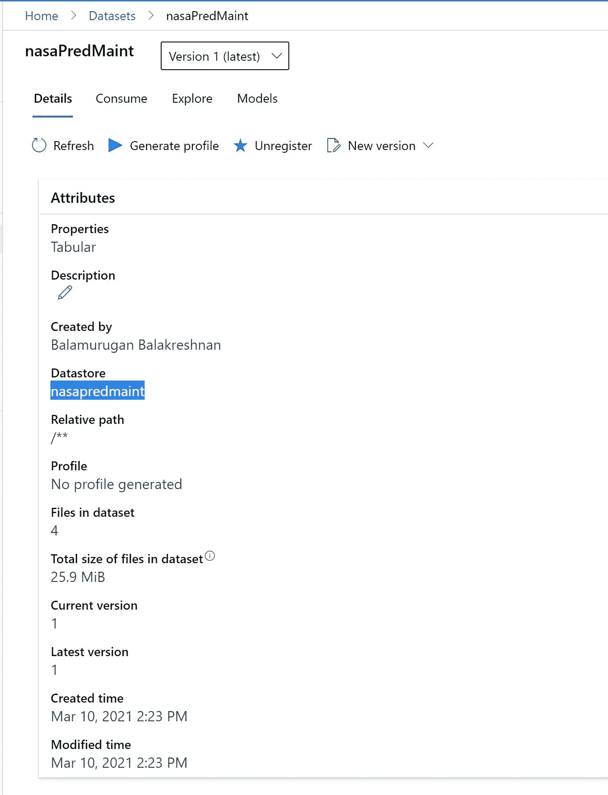
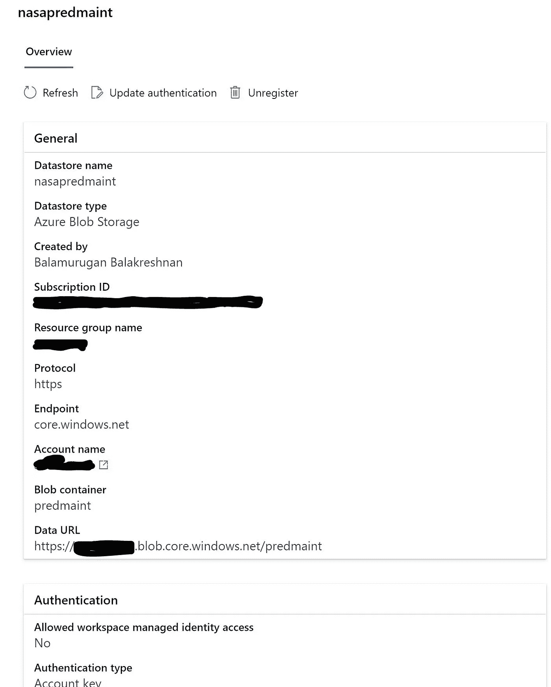
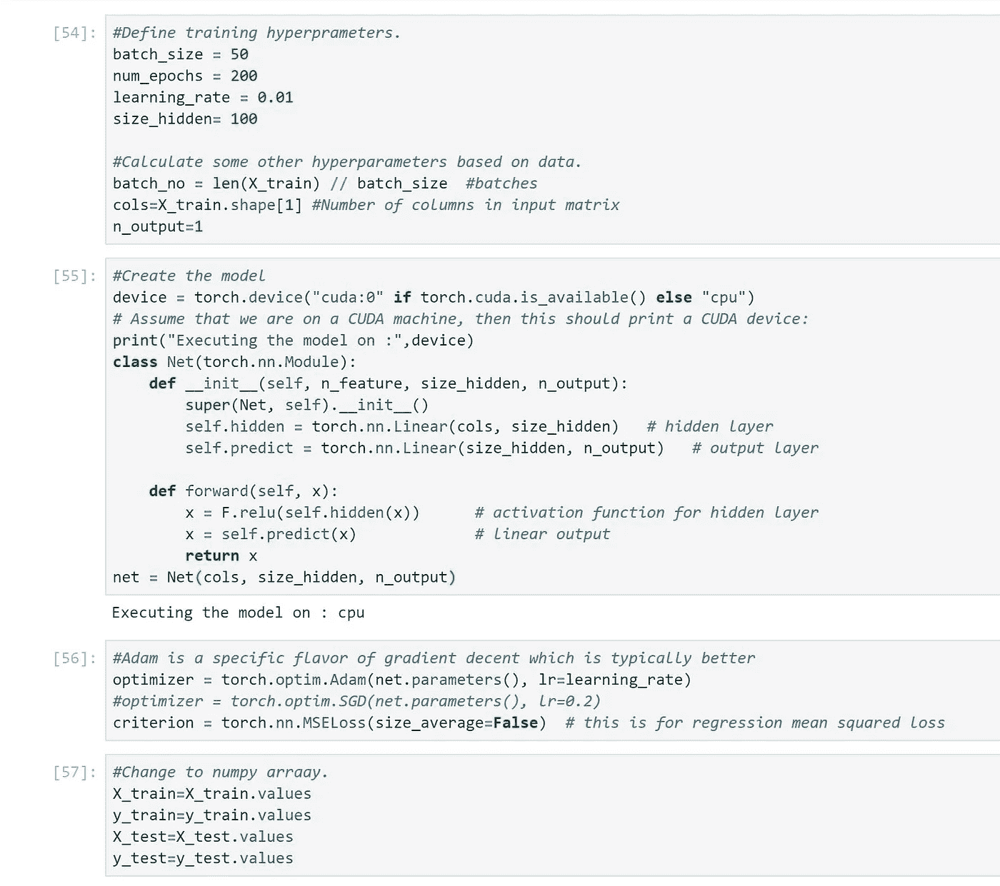
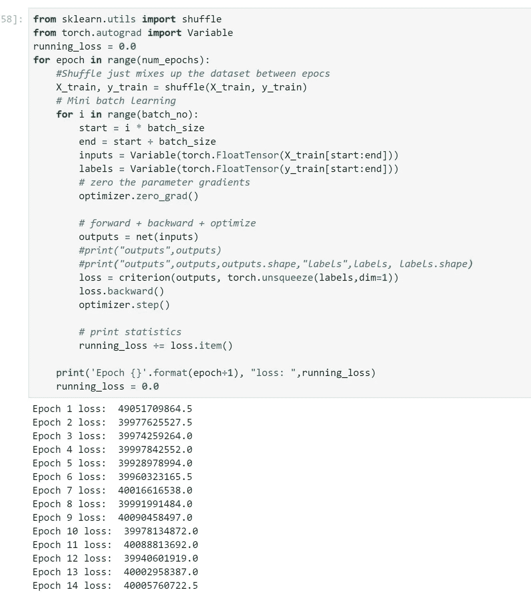

# 使用 Azure 机器学习的 Pytorch 回归模型

> 原文：<https://medium.com/analytics-vidhya/pytorch-regression-model-using-azure-machine-learning-f820a8db253?source=collection_archive---------11----------------------->

# 使用 pytorch 和 Azure ML 运行回归

文章的目的是展示过程和它的假模型。

# 先决条件

*   Azure 帐户
*   资源组
*   Azure 机器学习
*   Azure 存储 blob
*   下载 Nasa 预测维护数据集
*   请访问[https://ti . arc . NASA . gov/tech/dash/groups/pcoe/predictive-data-repository/](https://ti.arc.nasa.gov/tech/dash/groups/pcoe/prognostic-data-repository/)
*   向下滚动到涡扇发动机退化模拟数据集，点击下载涡扇发动机退化模拟数据集(68202 下载)
*   在 Azure ML 中创建一个名为 nasaPredMaint 的数据集

# Azure Blob 存储

*   创建存储帐户
*   创建一个名为 PredMaint 的容器
*   上传下载的文件

# Azure 机器学习

*   首先创建一个数据集



*   创建一个名为 nasapredmaint 的新数据存储



*   现在让我们创建一个计算实例
*   启动计算实例
*   创建新笔记本
*   选择 python + AzureML
*   加载注册的数据集

```
# azureml-core of version 1.0.72 or higher is required
# azureml-dataprep[pandas] of version 1.1.34 or higher is required
from azureml.core import Workspace, Dataset

subscription_id = 'xxxxxxxxxxx'
resource_group = 'rgname'
workspace_name = 'mlworkspace'

workspace = Workspace(subscription_id, resource_group, workspace_name)

dataset = Dataset.get_by_name(workspace, name='nasaPredMaint')
dataset.to_pandas_dataframe()
```

*   将数据集转换为数据帧

```
df = dataset.to_pandas_dataframe()
```

*   列出所有列

```
df.columns
```

*   导入库

```
import torch
import torch.nn as nn
import matplotlib.pyplot as plt
import numpy as np
import torch
from torch.autograd import Variable
```

*   删除标签列和不需要的列

```
df1 = df.drop(columns=['timecycles','sensor22', 'sensor23'])
```

*   分割要素和标签

```
X = df1.iloc[:,:31]
y = df[['timecycles']]
```

*   显示数据帧

```
df1.head()
```

*   现在导入新库

```
#Let's get rid of some imports
%matplotlib inline
import matplotlib.pyplot as plt
import numpy as np
#Define the model 
import torch
import torch.nn as nn
import torch.nn.functional as F
```

*   定义特征和标签

```
from sklearn.model_selection  import train_test_split
X = df1.iloc[:, 0:29]
y = df[['timecycles']]

# Split the data into a training set and a test set
X_train, X_test, y_train, y_test = train_test_split(X, y, test_size=0.3, random_state=0)

print(X_train.shape, X_test.shape, y_train.shape, y_test.shape)
```

*   定义参数

```
#Define training hyperprameters.
batch_size = 50
num_epochs = 200
learning_rate = 0.01
size_hidden= 100

#Calculate some other hyperparameters based on data.  
batch_no = len(X_train) // batch_size  #batches
cols=X_train.shape[1] #Number of columns in input matrix
n_output=1
```

*   创建模型

```
#Create the model
device = torch.device("cuda:0" if torch.cuda.is_available() else "cpu")
# Assume that we are on a CUDA machine, then this should print a CUDA device:
print("Executing the model on :",device)
class Net(torch.nn.Module):
    def __init__(self, n_feature, size_hidden, n_output):
        super(Net, self).__init__()
        self.hidden = torch.nn.Linear(cols, size_hidden)   # hidden layer
        self.predict = torch.nn.Linear(size_hidden, n_output)   # output layer

    def forward(self, x):
        x = F.relu(self.hidden(x))      # activation function for hidden layer
        x = self.predict(x)             # linear output
        return x
net = Net(cols, size_hidden, n_output)
```

*   配置优化程序

```
#Adam is a specific flavor of gradient decent which is typically better
optimizer = torch.optim.Adam(net.parameters(), lr=learning_rate)
#optimizer = torch.optim.SGD(net.parameters(), lr=0.2)
criterion = torch.nn.MSELoss(size_average=False)  # this is for regression mean squared loss
```

*   更改值

```
#Change to numpy arraay. 
X_train=X_train.values
y_train=y_train.values
X_test=X_test.values
y_test=y_test.values
```



*   现在运行模型

```
from sklearn.utils import shuffle
from torch.autograd import Variable
running_loss = 0.0
for epoch in range(num_epochs):
    #Shuffle just mixes up the dataset between epocs
    X_train, y_train = shuffle(X_train, y_train)
    # Mini batch learning
    for i in range(batch_no):
        start = i * batch_size
        end = start + batch_size
        inputs = Variable(torch.FloatTensor(X_train[start:end]))
        labels = Variable(torch.FloatTensor(y_train[start:end]))
        # zero the parameter gradients
        optimizer.zero_grad()

        # forward + backward + optimize
        outputs = net(inputs)
        #print("outputs",outputs)
        #print("outputs",outputs,outputs.shape,"labels",labels, labels.shape)
        loss = criterion(outputs, torch.unsqueeze(labels,dim=1))
        loss.backward()
        optimizer.step()

        # print statistics
        running_loss += loss.item()

    print('Epoch {}'.format(epoch+1), "loss: ",running_loss)
    running_loss = 0.0
```



*   计算指标

```
import pandas as pd
from sklearn.metrics import r2_score

X = Variable(torch.FloatTensor(X_train)) 
result = net(X)
pred=result.data[:,0].numpy()
print(len(pred),len(y_train))
r2_score(pred,y_train)
```

*   寻找 R2 分数

```
import pandas as pd
from sklearn.metrics import r2_score
#This is a little bit tricky to get the resulting prediction.  
def calculate_r2(x,y=[]):
    """
    This function will return the r2 if passed x and y or return predictions if just passed x. 
    """
    # Evaluate the model with the test set. 
    X = Variable(torch.FloatTensor(x))  
    result = net(X) #This outputs the value for regression
    result=result.data[:,0].numpy()

    if len(y) != 0:
        r2=r2_score(result, y)
        print("R-Squared", r2)
        #print('Accuracy {:.2f}'.format(num_right / len(y)), "for a total of ", len(y), "records")
        return pd.DataFrame(data= {'actual': y, 'predicted': result})
    else:
        print("returning predictions")
        return result
```

*   运行线性模型

```
from sklearn.linear_model import LinearRegression
lm = LinearRegression()
lm.fit( X_train, y_train )
```

*   打印分数

```
print('R2 for Train)', lm.score( X_train, y_train ))
print('R2 for Test (cross validation)', lm.score(X_test, y_test))
```

【github.com】的 samples 2021/pytorchregression . MD