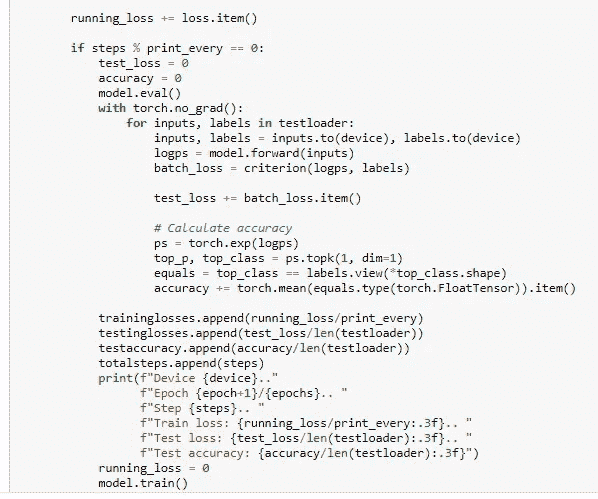

# Pytorch 卫星图像的神经网络分类。

> 原文：<https://medium.com/analytics-vidhya/pytorch-satellite-image-classification-using-neural-networks-47f2cd1f7d82?source=collection_archive---------1----------------------->

数据集的卫星图像

# **简介**

**数据集描述:**包含四类卫星图像:水域、沙漠、多云和绿地，每类 1500 张。测试文件夹包含每个类别的 40 幅图像。

**链接到数据集:**[https://www . ka ggle . com/mahmoudreda 55/satellite-image-class ification](https://www.kaggle.com/mahmoudreda55/satellite-image-classification)

**目标**:开发一个深度学习或神经网络模型，可以使用 pytorch 对卫星图像进行预测或分类，分为以下几类:水、沙漠、多云和绿色区域。这个模型也是在一台支持 cpu 的计算机上训练的。这个项目也有助于轻松地开始使用 pytorch。

**py torch 是什么？**

PyTorch 是一个开源的机器学习库，主要用于深度学习应用程序、计算机视觉和使用 GPU 和 CPU 的自然语言处理。它可以用 Python 实现，主要由脸书人工智能研究团队开发。其他类似 pytorch 的机器学习库还有 TensorFlow 和 Keras。它利用张量，可以用 numpy 实现。

> ***轮廓***
> 
> *1。导入库*
> 
> *2。加载和转换数据，然后定义数据加载器*
> 
> *3。加载一个预先训练好的密网模型*
> 
> *4。绘制一些图像*
> 
> *5。测试电脑 cpu 速度*
> 
> 6。定义神经网络
> 
> *7 定义培训步骤*
> 
> *8。绘制训练步骤图*
> 
> *9。保存训练好的模型*
> 
> *10。使用训练好的模型预测卫星图像类别*

1.  **导入库**

为此项目导入必要的库

**2。加载和转换数据，然后定义数据加载器**

包含图像数据的本地目录

在使用 pytorch dataloader 加载到数据集中之前，提供到 PC 上本地存储的图像的链接，转换并调整图像大小。

在使用 pytorch dataloader 加载到数据集中之前，转换图像并调整其大小

**3。加载一个预先训练好的密集网络模型**

一个 **DenseNet** 是一种卷积神经网络，它利用层之间的密集连接，通过密集块，我们将*所有层*(具有匹配的特征映射大小)直接相互连接。为了保持前馈性质，每一层从所有前面的层获得额外的输入，并将它自己的特征映射传递给所有后面的层。densenet-121 型号是 densenet 设计用于执行图像分类**的型号之一。**作者最初在 Torch*上训练模型，但后来转换成了 Caffe*格式。所有 DenseNet 模型都已经过 ImageNet 图像数据库的预训练。

加载 densenet 架构

**4 绘制一些图像**

使用 matplotlib 绘制图像

输出

**5。测试电脑 cpu 速度**

PYTORCH 使用 cuda 库作为 gpu 进行训练，但我的电脑没有支持 cuda 的 gpu。

cpu 时间输出 7.747 秒

**6 定义神经网络**

使用 pytorch.nn 模块，使用 relu 激活函数和 softmax 定义神经网络。注意没有必要通过 densenet 重量。

定义神经网络

**7 定义培训步骤**

定义纪元和设备输入，然后反向传播并应用优化器

向后传播和应用优化程序

定义训练循环

培训产出

**8。绘制训练步骤图**

绘制列车损失、测试损失和测试精度

**9。保存训练好的模型**

保存已训练的模型

**10。使用训练好的模型预测卫星图像类别**

首先加载训练好的模型

首先加载训练好的模型

用于对测试文件夹中的图像进行分类的功能

用于对测试文件夹中的图像进行分类的功能

预测类别标签

# 结论

这个项目解释了使用 pytorch 库预测卫星图像类的过程，这是一个简单直接的过程，但是这个过程在支持 GPU 的计算机上运行比在 CPU 上运行更快。所以选择权在你。该笔记本作为解决方案提交到 kaggle 图像分类页面。https://www . ka ggle . com/Mahmoud reda 55/satellite-image-class ification/code

**作家**:奥卢耶德·塞贡。(小)

**使用的资源(参考资料)和进一步阅读:**

 [## densenet-121 — OpenVINO 文档

### 编辑描述

docs.openvino.ai](https://docs.openvino.ai/latest/omz_models_model_densenet_121.html)  [## 在 PyTorch 中加载数据— PyTorch 教程 1.10.0+cu102 文档

### PyTorch 具有广泛的神经网络构建模块，具有简单、直观和稳定的 API。PyTorch 包括…

pytorch.org](https://pytorch.org/tutorials/recipes/recipes/loading_data_recipe.html)  [## PyTorch 库|什么是深度学习 PyTorch 库|

### 下面的教程假设了一些 Python 编程语言和高中数学的基础知识。不…

www.analyticsvidhya.com](https://www.analyticsvidhya.com/blog/2021/04/a-gentle-introduction-to-pytorch-library/) 

**链接到解释性笔记本:**

[https://github . com/juniorboycoder/py torch-Satellite-image-class ification-using-neural-networks。/blob/main/SATA lite _ py torch % 20-% 20 real . ipynb](https://github.com/juniorboycoder/PYTORCH-Satellite-image-classification-using-neural-networks./blob/main/satalite_pytorch%20-%20real.ipynb)

https://twitter.com/oluyedejun1 的推特简介:[T4](https://twitter.com/oluyedejun1)

**linkedin 简介**:[https://www . LinkedIn . com/in/oluyede-segun-ade deji-Jr-a 5550 b 167/](https://www.linkedin.com/in/oluyede-segun-adedeji-jr-a5550b167/)

**标签**:# py torch # neural network # image classification # dense net # machine learning # deep learning # python