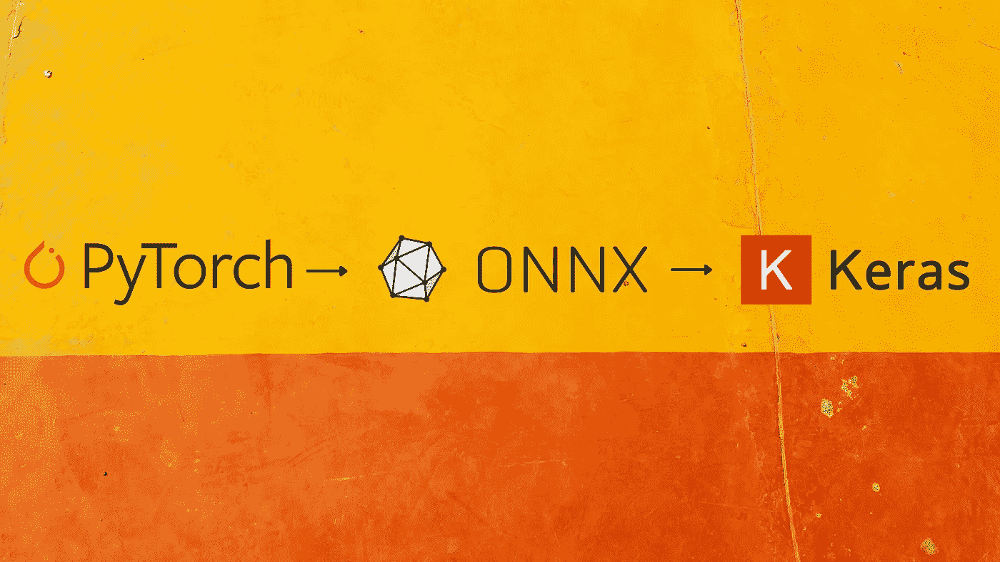
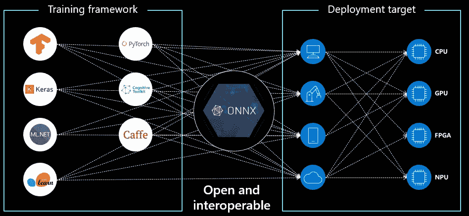
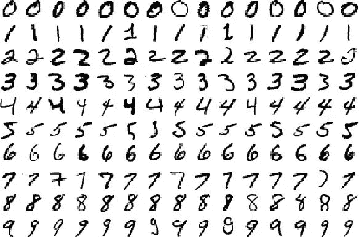
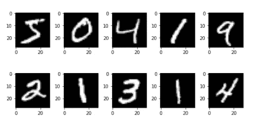
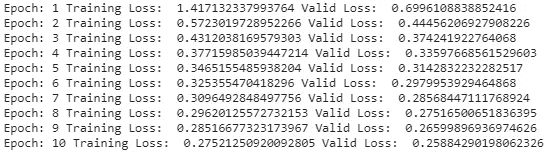
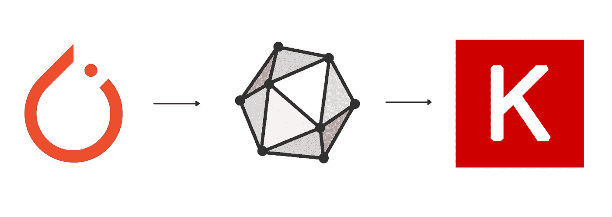
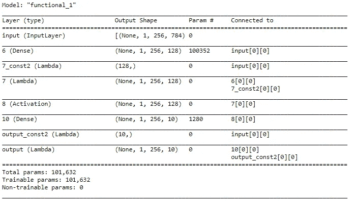
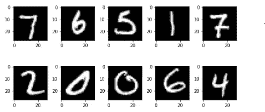

# 使用 ONNX 将 Pytorch 转换为 Keras

> 原文：<https://medium.com/analytics-vidhya/pytorch-to-keras-using-onnx-71d98258ad76?source=collection_archive---------0----------------------->



使用 ONNX 将 Pytorch 转换为 Keras

# **模型部署**

模型部署是一种方法，通过这种方法，您可以将机器学习模型集成到现有的生产环境中，以根据数据做出实际的业务决策。这是机器学习生命周期中的最后一个阶段，也可能是最繁琐的阶段之一。【[定义来源](https://www.datarobot.com/wiki/machine-learning-model-deployment/)

模型部署可能是机器学习模型生命周期中最重要的部分，但仍然是研究最少的部分。ML/DL 领域的大多数课程都教授如何探索数据、设计特征、训练模型和生成预测。但是他们忽略了最重要的部分:之后做什么？

除了为学习或 Kaggle 竞赛开发的模型之外，所有其他模型都是为了创收而构建的，如果你不将一个模型部署到生产中，那么就没有人使用它，因此没有收入。

# **ONNX vs 厂商锁定**

有时你使用一个框架创建模型，例如, [coreML](https://developer.apple.com/documentation/coreml) ,但是你想把它部署到一个它不支持的系统中(例如，Android)。这种不可互操作性意味着您训练过的、测试过的模型没有任何用处。

一个可能且显而易见的解决方案是使用 Android 支持的格式重新训练您的模型。但是这个显而易见的解决方案可行吗？在有严格时间表的生产环境中，这样的解决方案不是最佳的。即使你有充足的时间，再培训也不是最好的解决方案。训练一个模型并使其达到最佳精度绝非易事。这涉及到长时间的训练和调试，非常麻烦。所以，当你已经有了一个最佳精度的模型，你就不想再从头开始重新训练它了。引用软件工程中的一句话:

> 编程的第一条规则:如果有用，不要碰它。

一个更好的选择是将您的模型转换成一个框架，该框架受您想要部署模型的系统的支持。这就是 [**ONNX**](https://github.com/onnx/onnx) 出现的原因。

ONNX 代表**开放式神经网络交换**。ONNX 是一个开源的人工智能生态系统，可用于交换深度学习模型。它承诺使深度学习模型可移植，从而防止供应商锁定。

2017 年 9 月，脸书和微软推出了它，用于在 PyTorch 和 Caffe2 等机器学习框架之间切换。后来，IBM、华为、英特尔、AMD、ARM 和高通宣布支持该计划。



ONNX 引入了互操作性。[图像来源](https://microsoft.github.io/ai-at-edge/docs/onnx/)

# **手头的任务**

下面，我将解释使用 ONNX 将 Pytorch 模型转换为 Keras 模型的过程(类似的方法也可以用于其他类型模型之间的转换)。我们将使用以下用例进行演示。

# 用例:手写数字分类



来自 MNIST 数据集的样本图像。[图片来源](https://en.wikipedia.org/wiki/MNIST_database)

**用例简介**:我们想要创建一个 ML 模型，它可以将图像作为输入，并成功地将其分类为 0 到 9 之间的数字。

我们将创建一个多层感知器(MLP)网络，用于构建手写数字分类器。我们将利用*火炬视觉*包中包含的 MNIST 数据集。

我们将使用 PyTorch 内提供的不同实用程序包( *NN* 、*autograted*、 *optim* 、 *torchvision* 、 *torchtext* 等)。)来建立和训练神经网络。为了便于使用和访问，我们将使用[谷歌实验室](https://colab.research.google.com/)来运行我们的代码。

> 让我们把手弄脏。

# 装置

安装默认情况下 Google Colab 不附带的必要软件包。如果您在 Google Colab 之外运行，那么您需要安装本文最后一部分提到的所有软件包。

```
! pip install onnx! pip install onnx2keras! pip install onnxruntime
```

# 数据加载和处理

与您将要从事的任何 ML 项目一样，第一步是数据预处理。我们需要将原始数据集转换成张量，并在固定范围内对其进行归一化。torchvision 包提供了一个名为 transforms 的工具，可以用来将不同的转换组合在一起。

```
**from** **torchvision** **import** transforms_tasks = transforms.Compose([transforms.ToTensor(),
  transforms.Normalize((0.5,), (0.5,))
])
```

第一个变换将原始数据转换为张量变量，第二个变换使用以下操作执行归一化:

x_normalized = x 均值/标准差

```
**from** **torchvision.datasets** **import** MNIST*## Load MNIST Dataset and apply transformations*
mnist = MNIST("data", download=**True**, train=**True**, transform=_tasks)
```

# 数据可视化

现在让我们来看看数据集

```
**from** **torch.utils.data** **import** DataLoaderrawData = DataLoader(mnist, batch_size=10)dataiter = iter(rawData)
data, labels = dataiter.next()
data = data.view(data.shape[0], -1)print("shape", data.shape)
```

Out[ ]:

```
shape torch.Size([10, 784])
```

该数据集包含手写数字的图像。每个图像(最初是一个 28×28 的矩阵)被压缩成一个 1×784 的矢量。我们可以通过将向量整形为 28×28 的矩阵来得到原始图像。

这是第一个向量的 200 个起始值的样子:

```
data[0][:200]
```

Out[ ]:

```
tensor([-1.0000, -1.0000, -1.0000, -1.0000, -1.0000, -1.0000, -1.0000, -1.0000,
        -1.0000, -1.0000, -1.0000, -1.0000, -1.0000, -1.0000, -1.0000, -1.0000,
        -1.0000, -1.0000, -1.0000, -1.0000, -1.0000, -1.0000, -1.0000, -1.0000,
        -1.0000, -1.0000, -1.0000, -1.0000, -1.0000, -1.0000, -1.0000, -1.0000,
        -1.0000, -1.0000, -1.0000, -1.0000, -1.0000, -1.0000, -1.0000, -1.0000,
        -1.0000, -1.0000, -1.0000, -1.0000, -1.0000, -1.0000, -1.0000, -1.0000,
        -1.0000, -1.0000, -1.0000, -1.0000, -1.0000, -1.0000, -1.0000, -1.0000,
        -1.0000, -1.0000, -1.0000, -1.0000, -1.0000, -1.0000, -1.0000, -1.0000,
        -1.0000, -1.0000, -1.0000, -1.0000, -1.0000, -1.0000, -1.0000, -1.0000,
        -1.0000, -1.0000, -1.0000, -1.0000, -1.0000, -1.0000, -1.0000, -1.0000,
        -1.0000, -1.0000, -1.0000, -1.0000, -1.0000, -1.0000, -1.0000, -1.0000,
        -1.0000, -1.0000, -1.0000, -1.0000, -1.0000, -1.0000, -1.0000, -1.0000,
        -1.0000, -1.0000, -1.0000, -1.0000, -1.0000, -1.0000, -1.0000, -1.0000,
        -1.0000, -1.0000, -1.0000, -1.0000, -1.0000, -1.0000, -1.0000, -1.0000,
        -1.0000, -1.0000, -1.0000, -1.0000, -1.0000, -1.0000, -1.0000, -1.0000,
        -1.0000, -1.0000, -1.0000, -1.0000, -1.0000, -1.0000, -1.0000, -1.0000,
        -1.0000, -1.0000, -1.0000, -1.0000, -1.0000, -1.0000, -1.0000, -1.0000,
        -1.0000, -1.0000, -1.0000, -1.0000, -1.0000, -1.0000, -1.0000, -1.0000,
        -1.0000, -1.0000, -1.0000, -1.0000, -1.0000, -1.0000, -1.0000, -1.0000,
        -0.9765, -0.8588, -0.8588, -0.8588, -0.0118,  0.0667,  0.3725, -0.7961,
         0.3020,  1.0000,  0.9373, -0.0039, -1.0000, -1.0000, -1.0000, -1.0000,
        -1.0000, -1.0000, -1.0000, -1.0000, -1.0000, -1.0000, -1.0000, -1.0000,
        -0.7647, -0.7176, -0.2627,  0.2078,  0.3333,  0.9843,  0.9843,  0.9843,
         0.9843,  0.9843,  0.7647,  0.3490,  0.9843,  0.8980,  0.5294, -0.4980,
        -1.0000, -1.0000, -1.0000, -1.0000, -1.0000, -1.0000, -1.0000, -1.0000])
```

由于上面这样的数字不是很直观，让我们试着形象化一下。请注意，在下面的代码中，我们已经将 vector 调整为 28×28 的矩阵，以便绘制。

```
**import** **matplotlib.pyplot** **as** **plt**

num = 10
num_row = 2
num_col = 5

*# plot images*
fig, axes = plt.subplots(num_row, num_col, figsize=(1.5*num_col,2*num_row))
**for** i **in** range(num):
    ax = axes[i//num_col, i%num_col]
    pixels = data[i].numpy()
    pixels = pixels.reshape((28,28))
    ax.imshow(pixels, cmap='gray')
plt.tight_layout()
plt.show()
```



这就是我们的图像绘制时的样子。让我们朝着训练和推理前进。

# Pytorch 模型培训

*PyTorch* 的另一个优秀工具是*数据加载器*迭代器，它提供了使用多处理工作器并行批处理、混洗和加载数据的能力。为了评估我们的模型，我们将把数据分成训练集和验证集。

```
**from** **torch.utils.data** **import** DataLoader
**from** **torch.utils.data.sampler** **import** SubsetRandomSampler*## create training and validation split* 
split = int(0.8 * len(mnist))
index_list = list(range(len(mnist)))
train_idx, valid_idx = index_list[:split], index_list[split:]*## create sampler objects using SubsetRandomSampler*
tr_sampler = SubsetRandomSampler(train_idx)
val_sampler = SubsetRandomSampler(valid_idx)*## create iterator objects for train and valid datasets*
trainloader = DataLoader(mnist, batch_size=256, sampler=tr_sampler)
validloader = DataLoader(mnist, batch_size=256, sampler=val_sampler)
```

PyTorch 中的神经网络架构可以在一个类中定义，该类继承了来自名为 Module 的 *NN* 包的基类的属性。这个继承自 *nn。模块*类允许我们轻松地实现、访问和调用许多方法。我们可以定义类的构造函数中的所有层，以及 forward 函数中的前向传播步骤。

我们将定义一个具有以下层配置的网络:[784，128，10]。此配置表示输入层中有 784 个节点(28*28 像素)，隐藏层中有 128 个节点，输出层中有 10 个节点。在 forward 函数内部，我们将使用隐藏层中的 sigmoid 激活函数(可以从 *NN* 模块访问)。

```
**import** **torch.nn.functional** **as** **F**
**import** **torch.nn** **as** **nn****class** **Model**(nn.Module):
    **def** __init__(self):
        super().__init__()
        self.hidden = nn.Linear(784, 128)
        self.output = nn.Linear(128, 10)

    **def** forward(self, x):
        x = self.hidden(x)
        x = F.sigmoid(x)
        x = self.output(x)
        **return** xmodel = Model()
```

使用 *NN* 和 *optim* 包定义损失函数和优化器:

```
**from** **torch** **import** optim
**import** **numpy** **as** **np**
**import** **torch**loss_function = nn.CrossEntropyLoss()
optimizer = optim.SGD(model.parameters(), lr=0.01, weight_decay= 1e-6, momentum = 0.9, nesterov = **True**)
```

我们现在准备训练模型。核心步骤将是正向传播、损耗计算、反向传播和更新参数。

```
**for** epoch **in** range(1, 11): *## run the model for 10 epochs*
    train_loss, valid_loss = [], []
    *## training part* 
    model.train()
    **for** data, target **in** trainloader:
        optimizer.zero_grad()
        *## 1\. forward propagation*
        data = data.view(data.shape[0], -1)
        output = model(data)

        *## 2\. loss calculation*
        loss = loss_function(output, target)

        *## 3\. backward propagation*
        loss.backward()

        *## 4\. weight optimization*
        optimizer.step()

        train_loss.append(loss.item())

    *## evaluation part* 
    model.eval()
    **for** data, target **in** validloader:
        data = data.view(data.shape[0], -1)
        output = model(data)
        loss = loss_function(output, target)
        valid_loss.append(loss.item())
    print ("Epoch:", epoch, "Training Loss: ", np.mean(train_loss), "Valid Loss: ", np.mean(valid_loss))
```



在上面的代码片段中，我只使用了 10 个纪元，但是您可以根据准确性指标增加它们。

# 模型推理

模型定型后，对验证数据进行预测。**我们将使用预测值来查看我们的 *PyTorch* 模型和转换后的 Keras 模型是否输出相同的值。**

```
*## dataloader for validation dataset* 
dataiter = iter(validloader)
data, labels = dataiter.next()
data = data.view(data.shape[0], -1)
output = model(data)_, preds_tensor = torch.max(output, 1)
pytorchPredictions = np.squeeze(preds_tensor.numpy())
```

现在我们已经将预测保存在“pytorchPredictions”变量中，我们将把 *PyTorch* 模型转换成 ONNX 格式，然后再把它转换成 *Keras* 模型。

转换将是这样的:



# Pytorch 呼叫 ONNX

```
*# ONNX is natively supported by Pytorch so we just need* 
*# these 2 lines to export Pytorch model to ONNX.**# while running inferences you will have to pass data of this shape only*
x = torch.randn(1, 1, 256, 784, requires_grad=**True**)
torch.onnx.export(model, x, "torchToOnnx.onnx", verbose=**True**, input_names = ['input'], output_names = ['output'])
```

运行上述代码后的 ONNX 模型以“torchToOnnx.onnx”的名称保存在当前目录中。

如果你的目的只是推理，那么你可以直接使用 *ONNX* 对象来做。由于许多平台都支持 ONNX，所以直接用 ONNX 进行推理是一个合适的选择。为此，我们将需要 ONNX 运行时。以下代码描述了同样的情况:

**使用 ONNX 进行推理:**

```
**import** **onnxruntime** **as** **rt**
**import** **numpy**

sess = rt.InferenceSession("/content/torchToOnnx.onnx")
input_name = sess.get_inputs()[0].name

*# Note: The input must be of the same shape as the shape of x during # the model export part. i.e. second argument in this function call: torch.onnx.export()*
onnxPredictions = sess.run(**None**, {input_name: data.numpy().reshape(1,1,256,784)})[0]
```

我们会在最后看看预测值。现在，让我们继续前进，将模型转换为 Keras。

# ONNX 到 Keras

ONNX 到 Keras 不是本地支持的，但是多亏了慷慨的 Python 社区，我们有 [onnx2keras](https://pypi.org/project/onnx2keras/) 为我们做这些。

```
**import** **onnx**
**from** **onnx2keras** **import** onnx_to_keras*# Load ONNX model*
onnx_model = onnx.load('/content/torchToOnnx.onnx')*# Call the converter (input will be equal to the input_names parameter that you defined during exporting)*
k_model = onnx_to_keras(onnx_model, ['input'])
```

让我们看看 Keras 模型的概要，看看它是否被正确导入

```
k_model.summary()
```



现在我们有了 Keras 模型，我们可以在同一个数据集上生成预测，并将其与 Pytorch 模型的输出进行比较，以验证转换。

```
KerasPredictions = []
**for** i **in** range(10):
    inp = data[i].numpy()
    out = k_model.predict(inp.reshape(1, 784))
    KerasPredictions.append(np.argmax(out))
```

# 预测比较

让我们先看看原始图像

```
num = 10
num_row = 2
num_col = 5*# plot images*
fig, axes = plt.subplots(num_row, num_col, figsize=(1.5*num_col,2*num_row))
**for** i **in** range(num):
    ax = axes[i//num_col, i%num_col]
    pixels = data[i].numpy()
    pixels = pixels.reshape((28,28))
    ax.imshow(pixels, cmap='gray')
plt.tight_layout()
plt.show()
```



**图像的实际标签**

```
labels[:10]
```

Out[ ]:

```
tensor([7, 6, 5, 1, 7, 2, 0, 0, 6, 4])
```

**使用原始 Pytorch 模型的预测**

```
pytorchPredictions[:10]
```

Out[ ]:

```
array([7, 6, 5, 1, 7, 2, 0, 0, 6, 4])
```

**使用 ONNX 运行时的预测**

```
np.argmax(onnxPredictions[0][0][:10], axis=1)
```

Out[ ]:

```
array([7, 6, 5, 1, 7, 2, 0, 0, 6, 4])
```

**使用转换后的 Keras 模型进行预测**

```
KerasPredictions
```

Out[ ]:

```
[7, 6, 5, 1, 7, 2, 0, 0, 6, 4]
```

正如我们在最后三个输出单元中看到的，Pytorch、Keras 和 onnx 模型的输出是相同的，因此我们的转换有效。

# **套餐:**

以下是笔记本中使用的包列表:

1.  火炬:1.6.0+cu101
2.  onnx: 1.7.0
3.  数字:1.18.5
4.  onnx2keras: 0.0.23
5.  火炬视觉:0.7.0+cu101
6.  matplotlib: 3.2.2
7.  onnx 运行时:1.5.2

# 参考资料:

1.  [https://www . analyticsvidhya . com/blog/2019/01/guide-py torch-neural-networks-case-studies/](https://www.analyticsvidhya.com/blog/2019/01/guide-pytorch-neural-networks-case-studies/)
2.  [https://medium . com/@ mrdata science/how-to-plot-Mn ist-digits-using-matplotlib-65 a2 E0 cc 068](/@mrdatascience/how-to-plot-mnist-digits-using-matplotlib-65a2e0cc068)
3.  [https://blog . paper space . com/what-every-ml-ai-developer-should-know-on NX/](https://blog.paperspace.com/what-every-ml-ai-developer-should-know-about-onnx/)
4.  [https://microsoft.github.io/ai-at-edge/docs/onnx/](https://microsoft.github.io/ai-at-edge/docs/onnx/)
5.  [https://medium . com/analytics-vid hya/how-to-convert-your-keras-model-to-onnx-8d 8b 092 C4 e4f](/analytics-vidhya/how-to-convert-your-keras-model-to-onnx-8d8b092c4e4f)

# 结束注释

这就是你如何轻松获得 ONNX 平台及其背后慷慨的开源社区带来的互操作性好处。

为了写这篇文章，我得到了开源社区免费提供的多种资源的帮助。因为我从很多地方得到了帮助，所以我不也不能声称对这篇文章有任何所有权。你想怎么用就怎么用。你愿意的话可以提一下这篇文章。

此外，即使这篇文章是我自己写的(就像我的上一篇[文章](/analytics-vidhya/save-and-load-a-tensorflow-estimator-model-for-predictions-233b798620a9)，我自己写并开发了代码)，我也不会声称拥有任何所有权。

“结尾笔记”中的所有哲学不是为了吹嘘自己，而是为了激励你为开源社区做出贡献，以便每个人都可以学习，我们可以[让神经网络再次变得不酷](https://www.fast.ai/)。

如果你喜欢这篇文章，那么你可以想按多少次拍手按钮就按多少次。另外，你可以在 [LinkedIn](https://www.linkedin.com/in/singhajeet23/) 上联系我，或者在 [GitHub](https://github.com/AjeetSingh02) 上关注我。


快乐学习