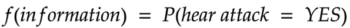
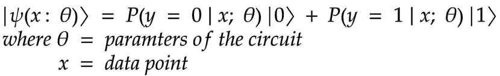
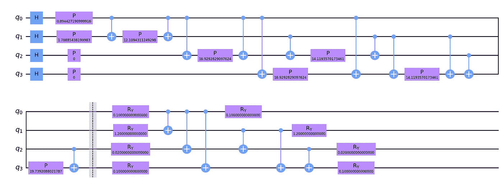

# Q1c。基于数据的变分量子分类器分析

> 原文：<https://medium.com/analytics-vidhya/q1c-an-analysis-of-the-variational-quantum-classifier-using-data-5cd29be55a58?source=collection_archive---------8----------------------->

> **我们之前的博客在:** [**讲解变分量子量词**](https://rodneyosodo.medium.com/qa2-explaining-variational-quantum-classifiers-b584c3bd7849?source=friends_link&sk=9ccabff95cb8c2ffa7c8c32bd5424a39)

**现在你应该知道变分量子分类器是如何工作的了。之前系列的代码在 [Github repo](https://github.com/0x6f736f646f/variational-quantum-classifier-on-heartattack)**

# **介绍**

**在二进制分类中，比方说标记某人是否可能患有心脏病，我们将构建一个函数，该函数接收关于患者的信息，并给出与现实相符的结果。例如，**

****

**这种概率分类非常适合量子计算，我们希望建立一个量子态，当测量和后处理时，返回**

****

**`P(hear attack = YES)`**

**通过优化电路，你可以找到基于训练数据的最接近现实概率的参数。**

# **问题陈述**

**给定一个关于病人信息的数据集，我们能预测病人是否有可能心脏病发作吗？这是一个二进制分类问题，在`{0, 1}`中有实输入向量`{x}`和二进制输出`{y}` 。我们想建立一个量子电路，它的输出是量子态:**

****

# **履行**

1.  **我们在零状态下初始化我们的电路(所有量子位都在零状态)**

```
self.sv = Statevector.from_label('0' * self.no_qubit)
```

**2.我们使用诸如`ZZFeaturemap, ZFeaturemap`或`PauliFeaturemap`的特征图，并根据数据的输入维度和我们想要的重复次数(即电路深度)来选择量子位的数量。我们用 1，3，5。**

**3.我们选择变分形式为`RealAmplitudes`，并指定量子位的数量以及我们想要的重复次数。我们使用 1、2、4 来使模型具有越来越多的可训练参数。**

**4.然后，我们将我们的特征图结合到变分电路中。`ZZfeaturemap and RealAmplitudes both with a depth of 1`**

```
def prepare_circuit(self):
    """
    Prepares the circuit. Combines an encoding circuit, feature map, to a variational circuit, RealAmplitudes
    :return:
    """
    self.circuit = self.feature_map.combine(self.var_form)
```

**5.我们创建一个函数，将特征图的参数与数据相关联，并将变分电路的参数与传递的参数相关联。这是为了在 Qiskit 中确保电路中正确的变量与正确的量相关联。**

```
def get_data_dict(self, params, x):
    """
    Assign the params to the variational circuit and the data to the featuremap
    :param params: Parameter for training the variational circuit
    :param x: The data
    :return parameters:
    """
    parameters = {}
    for i, p in enumerate(self.feature_map.ordered_parameters):
        parameters[p] = x[i]
    for i, p in enumerate(self.var_form.ordered_parameters):
        parameters[p] = params[i]
    return parameters
```

****

**参数化电路**

**6.我们创建另一个函数来检查传递的位串的奇偶性。如果奇偶校验是偶数，则返回“是”标签，如果奇偶校验是奇数，则返回“否”标签。我们选择这个是因为我们有两个类，奇偶校验对于给定的位串或者返回真或者返回假。还有其他的方法，例如，对于 3 个类，你可以将 bistring 转换成一个数字，并通过一个激活函数来传递。或者将电路的期望值解释为概率。需要注意的重要一点是，从量子电路的输出中分配标签有多种方式，你需要证明为什么或如何这样做。在我们的例子中，宇称的想法最初是在这篇非常好的论文(https://arxiv.org/abs/1804.11326)中被激发的，并且细节包含在其中。**

**7.现在我们创建一个函数，返回模型类的概率分布。在多次测量量子电路(即，多次拍摄)后，我们分别合计与“是”和“否”相关的概率，以获得每个标签的概率。**

```
def return_probabilities(self, counts):
    """
    Calculates the probabilities of the class label after assigning the label from the bit string measured
    as output
    :type counts: dict
    :param counts: The counts from the measurement of the quantum circuit
    :return result: The probability of each class
    """
    shots = sum(counts.values())
    result = {self.class_labels[0]: 0, self.class_labels[1]: 0}
    for key, item in counts.items():
        label = self.assign_label(key)
        result[label] += counts[key] / shots
    return result
```

**8.最后，我们创建一个对数据进行分类的函数。它接收数据和参数。对于数据集中的每个数据点，我们将参数分配给特征图，将参数分配给变分回路。然后我们进化我们的系统并储存量子电路。我们储存电路，以便在结束时立即运行它们。我们测量每个电路，并根据位串和类别标签返回概率。**

```
def classify(self, x_list, params):
    """
    Assigns the x and params to the quantum circuit the runs a measurement to return the probabilities
    of each class
    :type params: List
    :type x_list: List
    :param x_list: The x data
    :param params: Parameters for optimizing the variational circuit
    :return probs: The probabilities
    """
    qc_list = []
    for x in x_list:
        circ_ = self.circuit.assign_parameters(self.get_data_dict(params, x))
        qc = self.sv.evolve(circ_)
        qc_list += [qc]
        probs = []
    for qc in qc_list:
        counts = qc.to_counts()
        prob = self.return_probabilities(counts)
        probs += [prob]
    return probs
```

# **结果**

**数据分类是通过使用 IBM 框架中的 VQC 实现版本来执行的，并在提供者模拟器上执行**

```
qiskit==0.23.1
qiskit-aer==0.7.1
qiskit-aqua==0.8.1
qiskit-ibmq-provider==0.11.1
qiskit-ignis==0.5.1
qiskit-terra==0.16.1
```

**使用优化器的实现版本，用 1024 个镜头执行实验的每个组合。我们在 Qiskit 中用不同的特征图和深度、不同深度和不同优化器的实振幅变化形式进行了测试。在每种情况下，我们都在训练数据上比较了 50 次训练迭代后的损失值。我们最好的模型配置是**

```
ZFeatureMap(4, reps=2) SPSA(max_trials=50) vdepth 5 : Cost: 0.13492279429495616
ZFeatureMap(4, reps=2) SPSA(max_trials=50) vdepth 3 : Cost: 0.13842958846394343
ZFeatureMap(4, reps=2) COBYLA(maxiter=50) vdepth 3 : Cost: 0.14097642258192988
ZFeatureMap(4, reps=2) SPSA(max_trials=50) vdepth 1 : Cost: 0.14262128997684975
ZFeatureMap(4, reps=1) COBYLA(maxiter=50) vdepth 1 : Cost: 0.1430145495411656
ZZFeatureMap(4, reps=1) SPSA(max_trials=50) vdepth 5 : Cost: 0.14359757088670677
ZFeatureMap(4, reps=2) COBYLA(maxiter=50) vdepth 5 : Cost: 0.1460568741051525
ZFeatureMap(4, reps=1) SPSA(max_trials=50) vdepth 3 : Cost: 0.14830080135566964
ZFeatureMap(4, reps=1) SPSA(max_trials=50) vdepth 5 : Cost: 0.14946706294763648
ZFeatureMap(4, reps=1) COBYLA(maxiter=50) vdepth 3 : Cost: 0.15447151389989414
```

**从结果来看，深度为 2 的 ZFeatureMap、深度为 5 的实振幅变分形式和 SPSA 优化器实现了最低的成本。这些结果似乎表明，导致较低成本函数的特征映射通常是 ZFeatureMap。但是这是否意味着 ZFeaturemap 通常表现得更好呢？**

# **问题**

## **1.增加变分形式深度会增加收敛性吗？**

*   **有趣的是，增加变分形式的深度似乎并没有实质性地增加这些模型的收敛性。注意，增加变分形式的深度意味着在模型中引入更多的可训练参数。有人会天真地认为，模型中更多的参数会让我们更好地建模，并捕捉数据中存在的更复杂的关系，但也许这些模型太小了，无法通过更高的参数化来利用这些优势。**

## **2.增加特征图深度会增加收敛吗？**

*   **当增加`ZZFeatureMap ADAM (maxiter=50)`和`PauliFeatureMap ADAM(maxiter=50)`上的特征图深度时，这确实增加了模型训练的收敛性。其他模型配置没有显著变化(在某些情况下，增加特征图深度实际上几乎线性地减少了收敛——为什么会发生这种情况可以成为一个有趣的研究项目！).**

## **3.模型如何在不同的数据集上进行归纳？**

*   **作为最后的实验，我们在 iris 和 wine 数据集上对这些结果进行了基准测试。经典机器学习中使用的两个流行数据集，具有相同维度的心脏病发作数据，因此我们也可以使用 4 个量子位对其建模。这一次，最佳模型配置是:**

****虹膜数据集****

```
PauliFeatureMap(4, reps=4) SPSA(max_trials=50) vdepth 3 : Cost: 0.18055905629600544
ZZFeatureMap(4, reps=2) SPSA(max_trials=50) vdepth 5 : Cost: 0.18949957468013437
ZFeatureMap(4, reps=2) SPSA(max_trials=50) vdepth 5 : Cost: 0.18975231416858743
ZZFeatureMap(4, reps=1) SPSA(max_trials=50) vdepth 3 : Cost: 0.1916829328746686
ZZFeatureMap(4, reps=4) SPSA(max_trials=50) vdepth 3 : Cost: 0.19264230430490895
ZZFeatureMap(4, reps=2) SPSA(max_trials=50) vdepth 3 : Cost: 0.19356269726482855
ZFeatureMap(4, reps=4) COBYLA(maxiter=50) vdepth 1 : Cost: 0.19415440209151674
ZZFeatureMap(4, reps=4) SPSA(max_trials=50) vdepth 5 : Cost: 0.19598553766368446
ZFeatureMap(4, reps=2) COBYLA(maxiter=50) vdepth 1 : Cost: 0.19703058320810934
ZFeatureMap(4, reps=4) SPSA(max_trials=50) vdepth 3 : Cost: 0.19970277845347006
```

****葡萄酒数据集****

```
PauliFeatureMap(4, reps=1) SPSA(max_trials=50) vdepth 5 : Cost: 0.1958180042610037
PauliFeatureMap(4, reps=1) SPSA(max_trials=50) vdepth 3 : Cost: 0.1962278498243972
PauliFeatureMap(4, reps=2) SPSA(max_trials=50) vdepth 3 : Cost: 0.20178754496022344
ZZFeatureMap(4, reps=2) SPSA(max_trials=50) vdepth 1 : Cost: 0.20615090555639448
PauliFeatureMap(4, reps=2) SPSA(max_trials=50) vdepth 1 : Cost: 0.20621624103441463
ZZFeatureMap(4, reps=2) COBYLA(maxiter=50) vdepth 1 : Cost: 0.20655139975269518
PauliFeatureMap(4, reps=2) COBYLA(maxiter=50) vdepth 1 : Cost: 0.20655139975269518
ZZFeatureMap(4, reps=2) COBYLA(maxiter=50) vdepth 1 : Cost: 0.20655139975269518
PauliFeatureMap(4, reps=2) COBYLA(maxiter=50) vdepth 1 : Cost: 0.20655139975269518
ZFeatureMap(4, reps=4) SPSA(max_trials=50) vdepth 5 : Cost: 0.20674662980116945
ZFeatureMap(4, reps=1) SPSA(max_trials=50) vdepth 5 : Cost: 0.2076046292803965
ZZFeatureMap(4, reps=4) SPSA(max_trials=50) vdepth 5 : Cost: 0.20892451316076094
```

# **讨论**

**这一次，我们最好的模型配置完全不同！令人着迷的是，所使用的数据集似乎需要特定的模型结构。这在直觉上是有道理的，对吗？因为这些量子机器学习模型的第一步是加载数据并将其编码成量子态。如果我们使用不同的数据，根据您拥有的数据类型，可能会有不同的(或更优的)数据编码策略。**

**另一件让我惊讶的事情，特别是来自一个经典的 ML 背景，是 SPSA 优化器的性能。我本以为更先进的东西，比如亚当，会是明显的赢家。事实完全不是这样。理解为什么 SPSA 似乎非常适合优化这些量子模型会很酷。**

**最后，我们只研究了训练数据的损失值。最终，我们还想看看这些量子模型中是否有人擅长一般化。如果一个模型能够在以前从未见过的新数据上表现良好，那么它就具有良好的泛化能力。这种情况的代表通常是我们在测试数据中得到的错误。通过选择这里的最佳配置并在测试集上检查它们的性能，我们可以衡量这些玩具模型的性能并进行归纳，即使在这些小例子中也会非常有趣！**

**我们现在(可悲！)在终点线。我们已经走了这么远，但仍有许多未解决的问题有待发现。如果你对这些工作感兴趣，请随时联系我们，也许我们可以合作一些很酷的东西！希望你已经理解了使用真实世界数据训练量子机器学习算法的管道。感谢您阅读这些帖子，并感谢 [Amira Abbas](https://scholar.google.com/citations?user=-v3wO_UAAAAJ) 在 QOSF 计划中指导我。直到下次👋**