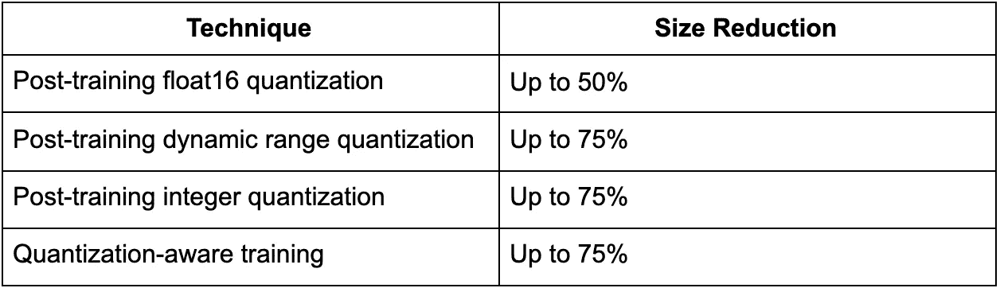
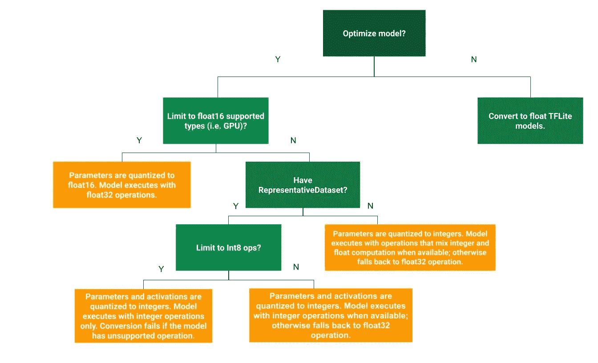

# 模型的量化

> 原文：<https://medium.com/analytics-vidhya/quantisation-of-models-8f609987a1f5?source=collection_archive---------27----------------------->


在[之前的文章](/analytics-vidhya/introduction-to-tf-lite-3a02d753939)中，我们已经讨论了以 TF-Lite 格式保存 Tensorflow 模型。现在让我们来理解为什么优化模型很重要。

1.  尺寸减小导致手机、raspberry pi 等边缘设备的存储尺寸更小。即使是一个小尺寸的模型消耗更少的内存，这给了我们更好的性能和稳定性。
2.  延迟也将减少。(模型在边缘设备中获得单个推断所花费的时间量称为延迟。)延迟还降低了边缘设备的功耗。
3.  对于一些硬件加速设备，如 Edge GPU，如果模型优化正确，模型会给出更快的推断。

量化可以解决这些问题。现在，让我们理解什么是量化。

# **什么是量化？**

量化是一个过程，其中用于表示模型参数的数字的精度(默认情况下，它们是 float32)减少到 float 16 或 int8。

现在让我们用更简单的术语来理解这个东西。

在前向和后向传播过程中，权重以 float32 的形式进行调整，以获得更好的推断，但在量化过程中，权重会根据您使用的量化方法转换为 int8 格式或 float16。这导致减少模型大小和模型的等待时间，从而通过使模型精确来增加模型的加速。

# 量化的类型



**现在让我们了解哪种量化对我们有利:**



参考:[https://www . tensor flow . org/lite/performance/post _ training _ quantization](https://www.tensorflow.org/lite/performance/post_training_quantization)

让我们来理解这个决策树，如果你已经保存了你的模型，那么如果你不想进一步优化它，你就把它转换成一个 TF-Lite 文件。如果你想进一步优化它，那么你有两个选择，你可以量化它:

**空间**

```
import tensorflow as tfconverter = tf.lite.TFLiteConverter.from_saved_model(saved_model_dir)tf_lite_converter.optimizations = [tf.lite.Optimize.OPTIMIZE_FOR_SIZE]tflite_model = tf_lite_converter.convert()
```

**浮动 16**

```
import tensorflow as tf
converter = tf.lite.TFLiteConverter.from_saved_model(saved_model_dir)
tf_lite_converter.optimizations = [tf.lite.Optimize.DEFAULT]
tf_lite_converter.target_spec.supported_types = [tf.float16]
tflite_model = tf_lite_converter.convert()
```

如果您有一个代表性数据集，您可以将其量化为 int8 或 uint8。可用于评估转换器优化的代表性数据集。这有助于通过校准模型的输入来估计最大和最小范围。因此，它有助于量化转换后的浮点模型。

```
def representative_data_gen():
  for input_value in tf.data.Dataset.from_tensor_slices(train_images).batch(1).take(100):
    yield [input_value]
```

这就是我们如何为我们的模型制作一个代表性的数据集。

**uint8**

```
import tensorflow as tfconverter = tf.lite.TFLiteConverter.from_saved_model(saved_model_dir)converter.optimizations = [tf.lite.Optimize.DEFAULT]converter.representative_dataset = representative_data_genconverter.target_spec.supported_ops = [tf.lite.OpsSet.TFLITE_BUILTINS_INT8]converter.inference_input_type = tf.uint8 # or tf.int8converter.inference_output_type = tf.uint8 # or tf.int8tflite_quant_model = converter.convert()
```

这就是我们如何量化我们的模型，以在我们的边缘设备中获得推论。在我接下来的博客中，我将通过制作深度学习模型向你展示，并向你解释量化是如何工作的。

在 Github 上关注我

[](https://github.com/sayannath) [## sayannath -概述

### 我是萨彦纳特。我是 KIIT 大学本科二年级的学生。我是……的主要贡献者之一

github.com](https://github.com/sayannath) 

# 社交把手

*insta gram:*[*https://www.instagram.com/sayannath235*](https://www.instagram.com/sayannath235/)*/*

*领英:*[*https://www.linkedin.com/in/sayannath235*](https://www.linkedin.com/in/sayannath235/)*/*

*邮件:sayannath235@gmail.com*