# 金融犯罪中的量子人工智能

> 原文：<https://medium.com/analytics-vidhya/quantum-artificial-intelligence-in-financial-crime-24a6671915e7?source=collection_archive---------1----------------------->

迈克尔·泽兹奇在 [Unsplash](https://unsplash.com?utm_source=medium&utm_medium=referral) 上的照片

> *“我们从历史中知道，我们只是没有想象力来预测新的信息技术会把我们带到哪里。”—* ***约翰·普雷斯克尔***

# 摘要

本文介绍了量子人工智能(QAI)及其对金融犯罪领域的重大影响，因为它可能比最著名的经典机器学习算法更快地解决一些问题。QAI 专注于开发量子算法，以增强人工智能(AI)中的计算任务，包括机器学习子域。叠加、干涉、纠缠和隧道等量子现象允许量子计算(QC)执行比金融犯罪领域使用的经典人工智能算法更有效的计算。人工智能和量子计算必将共同发展，挑战经典计算范式。本文重点介绍 QAI 的基本原理及其在基于金融犯罪服务的人工智能系统中的各种应用。利用量子计算机的能力带来商业优势是一个需要时间的旅程；试图采取“等着瞧”策略的用户可能会发现自己已经落后竞争对手好几年了。随着量子计算机的实现和未来十年的预计增长，预计早期采用者将实现突破，实现新的商业模式。因此，对于组织来说，现在就行动起来，开始理解量子计算的可能用例，并开始实施计划是有利的。

# 介绍

量子人工智能( [QAI](https://en.wikipedia.org/wiki/Quantum_artificial_intelligence) )整合了多学科领域的知识和方法，使用专注于量子计算的综合方法来推动人工智能及其子域(如机器学习)内的复杂计算任务。

量子计算( [QC](https://en.wikipedia.org/wiki/Quantum_computing) )和人工智能( [AI](https://en.wikipedia.org/wiki/Artificial_intelligence) )是变革性技术，因为人工智能很可能需要量子计算才能取得重大进展。虽然量子计算对人工智能技术的影响非常明显，但没有多少人想到相反的关系。量子计算和人工智能之间的双边关系认为，通过将量子至上论应用于人工智能，量子计算的起源将使今天不可能的人工神经网络新范式的基础成为可能。另一方面，人工智能的最新发展也在影响量子技术的演变。

量子计算可以为人工智能提供计算推动，使其能够解决人工通用智能 [AGI](https://en.wikipedia.org/wiki/Artificial_general_intelligence) 中更复杂的问题(计算机科学的一个分支，涉及建造能够执行类似人类任务的智能机器)。

量子计算和人工智能都是非常活跃的领域，在过去几年中有着压倒性的新发展速度，其中有巨大的交互可能性。由于力学现象，量子算法和人工智能可能无可辩驳地构成更深层次的联系。新兴的 QAI 领域使用量子启发的算法来解决与人工智能相关的计算任务。这种结合可能是高度协同的，因为人工智能的进步对计算资源的要求越来越高。这门课程远远超出了计算能力持续增长的速度。

然而，完全规模的量子技术仍有一段路要走，但一些金融机构已经预见到了潜在的价值。金融犯罪服务需要能够评估一系列可能的结果。为此，银行使用机器学习算法来计算统计概率。在数据丰富的现实中，越来越强大的计算机对于精确估计概率、风险、相关性和因果关系至关重要。量子技术正在接近主流，在这方面，几家银行正在转向新一代处理器，利用量子物理学的原理以超高速处理大量数据。

该领域的领导者谷歌在 2019 年表示，其 [Sycamore](https://en.wikipedia.org/wiki/Sycamore_processor) 量子处理器花了三分多一点的时间来执行一项将占用超级计算机数千年的任务。[谷歌人工智能](https://ai.google/)将量子计算描述为“一种新的范式，将在加速人工智能的任务方面发挥重要作用。我们希望为研究人员和开发人员提供开源框架和超越传统能力的计算能力。”谷歌有开源框架，明确设计来开发新的量子算法，以帮助解决实际问题的近期应用。一个工具是 [Cirq](https://quantumai.google/cirq) ，另一个是 [OpenFermion](https://quantumai.google/openfermion) 。

高盛最近宣布，他们可能在五年内引入量子算法来为金融工具定价。经营航空航天和建筑技术的跨国集团公司霍尼韦尔预测，量子计算将在未来几十年形成一个价值 1 万亿美元的产业。摩根大通还试验了霍尼韦尔的量子计算机，以简化涉及斐波那契数的数学运算。与此同时，摩根大通和花旗集团已经启动了量子计算计划，甚至购买了计算机初创企业的股份。

2019 年末，富国银行加入了 IBM Q 计划，这是一个由公司、创业公司、学术机构和研究实验室组成的社区，致力于探索实际应用[【5】](https://www.mckinsey.com/industries/financial-services/our-insights/how-quantum-computing-could-change-financial-services)。欧洲银行也在探索量子计算的机会。BBVA 已经建立了合作伙伴关系，探索投资组合优化和更有效的蒙特卡罗建模[【6】](https://www.mckinsey.com/industries/financial-services/our-insights/how-quantum-computing-could-change-financial-services)。同样在西班牙，Caixa 银行正在运行一个量子和传统计算的混合框架，目的是更好地对信用风险状况进行分类[【7】](https://www.mckinsey.com/industries/financial-services/our-insights/how-quantum-computing-could-change-financial-services)。

2019 年底，美国银行的一名策略师表示，量子计算将“在 2020 年像智能手机在 2010 年一样具有革命性。[【](https://www.mckinsey.com/industries/financial-services/our-insights/how-quantum-computing-could-change-financial-services)。然而，从业务线的角度来看，最有前途的用例可能是那些需要高度复杂、复合和/或异常快速的模型的用例。

这些举措是有意义的，因为它们允许金融机构在模拟器或云上测试量子算法，而无需获得全面的量子计算机。这似乎是一个明智的策略，只要量子计算机在实际应用中保持亚临界状态，并且没有扩展量子能力的主导设计。

快速而精确地计算欺诈交易的最佳风险分值的能力建立了显著的竞争优势。对历史行为模式的准确估计应该导致决策系统内更好的优化。从广义上讲，通过深入了解实体间关系的规模、高维度、稀疏性、复杂性以及风险的实质性，可以改进一系列公司财务活动中的欺诈和洗钱解决方案。通过更好的加密，支付和资金转移也是安全的。

通过吸引初始投资者和用户，量子计算应用可能会给金融犯罪领域内的非凸优化和约束模型带来许多进步。量子计算可能会带来特定的好处，如使用行为数据增强客户参与度、提高合规性以及更快地应对市场波动。

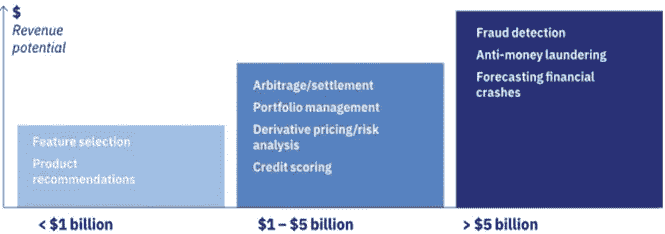

**图 1** :量子计算在金融领域的好处(来源:ibm.com)

量子计算机解决方案的空间比超级计算机系统还要大几个数量级。两倍于传统计算机的能力，大约需要两倍的晶体管数量。在量子计算机中，每当增加一个量子位，计算能力就会加倍。量子计算可能需要几年时间才能获得广泛的商业应用。然而，许多专家预测，这将导致不同商业领域的某些产品和服务的突破，特别是在打击金融犯罪的解决方案方面。金融机构可能会使用量子计算来重组其高级分析解决方案，以防止欺诈。

# 量子计算——基本原理

量子计算过程专注于创建系统和基于技术的量子力学现象，如叠加、纠缠、干涉和隧道效应，允许执行比金融犯罪服务中使用的经典人工智能算法更有效的计算。

**量子位**

量子计算使用比经典计算机使用的传统比特更高级的量子比特。根据量子力学定律的性质，在亚原子水平上，量子位的操作不同于比特。在量子纠缠下，科学家可以将多个量子位推入同一状态，即使这些量子位彼此不接触。2-量子位代表四种状态(00，01，10，11)。由于叠加现象，量子位可以同时代表所有四种状态。随着更多的量子位相互纠缠，两个量子位的叠加成指数增加。因此，一个两量子位结构包含四个可能的值，一个二十量子位结构包含超过一百万个。

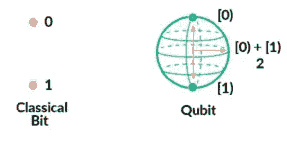

**图 2** :经典比特对量子比特

**量子门**

量子逻辑门(或量子门)是在少量量子位上运行的基本量子电路。它们是量子电路的组成部分，就像传统数字电路中的经典逻辑门一样。经典门对经典比特进行操作，而量子门对量子比特进行操作。与许多经典逻辑门不同，量子逻辑门是*可逆*。这意味着量子门可以利用经典门完全无法达到的量子力学的两个主要方面:*叠加*和*纠缠*。存在无数数量的量子逻辑门。其中一些是由不同的作者命名的。最常见的量子门对一个或两个量子位的向量空间进行操作，就像经典逻辑门对一个或两个位进行操作一样。当测量量子位的状态时，这些值决定了测量 0 或 1 的概率。

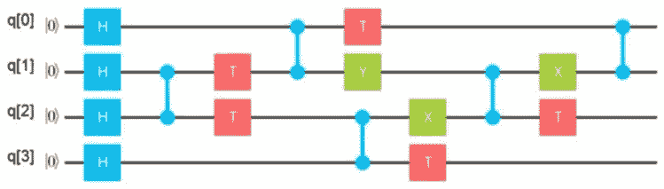

**图 3** : 4x1 通用随机量子电路。(来源:Jason Roell on medium)

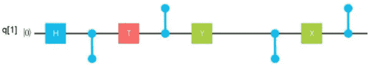

**图 4** :量子位 q[1]上的门形成的“鬃毛刷图案”(来源:Jason Roell on medium)

**纠缠**

量子纠缠是一种已知的现象，其中两个粒子的属性交织在一起，尽管彼此相距很远。这可能是所有量子特性中最奇怪的了。这是一种量子比特之间的量子联姻。纠缠是一件极其有用的事情。测量一个量子位的值，并确定第二个纠缠量子位的值。然而，量子位越多，它们越容易被解码(见下文)。NIST 声称这就是为什么仍然没有量子计算机能够执行有益的任务。在做任何有价值的事情之前，系统可能会崩溃。

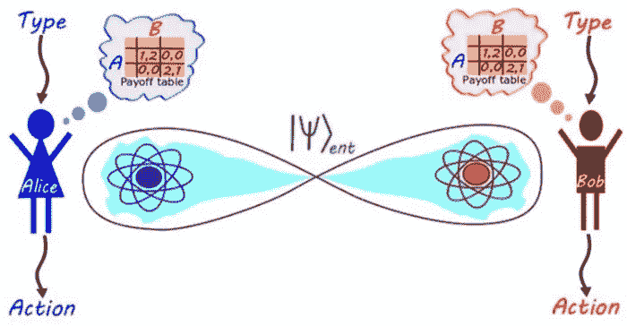

**图 5** :量子纠缠的基本理论和信息传递速度超过光速的可能性

**叠加**

叠加是一种量子系统特征，其中粒子或电子同时存在于几个独立的量子态中。电子只有在被测量时才能在特定的状态下被观察到。也就是说，它脱离叠加，采用一个位置或另一个位置。

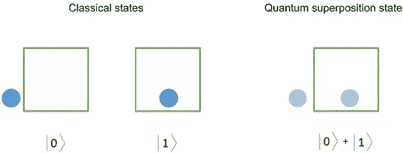

**图 6** :在量子叠加中，量子粒子确实同时存在于两种不同的状态。通过每一次观察，波函数会坍缩成一个单一的经典态——两个态叠加成一个态，就像薛定谔的猫实验中提到的那样。

**干扰**

量子干涉允许量子系统偏向期望的状态。这个想法是创造一种干涉模式，其中通向错误答案的路径破坏性地干涉并抵消，但是通向正确答案的路径相互加强。

直觉的一个经典类比是噪声消除。噪声消除是通过使用叠加和干涉原理来执行的，通过产生频率和振幅大致相同的音调来降低不需要的噪声的振幅。

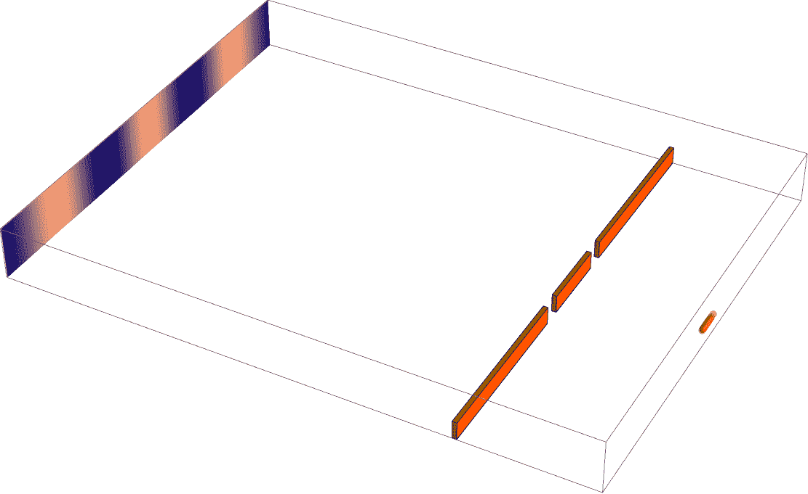

**图 7** :亚原子粒子在第二条狭缝上的干涉图样的形成(来源:Joerg Enderlein)

**退相干**

退相干破坏了叠加态，这是一个严重的问题。因此，研究人员必须保护量子位并将其隔离。当量子叠加(*一个原子同时处于 0 态和 1 态*)被某种外界扰动瓦解时，就会发生退相干。可以是测量原子的研究员。退相干和热态是 QC 的主要误差。

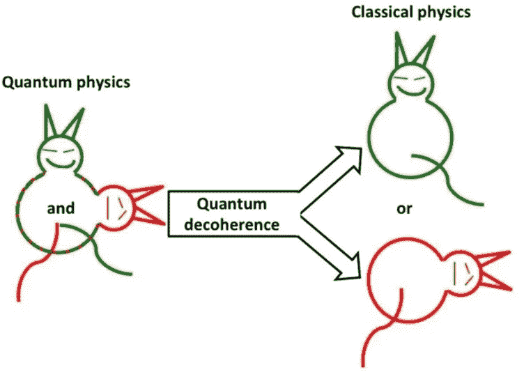

**图 8** :量子退相干是所有那些削弱我们看到活猫和死猫的现象。这些现象是噪音、扰动或相互作用，它们来自于这样一个事实，即单个原子并不孤单。猫动了，空气变了，分子互相撞击；任何事件都可能影响单个原子的完整性，引发它的解体，选择——要么死，要么活。

**隧道挖掘**

量子隧道是一种量子现象，其中原子或亚原子粒子可以穿过势垒传播，并出现在势垒的对面——这是粒子不可能穿透的东西。通过屏障的透射可以是有限的，并且指数地依赖于屏障高度和屏障宽度。量子隧道让一些量子计算机不仅有可能更快地完成任务，而且有可能完成经典计算机在经典物理学的范围内根本无法完成的任务。

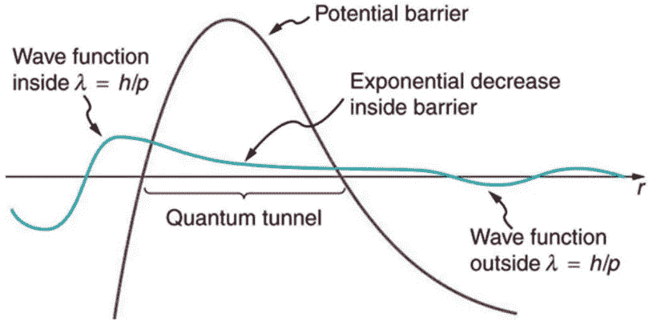

**图 9** :代表一个量子力学粒子的波函数必须平滑变化，从核内(势垒左侧)到核外(势垒右侧)。在势垒内部，波函数不会突然变为零；相反，它呈指数下降。在势垒之外，波函数是小而有限的，在那里它平滑地变成正弦曲线。由于在屏障外发现粒子的概率很小，粒子可以穿过屏障(来源:lumenlearning)

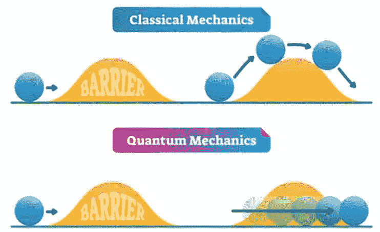

**图 10** :由于电子的波动性质，隧道效应是可能的。量子力学为每个粒子赋予了波动性，因此波穿过屏障的概率总是有限的，就像声音穿过墙壁一样。

**量子至上**

量子优势意味着量子计算机可以实现经典计算机无法实现的事情。在量子革命的前沿，IBM、微软和谷歌等公司正在建造计算机，旨在做经典计算机无法做到或只能在几千年后才能做到的事情。然而，“量子优势”的概念是基于在一台机器中组装足够数量的量子位。

谁刚刚实现了量子霸权？——名为[九章](https://en.wikipedia.org/wiki/Jiuzhang_(quantum_computer))的中国量子计算系统在 200 秒内完成了他们估计世界上最强大的超级计算机之一需要 20 亿年才能解决的问题。

**时间复杂度**

量子计算机可以比经典计算机更有效地处理的问题被称为有界错误量子多项式时间(BQP)——量子计算机可以在多项式时间内解决的一类决策问题，在所有情况下错误概率最多为 1/3。BQP 问题的一个著名例子是因式分解。

不幸的是，我们的大多数问题都是 NP 完全或 NP 困难的。这些词是一种方式，表示我们不知道如何解决它们，我们没有计算资源来解决它们。防止金融欺诈所需的复杂模式识别可能属于 NP 难问题。量子计算机可以高效解决的问题。

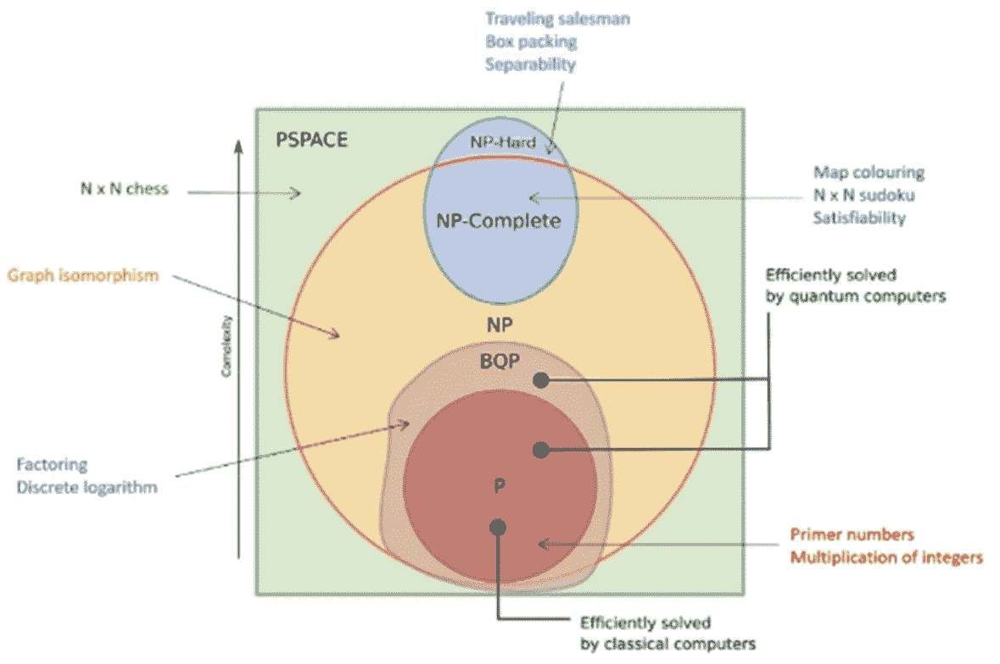

**图 11** :(资料来源:《大西洋技术概论》，Sonia López Bravo，2019 年)

量子计算有助于解决 BQP 空间之外的问题，而 BQP 与 NP 和 [PSPACE](https://en.wikipedia.org/wiki/PSPACE) 的确切关系是未知的，并且需要近似、假设和简化来将任何问题转化为较低阶的其他问题。利用这些，我们可以将任何问题转化为其他较次要的问题。无论如何，这是以牺牲准确性为代价的。量子计算机允许更少的近似，更少的假设，更少的简化。所以量子计算机可以增加准确性。欺诈模式识别问题将受益于这种方法。

**实施**

最近，谷歌宣布了 TensorFlow Quantum( [TFQ](https://www.tensorflow.org/quantum) ):这是一个量子机器学习的开源库，与滑铁卢大学、X 和大众汽车合作。TFQ 的目的是提供必要的工具来控制和模拟自然或人工量子系统。TFQ 是一套结合量子建模和机器学习技术的工具的例子。

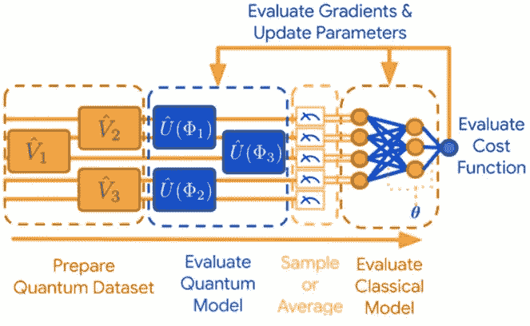

**图 12** :(来源:谷歌)

1.将量子数据转换为量子数据集:量子数据可以表示为一个多维数组，称为量子张量。TensorFlow 对这些张量进行处理，以创建数据集供进一步使用。

2.选择量子神经网络模型:基于量子数据结构的知识，选择量子神经网络模型。目的是执行量子处理，以便提取隐藏在纠缠态中的信息。

3.样本或平均值:量子态的测量从经典分布中提取样本形式的经典信息。这些值是从量子态本身获得的。TFQ 提供了在涉及步骤(1)和(2)的几次运行中求平均值的方法。

4.评估经典神经网络模型-由于量子数据现在被转换为经典数据，深度学习技术被用于学习数据之间的相关性。

**量子计算——局限性**

此时，了解量子计算机的发展程度也是必不可少的。我们正在经历第二次量子革命，我们越来越能够在比以前更大的程度上控制单个量子系统。这就是推动量子计算发展的原因。

然而，尽管第二次量子革命令人兴奋和迅速，但量子计算面临着巨大的挑战。目前的量子计算机没有一台符合所有[迪文森佐的标准](https://en.wikipedia.org/wiki/DiVincenzo%27s_criteria)。

系统的大小决定了可伸缩性，解决问题的难度呈指数增长，而数据量巨大，或者问题的本质非常复杂。这项研究证明，尽管量子计算是解决各种问题的强有力的方法。然而，由于对纯物理的依赖，它具有局限性和挑战性。然而，其他技术推进了量子计算机的硬件和软件开发，在量子计算机上可以创建和运行复杂的算法。

**硬件限制**

困扰研究人员的常见挑战是孤立。量子退相干可以由热和光引起，这是由于约束，例如量子位可以失去它们的量子属性，如纠缠，这进一步导致存储在这些量子位中的数据丢失。此外，量子计算机逻辑门的旋转容易出错，而且它们对于改变量子位的状态也至关重要。错误的旋转会导致输出错误。对于量子机器学习领域来说，要求计算机具有更大的电路长度和纠错能力(每个量子位都有冗余)也是至关重要的。

软件限制

量子计算机算法的开发者必须关心它们的物理学。虽然可以沿着图灵机的路线开发经典算法，但要开发量子计算机的算法，开发者必须将它建立在物理学的基础上，没有简单的公式将它与逻辑联系起来。这种设计的关键问题总是可伸缩性。设计一个程序，用更强的处理能力处理更大的数据。很少有信息可以用来开发这样的量子计算算法。所以大部分的开发都是直观的。大多数已知的量子算法都受到特定模拟条件的限制，这限制了它们的实际应用，并且很难开发出能够对机器学习产生重大影响的模型。

量子计算的另一个限制是，一个量子圈上可以拥有的量子位数量是有限的。虽然这些限制一般适用于量子计算，但机器学习等领域的扩展可以吸引更多的注意力，并以适当的梯度和幅度刺激主题。

即使在那些日子里，专家们仍然试图让量子计算机足够好地工作，但这项任务仍然具有挑战性，主要是因为量子态是脆弱的。退相干是一个关键的限制，当叠加态崩溃时，计算机就会丢失信息。系统中最轻微的噪声都会导致退相干。量子计算机是极其复杂和昂贵的机器。就像任何新兴技术一样，限制不胜枚举。随着政府和世界上最大的公司投入数十亿美元，量子计算能力的竞赛正在突飞猛进。

**量子计算的重要里程碑**

虽然量子计算是一项不成熟的技术，但量子计算中的改进增加了量子人工智能的潜力。然而，量子人工智能行业需要关键的里程碑才能成为更成熟的技术。这些关键步骤将使量子人工智能能够进一步发展。

*   不易出错且更强大的量子计算系统
*   广泛采用的开源建模和培训框架
*   丰富而熟练的开发者生态系统
*   量子计算优于经典计算的引人注目的人工智能应用

根据洛斯阿拉莫斯国家实验室最近的研究，量子机器学习不能成为量子混沌和热化(通过物理体之间的相互作用达到热平衡的过程)等调查过程的一部分。它对通过量子计算学习任何与之相关的新过程设置了实质性的限制。一项研究基于海登-普雷斯基尔的思维实验。一项思想实验，通过假设从霍金辐射中解码扔进黑洞的信息需要多长时间来研究黑洞信息悖论。

# 量子人工智能——在金融犯罪中的应用

金融犯罪是风险管理中发展最快的领域之一。新技术和法规遵从性处于这一不断发展的行业的前沿，随着金融机构寻求可靠、值得信赖的欺诈、反洗钱和金融市场法规遵从性解决方案，这一行业在过去几年取得了巨大的发展。金融服务公司利用人工智能和机器学习的进步力量，通过拥有动态和复杂的金融犯罪解决方案，使自己从竞争对手中脱颖而出。

能够利用量子计算的金融机构可能会看到巨大的好处。公司将能够以集中和分散的方式分析大型结构化和非结构化高维数据集。对金融犯罪领域的更深刻见解可以帮助银行做出更好、更快的决策，并通过利用量子计算的力量大幅提高价值实现时间。

金融犯罪部门开始预测量子计算可能创造的巨大变革可能性，并为量子计算机的潜在用例做好准备。许多金融机构和银行正在投资量子解决方案，以改善他们的财务运营。投资量子计算集成的公司在为量子解决方案建立金融建模问题的专业知识方面获得了优势。此外，金融机构在雇佣本已稀缺的量子人才方面获得了优势。

摩根大通公司(JPMorgan Chase & Co .)一个研究部门的负责人 Marco Pistoia 希望，量子计算机可以通过加快资产定价、挖掘表现更好的投资组合以及改进现有的最大似然算法来提高利润。西班牙 BBVA 银行今年 7 月发表的一项研究发现，量子计算机可以提高信用评分，发现套利机会，并加速蒙特卡罗模拟(《经济学人》，2020 年)[ [10](https://www.economist.com/finance-and-economics/2020/12/19/wall-streets-latest-shiny-new-thing-quantum-computing) ]。甚至高盛的量子研究负责人 William Zeng 也大胆声称，量子计算机可以“彻底改变”银行和金融业(《经济学人》，2020) [ [11](https://thegradient.pub/knocking-on-turings-door-quantum-computing-and-machine-learning/) ]。

银行业的一些人认为，量子计算更多的是科幻小说，而不是事实，计算能力不是商业模式的关键区别。当然，为客户服务不仅仅是计算速度和灵活性。尽管如此，量子计算在解决复杂或棘手的问题方面，尤其是在优化领域，越来越多地成为游戏规则的改变者。量子解决方案进入主流只是时间问题，这意味着加快速度和获得竞争优势的窗口不会打开太久。

谈到金融犯罪，全球的金融机构都在应对系统性威胁。从欺诈和洗钱到了解你的客户(KYC)和内幕交易，这些违法行为不仅会对组织，还会对个人和经济产生重大影响。它们可以助长犯罪企业和活动，包括人口贩运、恐怖主义和毒品贸易。

狡猾的犯罪集团继续利用新技术和快速变化的条件来实施日益复杂和大规模的非法计划，从隐藏非法资金到各种形式的第一方和第三方欺诈。最终结果是，金融机构面临着比以往任何时候都多的犯罪威胁，这些威胁来自组织内部和外部。作为强制合规和欺诈防范计划的一部分，金融机构将拥有各种系统和技术。但是，随着复杂和不断变化的欺诈和金融犯罪模式，如果没有基于人工智能系统的高级分析解决方案，这些工具无法快速有效地阻止这些事件。

大数据集的复杂性和规模比计算资源增长得更快，因此扩展了计算能力。虽然今天的计算机难以解决一些问题，但量子计算很可能在几秒钟内解决同样的问题。然而，据预测，特别是人工智能和机器学习可以受益于量子计算技术的进步，并将继续受益，甚至在完整的量子计算解决方案可用之前。量子计算算法允许我们增强机器学习领域中已经存在的可能性。

在量子计算中，用户可以物理控制电磁场强度、激光脉冲频率等参数来解决问题。因此，量子机器学习算法可以像人工神经网络一样得到训练。量子计算机的主要优势是可以产生经典系统认为难以产生的图案。因此，有理由假设量子计算机可能在机器学习任务上胜过经典计算机。它导致了一个新的领域，称为量子机器学习。

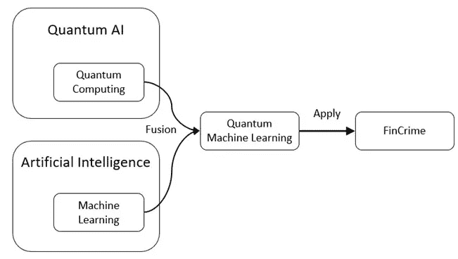

**图 13** : QAI 专注于构建量子算法来改善人工智能的计算任务，包括机器学习等子领域。量子计算在金融犯罪上的应用(来源:作者)

**数据处理**

量子计算可能推动革命的方式之一是，它能够执行数据采样和数据处理，以完成探索性数据分析任务，解决多种类型的问题，例如检测、预防和调查欺诈、洗钱和违规行为，并从整体上了解整个组织的风险。

大数据的各向异性膨胀需要不同的计算架构方法来处理大量生成的数据。不仅范围更大，而且试图解决的问题种类也非常不同。量子计算机能够更好地解决与数据流处理和分析相关的顺序问题。

量子计算机将允许快速分析、数据摄取以及通过拓扑从巨大的集中式和分散式数据源进行集成，并促进机器学习开发工作流中的 ETL 过程。量子计算可以快速处理大型数据集，并为基于人工智能的技术提供数据，以在更细粒度的水平上进行分析，识别复杂的不可重复模式和异常。

由于量子技术可以增强机器学习算法(quantum-enhanced machine learning)，量子计算机在该领域最常见的应用是指机器学习中的描述性和诊断性分析，用于无法通过经典计算执行的数据处理。

**采样和分布参数化**

采样是一种基本技术，用于近似由于各种约束(如时间、成本和硬件容量)而无法直接或有效计算的答案。旨在选择、操作和分析数据集的代表性子集，以识别被检查的大型数据集中的模式和趋势的采样技术。一般来说，概率分布是隐式定义的。很容易计算出任何给定点的概率。但是没有已知的分布结构。不可能以少于经典步骤的步骤根据任意概率分布进行精确采样。

最近的理论和实践成功证明了量子计算能力超越了经典的易处理性，这表明量子计算机可以从概率分布中采样，而使用传统计算机很难对这些概率分布进行指数采样。如果这些分布与真实世界的分布一致，这将表明潜在的显著优势。最近关于量子神经网络的研究显示了这一优势。它试图通过一些可调参数集和量子核方法来参数化分布。这些方法使用量子计算机来定义特征映射，将经典数据映射到量子希尔伯特空间(*无限维内积空间，具有完备或封闭的性质*)。这些方法超越经典模型的能力的理由通常遵循与量子模拟结果相似的路线。这意味着，在从传统计算角度来看非常困难的情况下，执行复杂的采样过程将是毫不费力的。

**数据整合**

由于异构数据集的集成，量子计算将导致巨大的突破。虽然一开始没有人类干预可能很难做到，但人类的参与将有助于计算机学习如何在未来整合数据。因此，如果有不同的原始数据源，并且这些数据源附有独特的模式，并且一个研究小组想要比较它们，那么计算机必须在数据比较之前理解模式之间的关系。要做到这一点，自然语言的语义分析需要有所突破。这是人工智能面临的最大挑战之一。然而，人在回路提供数据监管，然后为未来训练系统。前景是量子计算机将允许快速分析和集成庞大的数据集，从而改善和转变机器学习和人工智能的能力。

**优化**

优化问题是机器学习模型、基于决策系统的人工智能或任何其他基于金融犯罪解决方案的高级分析的核心。优化的目的是在一组优先标准和约束条件下获得最佳解决方案。典型的优化解决方案如下:包括采样、模拟、成本函数的最小化、拟合机器学习算法、训练模型、正则化、HPO 等等。

量子计算机具有独特的能力，有助于更有效地解决这些复杂类型的优化问题:使用叠加的量子属性来表示所有可能的解决方案，而干涉的量子属性则可以识别低成本、高价值的解决方案。解决这些问题的经典方法要么计算时间呈指数增长，要么性能不佳。量子优化算法，如量子近似优化算法( [QAOA](https://en.wikipedia.org/wiki/Quantum_optimization_algorithms) )有希望找到改善次优解的答案，而不会导致指数级增长的计算时间。它可以包括在训练场景中找到更好的最优解，执行非凸优化，逃离或求解[鞍点](https://en.wikipedia.org/wiki/Saddle_point#:~:text=In%20mathematics%2C%20a%20saddle%20point,local%20extremum%20of%20the%20function.) ( *，其中函数在一个方向上具有局部最大值，但在另一个方向上具有局部最小值*，或者用更少的查询找到最优解。

[D-Wave](https://en.wikipedia.org/wiki/D-Wave_Systems) (一家*加拿大量子计算公司*)，正在广泛使用量子退火来解决优化和采样问题。最近，他们推出了一个开源插件，允许开发人员轻松地将 IBM 的 [Qiskit](https://qiskit.org/) 格式的二次优化输入映射到 D-Wave 的二次无约束二进制优化(曲波)格式，并在 Qiskit 支持的任何量子系统上求解相同的输入。这使得用户能够对量子退火对其应用的好处进行现实的评估。

量子退火器是一种通用量子计算机版本，专门寻找超局部最小值和比经典计算机更接近全局最小值的近似值。量子退火器的工作原理是将一系列磁铁连接到一个网格上。磁体相互影响，并且通过反转到协调的方位，通过最小化其使用来为系统节省能量。在传统系统中，磁体在能够找到更低的最小值之前被限制在低能量设置中。然而，获得量子属性，如隧道，他们可以省略那些大的能量成本设置，允许函数更容易地从局部最小值下降到全局最小值或接近全局最小值的最接近的局部最小值。

对于成本函数，这可能意味着陷入次优设置的梯度下降函数与最优或接近最优设置的梯度下降函数之间的差异，尤其是在鞍点可能为基底的复杂非凸误差表面上。

在存在软需求的情况下，这种方法为复杂的机器学习优化问题提供了可靠的解决方案。这意味着需要巨大的传统计算能力。通过利用量子隧穿，在诸如金融犯罪领域中的欺诈损失分析的优化应用中，可以快速收敛到误差函数的最小化。

**蒙特卡洛模拟**

蒙特卡罗方法是一种用于估计不确定事件的可能结果的数学技术。蒙特卡罗模拟执行随机抽样来估计难以确定性计算的数值。它使用概率函数中不同的一组随机值重复计算结果。蒙特卡罗模拟用于模拟过程中不同结果的概率，这些结果由于随机变量的干预而不容易预测。

这是一种技术，用于了解金融犯罪解决方案中预测和预测模型中的风险和不确定性的影响。然而，为了获得最小相关误差的最有效结果，所需的模拟数量是巨大的。这些计算通常需要 24 小时。

因此，在蒙特卡罗方法中获得量子加速是非常有益的。可以使用量子振幅放大估计算法([振幅放大](https://en.wikipedia.org/wiki/Amplitude_amplification))来实现，该算法可以比经典方法更快地对概率分布进行二次采样。量子幅度估计算法基于从具有不同数量的幅度放大操作的量子电路产生的测量数据，采用最大似然估计( [MLE](https://en.wikipedia.org/wiki/Maximum_likelihood_estimation) )。

金融衍生产品的风险分析和定价是可以用这种方法解决的一些问题。确定一个交易台的整个投资组合的风险通常需要隔夜的价格计算。通过量子计算，通宵计算可以减少到更短的时间尺度(比如分钟)。它允许机构对不断变化的市场条件做出更快的反应，并从及时实现价值的机会中获利。

IBM 已经发表了一篇论文，展示了蒙特卡罗模拟的二次加速版本。剑桥量子计算( [CQC](https://cambridgequantum.com/) )最近利用量子振幅估计在量子蒙特卡罗积分方面取得突破。自 2017 年以来，摩根大通和巴克莱一直在使用 IBM 的量子计算软件测试蒙特卡罗模拟，以优化投资组合。与蒙特卡洛方法相比，高盛能够将一百万条潜在路径的衍生品定价速度提高一千倍。BMO 金融集团和加拿大丰业银行与 Xanadu 合作，为各种交易产品测试量子蒙特卡罗算法。

**训练模式**

构建和训练机器学习模型带来了巨大的挑战。需要大量的计算资源来训练鲁棒的和通用的模型。简单的数据集可以只使用 CPU 来训练，应该只需要几分钟。另一方面，更复杂的深度学习模型需要 2 到 32 个 GPU 和 u 到几天的时间来训练，特别是在处理典型的金融犯罪数据集时，这些数据集由于欺诈交易的少数类别而变得高维、稀疏和极度不平衡。

用于经典学习模型的量子概括的量子算法的开发可以在深度学习训练过程中提供可行的加速和其他改进。量子计算可以用于快速训练机器学习模型，并创建优化的算法。量子计算对经典机器学习的贡献可以通过快速呈现人工神经网络权重的最优解集来实现。量子计算提供的优化稳定的 AI 可以在短时间内完成多年的分析，并导致技术的进步。

**模式识别**

量子计算有望搜索大量无序的数据集，以极快的速度识别模式或异常。量子计算机有可能同时访问数据库中的所有项目，从而在几秒钟内识别出这些相似之处。虽然这在今天理论上是可能的，但它只发生在并行计算顺序查看每个记录的情况下，因此它需要大量的时间，并且取决于数据集的大小，这些类型的任务可能永远不会完成。

**强化学习**

量子计算架构的创建充满了传统离散计算技术难以解决的挑战，更适合人工智能模型。其中一个问题被称为量子控制优化，重点是量子控制的设计，将每个量子算法转化为一组模拟控制信号，这些信号可以在希尔伯特空间(配有内积运算的向量空间，允许定义长度和角度)周围精确地操纵量子计算机。这些控制的精确选择最终决定了每个量子操作的保真度和速度。到目前为止，量子计算一直缺乏一个通用的控制框架，该框架有助于在限制量子架构创建的系统约束下优化主要的实验非理想性。

在一篇题为“[通过深度强化学习实现通用量子控制](https://arxiv.org/abs/1803.01857)”的论文中，谷歌提出了一种新的深度强化学习框架，该框架同时优化了量子计算的速度和可信度，以防止泄漏和随机控制错误。通过在强化学习代理的训练环境中加入控制噪声来提高控制鲁棒性。代理控制解决方案表明，平均门误差比基线随机梯度下降解决方案降低了 2 个数量级，门时间比最佳门合成对应物降低了 1 个数量级。

**云**

量子云计算是一种量子计算机，可以在云环境中通过网络访问。基于云的量子计算提供了对仿真器、模拟器和量子处理器的直接访问。在云中利用量子服务的最大优势之一是，它允许通过网络访问量子物理驱动的计算机。2016 年，IBM 将一台小型量子计算机连接到云上，它允许在云上构建和执行简单的程序。2017 年初， [Rigetti Computing](https://en.wikipedia.org/wiki/Rigetti_Computing) 的研究人员使用 [pyQuil Python 库](https://en.wikipedia.org/wiki/Quil_(instruction_set_architecture))演示了第一次可编程云访问。[量子编排平台](https://www.quantum-machines.co/solutions/cloud-infrastructure/)为控制量子处理器和运行繁重的经典处理提供了一个统一的框架。先进的流处理框架和内置的人工智能引擎允许从第一天开始运行和优化混合量子经典算法。

云中的量子计算有可能以与人工智能和机器学习等其他新兴技术类似的方式颠覆行业。今天的云服务旨在为即将到来的量子计算机开始有用的那一天做好准备。量子计算甚至可以补充云提供商目前提供的一般计算和人工智能服务。在这种情况下，云将在一个协同处理环境中与传统的计算云资源相集成。事实上，利用云的弹性和量子计算强大的特定问题解决能力，量子计算和人工智能共生有很大的潜力。可以想象的前景是，两者和谐地合作，解决具有挑战性的复杂问题。两者各有所长，量子计算是解决方案的一部分。随着时间的推移，这两种计算格式将继续发展，但在利用量子计算能力的同时加速传统 GPU 和 ASICs 上的工作负载的能力是更快、更强大的结果的秘诀，这也是随着量子计算变得更加广泛，市场应该渴望看到的。

基于云的量子计算最突出的应用之一是利用去中心化人工智能的元素，如联邦和分布式机器学习范式。以模型为中心和以数据为中心的方法都可以获得更高的加速比和鲁棒性，同时通过在云上引入集体智能，以离线或在线学习的方式训练中大型数据集。

**量子神经网络**

量子神经网络是变分[量子算法](https://en.wikipedia.org/wiki/Quantum_algorithm)的一个子类，由包含参数化量子门操作的量子电路组成。信息首先通过适应量子模型的增强性能的特征图被编码到量子状态中，并且通常既不被优化也不被训练。一旦数据被编码成一个量子状态，一个包含参数化量子门的变分模型就被应用并为一个特定的任务进行优化。这通过损失函数最小化来实现，其中量子模型的输出可以从经典的后处理函数中提取。

量子神经网络( [QNN](https://en.wikipedia.org/wiki/Quantum_neural_network) )是一种新兴的深度学习范式，它促进了可以在量子计算架构上运行的人工神经网络的创建。在一篇论文“[用量子神经网络在近期处理器上分类](https://arxiv.org/abs/1802.06002)”中，谷歌提出了一个量子神经网络模型，专注于表示标记数据的分类任务。所提出的架构不同于经典的深度神经网络。量子神经网络架构不是隐藏层，而是由量子位上的量子门构成。谷歌在著名的 [MNIST](https://en.wikipedia.org/wiki/MNIST_database) 数据集中训练了他们的量子神经网络，结果令人印象深刻。

训练人工神经网络是一项众所周知的棘手任务，然而，量子神经网络表现出弹性，并且由于其有利的优化景观而比经典人工神经网络模型训练得更快，通过均匀分布的 [Fisher 信息](https://en.wikipedia.org/wiki/Fisher_information) ( *我们可以从样本*光谱中获得多少关于未知参数的信息)捕获。

基于量子神经网络的金融犯罪解决方案可能会受益于一个强大的通用模型，该模型可以捕捉大量数据中复杂的欺诈模式，并可以在几分钟内有效地训练。通过引入变分量子算法，量子神经网络架构通过结合分布式深度神经网络，朝着基于云上的数据联合体实现欺诈解决方案的方向发展。

**可解释的人工智能**

模型治理、风险和法规遵从性对于金融机构确保运营的可靠性和业务成果的实现至关重要。金融机构和企业面临越来越大的压力，需要建立适当的风险管理框架来发现、预防和调查金融犯罪。因此，金融犯罪解决方案应满足监管要求，并提供可解释、透明和可信的分析解决方案。

[量子逻辑门](https://en.wikipedia.org/wiki/Quantum_logic_gate)的一个独特特征是它们是可逆的，这意味着，与经典逻辑门不同，它们带有一个撤销按钮。实际上，这意味着在测量之前，量子比特不会丢失任何信息，当量子比特恢复到经典比特的行为时。它在机器学习模型的可解释性和可解释性领域是有用的。确定算法对欺诈性交易的预测的特征重要性集合是容易访问的。

# 激活

NICE Actimize 使用创新技术来保护机构以及消费者和投资者的资产，识别金融犯罪，防止欺诈并提供法规遵从性。它提供实时、跨渠道的欺诈防范、反洗钱检测和交易监控解决方案，解决支付欺诈、网络犯罪、制裁监控、市场滥用、客户尽职调查和内幕交易等问题。基于人工智能的系统和高级分析解决方案可以更早、更快地发现异常行为，消除从盗窃到欺诈、从监管处罚到制裁的财务损失。因此，组织减少了损失，提高了调查人员的效率，并改善了法规遵从性和监督。

NICE Actimize 看到了量子人工智能的直接应用，量子计算可以利用速度和特异性来帮助克服人工智能和机器学习中非常复杂的问题。事实上，量子计算的快速胜利最有可能出现在人工智能的子领域，如机器学习已经改进了传统的分类和回归解决方案，应用预测分析进行预测和预报。

NICE Actimize 认为，在接下来的几年里，量子计算很可能会推动这些活动。可以肯定的是，这将是一条漫长的道路，大多数银行正在迈出第一步。然而，在开始这一旅程时，银行现在需要考虑三个行动:

*   与 QAI 开发者建立研究伙伴关系，如亚马逊、D-Wave、IBM、谷歌、微软、Rigetti 和 Xanadu。这些公司拥有硬件和专业知识来帮助组织发展他们的能力。
*   创建一个专注于量子计算的小团队。在基于人工智能和高级分析的金融犯罪解决方案中，这种合作关系不是单行道，量子提供商也热衷于向金融行业参与者学习他们的算法和要求。一定要为合作做出贡献。
*   探索潜在的投资或合资企业。考虑到建造量子系统的挑战，合资企业可能会盛行。融合了量子技术的经典解决方案可能会形成云，为数据分析和模拟提供并合并复杂的优化。它可能会通过一个供应商平台获得，该平台可以简化采用流程并帮助运行初始 POC。
*   可以想象，早期采用者会有优势。不管怎样，在所有情况下，实际的第一步是用量子语言重写内部算法，这将为实质性的资金奠定基础。

# 结论

量子计算的到来可能会改变游戏规则。金融机构才刚刚开始接触必要的硬件，并开发出它们需要的量子算法。尽管如此，越来越多的倡议表明，一个卢比肯是在地平线上。对于尚未参与的银行，尤其是那些依赖计算能力和基于人工智能的系统来产生竞争优势的银行，现在是行动的时候了。

在未来几十年，量子计算将在技术、科学和商业发展中发挥重要作用。随着谷歌声称量子优势和对这一主题的指数兴趣，我们离看到量子计算解决经典计算机难以解决的许多棘手问题不远了。此外，有明确的迹象表明，机器学习和量子计算将在加强彼此的领域中发挥互补作用。

银行业的一些人认为，量子计算更多的是科幻小说，而不是事实，计算能力不是商业模式的关键区分因素。当然，为客户服务不仅仅是计算速度和灵活性。尽管如此，量子计算在解决复杂或棘手的问题方面，尤其是在优化领域，越来越多地成为游戏规则的改变者。量子解决方案进入主流只是时间问题，这意味着加快速度和获得竞争优势的窗口不会打开太久。

# 文献学

1.  亚历山大·斯特列佐夫等人。艾尔。，(2017)学术讨论会:量子相干作为一种资源。修订版。物理，89:041003

2.Amira Abbas 等人(2020 年)。量子神经网络的力量

3.伯恩斯坦和瓦齐拉尼(1993 年 6 月)。量子复杂性理论。ACM 数字图书馆。

4.C. H. Bennett 等人(1997 年)。量子计算的优势和劣势。SIAM 计算杂志，26(5):1510–1523

5.D. M .培根。(2001)量子计算机中的退相干、控制和对称性。加州大学伯克利分校

6.D.V. Fastovets et。艾尔。, (2019).量子计算理论中的机器学习方法

7.例如，Rieffel 和 W. H. Polak (2011)量子计算:一个温和的介绍。麻省理工学院出版社，第一版

8.e .唐。(2018)推荐系统的量子启发经典算法。计算复杂性电子学术讨论会(ECCC)，25:128

9.爱德华·法希等人。艾尔。, (2018).用量子神经网络在近期处理器上进行分类

10.Eleanor G,《使用可编程超导处理器的量子优势》,美国宇航局艾姆斯研究中心

11.法耶，J. (2002 年 5 月 3 日)。量子力学的哥本哈根诠释。斯坦福哲学百科全书

12.费曼(1986)。量子力学计算机。物理学基础，16(6)，507–531 页。

13.Gilles Brassard 等人(2000 年)。量子振幅放大和估计

14.新黄原等人，(2021，谷歌研究)。量子机器学习中数据的力量。

15.伊万·多伊奇。利用第二次量子革命的力量。PRX 量子。

16.John Preskill，(2020)加州理工学院量子信息与物质研究所量子计算 40 年后。

17.科普奇克 D. (2018 年 4 月 25 日)。数据科学家的量子机器学习

18.莫非牛等人。艾尔。, (2018).通过深度强化学习的通用量子控制

19.S. Simon (2010)量子计算……有所改变。物理世界

20.Vadlamudi，S. (2019)。人工智能如何提高农业生产率和可持续性:全球专题分析。亚太能源与环境杂志，6(2)，91–100。

21.蒋伟文等人。艾尔。, (2020).当机器学习遇到量子计算机:案例研究