# 基于张量流的量子卷积神经网络图像分类

> 原文：<https://medium.com/analytics-vidhya/quantum-convolutional-neural-network-for-image-classification-using-tensorflow-334c6c2c73f0?source=collection_archive---------3----------------------->

神经网络中的实现量子

阿迪·戈尔茨坦在 [Unsplash](https://unsplash.com/s/photos/quantum-computing?utm_source=unsplash&utm_medium=referral&utm_content=creditCopyText) 上的照片

# 介绍

量子计算有可能超越经典计算机，并有望在各个领域发挥积极作用，在量子机器学习中，量子计算已被发现对增强的特征表示和状态近似有用(Watabe et al. 2021)。基于量子比特(qubits)的量子计算，灵感来源于量子态中的粒子现象。这种现象是一个量子态的粒子可以同时有两种状态的叠加现象(Gultom 2017)。处理这种现象的方法被转换成量子比特的形式，即 0.1 或两者都是(Kaye 2007)。

# 主要成分

## 量子位

量子计算使用量子位作为信息的基本单位，用一个状态向量来表示(加多和尤尼斯，2021)。狄拉克符号是保罗·狄拉克发现的量子力学中使用的符号之一。在狄拉克符号中，标识向量的符号写为:

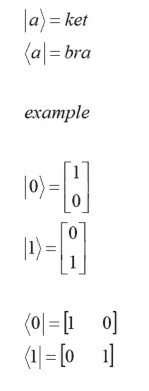

此外，这些符号将使用量子逻辑门操作。量子位是量子信息的基本单位，一个量子位:一个两级系统，可以存在于这两个可能状态的叠加中。

## 门和操作

量子门是[酉算符](https://en.wikipedia.org/wiki/Unitary_operators)，相对于某个[基](https://en.wikipedia.org/wiki/Basis_(linear_algebra))被描述为[酉矩阵](https://en.wikipedia.org/wiki/Unitary_matrix)。在[量子计算](https://en.wikipedia.org/wiki/Quantum_computing)中，特别是在[量子电路](https://en.wikipedia.org/wiki/Quantum_circuit) [计算模型](https://en.wikipedia.org/wiki/Model_of_computation)中，一个**量子逻辑门**(或简称为**量子门**)是一个基本的量子电路，对少量[量子位](https://en.wikipedia.org/wiki/Qubit)进行操作。它们是量子电路的组成部分，就像传统数字电路的经典逻辑门一样。门是一种可以应用于量子位集合(具有 Qid 的对象)的效应。通过调用它们的 on 方法，或者调用量子位上的门，门可以应用于量子位。这种调用创建的对象是一个操作。

盖茨与运营

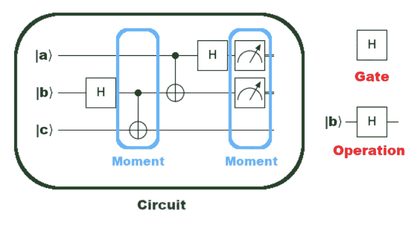

上面的例子展示了一个量子隐形传态电路的前半部分，在很多量子计算教科书中都可以找到。这个例子使用了三个不同的门:阿达玛(H)、受控非(CNOT)和测量。这些在 *cirq* 中用 *cirq 表示。H* ， *cirq。CNOT* 和*分别测量*。
量子计算有自己的逻辑门，即量子逻辑门(quantum gate)。有几种量子逻辑门，如下所示:

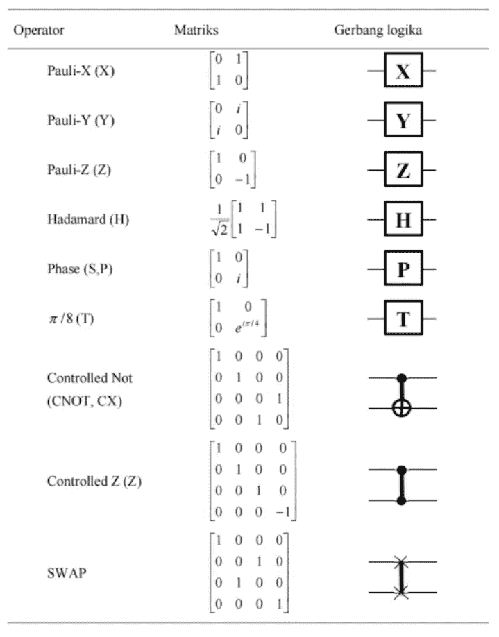

## 电路

一条线路是一系列瞬间的集合。一个时刻是所有活动在同一个抽象时间片内的操作的集合。操作是对量子位的特定子集进行操作的一些效果，最常见的操作类型是选通操作。

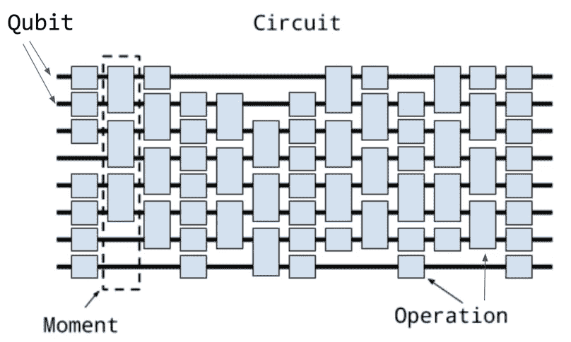

## 架构 CNN VS QCNN

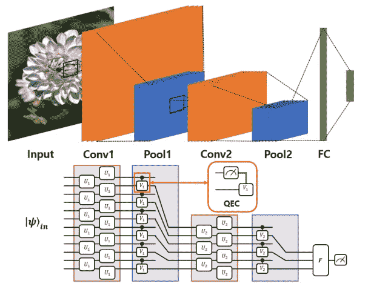

卷积神经网络(CNN)是一种用于处理图像数据的深度学习方法。在这个过程中，CCN 有几个主要层，即卷积层，子采样层，和完全连接层。

量子卷积神经网络是基于量子计算的 CNN 的发展。QCNN 将 CNN 的主要特征和结构扩展到量子系统中(Oh et al. 2020)。

# 构建量子卷积神经网络

## 安装库

对于量子卷积神经网络的制造，推荐使用 [google collab](https://research.google.com/colaboratory/) 或者 [Kaggle notebook](https://www.kaggle.com/code) ，因为这两种环境都已经支持 TensorFlow-Quantum 包。

导入包

## 输入数据 MNIST

将使用的数据是 MNIST 数据库(修改后的国家标准和技术研究所数据库)。

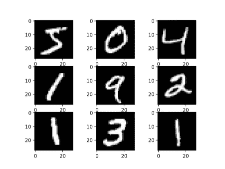

MNIST 数据库

将使用的 MNIST 数据只有两位数 3 和 6。

示例数据:

在用大数据实现 QCNN 的过程中，它仍然需要足够大的资源，因此对于本教程，我们将把数据大小调整为 4 x 4 像素，并删除矛盾的数据。

下一个过程是对极限值为 0.5 的像素数据的宁滨过程，其中大于或等于 0.5 的像素值将具有值 1，小于 0.5 的像素值将具有值 0。上述转换过程的一个例子如下:

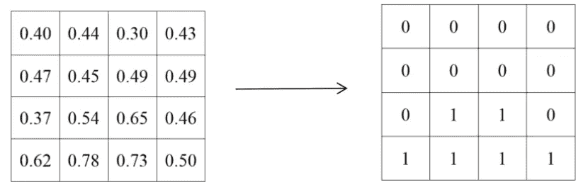

下一阶段是准备簇状态作为数据处理环境，因为使用的数据是 4 x 4 像素，因此它采用总共 16 个量子位的簇状态，簇状态如下:

下一步是将数据转换成数据电路。在这个变换中，对于值为 1 的数据添加 Pauli-x 门，对于值为 0 的数据，不添加 Pauli-x 门。

上述转换的一个示例如下:

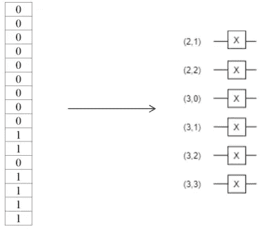

## 建造艺术博物馆

量子卷积神经网络架构的制作有几个阶段，即**量子电路**的制作、**量子层**的构建、**量子卷积神经网络架构**的构建。

## **量子电路**

在形成量子电路的阶段，需要三个主要的量子电路，即*一比特酉电路*、*两量子比特酉电路*和*两量子比特共用电路*，其中量子电路如下:

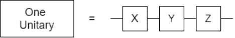

**一肘单回路**

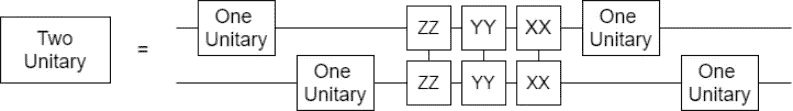

**两量子比特酉电路**

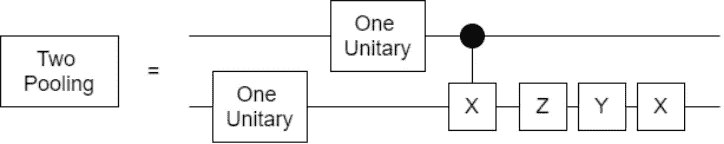

***双量子位池电路***

电路是构建量子层架构的组件。在量子层发展的下一个阶段。

## 量子层

量子层的构建，构建一个量子卷积神经网络架构需要三层，即*量子卷积层*、*量子池层*和*量子神经网络层*，各层如下:

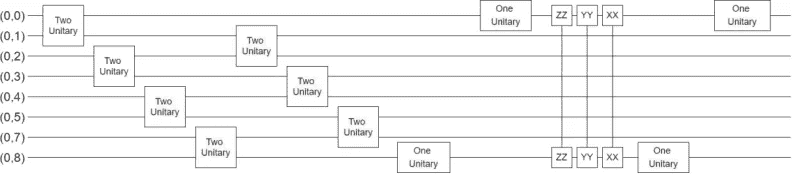

***量子卷积层***

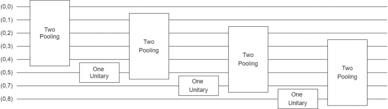

**量子池层**

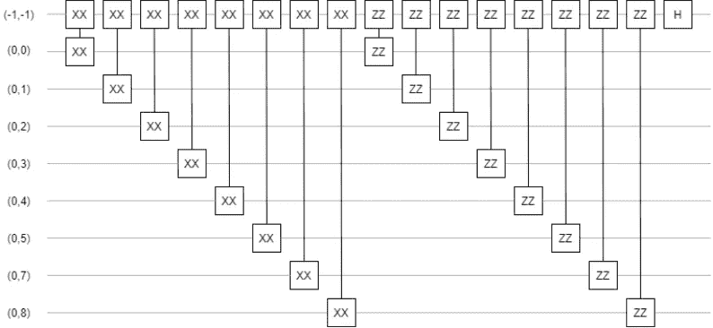

**量子神经网络层**

量子卷积层由七个单量子比特电路和四个单量子比特电路组成，外加六个量子门。量子池层由四个双量子位池电路和三个单量子位酉电路组成。此外，量子神经网络层由泡利-x 门和泡利-z 门的阵列组成。量子层形成后，下一步就是将量子层排列成量子卷积神经网络架构。

## 构建成为 QCNN 架构

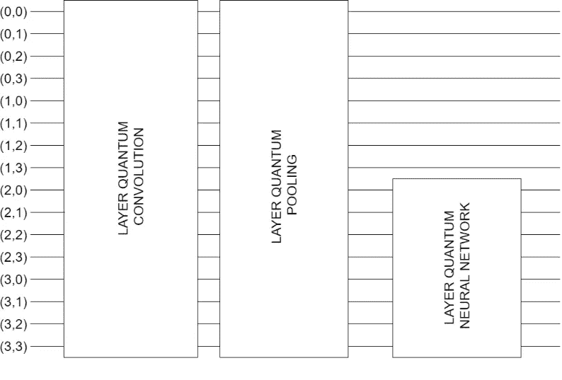

这个量子卷积神经网络架构由 16 个量子比特数据输入的*量子卷积层*，16 个量子比特数据输入的*量子池层*，8 个量子比特数据输入的*量子神经网络层*组成。

## 培训模式

对于本教程，我们将尝试简单的建模，不需要太多时间，有 5 个时期，使用 500 个数据样本。如果感兴趣，你可以直接用不同的参数和它们的变化来尝试。

建模结果显示了相当好的结果，最新验证准确率为 83.33。

这种 QCNN 建模仍然有许多缺点和弱点，特别是从量子计算环境的可用性来看，它并不是广泛可用的，并且我们在经典计算机中创建量子环境，这是导致经典计算机上的量子处理相对较长的原因。希望本文能帮助读者进一步研究和发展量子计算。我知道我的写作还有很多错误，我希望得到反馈和建议。

非常感谢您阅读这篇文章。

**参考文献:**

*   [https://www.tensorflow.org/quantum](https://www.tensorflow.org/quantum)
*   [https://quantumai.google/cirq](https://quantumai.google/cirq)
*   [https://en.wikipedia.org/wiki/Quantum_logic_gate](https://en.wikipedia.org/wiki/Quantum_logic_gate)
*   渡部明，，陈，所部明，坂本明，所部明。基于误差反向传播算法的量子电路学习及实验实现。*期刊量子报告*3(2):333–349。doi.org/10.3390/quantum3020021.
*   古尔汤姆。2017.Klasifikasi 数据与量子感知机。Jurnal Teknovasi。第四章第一节:第一至第九节。
*   Kaye P，Laflamme R，Mosca M，2007 年。*量子计算入门*。纽约:牛津大学出版社。
*   尤尼斯·加多，2021 年。用负控制 toffoli 分解优化可逆电路。*左右对称。* 13(6): 1025。doi.org/10.3390/sym13061025.
*   Oh S，Choi J，Kim J.2020 .量子卷积神经网络(QCNN)教程。，*即将出版。*