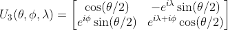

# 量子门

> 原文：<https://medium.com/analytics-vidhya/quantum-gates-7fe83817b684?source=collection_archive---------2----------------------->

## 一些常见的单量子位门的逐步走查


迈克尔·泽兹奇在 [Unsplash](https://unsplash.com?utm_source=medium&utm_medium=referral) 上的照片

正如前面的文章所介绍的，门可以被认为是对量子位的操作，它将量子位的状态从一个改变到另一个。因为我们用向量来表示量子位元状态，所以我们可以把量子门视为可以转换向量的矩阵。由于量子理论是酉的，量子门被表示为酉矩阵。理解门操作的另一种方式是把它们想象成围绕着块球体的旋转。

任何归一化的纯态都可以写成以下形式:


这里ϕ描述了相对相位，其值的范围从[0，2π]。另一方面，θ ∈ [0，π]决定了测量结果出现在|0⟩或|1⟩.的概率我们已经看到，所有的归一化纯态都可以在一个半径为|r| = 1 的球面上表示出来，我们称这个球面为布洛赫球。这种状态在布洛赫球面上的坐标由布洛赫向量给出:


因此，各种状态可以表示如下—


请注意这里


我们将很快使用 qiskit 可视化 Bloch 球上的旋转，当门在它上面操作时。

现在你已经有了一点背景知识，让我们来探索一下量子计算中一些常用的门。本文将集中讨论单量子位门。

## 泡利 X 门

泡利 X 门或比特翻转门是经典非门的量子等价物。它由酉矩阵表示:


我们在上一篇文章中已经看到了 Pauli X-gate 的实际应用。在内部，它将量子态围绕 x 轴旋转π弧度。现在看上面的布洛赫球的图像，我们看到|+⟩和|-⟩位于 x 轴上，或者我们可以说|+⟩和|-⟩是 x 门的两个本征态。因此这些态不受泡利 X 操作的影响。为了看看它如何影响其他州，让我们做一些编程。

首先，让我们进行必要的导入并设置 *statevector_simulator* 来查看 Bloch 球体上的状态向量。

```
from qiskit import QuantumCircuit, assemble, Aer
from qiskit.visualization import plot_histogram, plot_bloch_multivector
svsim = Aer.get_backend('statevector_simulator')
```

让我们定义一个 1 量子位的量子电路，看看电路和状态向量的方向是什么样子的。

```
qc = QuantumCircuit(1)
qc.draw(output='mpl')
```


```
qobj = assemble(qc)
state = svsim.run(qobj).result().get_statevector()
plot_bloch_multivector(state)
```


应用 X 门后，我们的输出如下

```
qc.x(0)
qc.draw(output=’mpl’)
```


```
qobj = assemble(qc)
state = svsim.run(qobj).result().get_statevector()
plot_bloch_multivector(state)
```


注意向量的方向是如何向下翻转的。从数学上讲，这是幕后发生的事情，


作为练习，试着看看如果我们从|i⟩.开始会发生什么

## 泡利 Z 和 Y 盖茨

**Pauli Z** gate 是一个相位翻转门，它可以围绕 Z 轴旋转π弧度。


Since|0⟩和|1⟩位于 z 轴上，z 门不会影响这些州。换句话说，|0⟩和|1⟩是 z 门的两个本征态。另一方面，它把|+⟩变成了|-⟩，把|-⟩变成了|+⟩.为了看到这一点，让我们将状态向量初始化为|+⟩，并想象 Z gate 如何变换向量。

```
qc = QuantumCircuit(1) 
initial_state = [1/sqrt(2),1/sqrt(2)]   
qc.initialize(initial_state, 0)
qobj = assemble(qc)
state = svsim.run(qobj).result().get_statevector()
plot_bloch_multivector(state)
```


```
qc.z(0)
qobj = assemble(qc)
state = svsim.run(qobj).result().get_statevector()
plot_bloch_multivector(state)
```


**泡利 Y** 门可以被认为是一个位和相位翻转门，它导致绕 Y 轴旋转π弧度。


用我们研究其他泡利门的同样方法，尝试找出 Y 门是如何影响块球上各种矢量的方向的。

这些泡利矩阵与单位矩阵一起构成了 2×2 矩阵的基础。因此，任何量子位元的旋转都可以写成这些门的线性组合。

## 哈达玛门

哈达玛门是量子计算中最常用的门之一。将哈达玛门应用于处于|0⟩状态的量子位，使量子位处于叠加状态，其中测量 0 的概率等于测量 1 的概率。形象地说，这意味着


图片提供:[曼宁出版](https://freecontent.manning.com/all-about-hadamard-gates/)

H 门的动作可以被认为是围绕布洛赫向量`[1,0,1]`(x 轴& z 轴之间的线)的旋转。


图片提供:
[物理栈交换](https://www.google.com/url?sa=i&url=https%3A%2F%2Fphysics.stackexchange.com%2Fquestions%2F313959%2Fvisual-interpretation-on-the-bloch-sphere-when-hadamard-gate-is-applied-twice&psig=AOvVaw17g95g7Oz6v3zoslUO1dFZ&ust=1618372094508000&source=images&cd=vfe&ved=0CAMQjB1qFwoTCPDpl9Go-u8CFQAAAAAdAAAAABAD)

让我们理解这样的运算在数学上是如何完成的。

哈达玛矩阵由下式给出


对|0⟩状态向量应用 H-gate 得到如下结果:


|+⟩是一个叠加态，因为如果我们应用玻恩法则，我们会发现 P(0) = P(1) = 1/2。

尝试使用 Hadamard 门编写一个简单的电路，就像我们对其他门所做的一样。分析它如何影响不同的国家向量 especially|0⟩和|1⟩.我们可以使用 QuantumCircuit 类的 *h()* 方法来实现这一点。

```
qc.h(0)
```

## R𝓏门

Rz 闸门或 Rϕ-gate 将是我们将要介绍的第一个*参数化*闸门。“参数化”是指它接受一个参数，并根据该参数执行操作。这里接受的参数是ϕ，执行的操作是绕 z 轴旋转ϕ弧度。该门的矩阵由下式给出


由于|0⟩和|1⟩位于 z 轴上，它们不会受到门的影响。尝试将状态向量初始化为|+⟩，并将其传递给 Rz 门，如下所示:


```
qc.rz(pi/4,0) # First argument is ϕ and second one is the qubit no.
```

你会看到向量从一种状态变成另一种状态，如左图所示。注意，状态向量逆时针旋转π/4 弧度。

## 输入、输出和 T 门

I、s 和 t 门是更一般的 Rϕ门的特例。

**I-gate** 不做任何特别的事情。它的矩阵就是单位矩阵本身。它被认为是一个门，因为它们经常在计算中有用。此外，它们在某种程度上也很重要，因为在考虑实际硬件时，它们可以用来指定“无”操作。

**S 门**是ϕ = π/2 的 Rϕ门，或者换句话说，它围绕 z 轴旋转π/2 弧度的矢量。与其他门不同，S 门不是它自己的反向门。虽然还是一元的。S 门及其反转 S dagger 或 Sdg 由下式给出:


正如您可能已经猜到的那样，S-dagger 将向量绕 z 轴顺时针旋转π/2 弧度。有趣的是，连续两次 S 门操作相当于执行一次 Z 门操作。因此，S 门也称为√Z 门。

**T 型门**也是ϕ = π/4 的 Rϕ门的一个特例。它遵循与 S 门相同的行为。T-gate 及其反相 T-dagger 或 Tdg 由下式给出


应用四个 T 门相当于执行一个 Z 门。

## 通用 U 型门

让我们从 **U₁-gate** 开始。该门的矩阵等效于 Rϕ门本身，由下式给出


我们还有一个 U₂-gate，它的矩阵由下式给出


两者都是参数化的门，但最重要的是，它们是从无所不包的 **U₃-gate** 中派生出来的。事实上，本文中介绍的每个门都可以用 U₃-gate.来表示正如所料，这是一个参数化的门，其矩阵由下式给出



人们可以观察到 U₁ = U₃(0,0,λ)和 U₂ = U₃(π/2,ϕ,λ).

## 参考

Qiskit 教材—[https://qiskit.org/textbook/preface.html](https://qiskit.org/textbook/preface.html)