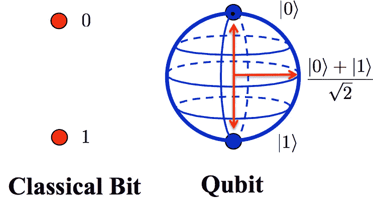

# 量子态——表示和编程

> 原文：<https://medium.com/analytics-vidhya/quantum-states-representation-and-programming-e562e44799d4?source=collection_archive---------7----------------------->



图片提供:
[安德鲁·戴利的——斯特拉斯克莱德大学](https://qoqms.phys.strath.ac.uk/research_qc.html)

之前关于[线性代数](https://navaneethsdk.medium.com/linear-algebra-for-quantum-computing-part-1-8ac7c8e63483)的文章可能对你们中的一些人来说有点无聊，尤其是因为它涵盖了量子力学和计算的各个部分。是时候把这一切变成一种最终有意义的形式了。对于所有程序员来说，好消息是，我们将最终在本文中讨论代码。让我们开始派对吧。

还记得我们在线性代数第一部分中介绍过的两个量子位态，|0⟩和|1⟩吗？对于健忘的人来说，它们是作为基(单数基)引入的，更具体地说，是作为**正交**基。在数学上，它们可以表示为:


但是等等！“标准正交”这个术语是从哪里突然出现的？

别担心，我们一会儿会讲到的。显然，|0⟩和|1⟩是基，这意味着它们形成了跨越希尔伯特空间的线性独立的生成集。这意味着它们是标准化的，即，


所谓正交性，我们的意思是这些向量不仅是归一化的，而且是相互正交的。


直观地说，就像我们可以用相互垂直的 x 轴和 y 轴来表示笛卡尔平面上的任何直线一样，我们也可以通过矢量加法和标量乘法，用|0⟩和|1⟩基来表示二维空间中的任何量子态。


和 n _ bimage 礼貌:Qiskit 教科书

现在让 q₀是一个量子位，它的状态向量表示为


这样的线性组合在量子力学中有个花哨的名字叫叠加态。我们可以说，这样一个重叠的国家既不完全是|0⟩，也不完全是|1⟩.这里，振幅α和β与在任何量子位状态下测量状态|q₀⟩的概率直接相关。这种关系是由量子力学中的一个关键假设给出的，称为**玻恩法则**。

根据玻恩规则，在任何量子位状态|x⟩中测量一个状态|ψ⟩的概率由下式给出


因此，对于|q₀⟩给出的状态


它在测量中坍缩成|1⟩的概率可以用玻恩法则计算如下


我们在线性代数文章中讨论的规范化条件是这个规则的直接应用。

好了，理论到此为止。让我们从一些编程开始。我们将使用名为 qiskit 的开源 SDK 进行编码。要安装 qiskit，你可以按照[这个](https://qiskit.org/documentation/install.html)教程。

首先，让我们探索一下我们上面讨论过的状态是如何在 qiskit 编程中表示的。为了达到这个目的，我们将建造一个量子电路。量子电路有三个部分:

1.  编码输入
2.  执行计算，以及
3.  提取输出。

让我们以一个简单的非门为例来理解这是如何实现的。“非”门的真值表如下


请注意，无论输入是什么，输出都是输入的翻转版本。但是，需要注意的是，这是一个经典的非门。非门的量子模拟被称为泡利 X 门或简称为 X 门(我们将在另一篇文章中介绍更多关于门的内容)。

## 编码输入

X 门就像非门一样，接受 1 个输入，给出 1 个输出。因此，为了对输入进行编码，我们需要的**量子位**的数量是 1。术语“量子位”在前面的陈述中被强调，因为我们基本上提供了一个量子位状态，像|0⟩或|1⟩，作为电路的输入，而不是像 0 或 1 这样的单个位。现在，让我们导入必要的模块。

```
from qiskit import QuantumCircuit, assemble, Aer
from qiskit.visualization import plot_histogram
```

我们将使用 qiskit 的“QuantumCircuit”来构建我们的电路。“汇编”和“Aer”将用于汇编代码和设置我们的量子模拟器。“plot_histogram”将用于查看结果。我们将在编码时详细解释它们。

前面，我们看到我们必须给量子电路一个输入来实现 X 门。具有一个输入的量子电路可以如下创建

```
n_q = 1
n_b = 1
qc = QuantumCircuit(n_q,n_b)
```

数字`n_q`定义了电路中量子位的数量。通过`n_b`，我们定义了最终将从电路中提取的输出位数。对于 X 门，`n_q`和`n_b`都是 1。

在我们的量子电路中，量子位总是从|0⟩.态开始但是，我们可以使用 initialize()方法将它转换成任何状态。一旦我们建成了电路，我们就能看到它是如何实现的。

## 执行计算

这里要执行的计算是量子位状态的翻转，即，如果输入状态是|0⟩，那么输出状态将是|1⟩，反之亦然。为了在电路中的唯一量子位上应用位翻转门或 X 门，我们使用方法 X()。

```
qc.x(0)
```

上述命令将在量子电路中的第 0 个量子位上应用 X 门。现在你知道我们为什么把 0 传递给 x()方法了。如果在我们的电路中有 2 个量子位，我们必须对第 2 个量子位执行 Pauli X gate 操作，我们会将 1 传递给 X()方法，因为量子位从 0 开始编号。

但到目前为止，这条赛道看起来怎么样？让我们看看下面的命令。

```
qc.draw(output='mpl')
```

该命令的输出将是


## 提取输出

最后的任务是提取和可视化输出。这个提取是通过一个叫做 *measure 的操作来完成的。*每次测量告诉一个特定的量子位给一个特定的输出位一个输出。让我们把测量操作加到电路中的量子位上。

```
qc**.**measure(0,0)
```

这将第 0 个量子位的输出提取到第 0 位。如果我们此时调用 draw()方法，我们的电路如下所示:


该看输出了！我们执行这组命令来查看结果:

```
# this is the simulator we'll use
sim = Aer.get_backend('qasm_simulator') # this turns the circuit into an object our backend can run
qobj = assemble(qc) # we run the experiment and get the result from that experiment
# from the results, we get a dictionary containing the number of 
# times (counts) each result appeared
result = sim.run(qobj).result()  
counts = result.get_counts()# and display it on a histogram
plot_histogram(counts)
```


请注意，输出 1 的概率等于 1。这与我们从|0⟩转向|1 ⟩.后所了解到的一致但是为什么是概率呢？它可以直接产生输出 1，对吗？这是因为量子计算机的结果可能有一定的随机性。因此，它们会运行多次，结果会显示为直方图。还要注意，这个结果来自量子模拟器，它是一台计算理想量子计算机会做什么的标准计算机。

现在，我们已经尝试了输入|0⟩，让我们尝试输入|1⟩.我们知道，


要将起始状态初始化为|1⟩，我们需要执行以下操作:

```
qc **=** QuantumCircuit(1,1)  *# Create a quantum circuit with one qubit*initial_state **=** [0,1]   *# Define initial_state as |1>*qc**.**initialize(initial_state, 0) *# Apply initialisation operation to the 0th qubit*qc**.**draw()  *# Let's view our circuit*
```

相应的输出将是


应用 X 门并按照我们对上一个电路所做的相同方式进行操作，会得到以下结果:

```
qc.x(0)
qc.measure(0,0)
qc.draw(output='mpl')
```


```
sim = Aer.get_backend('qasm_simulator')  
qobj = assemble(qc) 
result = sim.run(qobj).result()  
counts = result.get_counts()
plot_histogram(counts)
```


注意，这里输出 0 的概率等于 1。这反过来验证了我们之前的讨论，因为量子位 state|1⟩是翻转的 to|0⟩.

这是一个非常简单的例子。一旦我们对量子门有了更多的了解，我们将会建造更复杂的电路。所以在那之前，保持饥饿保持愚蠢！！！

## 参考:

1.  Qiskit 教科书—[https://qiskit . org/textbook/ch-States/atoms-computation . html](https://qiskit.org/textbook/ch-states/atoms-computation.html)
2.  Qiskit 教科书—[https://qiskit . org/textbook/ch-States/representating-qubit-States . html](https://qiskit.org/textbook/ch-states/representing-qubit-states.html)