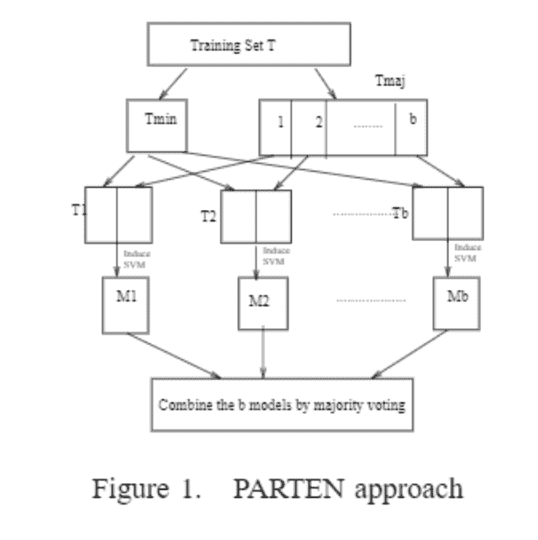
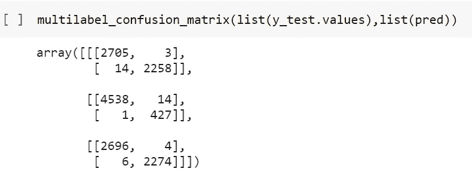

# 基于机器学习和深度学习模型的类星体探测

> 原文：<https://medium.com/analytics-vidhya/quasar-detection-using-machine-learning-and-deep-learning-model-6e4b31683208?source=collection_archive---------1----------------------->

有史以来由黑洞驱动的最亮类星体，可追溯到时间的黎明

# 目录:-

1.  类星体介绍。
2.  商业问题的 ML 公式。
3.  业务限制。
4.  数据的来源。
5.  现有方法。
6.  我的进步。
7.  探索性数据分析。
8.  最终创建数据，以便使用机器学习和深度学习模型。
9.  将数据分为训练集、交叉验证集和测试集。
10.  用于分类的模型。
11.  比较所有模型及其性能的最终结果。
12.  使用最佳模型的最终管道。
13.  未来的工作。
14.  Github 和 LinkedIn 个人资料。
15.  参考文献。

# 1.类星体是什么？

类星体是极其罕见的一类天体，也是极其重要的。也被称为准恒星物体，它是一个极其明亮的活动星系核(AGN)。类星体辐射的能量是巨大的。最强大的类星体的亮度超过 1041 瓦，是普通大星系如银河系的数千倍。

**类星体的重要性:**

> *它们发出如此明亮的光芒，以至于遮蔽了包含它们的古老星系，它们是由十亿倍于太阳质量的黑洞驱动的遥远物体。它们是最有趣的，因为它们中的大多数是在数十亿光年之外被发现的。由于光需要时间旅行，研究这样的物体就像一个时间机器。我们看到的物体是几十亿年前光线反射时的样子。在银河系的早期生活中，存在着 2000 多个已知的类星体。像银河系这样的星系可能曾经拥有一个长期沉默的类星体。它们可以用来研究宇宙膨胀的青少年阶段，当时宇宙只有十亿岁。*
> 
> *类星体是已知最明亮、最遥远的天体之一，对于了解早期宇宙至关重要*
> 
> **德国马克斯·普朗克天文研究所的布拉姆·维尼曼斯说。**
> 
> ***因此，不要对单个类星体进行错误分类是非常重要的，并且考虑到科学仪器生成的大量数据每天都在惊人地增长，建立一个机器学习或深度学习模型来自动分类这些物体是非常重要的。***

# **2.商业问题的 ML 公式:**

1.  **识别一个天体是类星体、星系还是恒星。因此，这里的 ml 问题是训练一个多类分类模型。类星体是一类极其罕见的物体，具有极其重要的科学意义。因此，主要重点将是建立一个机器学习模型，以减少将类星体归类为非类星体的错误，即类星体对象的 FNR 减少的模型。**
2.  **研究由斯隆数字巡天不同数据版本提供的对类星体分类有用的所有特征。**

# **3.业务限制:**

1.  **类星体的低 FNR 是非常重要的，因为将类星体错误分类为非类星体的代价非常高。**
2.  **没有低延迟要求。**

# **4.数据来源:**

**数据来自斯隆数字巡天服务器 DR14 网站，使用 SQL 查询。**

** [## SDSS 天空服务器 DR14

### 编辑描述

skyserver.sdss.org](http://skyserver.sdss.org/dr14/en/tools/search/sql.aspx) 

使用 python 中的 ***selenium*** 包，从上述网站中废弃了每个对象的光谱图像。python 代码自动从数据中选择一个板和一个纤维 id，并提取光谱图像。

**所需套餐**

**获取光谱图像的代码**

# 5.现有方法:

1.  [https://arxiv.org/pdf/2010.00401.pdf](https://arxiv.org/pdf/2010.00401.pdf)

基于线性支持向量机和错误学习方法的类星体探测。本文致力于减少类星体的错误分类。

为了降低模型的 FNR，使用了从错误中学习的方法。数据以 2:1:1 的比例分割。在数据集的前 50%上训练具有 15%维持验证的线性 SVM 模型(LSVM ),随后在数据集的 25%上测试，并且通过 2 种不同的算法训练错误分类的点:

a.使用 5 折交叉验证方法的集合袋装树。

b.LSVM 模型有 15%的坚持验证。

两种顺序训练的算法都在最后 25%的数据样本上进行测试。使用一个简单的 OR 函数来获得最终的预测类。如果其中一个模型预测了类星体，那么最后分配的类就被声明为类星体。

LSVM 与系综采油树耦合的 FNR 为 0.4673%，与 LSVM 相比，FNR 降低了 10 倍，但 FPR 增加到 46.94%。当两个线性支持向量机以这种方式耦合在一起时，FNR 为 0%，但极端 FPR 为 99.69%。

2.[https://www . research gate . net/publication/324536351 _ Machine _ Learning _ in _ Astronomy _ A _ Case _ Study _ in _ Quasar-Star _ class ification](https://www.researchgate.net/publication/324536351_Machine_Learning_in_Astronomy_A_Case_Study_in_Quasar-Star_Classification)

提出了人工平衡数据的方法，以克服类不平衡问题，减少模型对多数类的偏向。在人工平衡中，从两个类中取相同数量的样本来训练分类器。这消除了类别偏见和数据不平衡。它建议使用非对称 AdaBoost 来处理不平衡数据集。它基本上给了正点(类星体)比负点(恒星)更多的权重。当与负样本相比时，非对称 AdaBoost 倾向于更仔细地分类正样本，因为它纠正了错误分类。

3.在 Kaggle 中发现的大多数笔记本使用线性 SVM 模型进行分类。

# 6.我的改进:

在上述方法中，具有从错误中学习方法的线性支持向量机在具有非常低的 FNR 的情况下给出了最好的结果，但是 FPR 非常高，并且结果非常不切实际，因为它将每个点都检测为类星体。我的模型确实减少了 FNR，但同时类星体点的 FPR 也很低。

我实现的模型也将恒星、星系和类星体分类。

我也使用了不同的技术来处理班级不平衡。

# 7.探索性数据分析:

在深入研究模型架构之前，让我们首先了解 SDSS 网站提供的数据发布 14 中的功能。

从 SDSS 站点获取了 30000 个数据点

分类所需的特征:

1.  红移:区分类星体的最重要特征是红移。类星体的距离由所谓的红移决定，红移是对其光的波长在到达地球之前被宇宙膨胀拉伸了多少的测量。红移越高，距离就越大，天文学家在观察该天体时所看到的时间就越久远。
2.  **赤经**:它是一个特定点沿天赤道向东测量的角距离，从三月二分点的太阳到地球上方该点(的小时圈)。该特征取自图像表。
3.  **赤纬**:赤纬与赤经配对，是天文坐标，指定了一个点在赤道坐标系中的天球上的位置。

 [## ra _ and _ dec _ demo _ animation _ small . gif

### 编辑描述

drive.google.com](https://drive.google.com/file/d/1ZMVFv1hvhvdZ5fc8VyCjK25xhyfOsAE0/view) 

4.根据 Thuan-Gunn 天文星等系统，u、g、r、I、z 代表望远镜 5 个波段的响应。多个波段允许确定被检测物体的颜色。

在给定的图中，注意有五行 CCD，标记为 u、g、r、I 和 z，这导致这些带通中的每一个几乎同时产生图像。

**阶层失衡:**

图片，以了解阶级的不平衡，以及每个阶级的标签

**Ra 和 Dec** :

下面的 dec 图显示，所有类别的 dec 基本上都在-15–20 和 40–65 的范围内。

下面的 ra 图显示，所有等级的 ra 基本上都在 0–50 和 100–250 的范围内。

条形图和 pdf 对于所有三个类别都是重叠的，因此我们实际上不能根据坐标来分离这些点。

赤纬与赤经配对，是天文坐标。

散点图和 pdf 显示，ra 和 dec 特征对于所有类别的点都是重叠的，因此可以得出结论，在给定区域找到类星体的概率与找到星系或恒星的概率相同。

**红移:**

下面的红移图显示，对于非类星体点，红移基本上在 0 左右或非常小，而对于类星体点，红移非常高，变化很大，在-1–8 的范围内。这表明红移是一个非常重要的特征，可以用来区分不同类别的点。

**波段特性:**

下图显示波段特征高度相关。

相关矩阵

**测试数据集中的线性可分性:**

凸包也是同样的用途。

形状或一组点的凸包是围绕点或形状的紧拟合凸边界。关键思想是，如果任何数据集的至少两个类的凸包相交或重叠，那么可以得出结论，数据中的那些类不是线性可分的。相对于红移为每个特征绘制具有散点图的凸包。

当红移分别与其他特征一起使用时，观察到属于类星体的大部分数据并不存在于非类星体的凸包中。因此，数据集中的两个类别(类星体和非类星体)在红移的基础上大多是线性可分的。

**当红移被用作特征时的凸包**

观察到，当带特征 u 分别与其它带特征一起使用时，属于类星体的大部分数据在非类星体的凸包内是重叠的。那么可以得出结论，当使用波段特征时，数据不是线性可分的，并且仅在红移是特征的第一个图中，我们可以看到线性可分性。

**带带状特征的凸包**

使用 **TSNE** 将五个波段特征转换成三维特征，因为它们高度相关。

# 8.最终数据通过以下方式生成:

1.  红移。
2.  拉。
3.  十二月
4.  三维带状特征。
5.  使用对应于该行的光纤 id 和板号将光谱图像的路径添加到每一行。

在移除没有图像数据的点并丢弃 nan 值后，结果数据只有 19，918 个点。

在这里，没有使用像运行、重新运行、camcol 和字段这样的描述 SDSS 拍摄的图像中的字段的特征。一个场基本上是对应于 2048×1489 像素的整个图像的一部分。这些基本上是相机功能，因此被删除。

# 9.列车测试分离:

**数据分成大约 2:1:1 的比例**

# 10.用于分类的模型:

## 1.用于分类的基本机器学习模型:

1).在应用几个基本的机器学习模型进行分类之前:

a.Adasyn 技术用于生成 Quasar 的合成点，以消除每个训练集、交叉验证集和测试集中数据的不平衡。

b.每个特征都是连续变量，因此使用 sklearn 的预处理库对它们进行标准化。

2).训练:使用训练集训练每个模型，并使用网格搜索 cv 调整超参数。

3).获得的结果 **:**

具有余弦度量的 KNN 模型和 Xgboost 模型显示了良好的 f1 得分。虽然 KNN_cos 模型的 FNR 很高，但我们仍然可以对它做更多的工作来降低 FNR。

## 2.CNN 模型利用光谱图像和数值特征进行分类。

**采用图像和数字特征进行分类的模型架构**

作为输入的图像类型:

**星系、恒星和类星体的光谱图像**

获取预测类的代码

**使用上述两种模式的第一种切割方法:**

a)。CNN 模式。

b)。KNN 余弦是基本模型。

训练好的 CNN 模型。

使用现有方法的第一种方法中指定的 or 函数，将 knn_cos 的预测与 CNN 模型的预测相结合。

c)。KNN 余弦是基本模型。

从 KNN cos 模型中提取误分类点，并在此基础上训练 AdaBoost 模型。

训练好的 CNN 模型。

将 AdaBoost 的预测与 CNN 模型的预测相结合。

结果:

## 3.自定义堆叠分类器:

1)将整个数据分成训练和测试(80-20)

2)现在，在 80%的列车组中，将列车组拆分为 D1 和 D2。(50–50).

根据该 d1，对行和列进行替换采样，以创建 D1、d2、d3…dk(k 个样本)。每个样本至少有 3 列和 60%的训练数据行，其中一些点被复制。

现在创建了“k”个模型，并且用这 k 个样本中的每一个来训练这些模型中的每一个。

**使用的型号**

3)现在，D2 集被传递给这 k 个模型中的每一个；现在，从这些模型中的每一个得到了对 D2 的 k 个预测。

4)现在，使用这 k 个预测，为 D2 创建新的数据集。图像嵌入也被添加到数据集中。现在对于 D2，我们已经知道它的相应目标值，所以现在用这 k 个预测和图像嵌入来训练一个元模型(在这个例子中是 Xgboost)。

5)现在，对于模型评估，使用我们作为测试集保留的 20%的数据。测试集被传递到每个基础模型，并获得“k”个预测。对于测试集，也获得了图像嵌入。现在，使用这 k 个预测和图像嵌入创建了一个新的数据集，并将其传递给元模型，从而获得最终的预测。使用这个最终预测和测试集的目标，计算模型的性能分数。

**模型架构:**

**第一部分**

**第二部分**

**第三部分**

结果:

**星系、类星体和恒星的混淆矩阵**

虽然，类星体的 FNR 并不太低，但是 FPR 却很低。因此，该模型可以与其他模型结合使用。

## 4.分割系综的 Parten 方法；

这种方法用于进行二元分类，即从非类星体点中分离类星体点。

1.  组合训练和交叉验证数据集以给出一个训练数据集 t
2.  t 分为少数类数据点和多数类数据点两部分。
3.  如自定义堆叠分类器中所述，使用带有替换的随机行采样将多数类划分为 b 个数据点。
4.  每个 b 数据点都与整个少数类点相结合。相应数据点的图像嵌入也被连接起来。
5.  现在，这些采样数据点中的每一个分别用于训练不同的模型。
6.  最后，由每个模型预测的类的大多数是最终预测。这些方法不会导致数据丢失。
7.  使用 help 测试数据集可以看到模型性能。(数据的 25%)。

**模型架构:**

**第一部**

注:在这里，而不是使用 SVM 作为 M1…MB。我使用了不同的模型进行培训。

结果:

## 5.多数票:

使用迄今为止训练的所有模型进行最终预测。

1.  第一次切割方法中的 Xgboost 模型。
2.  KNN 模型结合 CNN。
3.  CNN 模式。
4.  堆积分类器
5.  Parten 方法

因为 parten 方法用于二元类分类。来自所有模型的预测首先从多类标签转换为二进制标签，即任何不为 1 的点(QSO)被声明为 0。

然后从上述所有模型中获得多数票。

然后，对于非类星体点，多数投票来自 CNN 和堆叠模型，因为它们对类星体点的偏向较小，因此也获得了恒星和星系分类。

**代号:**

**模型架构:**

**结果:**

**多数表决后的混淆矩阵**

# 11.最终结果:

# 12.最终管道:

要加载图像数据以便传入 CNN 模型进行图像嵌入，请执行以下操作:

获得加载所有模型和最终预测的最终代码:

# 13.未来工作:

我们可以利用更大的数据集，完全消除任何类星体点分类错误的可能性。

# 14.Github 和 LinkedIn 个人资料:

***完整的教程代码你可以在 github*** [***这里***](https://github.com/Mansisarda1999/Quasar-Detection-by-using-Machine-Learning-and-Deep-Learning-Model) 找到

 [## 曼西·萨尔达——西孟加拉邦毛拉纳·阿布·卡拉姆·阿扎德技术大学，原名 WBUT …

### 查看曼西·萨尔达在全球最大的职业社区 LinkedIn 上的个人资料。曼西有一份工作列在他们的…

www.linkedin.com](https://www.linkedin.com/in/mansi-sarda-87b76a168/) 

# 15.参考资料:

1.  利用线性支持向量机从错误中学习的类星体探测方法研究论文。[https://arxiv.org/abs/2010.00401](https://arxiv.org/abs/2010.00401)
2.  [https://www . researchgate . net/publication/324536351 _ Machine _ Learning _ in _ Astronomy _ A _ Case _ Study _ in _ Quasar-Star _ class ification](https://www.researchgate.net/publication/324536351_Machine_Learning_in_Astronomy_A_Case_Study_in_Quasar-Star_Classification)
3.  [https://www . ka ggle . com/lucidlenn/data-analysis-and-class ification-using-xgboost](https://www.kaggle.com/lucidlenn/data-analysis-and-classification-using-xgboost)
4.  [https://github . com/soumilshah 1995/Smart-Library-to-load-image-Dataset-for-Convolution-Neural-Network-tensor flow-Keras-/blob/master/master image . py](https://github.com/soumilshah1995/Smart-Library-to-load-image-Dataset-for-Convolution-Neural-Network-Tensorflow-Keras-/blob/master/masterimage.py)
5.  [http://skyserver.sdss.org/dr14/en/tools/search/sql.aspx](http://skyserver.sdss.org/dr14/en/tools/search/sql.aspx)
6.  [来真的？基于机器学习的汽车保险欺诈索赔检测。|作者 IceAsher Chew |走向数据科学](https://towardsdatascience.com/for-real-auto-insurance-fraud-claim-detection-with-machine-learning-efcf957b38f3)
7.  [https://www . research gate . net/publication/221230850 _ 比较 _ SVM _ 集成 _ 不平衡 _ 数据集](https://www.researchgate.net/publication/221230850_Comparing_SVM_ensembles_for_imbalanced_datasets)
8.  [www.appliedaicourse.com](https://www.appliedaicourse.com/course/11/Applied-Machine-learning-course)**